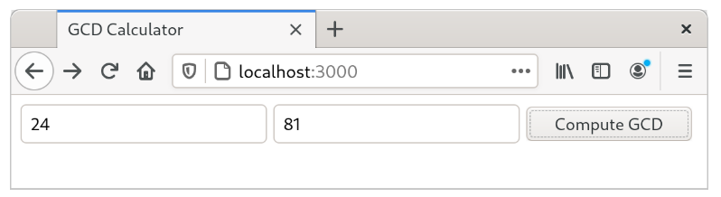
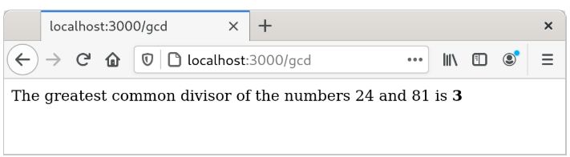
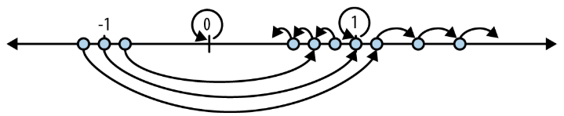
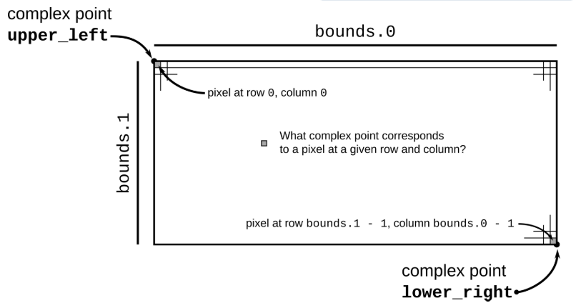
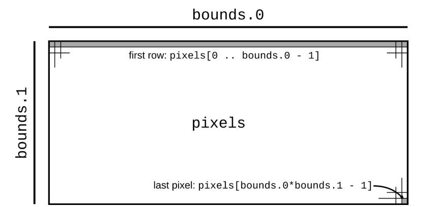
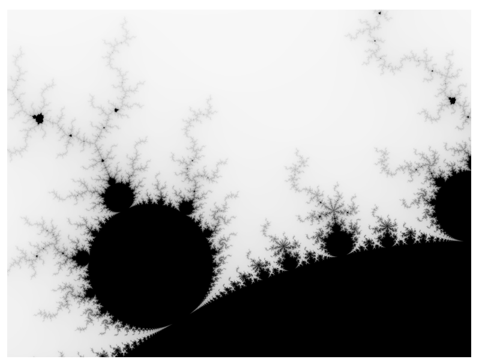
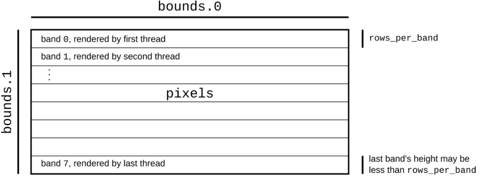

# Rust概览

Rust给像本书一样的书籍的作者提出了一个挑战：赋予这门语言特色的并不是可以在第一页就展示出来的某些具体的、惊人的特性，而是如何设计这门语言以使它的各个部分可以无缝的协同工作，最终达到我们在上一章提到的目标：安全、高性能的系统编程。这门语言的每一部分在以其他所有部分为背景的前提下都是最合理的。

因此，相比于一次着眼于一种语言特性，我们选择了几个简单但却完整的程序作为概览，每一个程序都会涉及到一些语言特性：

- 作为热身，我们准备了一个简单的计算命令行参数的程序，以及相应的单元测试。这个程序展示了Rust的核心类型，并引入了 *trait* 。
- 接下来，我们构建了一个web服务器。我们将会使用一个第三方库来处理HTTP的细节，并引入字符串处理、闭包、错误处理。
- 我们的第三个程序绘制了一个漂亮的图形，将计算分布到多个线程来提高速度。这一部分包括一个泛型函数的示例，阐明了怎么处理一个像素以及类似的概念，并展示了Rust对并发的支持。
- 最后，我们展示了一个使用正则表达式处理文件的健壮的命令行程序。这个程序展示了Rust标准库中处理文件的设施和最常用的第三方正则表达式库。

Rust保证在对代码的性能影响最小的情况下防止未定义行为，这一保证影响了整个Rust中每个部分的设计，从标准的数据结构例如vector和string到Rust程序员使用第三方库的方式都受此影响。这些具体的细节书中都会提到，但是现在，我们想向你展示Rust是一门强大且有趣的语言。

当然，首先你要在你的计算机上安装Rust。

## rustup和Cargo

安装Rust的最佳方式是使用`rustup`。访问<https://rustup.rs>并按照说明进行操作。

或者，你可以访问[Rust网站](https://www.rust-lang.org/)来获取预构建好的Linux、macOS、Windows上的包。一些操作系统发行版里也包含Rust。我们推荐使用`rustup`，因为它是专门用于管理Rust安装的工具，就像Ruby的RVM和Node的NVM一样。例如，当一个新版本的Rust发布时，你只需要输入`rustup update`就可以完成更新。

无论如何，一旦你完成了安装，你就应该可以通过命令行访问以下三条新命令：
```
    $ cargo --version
    cargo 1.49.0 (d00d64df9 2020-12-05)
    $ rustc --version
    rustc 1.49.0 (e1884a8e3 2020-12-29)
    $ rustdoc --version
    rustdoc 1.49.0 (e1884a8e3 2020-12-29)
```

这里，`$`是命令提示符。在Windows上，可能是`C:\>`或者别的类似的。这里我们运行了安装的三条命令，查询它们的版本。接下来让我们依次讲解每一个命令：

- `cargo`是Rust的编译管理器、包管理器和通用的工具。你可以使用Cargo来新建项目、构建并运行程序、管理所有代码中依赖的外部库。
- `rustc`是Rust的编译器。通常我们使用Cargo来调用编译器，但有时也需要直接运行它。
- `rustdoc`是Rust的文档工具。如果你在源代码中按照文档注释的格式写了文档，那么`rustdoc`可以通过它们构建出漂亮的HTML文档。和`rustc`一样，我们通常用Cargo来调用`rustdoc`。

使用Cargo可以很方便地创建新的Rust包，并设置好一些标准元数据：
```
    $ cargo new hello
        Created binary (application) `hello` package
```

这个命令创建了一个叫做`hello`的新的包目录，并准备好构建一个可执行程序。

进入包的顶级目录并查看：
```
    $ cd hello
    $ ls -la
    total 24
    drwxrwxr-x.  4 jimb jimb 4096 Sep 22 21:09 .
    drwx------. 62 jimb jimb 4096 Sep 22 21:09 ..
    drwxrwxr-x.  6 jimb jimb 4096 Sep 22 21:09 .git
    -rw-rw-r--.  1 jimb jimb    7 Sep 22 21:09 .gitignore
    -rw-rw-r--.  1 jimb jimb   88 Sep 22 21:09 Cargo.toml
    drwxrwxr-x.  2 jimb jimb 4096 Sep 22 21:09 src
```

我们可以看到Cargo创建了一个文件`Cargo.toml`来保存包的元数据。此时这个文件里还没有太多内容：
```toml
    [package]
    name = "hello"
    version = "0.1.0"
    authors = ["You <you@example.com>"]
    edition = "2018"

    # See more keys and their definitions at
    # https://doc.rust-lang.org/cargo/reference/manifest.html

    [dependencies]
```

如果我们的程序中需要使用第三方库，那么可以把它们添加在这个文件里，Cargo将会负责下载、构建和更新这些库。我们将在”第8章”中详细介绍`Cargo.toml`文件。

Cargo已经为我们的包初始化好了`git`版本控制系统，创建了一个`.git`元数据目录和一个`.gitignore`文件。你可以通过向`cargo new`命令传递`--vcs none`参数来跳过这一步。

`src`子目录包含了实际的Rust代码：
```
    $ cd src
    $ ls -l
    total 4
    -rw-rw-r--.  1 jimb jimb 45 Sep 22 21:09 main.rs
```

看起来Cargo好像已经替我们写好了程序。`main.rs`中包含以下内容：
```Rust
    fn main() {
        println!("Hello, world!");
    }
```

在Rust中，你甚至不需要自己编写“Hello, World!”程序。它是Rust的样板程序：包含两个文件，总共13行。

我们可以从包中的任何目录调用`cargo run`命令来构建并运行我们的程序：
```
    $ cargo run
        Compiling hello v0.1.0 (/home/jimb/rust/hello)
        Finished dev [unoptimized + debuginfo] target(s) in 0.28s
        Running `/home/jimb/rust/hello/target/debug/hello`
    Hello, world!
```

这里，Cargo调用了Rust的编译器`rustc`，然后运行了它生成的可执行文件。Cargo把可执行文件放在了顶层目录的`target`子目录下：
```
    $ ls -l ../target/debug
    total 580
    drwxrwxr-x. 2 jimb jimb   4096 Sep 22 21:37 build
    drwxrwxr-x. 2 jimb jimb   4096 Sep 22 21:37 deps
    drwxrwxr-x. 2 jimb jimb   4096 Sep 22 21:37 examples
    -rwxrwxr-x. 1 jimb jimb 576632 Sep 22 21:37 hello
    -rw-rw-r--. 1 jimb jimb    198 Sep 22 21:37 hello.d
    drwxrwxr-x. 2 jimb jimb     68 Sep 22 21:37 incremental
    $ ../target/debug/hello
    Hello, world!
```

如果需要的话，Cargo可以为我们清理生成的文件：
```
    $ cargo clean
    $ ../target/debug/hello
    bash: ../target/debug/hello: No such file or directory
```

## Rust函数

Rust的语法借鉴自其他语言。如果你熟悉C、C++、Java或者JavaScript，你可以很快找到自己的方式来理解Rust的程序结构。这里有一个使用[欧几里得算法](https://en.wikipedia.org/wiki/Euclidean_algorithm)计算两个整数的最大公约数的函数。你可以把它添加到`src/main.rs`的最后：
```Rust
    fn gcd(mut n: u64, mut m: u64) -> u64 {
        assert!(n != 0 && m != 0);
        while m != 0 {
            if m < n {
                let t = m;
                m = n;
                n = t;
            }
            m = m % n;
        }
        n
    }
```

`fn`关键字（读作“fun”）创建了一个函数。这里，我们定义了一个叫`gcd`的函数，它有两个参数`m`和`n`，类型都是`u64`，也就是64位无符号整数。`->`词元指明了返回值类型：我们的函数返回一个`u64`类型的值。四个空格缩进是Rust的标准风格。

Rust的整数类型的名字代表了它们的大小和符号性：`i32`是有符号32位整数；`u8`是无符号8位整数（用于表示“字节”）等。`isize`和`usize`类型分别代表可以存下一个指针的有符号和无符号整数，在32位平台上它们就是32位，在64位平台上就是64位。Rust还有两种浮点数类型：`f32`和`f64`，分别是IEEE标准的单精度和双精度浮点数类型，类似于C和C++中的`float`和`double`。

默认情况下，当变量初始化后，它的值就不能再被改变。但如果在参数`m`和`n`前加上`mut`关键字（读作“mute”， *mutable* 的缩写）就可以在函数体中对它们进行赋值。在实践中，大多数变量都不会被重新赋值，因此在阅读代码时`mut`关键字将是一个有用的提示。

函数体中首先调用了`assert!`宏来确保两个参数都不是0。`!`字符表示这是宏调用，而不是函数调用。类似于C和C++中的`assert`宏，Rust中的`assert!`宏也会检查参数是否为真，如果不为真则中断程序，并输出一条有用的信息，其中包括断言失败的源码位置。这种终止的方式被称为 *panic* 。和C和C++中断言可以被跳过不同，Rust总是检查断言，不管程序怎么编译。还有一个`debug_assert!`宏，当程序被编译为release模式时会被跳过。

我们函数的主体是一个包含一条`if`语句和一条赋值语句的`while`循环。和C和C++不同，Rust的条件表达式不需要括号，但紧随其后的控制流语句需要花括号。

`let`语句声明了一个局部变量，例如函数中的`t`。我们不需要写出`t`的类型，因为Rust可以通过使用这个值的方式来推断它的类型。在我们的函数中，`t`只有和`m`、`n`相匹配，即是`u64`类型时函数才可以正常运行。Rust只在函数体内推断类型：你必须写出函数参数和返回值的类型，就像我们所做的那样。如果你想指明`t`的类型，你可以写：
```Rust
    let t: u64 = m;
```

Rust有`return`语句，但是`gcd`函数并不需要。如果一个函数体以一个 *没有* 分号结尾的表达式结尾，那么这个表达式的值就是函数的返回值。事实上，任何一个花括号包围的语法块都可以作为一个表达式。例如，这里有一个表达式打印出一条消息，然后返回`x.cos()`作为它的值：
```Rust
    {
        println!("evaluating cos x");
        x.cos()
    }
```

在Rust中当控制流到达函数底部时利用这种形式返回值是一种很典型的做法，只有当在函数的中途显式地返回时才会使用`return`语句。

## 编写并运行单元测试

Rust语言内建有对测试的支持。为了测试我们的`gcd`函数，我们可以在`src/main.rs`的最后添加下列代码：
```Rust
    #[test]
    fn test_gcd() {
        assert_eq!(gcd(14, 15), 1);

        assert_eq!(gcd(2 * 3 * 5 * 11 * 17,
                       3 * 7 * 11 * 13 * 19),
                   3 * 11);
    }
```

这里我们定义了一个叫`test_gcd`的函数，它调用了`gcd`函数并检查返回值是否正确。函数上方的`#[test]`标记`test_gcd`是一个测试函数，这种函数在正常编译时会被跳过，但在使用`cargo test`命令时会被编译并自动调用。我们可以在整个源码树的任何位置定义测试函数，`cargo test`会自动收集它们并运行。

`#[test]`标记是一个 *属性(attribute)* 。属性是一种为函数和其他声明标记额外信息的开放式系统，类似于C++和C#中的属性，或者Java中的注解。它们被用来控制编译器警告和代码风格检查、条件编译（类似于C和C++中的`#ifdef`）、告诉Rust怎么和其它语言编写的代码交互等。随着继续深入我们将会看到更多使用属性的例子。

把`gcd`和`test_gcd`函数的定义添加到`hello`包里之后，我们可以在包内的某个目录下按照如下方式运行测试：
```
    $ cargo test
        Compiling hello v0.1.0 (/home/jimb/rust/hello)
         Finished test [unoptimized + debuginfo] target(s) in 0.35s
          Running /home/jimb/rust/hello/target/debug/deps/hello-2375a82d9e9673d7

    running 1 test
    test test_gcd ... ok
    
    test result: ok. 1 passed; 0 failed; 0 ignored; 0 measured; 0 filtered out
```

## 处理命令行参数

为了让我们的函数能获取一些作为命令行参数传入的数字并打印出他们的最大公约数，我们可以把`src/main.rs`中`main`函数的代码替换为如下内容：
```Rust
    use std::str::FromStr;
    use std::env;

    fn main() {
        let mut numbers = Vec::new();

        for arg in env::args().skip(1) {
            numbers.push(u64::from_str(&arg)
                         .expect("error parsing argument"));
        }

        if numbers.len() == 0 {
            eprintln!("Usage: gcd NUMBER ...");
            std::process::exit(1);
        }

        let mut d = numbers[0];
        for m in &numbers[1..] {
            d = gcd(d, *m);
        }

        println!("The greatest common divisor of {:?} is {}",   numbers, d);
    }
```

这是一个很大的代码块，让我们一步步来理解它：
```Rust
    use std::str::FromStr;
    use std::env;
```

第一个`use`声明引入了标准库中的`FromStr`  *trait* 。一个`trait`就是一些可以被实现的方法的集合。任何实现了`FromStr` trait的类型都有一个`from_str`方法，这个方法尝试把一个字符串解析为该类型。`u64`类型实现了`FromStr`，因此我们将调用`u64::from_str`来解析命令行参数。尽管我们在程序中并没有使用到`FromStr`这个名字，但为了使用这个trait的方法，必须将它引入作用域。我们将会在”第11章”讲解trait。

第二个`use`声明引入了`std::env`模块，它提供了一些和运行环境进行交互的函数和类型，包括`args`函数，它可以让我们获取到程序的命令行参数。

接下来移步到程序的`main`函数：
```Rust
    fn main() {
```

我们的`main`函数不返回值，因此我们可以省略`->`和返回类型。

```Rust
    let mut numbers = Vec::new();
```

我们声明了一个可变的局部变量`numbers`，并将它初始化为一个空的vector。`Vec`是Rust的可变长的向量类型，类似于C++的`std::vector`、Python的`list`、或者JavaScript的`array`。即使vector被设计为动态伸缩，我们仍然需要将变量标记为`mut`，这样Rust才允许我们向它的末尾添加元素。

`numbers`的类型是`Vec<u64>`，一个`u64`的vector。但和之前一样，我们不需要写出类型。Rust将会为我们推断出它的类型：这里我们把`u64`类型的值添加到了vector里，而且我们之后还把这个vector的元素传给了`gcd`函数，而`gcd`函数的参数只能是`u64`。

```Rust
    for arg in env::args().skip(1) {
```

这里我们使用了一个`for`循环来处理命令行参数，依次将每个参数赋值给`arg`变量，然后执行循环体。

`std::env`模块的`args`函数返回一个 *迭代器* ，迭代器可以惰性产生每一个值，并在迭代结束时告知我们。迭代器在`Rust`中无处不在，标准库中还包含其他的迭代器，例如产生vector中的每个元素、产生文件的每一行、产生通道收到的每一条消息、以及其他几乎所有可以循环处理的东西。Rust的迭代器非常高效：编译器通常能将它们翻译为和手写循环一样的代码。我们将会在”第15章”介绍该怎么使用它并给出一些示例。

除了和`for`循环一起使用之外，迭代器还有很多可以直接使用的方法。例如，`args`方法返回的迭代器的第一个值总是正在运行的程序名，我们想要跳过它，因此我们调用了迭代器的`skip`方法来生成一个忽略了第一个值的新迭代器。

```Rust
    numbers.push(u64::from_str(&arg)
                 .expect("error parsing argument"));
```

这里我们调用了`u64::from_str`来尝试将命令行参数解析为64位整数。和通过`u64`类型的值调用的方法不同，`u64::from_str`是一个和`u64`类型关联的方法，类似于C++和Java中的静态方法。`from_str`函数不直接返回一个`u64`类型的值，而是返回一个`Result`类型的值来表示解析是否成功。一个`Result`类型的值有两种可能：

- 一个写作`Ok(v)`，表示解析成功，`v`就是解析出的值。
- 另一个写作`Err(e)`，表示解析失败，`e`是解释失败的原因。

任何可能会失败的函数，例如输入输出或其他和操作系统交互的函数，都会返回`Result`值，`Ok`时会携带成功的结果——读写的字节数、打开的文件等等——`Err`时会携带错误码来指示错误的原因。和大多数现代编程语言不同，Rust没有异常：所有的错误都通过`Result`或者panic来处理，这会在”第7章”中介绍。

我们使用Rust的`expect`方法来检查解析是否成功。如果结果是`Err(e)`，`expect`会打印出包含`e`的描述错误的消息。如果结果是`Ok(v)`，`expect`会简单的返回`v`，之后我们才能把它添加到vector的尾部。

```Rust
    if numbers.len() == 0 {
        eprintln!("Usage: gcd NUMBER ...");
        std::process::exit(1);
    }
```

空的数字集合没有最大公约数，因此我们检查vector是否不为空，如果为空就退出程序。我们使用`eprintln!`宏来把错误信息写入到标准错误输出流。

```Rust
    let mut d = numbers[0];
    for m in &numbers[1..] {
        d = gcd(d, *m);
    }
```

这一个循环使用了变量`d`，将它更新为目前的最大公约数。和之前一样，我们将`d`标记为可变的，因此我们在循环里给它赋值。

这个`for`循环有两个特别的地方。一个是`for m in &numbers[1..]`，操作符`&`是什么意思？另一个是`gcd(d, *m);`，`*m`里的`*`又是什么意思？事实上这两个细节是互补的。

到目前为止，我们的代码只操作过像整数这类固定内存大小的值。但是现在我们要迭代一个vector，它的值可能是任意大小——有可能非常大。在处理这类值时Rust是很谨慎的：它想让程序员自己控制对内存的消耗、明确每个值的生命周期，同时确保当内存不再被需要时立即释放内存。

因此当我们在迭代时，我们想告诉Rust这个vector的 *所有权* 仍然属于`numbers`，我们只是 *借用* 它的值来进行循环。`&numbers[1..]`中的`&`运算符借用了vector中从第二个元素开始到最后一个元素的引用。`for`循环迭代引用的那些元素，每次迭代中用`m`借用每一个元素。`*m`中的`*`运算符 *解引用* 了`m`，返回了它所指向的值，也就是我们传递给`gcd`的第二个值。最后，因为`numbers`拥有vector的所有权，当`numbers`离开`main`的作用域时Rust会自动释放它的内存。

Rust对所有权和引用的规则是Rust的内存管理和安全并发的关键。我们将在”第4章”讨论它们，并在”第5章”讨论它们的伙伴。

要想舒服的使用Rust，你必须习惯这些规则，但在这篇概览中，你只需要知道`&x`是借用`x`的引用，`*r`返回引用`r`指向的值。

继续我们的程序：
```Rust
    println!("The greatest common divisor of {:?} is {}", numbers, d);
```

迭代完`numbers`的元素之后，程序把结果打印到标准输出流。`println!`宏接收一个模板字符串，用剩余参数替换掉模板字符串里的`{...}`，并把结果写入到标准输出流。

与C和C++中的`main`函数成功执行结束时要返回0、执行失败时返回非0不同，Rust假设不管`main`返回什么值都代表成功执行结束。只有当显式调用`expect`或`std::process::exit`之类的才会导致程序以错误的状态码终止。

`cargo run`命令允许我们向程序传递参数，因此我们可以测试我们的命令行程序：
```
    $ cargo run 42 56
       Compiling hello v0.1.0 (/home/jimb/rust/hello)
        Finished dev [unoptimized + debuginfo] target(s) in 0.22s
         Running `/home/jimb/rust/hello/target/debug/hello 42 56`
    The greatest common divisor of [42, 56] is 14
    $ cargo run 799459 28823 27347
        Finished dev [unoptimized + debuginfo] target(s) in 0.02s
         Running `/home/jimb/rust/hello/target/debug/hello 799459 28823 27347`
    The greatest common divisor of [799459, 28823, 27347] is 41
    $ cargo run 83
        Finished dev [unoptimized + debuginfo] target(s) in 0.02s
         Running `/home/jimb/rust/hello/target/debug/hello 83`
    The greatest common divisor of [83] is 83
    $ cargo run
        Finished dev [unoptimized + debuginfo] target(s) in 0.02s
         Running `/home/jimb/rust/hello/target/debug/hello`
    Usage: gcd NUMBER ...
```

我们在这一节中用到了Rust标准库中的一小部分特性。如果你对其他的部分很好奇，我们强烈建议你去尝试Rust的在线文档。它的搜索功能很有用，甚至还包括到源代码的链接。安装Rust时`rustup`命令会自动在你的计算机上安装一份文档的拷贝。你可以在Rust的[网站](https://www.rust-lang.org/learn)上查阅标准库的文档，或者通过如下命令在你的浏览器中查阅：
```
    $ rustup doc --std
```

## 提供web页面

Rust的一个强项就是发布在网站[crates.io](https://crates.io)上的可以自由使用的包。`cargo`命令让你可以方便的使用crates.io的包：它将会下载正确的版本并按需构建和更新包。一个Rust包，无论是库还是可执行文件，都被称为一个 *crate* 。Cargo和crates.io都是因为这个术语而得名。

为了展示它的工作方式，我们将会使用`actix-web`网络框架crate，`serde`序列化crate和其它它们依赖的crate来构建一个简单的web服务器。如”图2-1”所示，我们的网站将会提示用户输入两个数字，然后计算它们的最大公约数。


<p align="center">图2-1 提供计算最大公约数功能的web页面</p>

首先，我们需要使用Cargo创建一个新的包，名称为`actix-gcd`：
```
    $ cargo new actix-gcd
        Created binary (application) `actix-gcd' package
    $ cd actix-gcd
```

然后，我们将编辑项目中的`Cargo.toml`文件来列举出我们需要的包，它的内容如下所示：
```toml
    [package]
    name = "actix-gcd"
    version = "0.1.0"
    authors = ["You <you@example.com>"]
    edition = "2018"

    # See more keys and their definitions at
    # https://doc.rust-lang.org/cargo/reference/manifest.html

    [dependencies]
    actix-web = "1.0.8"
    serde = { version = "1.0", features = ["derive"] }
```

`Cargo.toml`中`dependencies`节的每一行都有一个cartes.io上的crate的名字和需要使用的版本。在这个例子中，我们需要`actix-web` crate的`1.0.8`版本和`serde` crate的`1.0`版本。crates.io上这两个crate可能还有更新的版本，但是通过指定我们测试成功的特定版本，可以保证即使这两个crate发布了新的版本，代码仍然可以正常工作。我们将会在”第8章”中详细讨论版本管理。

crate有一些可选的特性：这些特性是有些用户可能用不到、但仍然需要包含在crate中的部分接口或实现。`serde`提供了一个非常简洁的方式来处理web表单中的数据，但是根据`serde`的文档，只有当我们选择了这个crate的`derive`特性，才可以使用这种方式，因此我们在`Cargo.toml`文件中指定了这个特性。

注意我们只需要指明那些我们直接使用的crate，`cargo`会自动下载它们依赖的其他crate。

在我们的第一个版本中，我们将保持web服务器的简洁：它将只提供一个页面，提示用户输入要计算的数字。将`actix-gcd/src/main.rs`中的内容替换为如下：
```Rust
    use actix_web::{web, App, HttpResponse, HttpServer};

    fn main() {
        let server = HttpServer::new( || {
            App::new()
                .route("/", web::get().to(get_index))
        });

        println!("Servering on http://localhost:3000...");
        server
            .bind("127.0.0.1:3000").expect("error binding server to     address")
            .run().expect("error running server");

    }

    fn get_index() -> HttpResponse {
        HttpResponse::Ok()
            .content_type("text/html")
            .body(
                r#"
                    <title>GCD Calculator</title>
                    <form action="/gcd" method="post">
                    <input type="text" name="n"/>
                    <input type="text" name="m"/>
                    <button type="submit">Compute GCD</button>
                    </form>
                "#
            )
    }
```

我们以一条`use`声明开始，引入一些`actix-web`的定义。当我们写下`use actix_web::{...}`时，花括号里的每一个名称都被导入到作用域中，这样我们就可以直接使用`HttpResponse`，而不用每次都写出全名`actix_web::HttpResponse`。（我们稍后才会使用`serde` crate）

我们的`main`函数很简单：它首先调用`HttpServer::new`来创建一个服务器，这个服务器会响应对`"/"`路径的get方法；然后打印出一条消息；最后让服务器监听本地机器上的3000 TCP端口。

我们传递给`HttpServer::new`的参数是Rust的 *闭包* 表达式`|| { App::new() ... }`。闭包是一种可以被当作函数来调用的值。这里定义的闭包没有参数，但如果需要参数的话，要写在`||`之间。`{ ... }`是闭包的函数体。当我们启动服务器时，Actix会启动一个线程池来处理到达的请求。每个线程都会调用我们的闭包来获取一份`App`的拷贝，`App`的值将告诉它如何路由和处理请求。

闭包会调用`App::new`来创建一个新的`App`并调用它的`route`方法来添加一个路径`"/"`的路由。`web::get().to(get_index)`为这个路由了添加处理函数，这样当遇到HTTP `GET`请求时会调用函数`get_index`。`route`方法在增加新的路由之后会返回调用它的`App`自身。因为闭包的结尾处没有分号，因此`App`就是闭包的返回值，`HttpServer`线程将会使用它。

`get_index`函数构建了一个`HttpResponse`类型的值作为HTTP `GET /`请求的响应。`HttpResponse::Ok()`代表HTTP `200 OK`状态，表示请求被成功处理。我们还调用了它的`content_type`和`body`方法来填充相应的细节，这两个方法都会返回调用它们的`HttpResponse`。最后，`body`方法的返回值作为`get_index`的返回值。

因为响应文本中包含很多双引号，所以我们使用了Rust的raw string语法：开头是字母`r`+0个或多个井号（`#`字符）+一个双引号，然后是string的内容，最后以另一个双引号加上和开头处相同数量的井号结尾。raw string中出现的任何字符都不会被转义，包括双引号；事实上，像`\"`这样的转义序列也不会被转义。我们可以通过增多井号的数量来保证终止的标记不会出现在字符串内容中。

编写完`main.rs`之后，我们可以使用`cargo run`命令来运行它：它会自动获取所需的crate并编译它们，然后编译我们自己的程序，再链接在一起，最后运行程序：
```
    $ cargo run
        Updating crates.io index
     Downloading crates ...
      Downloaded serde v1.0.100
      Downloaded actix-web v1.0.8
      Downloaded serde_derive v1.0.100
    ...
      Compiling serde_json v1.0.40
      Compiling actix-router v0.1.5
      Compiling actix-http v0.2.10
      Compiling awc v0.2.7
      Compiling actix-web v1.0.8
      Compiling gcd v0.1.0 (/home/jimb/rust/actix-gcd)
       Finished dev [unoptimized + debuginfo] target(s) in 1m 24s
        Running `/home/jimb/rust/actix-gcd/target/debug/actix-gcd`
    Serving on http://localhost:3000...
```

到此我们已经可以访问给定的URL并看到如”图2-1”所示的页面。

不幸的是，点击GCD并不会做任何事，而且会把我们的浏览器导航到一个空页面。接下来让我们来修复它，通过向我们的`App`添加另一个路由来处理我们表单的`POST`请求的响应。

终于到了使用我们在`Cargo.toml`中列出的`serde` crate的时候了：它提供了一种帮助我们处理表单数据的简单方法。首先，我们需要在`src/main.rs`中添加如下`use`声明：
```Rust
    use serde::Deserialize;
```

Rust程序员通常会把`use`声明集中在文件开始处，但这并不是必须的：Rust允许`use`声明以任何顺序出现，只要它们出现在正确的嵌套层级。

接下来让我们定义一个Rust结构体类型来表示我们希望从表单中接收到的数据：
```Rust
    #[derive(Deserialize)]
    struct GcdParameters {
        n: u64,
        m: u64,
    }
```

这里定义了一个新的类型叫做`GcdParameters`，它有两个字段`n`和`m`，都是`u64`类型，和`gcd`函数的参数类型保持一致。

`struct`定义上方的注解是一个属性，类似于我们之前用来标记为测试函数时使用的`#[test]`属性。在一个类型定义前加上`#[derive(Deserialize)]`属性可以告诉`serde` crate在程序编译时自动为该类型生成代码来把HTML `POST`请求的表单数据转为该类型的值。事实上，这个属性可以让你从几乎所有结构化的数据：JSON、YAML、TOML或其他文本或二进制格式中解析出一个`GcdParameters`类型的值。`serde` crate还提供一个`Serialize`属性来做相反的事，即把Rust值写成结构化的格式。

有了上面的定义，我们可以简单地写出我们的处理函数：
```Rust
    fn post_gcd(form: web::Form<GcdParameters>) -> HttpResponse {
        if form.n == 0 || form.m == 0 {
            return HttpResponse::BadRequest()
                .content_type("text/html")
                .body("Computing the GCD with zero is boring.");
        }

        let response = 
            format!("The greatest common divisor of the numbers {} and {} \
                    is <b>{}</b>\n",
                    form.n, form.m, gcd(form.n, form.m));
        
        HttpResponse::Ok()
            .content_type("text/html")
            .body(response)
    }
```

作为Actix请求的处理函数，它的参数的类型必须是Actix知道怎么从中提取出HTTP请求的类型。我们的`post_gcd`函数有一个参数`form`，它的类型是`web::Form<GcdParameters>`。当且仅当`T`可以由HTML的`POST`表单数据反序列化出来时，Actix才知道怎么从`web::Form<T>`类型中提取出值。因为我们在`GcdParameters`类型的定义前加上了`#[derive(Deserialize)]`属性，所以Actix可以从表单数据中反序列化出它，因此请求的处理函数可以使用`web::Form<GcdParameters>`作为参数。这些类型和函数之间的关系都是在编译期处理的，如果你用了Actix不知道该如何处理的类型作为参数的类型，Rust编译器将会立刻告诉你这个错误。

再看`post_gcd`的实现：如果有参数的值为0，这个函数会返回一个HTTP `401 BAD REQUEST`错误，因为这种情况下我们的`gcd`函数会panic。然后，它使用`format!`宏创建了一个响应。`format!`宏类似于`println!`宏，只不过它不会把字符串写入到标准输出，而是会返回字符串。当响应的文本就绪后，`post_gcd`用一个HTTP `200 OK`响应来包装它，设置好content type之后，就把它返回到请求方。

我们还要把`post_gcd`注册为表单的处理函数。我们要把`main`函数替换为如下内容：
```Rust
    fn main() {
        let server = HttpServer::new(|| {
            App::new()
                .route("/", web::get().to(get_index))
                .route("/gcd", web::post().to(post_gcd))
        });

        println!("Servering on http://localhost:3000...");
        server
            .bind("127.0.0.1:3000").expect("error binding server to address")
            .run().expect("error running server");
    }
```

唯一的变化在于多了一个`route`的调用，把`web::post().to(post_gcd)`注册为路径`"/gcd"`的handler。

最后剩余的部分是我们之前编写的`gcd`函数，要把它添加到`actix-gcd/src/main.rs`文件中。完成这些之后，你可以停止之前运行的服务器并重新启动程序：
```
    $ cargo run
    Compiling actix-gcd v0.1.0 (/home/jimb/rust/actix-gcd)
     Finished dev [unoptimized + debuginfo] target(s) in 0.0 secs
      Running `target/debug/actix-gcd`
    Serving on http://localhost:3000...
```

这一次，通过访问 *http://localhost:3000* ，输入一些数字，然后点击Compute GCD按钮，你应该能看到如下的结果（”图2-2”）。


<p align="center">图2-2 显示计算GCD结果的web页面</p>

## 并发

Rust的另一项长处是对并发编程的支持。Rust中用于避免内存安全问题的规则同样可以保证线程之间在没有数据竞争的情况下共享数据。例如：

- 如果你使用互斥锁来同步需要修改共享数据结构的线程，Rust保证只有当你持有锁的情况下才可以访问数据，并且当你处理完数据后自动释放锁。在C和C++中，互斥锁和要保护的数据之间的关系一般都写在注释里。
- 如果你想在几个线程中共享只读数据，Rust保证你不可能意外修改数据。在C和C++中，类型系统也可以帮我们做到这一点，但很容易出错。
- 如果你把一个数据结构的所有权从一个线程转移到另一个线程，Rust会保证你确实已经失去了对它的访问权。在C和C++中，需要由你自己来保证发送线程不会再次访问该数据。如果你没有正确做到这些，那么结果将会取决于处理器的缓存和你最近写入了多少内存。

在这一节中，我们将带领你编写你的第二个多线程程序。

你已经编写过第一个多线程程序了：你用来实现最大公约数服务器的Actix web框架使用了线程池来运行请求的处理函数。如果服务器同时收到很多请求，它会立刻在若干个线程里运行`get_form`和`post_gcd`函数。这可能让我们有些震惊，因为当我们编写那些函数时我们完全没有并发的概念。

不过Rust保证这么做是安全的，不管你的服务器变得多复杂：只要你的程序能够编译，它就能免于数据竞争。所有的Rust函数都是线程安全的。

这一节的程序将绘制曼德勃罗集，它是一种通过迭代一个简单的复数函数得到的分形。绘制曼德勃罗集经常被称为 *embarrassingly parallel* 算法，因为线程之间的通信太过简单；我们将会在”第19章”中讲述更为复杂的模式，但这个例子已经可以展示出一些核心的部分。

开始之前，我们要创建一个新的Rust项目：
```
    $ cargo new mandelbrot
         Created binary (application) `mandelbrot` package
    $ cd mandelbrot
```

所有的代码都会添加到`mandelbrot/src/main.rs`里，我们将会把一些依赖添加到`mandelbrot/Cargo.toml`。

在开始实现并行的曼德勃罗集之前，我们需要先描述一下我们准备实现的计算过程。

### 曼德勃罗集到底是什么

了解这一点可以帮我们在阅读代码时更加清楚它要做什么，因此首先让我们先探讨一些纯数学知识。我们将以一个简单的例子开始，并逐渐添加复杂的细节，直到我们讲到曼德勃罗集的核心。

首先这里有一个无限循环，用Rust的语法来写的话就是一个`loop`语句：
```Rust
    fn square_loop(mut x: f64) {
        loop {
            x = x * x;
        }
    }
```

事实上，Rust可能会看出`x`的值从来没有被使用过，因此并不执行计算。但一开始，首先让我们假设代码按照我们所写的运行。`x`的值将会发生什么变化？任何小于1的数平方都会变得更小，因此它会接近于0；1的平方还是1；大于1的数平方会变得更大，因此它会接近无限大；负数的平方将会使它变为正数，然后它的变化就和前面说的一样（”图2-3”）。


<p align="center">图2-3 重复平方一个数的结果</p>

因此根据传递给`square_loop`的值不同，`x`可能会保持0或者1不变，也可能接近0或者接近无限大。

现在让我们考虑一个稍有不同的循环：
```Rust
    fn square_add_loop(c: f64) {
        let mut x = 0.;
        loop {
            x = x * x + c;
        }
    }
```

这一次，`x`从0开始，并且每次迭代时平方之后再加上`c`。这导致我们更难看出`x`会怎么变化，但一些实验表明如果`c`大于`0.25`或者小于`-2.0`，那么`x`将会变得接近无穷大；否则它会保持在接近0的某个区间。

更进一步，如果不用`f64`类型的值，考虑使用复数来执行相同的循环。crates.io上的`num` crate提供了一个我们可以使用的复数类型，因此我们必须在我们程序的`Cargo.toml`文件的`[dependencies]`节中添加一行对`num`的引用。这是到目前为止这个文件里的全部内容（稍后我们还会添加一些内容）：
```toml
    [package]
    name = "mandelbrot"
    version = "0.1.0"
    authors = ["You <you@example>"]
    edition = "2018"

    # See more keys and their definitions at
    # https://doc.rust-lang.org/cargo/reference/manifest.html

    [dependencies]
    num = "0.4"
```

现在我们可以写出循环的倒数第二个版本：
```Rust
    use num::Complex;

    fn complex_square_add_loop(c: Complex<f64>) {
        let mut z = Complex { re: 0.0, im: 0.0};
        loop {
            z = z * z + c;
        }
    }
```

用`z`表示复数是一种习惯，因此我们重命名了变量。表达式`Complex { re: 0.0, im: 0.0 }`创建了一个`num` crate的`Complex`类型的复数0值。`Complex`是一个Rust的结构体类型，定义类似于如下：
```Rust
    struct Complex<T> {
        /// 复数的实部
        re: T,

        /// 复数的虚部
        im: T,
    }
```

上面的代码定义了一个叫`Complex`的结构体，有两个字段：`re`和`im`。`Complex`是一个 *泛型* 结构体：你可以将类型名后的`<T>`理解为“任意类型`T`”。例如，`Complex<f64>`是一个`re`和`im`字段都是`f64`类型的复数，`Complex<f32>`则是32位浮点数，等等。有了这个定义之后，类似于`Complex { re: 0.24, im: 0.3 }`这样的表达式将会产生一个`re`字段初始化为0.24、`im`字段初始化为0.3的`Complex`类型的值。

`num` crate为`Complex`类型的值提供了`*`, `+`和其他的算术运算符，因此剩余的代码就和之前一样，除了它现在是操作复数类型，而不是实数。我们将会在”第12章”解释怎么为自定义类型定义运算符。

最后，我们终于完成了纯数学的部分。曼德勃罗集被定义为使得`z`不会变为无穷大的`c`的集合。我们最初始版本的循环很容易预测结果：任何大于1或小于-1的数都不满足曼德勃罗集的条件。每次迭代平方之后再`+ c`则让程序的行为更难预测：正如我们之前所说，如果`c`的值大于0.25或者小于-2会导致`z`变为无穷大。但如果扩展到复数领域事情就会变得有趣起来，并且会生成漂亮的图形，我们将绘制这个图形。

因为一个复数`c`同时有实部`c.re`和虚部`c.im`，因此我们将它当作笛卡尔坐标系中的`x`和`y`坐标，然后如果`c`在曼德勃罗集里就把点设置为黑色，否则设置为白色。因此对于我们图片中的每个像素点，我们必须运行复数版本的循环，看看它最终是会变为无穷大还是围绕在原点附近，并以次判断点的颜色。

无限循环会运行很长时间，但有两个技巧可以加快它。首先，如果我们放弃无限循环而是只迭代有限次，实验表明我们仍然可以得到一个不错的近似结果。迭代多少次取决于我们想要多精确的绘制边界。其次，已经被证明的一点是，如果`z`有一次离开了以原点为中心半径为2的圆形范围，它将会逐渐变为无穷大。因此这是我们最终版本的循环，也是我们程序的核心：
```Rust
    use num::Complex;

    /// 尝试判断`c`是否在曼德勃罗集里，最多迭代`limit`次。
    ///
    /// 如果`c`不在曼德勃罗集里，就返回`Some(i)`，其中`i`是
    /// `z`离开以原点为圆心、2为半径的圆所需的迭代次数。
    /// 如果`c`似乎在曼德勃罗集里（更确切地说是迭代了`limit`次
    /// 之后仍无法证明`c`不在曼德勃罗集里），就返回`None`。
    fn escape_time(c: Complex<f64>, limit: usize) -> Option<usize> {
        let mut z = Complex { re: 0.0, im: 0.0 };
        for i in 0..limit {
            if z.norm_sqr() > 4.0 {
                return Some(i);
            }
            z = z * z + c;
        }
        None
    }
```

这个函数接收我们想测试是否在曼德勃罗集中的复数`c`和迭代次数上限作为参数。函数的返回值是`Option<usize>`类型。Rust的标准库中`Option`类型定义如下：
```Rust
    enum Option<T> {
        None,
        Some(T),
    }
```

`Option`是一个 *枚举类型* ，通常被称为 *enum* ，因为它的定义列举出了一个该类型的实例可能的值：对于任何类型`T`，一个`Option<T>`类型的值要么是`Some(v)`（其中`v`是`T`类型的值），要么是`None`，表示没有可用的`T`类型的值。类似于我们之前讨论的`Complex`类型，`Option`也是泛型类型：你可以用`Option<T>`来代替任何类型的可选值。

在我们的例子中，`escape_time`返回一个可选的`Option<usize>`来表示`c`是否在曼德勃罗集里，并且如果不在的话，我们希望知道迭代多少次才能判断出来它不在。如果`C`不在曼德勃罗集里，`escape_time`会返回`Some(i)`，其中`i`是`z`离开半径为2的圆所需的迭代次数。否则，如果`c`在曼德勃罗集里，`escape_time`会返回`None`。
```Rust
    for i in 0..limit {
```

更早的例子中展示过使用`for`循环迭代命令行参数和vector的元素；这里的`for`循环迭代一个从`0`到`limit`（但不包含）的范围内的整数。

`z.norm_sqr()`方法会返回`z`与原点的距离的平方。为了判断`z`是否离开了半径为2的圆，我们不需要求平方根，只需要比较距离的平方和4.0即可，这样会更快一些。

你可能已经注意到我们在函数定义的上方使用了`///`来标记注释行；`Complex`结构体的成员上方的注释也是以`///`开头。这些是 *文档注释* ；`rustdoc`工具知道该如何解析它们、收集它们中对代码的解释、并生成在线文档。Rust标准库的文档就是用这种方式书写的。我们将在”第8章”中详细介绍文档注释。

程序的剩余部分就是在多大的分辨率范围内计算曼德勃罗集和把负载分发到若干线程来加快计算。

### 解析成对的命令行参数

程序将会接收几个命令行参数来控制生成图片的分辨率和图中曼德勃罗集所占的部分。因为这些命令行参数都遵循相同的形式，这里定义了一个解析它们的函数：
```Rust
    use std::str::FromStr;

    /// 将`s`解析为一个坐标对，例如`"400x6000"`或者`"1.0,0.5"`
    ///
    /// 确切地说，`s`的形式应该是<left><sep><right>，其中<sep>是由
    /// `separator`参数指定的字符，<left>和<right>都是可以被`T::from_str`
    /// 解析的字符串，`separator`必须是个ASCII字符。
    ///
    /// 如果`s`的格式正确，就返回`Some<(x, y)>`。
    /// 如果不能正确解析，就返回`None`。
    fn parse_pair<T: FromStr>(s: &str, separator: char) -> Option<(T, T)> {
        match s.find(separator) {
            None => None,
            Some(index) => {
                match (T::from_str(&s[..index]), T::from_str(&s [index + 1..])) {
                    (Ok(l), Ok(r)) => Some((l, r)),
                    _ => None
                }
            }
        }
    }

    #[test]
    fn test_parse_pair() {
        assert_eq!(parse_pair::<i32>("",        ','), None);
        assert_eq!(parse_pair::<i32>("10,",     ','), None);
        assert_eq!(parse_pair::<i32>(",10",     ','), None);
        assert_eq!(parse_pair::<i32>("10,20",   ','), Some((10, 20)));
        assert_eq!(parse_pair::<i32>("10,20xy", ','), None);
        assert_eq!(parse_pair::<f64>("0.5x",    ','), None);
        assert_eq!(parse_pair::<f64>("0.5x1.5", 'x'), Some((0.5, 1. 5)));
    }
```

`parse_pair`的定义是一个 *泛型函数* ：
```Rust
    fn parse_pair<T: FromStr>(s: &str, separator: char) -> Option<(T, T)> {
```

你可以将语法`<T: FromStr>`读作：“对于任意实现了`FromStr` trait的类型`T`...”。这可以让我们方便地一次定义一系列函数：`parse_pair::<i32>`是一个把字符串解析为`i32`值对的函数，`parse_pair::<f64>`是一个把字符串解析为浮点数对的函数，等等。这很像C++中的函数模板。一个Rust程序员会把`T`称为`parse_pair`的 *类型参数* 。当你使用泛型函数时，Rust通常能推导出类型参数，你不需要像我们测试代码中那样指明类型。

我们的返回类型是`Option<(T, T)>`：要么是`None`要么是`Some((v1, v2))`，`(v1, v2)`是一个有两个值的元组，两个值类型都是`T`。`parse_pair`函数没有使用显式的return语句，因此它的返回值就是函数体中最后一条表达式的值：
```Rust
    match s.find(separator) {
        None => None,
        Some(index) => {
            ...
        }
    }
```

`String`类型的`find`方法会在字符串中搜索匹配`separator`的字符。如果`find`返回`None`，表示字符串中不存在分隔字符，整个`match`语句将会求值为`None`，表示解析失败；否则，`index`就是分隔字符在字符串中的位置。

```Rust
    match (T::from_str(&s[..index]), T::from_str(&s[index + 1..])) {
        (Ok(l), Ok(r)) => Some((l, r)),
        _ => None
    }
```

从这里就能看出`match`表达式的强大，要匹配的参数是这个元组表达式：
```Rust
    (T::from_str(&s[..index]), T::from_str(&s[index + 1..]))
```
表达式`&s[..index]`和`&s[index + 1..]`是字符串切片，分别是分隔字符之前和之后的部分。参数`T`的类型关联的`from_str`函数接收参数并尝试将它们解析为`T`类型的值，最后生成一个元组。我们要匹配的模式是：
```Rust
    (Ok(l), Ok(r)) => Some((l, r)),
```

只有当元组的两个值都是`Result`类型的`Ok`值才可以匹配这个模式，表示两个解析都成功了此时`Some((l, r))`。就是match表达式的值，也是函数的返回值。

```Rust
    _ => None
```

通配模式`_`匹配任何情况并忽略值。如果我们到达这个地方，说明`parse_pair`失败了，因此求值为`None`，并作为函数的返回值。

现在我们已经有了`parse_pair`，很容易就可以写出一个解析一对浮点数并返回`Complex<f64>`值的函数：
```Rust
    /// 把一对逗号分隔的浮点数解析为一个复数。
    fn parse_complex(s: &str) -> Option<Complex<f64>> {
        match parse_pair(s, ',') {
            Some((re, im)) => Some(Complex { re, im }),
            None => None
        }
    }

    #[test]
    fn test_parse_complex() {
        assert_eq!(parse_complex("1.25,-0.0625"),
                   Some(Complex { re: 1.25, im: -0.0625 }));
        assert_eq!(parse_complex(",-0.0625"), None);
    }
```

`parse_complex`函数会调用`parse_pair`函数，如果参数成功解析就构建一个`Complex`值，如果失败就向调用者传播。

如果你仔细阅读代码，你可能已经注意到我们使用了一种简写的方式来构建`Complex`值。用同名的变量来初始化结构体的字段是很常见的，因此相比于强迫你写`Complex { re: re, im: im }`，Rust允许你简写为`Complex { re, im }`。这是受JavaScript和Haskell中类似写法的启发。

### 将像素映射到复数

我们的程序需要处理两个相关联的坐标空间：输出图片中的每个像素对应复平面中的一个点。这两个空间的关系取决于我们要绘制的曼德勃罗集的部分和图片的分辨率，这些都是由命令行参数指定的。下面的函数实现从 *图片空间* 到 *复数空间* 的转换：
```Rust
    /// 给定输出图片中一个像素的行和列，返回复平面中相应的点。
    ///
    /// `bounds`是一个指定图片的宽和高的值对。
    /// `pixel`是一个（行，列）对，指定图片中的某个像素。
    /// `upper_left`和`lower_right`参数是复平面上的点，
    /// 指定我们的图像覆盖的区域。
    fn pixel_to_point(bounds: (usize, usize),
                      pixel: (usize, usize),
                      upper_left: Complex<f64>,
                      lower_right: Complex<f64>) -> Complex<f64> {
        let (width, height) = (lower_right.re - upper_left.re,
                               upper_left.im - lower_right.im);
        Complex {
            re: upper_left.re + pixel.0 as f64 * width / bounds.0 as f64,
            im: upper_left.im - pixel.1 as f64 * height / bounds.1 as f64
            // 为什么这里是减法？当我们向下时pixel.1会增大，但虚部会减小。
        }
    }

    #[test]
    fn test_pixel_to_point() {
        assert_eq!(pixel_to_point((100, 200), (25, 175),
                                  Complex { re: -1.0, im: 1.0 },
                                  Complex { re: 1.0, im: -1.0 }),
                   Complex { re: -0.5, im: -0.75 });
    }
```

”图2-4”展示了`pixel_to_point`进行的计算。


<p align="center">图2-4 复数平面和图片像素的关系</p>

`pixel_to_point`中的代码只是简单的计算，因此我们不会详细解释。然而，还是有一点要提一下。下面的表达式展示了引用元组元素的方式：
```Rust
    pixel.0
```
上面的表达式引用了元组`pixel`的第一个元素。

```Rust
    pixel.0 as f64
```

这是Rust的类型转换语法：把`pixel.0`转换为`f64`类型的值。与C和C++不同，Rust禁止数字类型之间的隐式转换，你必须显式写明类型转换。这可能会很枯燥，但显式指明类型转换有时会很有用。整数之间的隐式转换看起来似乎没有问题，但历史上它们曾在真实世界中的C和C++代码中导致了很多bug和安全漏洞。

### 绘制曼德勃罗集

为了绘制曼德勃罗集，对于图像中的每个像素点，我们需要用它在复平面中对应的点来调用`escape_time`，然后根据结果决定像素点的颜色：
```Rust
    /// 把一个矩形区域内的曼德勃罗集渲染到像素的缓冲区里。
    ///
    /// `bounds`参数指定了缓冲区`pixels`的宽度和高度，每个字节存储一个
    /// 灰度像素。`upper_left`和`lower_right`参数指定了复平面中对应
    /// 像素缓冲区左上角和右下角的两个点。
    fn render(pixels: &mut [u8],
          bounds: (usize, usize),
          upper_left: Complex<f64>,
          lower_right: Complex<f64>)
    {
        assert!(pixels.len() == bounds.0 * bounds.1);

        for row in 0..bounds.1 {
            for column in 0..bounds.0 {
                let point = pixel_to_point(bounds, (column, row),
                                           upper_left, lower_right);
                pixels[row * bounds.0 + column] = 
                    match escape_time(point, 255) {
                        None => 0,
                        Some(count) => 255 - count as u8
                    };
            }
        }
    }
```

这一段代码看起来应该很熟悉：
```Rust
    pixels[row * bounds.0 + column] =
        match escape_time(point, 255) {
            None => 0,
            Some(count) => 255 - count as u8
        };
```

如果`escape_time`函数判定`point`属于曼德勃罗集，`render`将会把相应像素设为黑色。否则，`render`根据点要迭代多少次才能离开圆来决定像素的颜色有多深。

### 写入图片文件

`image` crate提供读写很多图片格式的函数，还有一些对图片进行简单操作的函数。它包含了一个PNG图片格式的编码器，我们的程序将用它来保存最后的结果。为了使用`image`，在`Cargo.toml`的`[dependencies]`节添加下面这一行：
```toml
    image = "0.13.0"
```

然后再加上下面的代码：
```Rust
    use image::ColorType;
    use image::png::PNGEncoder;
    use std::fs::File;

    /// 把缓冲区`pixels`写入到文件`filename`，它的宽和高由`bounds`指定。
    fn write_image(filename: &str, pixels: &[u8], bounds: (usize, usize))
        -> Result<(), std::io::Error> {
        let output = File::create(filename)?;

        let encoder = PNGEncoder::new(output);
        encoder.encode(&pixels,
                       bounds.0 as u32, bounds.1 as u32,
                       ColorType::Gray(8))?;
        Ok(())
    }
```

这个函数的操作非常直观：它打开一个文件，然后尝试写入图片。我们向编码器传递了`pixels`中的像素数据，图片的宽和高则来自`bounds`，编码器的最后一个参数表明该如何解析`pixels`的字节：`ColorType::Gray(8)`表示每个字节都是8比特的灰度值。

这些都很直观，有趣的地方是它处理错误的方式。如果我们遇到了一个错误，我们需要把错误返回给调用者。正如我们之前提到的那样，Rust里可能会失败的函数应该返回一个`Result`值，成功时是`Ok(s)`（`s`是成功后的结果），或者失败时是`Err(e)`（`e`是错误码）。那么`write_image`的成功和错误类型是什么呢？

在一切顺利的情况下，我们的`write_image`函数没有需要返回的值，因为它把数据都写入到了文件里。因此它的成功类型是 *单元* 类型`()`，这么称呼是因为这种类型只有唯一的值，这个唯一的值也被写作`()`。单元类型类似于C和C++中的`void`。

当出现错误时，不管是因为`File::create`不能创建文件还是`encoder.encode`不能写入图片，I/O操作都会返回一个错误码。`File::create`的返回类型是`Result<std::fs::File, std::io::Error>`，而`encoder.encode`的返回类型是`Result<(), std::io::Error>`，因此两者有相同的错误类型：`std::io::Error`。我们的`write_image`函数也把错误类型设置为同样的类型，当两者中任何一个出现错误时，函数应该立即返回，并把描述错误信息的`std::io::Error`向上传播。

因此为了正确地处理`File::create`的结果，我们需要`match`它的返回值，类似于这样：
```Rust
    let output = match File::create(filename) {
        Ok(f) => f,
        Err(e) => {
            return Err(e);
        }
    }
```

当成功时，将`output`赋值为`Ok`里携带的`File`值。当失败时，把错误传播给调用者。

这种模式的`match`语句在Rust中太过常见，因此Rust提供了一个`?`操作符作为这种模式的缩写。因此，我们不需要再每次都显式地写出这样的逻辑来处理可能的错误，我们可以用下面这种等价但简洁的多的语法：
```Rust
    let output = File::create(filename)?;
```

如果`File::create`失败了，`?`操作符会使`write_image`函数返回，并把错误向上传播。否则，`output`将被赋值为成功打开的`File`。

> 初学者的一个常见错误是尝试在`main`函数中使用`?`。然而，因为`main`函数自身不返回值，所以这种写法是错误的。正确的做法是使用`match`表达式或者类似于`unwrap`或`expect`这样的缩写方法。还有一种方式是把`main`改为返回`Result`，我们之后会介绍这种方式。

### 一个并发的曼德勃罗集程序

所有的部分都已经就位，我们将在`main`函数中加入并发的部分。首先，一个简单的无并发版本如下：
```Rust
    use std::env;

    fn main() {
        let args: Vec<String> = env::args().collect();

        if args.len() != 5 {
            eprintln!("Usage: {} FILE PIXELS UPPERLEFT LOWERRIGHT",     args[0]);
            eprintln!("Example: {} mandel.png 1000x750 -1.20,0.35   -1,0.20",
                args[0]);
            std::process::exit(1);
        }

        let bounds = parse_pair(&args[2], 'x')
            .expect("error parsing image dimensions");
        let upper_left = parse_complex(&args[3])
            .expect("error parsing upper left corner point");
        let lower_right = parse_complex(&args[4])
            .expect("error parsing lower right corner point");

        let mut pixels = vec![0; bounds.0 * bounds.1];

        render(&mut pixels, bounds, upper_left, lower_right);

        write_image(&args[1], &pixels, bounds)
            .expect("error writing PNG file");
    }
```

把命令行参数收集为一个`String`的vector之后，我们逐个解析每个参数，然后开始计算。

```Rust
    let mut pixels = vec![0; bounds.0 * bounds.1];
```

宏调用`vec![v; n]`会创建一个有`n`个元素，并且每个元素都被初始化为`v`的vector，因此上面的代码会创建一个长度为`bounds.0 * bounds.1`，元素全为0的vector，其中`bounds`是通过解析命令行参数得到的图片的分辨率。我们将把这个vector用作数组来存储一字节的灰度像素值，如”图2-5”所示。


<p align="center">图2-5 将vector用作矩形像素数组</p>

下一行有趣的代码如下：
```Rust
    render(&mut pixels, bounds, upper_left, lower_right);
```
这里调用了`render`函数来计算图片。表达式`&mut pixels`获取像素缓冲区的可变引用，这样可以让`render`用计算出的灰度值填充像素缓冲区，同时`pixels`仍然保有vector的所有权。剩余的参数传递了图像的维度和我们要绘制的复平面对应的矩形。

```Rust
    write_image(&args[1], &pixels, bounds)
        .expect("error writing PNG file");
```

最后，我们把像素缓冲区以PNG格式写入到磁盘上。在这个例子中，我们传递了一个缓冲区的共享（不可变）引用，因为`write_image`不需要修改缓冲区的内容。

到了这里，我们可以以release模式构建并运行应用，这样可以允许编译器进行更多优化。几秒之后，它将会生成一幅漂亮的图片`mandel.png`：
```
    $cargo build --release
       Updating crates.io index
      Compiling autocfg v1.0.1
      ...
      Compiling image v0.13.0
      Compiling mandelbrot v0.1.0 ($RUSTBOOK/mandelbrot)
       Finished release [optimized] target(s) in 25.36s
    $ time target/release/mandelbrot mandel.png 4000x3000 -1.20,0.35 -1,0.20
    real 0m4.678s
    user 0m4.661s
    sys  0m0.008s
```
这条命令会创建一个叫`mandel.png`的文件，你可以用系统的图片查看器或者在浏览器中打开。如果一切正常的话，它应该看起来类似于”图2-6”。


<p align="center">图2-6 曼德勃罗集程序的结果</p>

在上面的测试中，我们使用了Unix的`time`程序分析了程序的运行时间：它需要花费5秒才能对图片中的每个像素进行曼德勃罗计算。但几乎所有现代机器都有很多个处理核心，而这个程序只利用到了一个。如果我们可以把计算任务分配给机器提供的所有计算资源，我们将能更快的完成图片的计算。

为了实现这一点，我们把图片分成了几个部分，每一个处理单元负责计算一个部分的像素值。为了简单，我们把图片分成水平的条带，如”图2-7”所示。当所有的处理单元都计算完成之后，我们再把结果写入到磁盘。


<p align="center">图2-7 把像素缓冲区分成若干条带来并行渲染</p>

`crossbeam` crate提供了很多并行的设施，包括我们恰好需要的 *作用域线程(scoped thread)* 。为了使用它，我们需要在`Cargo.toml`中加上下面这一行：
```toml
    crossbeam = "0.8"
```

然后我们需要删除调用`render`的那一行，将它替换为如下内容：
```Rust
    let threads = 8;
    let rows_per_band = bounds.1 / threads + 1;

    {
        let bands: Vec<&mut [u8]> =
            pixels.chunks_mut(rows_per_band * bounds. 0).collect();
        crossbeam::scope(|spawner| {
            for (i, band) in bands.into_iter().enumerate() {
                let top = rows_per_band * i;
                let height = band.len() / bounds.0;
                let band_bounds = (bounds.0, height);
                let band_upper_left =
                    pixel_to_point(bounds, (0, top), upper_left, lower_right);
                let band_lower_right =
                    pixel_to_point(bounds, (bounds.0, top + height),
                                   upper_left, lower_right);
                spawner.spawn(move |_| {
                    render(band, band_bounds, band_upper_left, band_lower_right);
                });
            }
        }).unwrap();
    }
```

和之前一样对这段代码进行分解：
```Rust
    let threads = 8;
    let rows_per_band = bounds.1 / threads + 1;
```

这里我们决定使用8个线程[^1]。然后我们计算每一个条带包含多少个像素，我们将结果加一来保证即使图片的高度不是`threads`的倍数的情况下，这些条带仍然能包含整个图像。

[^1]:`num_cpus` crate提供了一个函数返回当前系统中可用的CPU核的数量。

```Rust
    let bands: Vec<&mut [u8]> =
        pixels.chunks_mut(rows_per_band * bounds.0).collect();
```

这里我们把像素缓冲区划分为了若干条带。缓冲区的`chunks_mut`方法返回了一个产生可变引用的迭代器，每一个引用都是缓冲区的切片，这些引用互相不重叠，切片里包含`rows_per_band * bounds.0`个像素——即`rows_per_band`行的像素。`chunks_mut`产生的最后一个切片包含的行数可能会比较少，但每一行的像素数量都是相同的。最后，使用迭代器的`collect`方法创建一个vector来保存这些可变且互不相交的切片。

现在我们可以使用`crossbeam`库了：
```Rust
    crossbeam::scope(|spawner| {
        ...
    }).unwrap();
```
参数`|spawner| { ... }`是一个Rust的闭包，这个闭包接收一个参数`spawner`。注意，和使用`fn`声明的函数不同，我们不需要指明闭包中的参数的类型；Rust将会自动推断参数和返回值的类型。在这个例子中，`crossbeam::scope`会调用这个闭包，并将闭包中创建新线程需要使用的值作为`spawner`参数传入。`crossbeam::scope`会等待所有的线程都结束之后才会返回。这样可以确保线程不会在`pixels`离开作用域之后再访问它的数据，并且可以确保当`crossbeam::scope`返回时，计算图片的过程已经完成。如果一切顺利，`crossbeam::scope`会返回`Ok(())`，但如果任何一个线程panic了，它会返回一个`Err`。我们对返回的`Result`调用`unwrap`，这样当遇到线程panic的情况时程序也会panic。

```Rust
    for (i, band) in bands.into_iter().enumerate() {
```
这里我们迭代了像素缓冲区的条带。`into_iter()`迭代器在循环体的每一次迭代时获取一个条带的所有权，以确保同一时间内只有一个线程可以写入它。我们将在”第5章”详细讲解它是如何工作的。之后，`enumerate`适配器产生一个包含迭代元素和它的索引的tuple。

```Rust
    let top = rows_per_band * i;
    let height = band.len() / bounds.0;
    let band_bounds = (bounds.0, height);
    let band_upper_left = 
        pixel_to_point(bounds, (0, top), upper_left, lower_right);
    let band_lower_right = 
        pixel_to_point(bounds, (bounds.0, top + height),
                       upper_left, lower_right);
```
给定索引和每个条带的实际大小（再次提醒一下最后一个条带可能比其他的要短），我们可以构造出一个`render`所需的矩形区域，不同的是现在每一个区域指向缓冲区的条带，而不是整个图像。类似于之前，我们再次调用`pixel_to_point`函数来找出区域的左上角和右下角在复平面中的位置。

```Rust
    spawner.spawn(move |_| {
        render(band, band_bounds, band_upper_left, band_lower_right);
    });
```

最后，我们创建了一个线程来运行闭包`move |_| { ... }`。前边的`move`关键字表示这个闭包需要获取它用到的变量的所有权；在闭包获取了所有权之后，就只有闭包可以使用可变的切片`band`。参数列表`|_|`表示这个闭包有一个参数，但不会用到这个参数（另一个用于嵌套线程的spawner）。

如同我们之前提到的一样，`crossbeam::scope`调用会保证在它返回之前所有的线程都已经结束，这意味着我们可以安全的把图片保存到文件，正如我们接下来要做的一样。

### 运行曼德勃罗集绘制器

我们在程序中使用了好几个外部crate：`num`用于复数的数学计算、`image`用于写入PNG文件、`crossbeam`用于创建scoped thread。这是最终的包含所有这些依赖的`Cargo.toml`文件：
```toml
    [package]
    name = "mandelbrot"
    version = "0.1.0"
    authors = ["You <you@example.com>"]
    edition = "2018"

    [dependencies]
    num = "0.4"
    image = "0.13"
    crossbeam = "0.8"
```

这些都就绪之后，我们可以构建并运行程序：
```
    $ cargo build --release
        Updating crates.io index
       Compiling crossbeam-queue v0.3.1
       Compiling crossbeam v0.8.0
       Compiling mandelbrot v0.1.0 ($RUSTBOOK/mandelbrot)
        Finished release [optimized] target(s) in #.## secs
    $ time target/release/mandelbrot mandel.png 4000x3000 -1.20,0.35 -1,0.20
    real    0m1.436s
    user    0m4.922s
    sys     0m0.011s
```

这里，我们再次使用了`time`来查看程序运行了多长时间；注意尽管还是花费了接近5秒的处理器时间，但实际经过的时间只有1.5秒左右。这其中有一部分时间用来写入图片文件，你可以试着注释掉相应的代码并再次测量。在我们的测试笔记本上，计算曼德勃罗集的并发版本只需要大概1/4的时间。我们将会在”第19章”中展示如何从本质上加快速度。

和之前一样，程序会创建一个`mandel.png`文件。有了这个更快的版本，你可以更加轻松地通过改变命令行参数来探索曼德勃罗集。

### 安全性是不可见的

在最后，我们的最终版本的并行程序和其它语言编写的并没有本质上的不同：我们把像素缓冲区分成不同部分，每一个处理器核心都单独计算它自己的那一部分，并在全部结束时保存结果。所以Rust的并发支持到底有什么特殊之处？

我们在这里并没有展示 *不能* 编写的代码。我们在这一章中编写的代码正确的把缓冲区划分到了各个线程中，但这段代码还有很多不正确的变体（会导致数据竞争）；所有这些变体都不可能通过Rust编译器的静态检查。一个C或C++编译器将会乐于帮助你探索带有数据竞争的程序的广阔空间；Rust则会在错误发生之前就告诉你。

在”第4章”和”第5章”中，我们描述了Rust保证内存安全的规则。”第19章”将会介绍这些规则怎么保证并发的安全性。

## 文件系统和命令行工具

Rust在命令行工具的世界中找到了合适的应用场景。作为一个现代、安全、高性能的系统编程语言，它给程序员提供了一套用于创建命令行接口的工具箱，这些新的接口可以替代或者扩展现有的基础工具。例如，`bat`命令行工具提供了一个自带语法高亮并内建对分页程序的支持的`cat`命令替代品，`hyperfine`可以自动测量任何可以通过命令或管道运行的程序的性能。

虽然这么复杂的东西超出了本书的范围，但Rust使你可以轻松的涉足人体工程学命令行程序的世界。在本节中，我们将向你展示如何构建自己的搜索-替换工具，并带有彩色的输出和友好的错误信息。

开始之前，我们要创建一个新的Rust项目：
```
    $ cargo new quickreplace
         Created binay (application) `quickreplace` package
    $ cd quickreplace
```

我们的程序需要两个其他的crate：`text-colorizer`用于在终端中创建彩色输出，`regex`用于实际的搜索-替换功能。和之前一样，我们把这些crate写在`Cargo.toml`中来告诉`cargo`我们需要它们：
```toml
    [package]
    name = "quickreplace"
    version = "0.1.0"
    authors = ["You <you@example.com>"]
    edition = "2018"

    # See more keys and their definitions at
    # https://doc.rust-lang.org/cargo/reference/manifest.html
    
    [dependencies]
    text-colorizer = "1"
    regex = "1"
```

Rust中版本到达了1.0以上的crate都遵循“语义版本”的规则：只要主版本号`1`不变，新版本将是兼容之前版本的扩展。因此如果我们用例如`1.2`版本的crate测试成功，那么换成版本`1.3`、`1.4`之后代码将仍然能够工作；但版本`2.0`将会引入不兼容的更改。当我们简单地在`Cargo.toml`中把所需版本写为`1`时，Cargo将会使用`2.0`之前的最新的可用版本。

### 命令行接口

这个程序的接口非常简单。它只需要4个参数：一个需要搜索的字符串（或正则表达式）、一个用于替换的字符串（或正则表达式）、输入文件的名称、输出文件的名称。我们将以以一个包含这些参数的struct开始`main.rs`文件：
```Rust
    #[derive(Debug)]
    struct Arguments {
        target: String,
        replacement: String,
        filename: String,
        output: String,
    }
```

`#[derive(Debug)]`属性告诉编译器生成额外的代码，以允许我们在`println!`中使用`{:?}`来格式化`Arguments`结构体。

当用户输入的参数数量错误时，我们需要打印出信息来解释如何使用程序。我们将使用一个叫`print_usage`的简单的函数来实现这一点，并且导入`text-colorizer`中的内容，这样我们可以添加一些颜色：
```Rust
    use text_colorizer::*;

    fn print_usage() {
        eprintln!("{} - change occurrences of one string into another",
            "quickreplace".green());
        eprintln!("Usage: quickreplace <target> <replacement> <INPUT> <OUTPUT>");
    }
```

简单地在字符串字面量的最后添加上`.green()`就可以返回一个用ANSI转义代码包装后的字符串，它在终端模拟器中会显示为绿色。这个字符串在打印之前会被插入到消息中。

现在我们收集并处理程序的参数：
```Rust
    use std::env;

    fn parse_args() -> Arguments {
        let args: Vec<String> = env::args().skip(1).collect();

        if args.len() != 4 {
            print_usage();
            eprintln!("{} wrong number of arguments: expected 4, got {}.",
                "Error:".red().bold(), args.len());
            std::process::exit(1);
        }

        Arguments {
            target: args[0].clone(),
            replacement: args[1].clone(),
            filename: args[2].clone(),
            output: args[3].clone()
        }
    }
```

为了获取用户传递的命令行参数，我们使用了和上面例子中相同的`args`迭代器。`.skip(1)`跳过迭代器的第一个值（正在运行的程序名）因此结果只有命令行参数。

`collect()`方法返回一个参数组成的`Vec`。我们之后检查参数的数量是否正确，如果不正确，打印出消息并终止程序。我们再次把输出的部分消息带上颜色并使用`.bold()`来加粗文本。如果参数的数量正确，我们将它们存储到`Arguments`结构体中并返回。

之后我们添加一个`main`函数，函数里简单的调用`parse_args`并打印出结果：
```Rust
    fn main() {
        let args = parse_args();
        println!("{:?}", args);
    }
```

到此，我们可以运行程序并看到它打印出正确的错误信息：
```
    $ cargo run
     Updating crates.io index
    Compiling libc v0.2.82
    Compiling lazy_static v1.4.0
    Compiling memchr v2.3.4
    Compiling regex-syntax v0.6.22
    Compiling thread_local v1.1.0
    Compiling aho-corasick v0.7.15
    Compiling atty v0.2.14
    Compiling text-colorizer v1.0.0
    Compiling regex v1.4.3
    Compiling quickreplace v0.1.0 (/home/jimb/quickreplace)
    Finished dev [unoptimized + debuginfo] target(s) in 6.98s
    Running `target/debug/quickreplace`
    quickreplace - change occurrences of one string into another
    Usage: quickreplace <target> <replacement> <INPUT> <OUTPUT>
    Error: wrong number of arguments: expect 4, got 0
```

如果给这个程序传递一些参数，它会打印出`Arguments`结构体的表示：
```
    $ cargo run "find" "replace" file output
        Finished dev [unoptimized + debuginfo] target(s) in 0.01s
         Running `target/debug/quickreplace find replace file output`
    Arguments { target: "find", replacement: "replace", filename: "file",
    output: "output" }
```

这是一个很好的开始！参数被正确提取出来并存储到`Arguments`结构体中。

### 读写文件

接下来，我们需要一些方法来从文件系统中获取数据，处理之后再写回到文件系统中。Rust有健全的输入输出工具，但标准库的设计者知道读写文件是非常常见的，因此他们特意将这些工具设计得非常易用。我们需要的只是导入`std::fs`，这样我们就可以使用`read_to_string`和`write`函数：
```Rust
    use std::fs;
```

`std::fs::read_to_string`返回一个`Result<String, std::io::Error>`。如果函数成功执行，它会产生一个`String`。如果失败了，它会产生一个`std::io::Error`，标准库用这个类型表示I/O错误。与之类似，`std::fs::write`返回一个`Result<(), std::io::Error>`：成功时什么也不返回，失败时返回错误详情。

```Rust
    use std::fs;

    fn main() {
        let args = parse_args();
        let data = match fs::read_to_string(&args.filename) {
            Ok(v) => v,
            Err(e) => {
                eprintln!("{} failed to read from file '{}': {:?}",
                          "Error:".red().bold(), args.filename, e);
                std::process::exit(1);
            }
        };

        match fs::write(&args.output, &data) {
            Ok(_) => {},
            Err(e) => {
                eprintln!("{} failed to write to file '{}': {:?}",
                          "Error".red().bold(), args.filename, e);
                std::process::exit(1);
            }
        };
    }
```

这里，我们使用了我们之前编写的`parse_args()`函数，并把解析出的文件名传递给`read_to_string`和`write`。`match`语句优雅地处理错误，打印出错误的文件名、错误的原因、还有一点颜色来引起用户的注意。

有了更新之后的`main`函数，我们就可以运行程序了。当然，新文件的内容和旧文件的内容完全相同：
```
    $ cargo run "find" "replace" Cargo.toml Copy.toml
       Compiling quickreplace v0.1.0 (/home/jimb/rust/quickreplace)
        Finished dev [unoptimized + debuginfo] target(s) in 0.01s
         Running `target/debug/quickreplace find replace Cargo.toml Copy.toml`
```

程序 *确实* 读取了输入文件`Cargo.toml`，并且确实写入到输出文件`Copy.toml`，但因为我们没有写任何实际做查找和替换工作的代码，因此输出文件和输入文件没有任何不同。我们可以通过`diff`命令来检查：
```
    $ diff Cargo.toml Copy.toml
```

### 查找和替换

这个程序的最终目标是实现它实际的功能：查找和替换。为了这一点，我们使用了`regex` crate来编译和处理正则表达式。它提供了一个叫`Regex`的结构体来表示一个编译后的正则表达式。`Regex`有一个方法`replace_all`，它的行为就像名称一样：在一个字符串中搜索每一个匹配的子串并替换为指定的模式。我们可以把这部分逻辑放入一个函数：
```Rust
    use regex::Regex;
    fn replace(target: &str, replacement: &str, text: &str)
        -> Result<String, regex::Error> {
        let regex = Regex::new(target)?;
        Ok(regex.replace_all(text, replacement).to_string())
    }
```

注意这个函数的返回值类型。像我们之前使用的标准库函数一样，`replace_all`返回一个`Result`，这一次它的错误类型由`regex` crate提供。

`Regex::new`编译用户提供的正则表达式，如果给定的表达式无效时可能会失败。像在曼德勃罗集程序中一样，我们使用`?`来短路处理`Regex::new`失败的情况，但这个例子中返回一个`regex` crate中特定的错误类型。当正则表达式编译完后，它的`replace_all`方法把`text`中的所有匹配项替换为指定的字符串。

如果`replace_all`找到了匹配项，它会返回一个替换后的新的`String`。否则，`replace_all`返回一个指向原始文本的指针，这样可以避免不必要的内存分配和拷贝。然而在这个例子中，我们总是想要一个独立的拷贝，所以我们使用`to_string`方法来获取一个`String`，然后用`Result::Ok`包装之后返回。

现在，是时候在`main`函数的代码中插入我们的新函数了：
```Rust
    fn main() {
        let args = parse_args();

        let data = match fs::read_to_string(&args.filename) {
            Ok(v) => v,
            Err(e) => {
                eprintln!("{} failed to read from file '{}': {:?}",
                    "Error:".red().bold(), args.filename, e);
                std::process::exit(1);
            }
        };

        let replaced_data = match replace(&args.target, &args.replacement, &data) {
            Ok(v) => v,
            Err(e) => {
                eprintln!("{} failed to replace text: {:?}",
                    "Error:".red().bold(), e);
                std::process::exit(1);
            }
        };

        match fs::write(&args.output, &replaced_data) {
            Ok(v) => v,
            Err(e) => {
                eprintln!("{} failed to write to file '{}': {:?}",
                    "Error:".red().bold, args.filename, e);
                std::process::exit(1);
            }
        };
    }
```

有了最终的版本，程序已经完全就绪，你可以像下面这样测试它：
```
    $ echo "Hello, world" > test.txt
    $ cargo run "world" "Rust" test.txt test-modified.txt
       Compiling quickreplace v0.1.0 (/home/jimb/rust/quickreplace)
        Finished dev [unoptimized + debuginfo] target(s) in 0.88s
         Running `target/debug/quickreplace world Rust test.txt test-modified.txt`
    $ cat test-modified.txt
    Hello, Rust
```

当然，错误处理也已经就绪，可以优雅地向用户报告错误：
```
    $ cargo run "[[a-z]" "0" test.txt test-modified.txt
        Finished dev [unoptimized + debuginfo] target(s) in 0.01s 
         Running `target/debug/quickreplace '[[a-z]' 0 test.txt test-modified.txt`
    Error: failed to replace text: Syntax(
    ~~~~~~~~~~~~~~~~~~~~~~~~~~~~~~~~~~~~~~~~~~~~~~~~~~~~~~~~~~
    regex parse error:
        [[a-z]
    error: unclosed character class
    ~~~~~~~~~~~~~~~~~~~~~~~~~~~~~~~~~~~~~~~~~~~~~~~~~~~~~~~~~~
    )
```

当然，这个简单的演示中缺少了很多特性，但基础的功能都已经有了。你可以看到如何读写文件、传播和显示错误、使用彩色输出来提高用户的终端体验。

后续的章节会介绍更多高级的应用开发的技术：从数据集合和使用迭代器的函数式编程到为了实现极致并发效率的异步编程。但首先，你需要在下一章中为Rust的基本数据类型打下坚实的基础。
