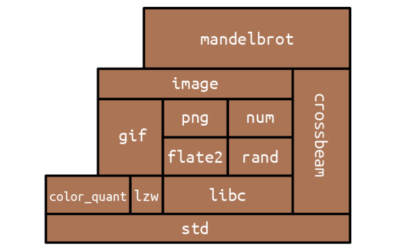
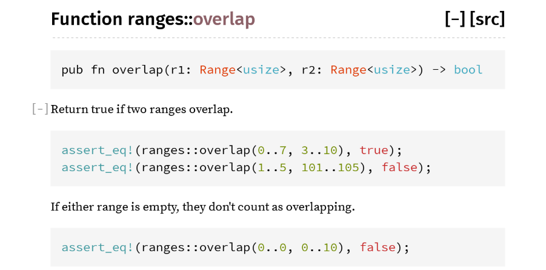

# crate与模块

 *This is one note in a Rust theme: systems programmers can have nice things.* 

<p align="right">
    ——Robert O'Callahan, “<a href="https://robert.ocallahan.org/2016/08/random-thoughts-on-rust-cratesio-and.html">Random Thoughts on Rust: crates.io and IDEs</a>”
</p>

假设你在编写一个仿真蕨类植物从细胞开始生长的程序。你的程序就像蕨类一样，一开始非常简单，可能所有代码都在单个文件里——就像一个孢子。随着它逐渐成长，它开始逐渐建立起内部的结构，不同的片段负责不同的功能。它将分裂为多个文件，可能覆盖整个目录树。随着时间的推移，它可能会成为整个软件生态系统的重要组成部分 。对于任何成长到不仅仅是几个数据结构和几百行代码的程序，都必须要对代码进行组织。

这一章将会介绍Rust中用于组织程序的特性：crate和模块。我们还会介绍Rust crate的结构和分发相关的话题，包括如何编写文档和测试Rust代码，如何禁用不需要的编译器警告，如何使用Cargo来管理项目依赖和版本，如何在Rust的公开crate仓库：crates.io上发布开源的库，crate的版本如何演变，等等。我们将使用蕨类仿真程序作为我们的例子。

## Crate

Rust程序由 *crates* 组成。每一个crate都是一个完整的、一体的单元：一个库或可执行文件的所有代码、加上相关的测试、示例、工具、配置、以及一些其他东西。为了编写你自己的蕨类模拟器，你可能需要使用和3D图形、生物信息学、并行计算等相关的第三方库。这些库就像箱子一样（见”图8-1”）。


<p align="center">图8-1 一个crate和它的依赖</p>

查看crate是什么以及它们是如何工作的最简单方法就是使用带有`--verbose`参数的`cargo build`来构建一个有一些依赖的程序。我们用”一个并发的曼德勃罗集”作为示例。结果如下所示：
```
    $ cd mandelbrot
    $ cargo clean   # delete previously compiled code
    $ cargo build --verbose
        Updating registry `https://github.com/rust-lang/crates.io-index`
     Downloading autocfg v1.0.0
     Downloading semver-parser v0.7.0
     Downloading gif v0.9.0
     Downloading png v0.7.0
    
    ... (downloading and compiling many more crates)

        Compiling jpeg-decoder v0.1.18
          Running `rustc
             --crate-name jpeg_decoder
             --crate-type lib
             ...
             --extern byteorder=.../libbyteorder-29efdd0b59c6f920.rmeta
             ...
        Compiling image v0.13.0
          Running `rustc
             --crate--name image
             --crate-type lib
             ...
             --extern byteorder=.../libbyteorder-29efdd0b59c6f920.rmeta
             --extern gif=.../libgif-a7006d35f1b58972.rmeta
             --extern jpeg_decoder=.../libjped_decoder-5c10558d0d57d300.rmeta
        Compiling mandelbrot v0.1.0 (/tmp/rustbook-test-files/mandelbrot)
          Running `rustc
             --edition=2018
             --crate-name mandelbrot
             --crate-type bin
             ...
             --extern crossbeam=.../libcrossbeam-f87b4b3d3284acc2.rlib
             --extern image=.../libimage-b5737c12bd641c43.rlib
             --extern num=.../libnum-1974e9a1dc582ba7.rlib -C link-arg=-fuse-ld=lld`
         Finished dev [unoptimized + debuginfo] target(s) in 16.94s
```

我们重新格式化了`rustc`的命令行来改善可读性，并且删掉了很多和我们的讨论无关的编译器选项，用省略号(...)代替了它们。

你可能还记得，当我们完成曼德勃罗集程序时，它的 *main.rs* 包含几个引入其它crate的`use`声明：
```Rust
    use num::Complex;
    // ...
    use image::ColorType;
    use image::png::PNGEncoder;
```

我们还在 *Cargo.toml* 中指定了每个crate的版本：
```toml
    [dependencies]
    num = "0.4"
    image = "0.13"
    crossbeam = "0.8"
```

这里的 *依赖* 指这个程序使用的其它crate，也就是我们依赖的代码。我们可以在[crates.io](https://crates.io)中找到这些crate，那是Rust社区用于存放开源的crate的网站。例如，我们可以访问crates.io并搜索图片库来找到`image`库。crates.io上的每个crate的页面上会显示它的 *README.md* 文件和到文档和源代码的链接，还有一行配置例如`image = "0.13"`，你可以复制这一行并添加到你的 *Crago.toml* 中。这里显示的版本号直接用了我们在编写这个程序时这三个包的最新版本。

Cargo的输出说明了这些信息是如何被使用的。当我们运行`cargo build`时，Cargo会首先从crates.io下载这些crate的指定版本的源码。然后，它读取那些crate的 *Cargo.toml* 文件，下载 *它们* 的依赖，然后递归操作。例如，`image` crate的0.13.0版本的源代码中包含一个 *Cargo.toml* 文件，内容如下：
```toml
    [dependencies]
    byteorder = "1.0.0"
    num-iter = "0.1.32"
    num-rational = "0.1.32"
    num-traits = "0.1.32"
    enum_primitive = "0.1.0"
```

看到这些内容，Cargo知道在它可以使用`image`之前，它必须先拉取这些crate。我们称它们为`mandelbrot`的 *间接(transitive)* 依赖。所有这些依赖的集合告诉了Cargo需要知道的有关如何构建和构建顺序的一切信息，它被称为crate的 *依赖图* 。Cargo自动处理依赖图和间接依赖的能力是程序员们付出时间和努力的一大胜利。

当获得了源代码之后，Cargo会编译所有的crate。它会运行Rust的编译器`rustc`，一次编译依赖图中的一个crate。当编译这些库时，Cargo会使用`--crate-type lib`选项。这告诉`rustc`不要寻找`main()`函数，而是产生一个包含编译过代码的 *.rlib* 文件，这个文件可以被用于创建可执行文件和其他 *.rlib* 文件。

当编译程序时，Cargo会使用`--crate-type bin`，编译的结果将是一个目标平台的二进制可执行文件：例如在Windows上就是 *mandelbrot.exe* 。

对于每一个`rustc`命令，Cargo都会传递`--extern`选项，给出crate用到的每一个库的名称。这样，当`rustc`看到一行类似于`use image::png::PNGEncoder`的代码时，它可以分辨出`image`是另一个crate的名字，而且Cargo传递的选项让它知道该从哪里寻找编译好的crate。Rust的编译器需要访问这些 *.rlib* 文件，因为它们包含编译好的库中的代码。Rust将会将代码静态链接到最终的可执行文件中。 *.rlib* 还包含类型信息，因此Rust可以通过检查确保我们在代码中使用的库的特性确实存在而且被正确使用。它还包含一份crate的public内联函数、泛型、宏、特性的拷贝，这些东西只有当Rust看到我们如何使用它们时才可以将它们编译为机器代码。

`cargo build`支持各种选项，其中的大部分都超出了本书的范围，不过我们在这里会提到其中一个：`cargo build --release`会生成优化后的构建。Release构建运行得更快，但需要更长的时间来编译，而且它们不检查整数溢出、跳过`debug_assert!()`断言，并且它们在panic时生成的堆栈追踪通常不太可靠。

### 版本

Rust有极强的兼容性保证。任何在Rust 1.0中能编译的代码必须在Rust 1.50或者1.900（如果发布了的话）中也能编译。

但有时社区会遇到一些令人信服的扩展语言的建议，这可能会导致旧代码不能再编译。例如，经过了多次讨论之后，Rust确定了一种支持异步编程的语法，将标识符`async`和`await`重新用作关键字（见”第20章”）。但这项语言的改变可能会导致使用`async`或者`await`作为变量名的代码不能再编译。

为了在不破坏这些现有代码的前提下演变，Rust使用了 *版本* 。Rust的2015版本和Rust 1.0兼容。2018版本将`async`和`await`改为关键字、精简了模块系统、还引入了一些和2015版本不兼容的其它语言更改。每个crate在 *Cargo.toml* 文件中的`package`节中用一行类似如下的说明指定Rust的版本：
```Rust
    edition = "2018"
```

如果缺少这个关键字，将会假设使用2015版本，因此旧的crate完全不需要做任何更改。但如果你想使用异步函数或者新的模块系统，你需要确保 *Cargo.toml* 中有`edition = "2018"`（或者可能更新的版本）。

Rust保证编译器将总是接受语言的所有版本，并且程序可以自由混合使用不同版本编写的crate。即使一个2015版本的crate依赖一个2018版本的crate也没有问题。换句话说，一个crate的版本只影响它的代码是如何被构建的，版本的区别只体现在代码编译的时候。这意味着没有必要更新旧的版本来适配现代Rust的生态。类似的，也没有必要将crate保持在旧版本来避免影响到它的用户。你只需要在想使用新的语言特性时更改自己代码中的版本。

版本并不是每年都会更新，只有当Rust项目觉得有必要出新版本的时候才会更新。例如，没有2020版本。把`edition`设置为`"2020"`将会导致错误。[Rust版本指南](https://doc.rust-lang.org/stable/edition-guide)介绍了每一个版本中的变化，并提供了版本系统的背景知识。

使用最新版本几乎总是一个好主意，尤其是新编写代码时。`cargo new`会默认创建最新版本的项目。本书中将始终使用2018版本。

如果你有一个用更旧版本的Rust编写的crate，`cargo fix`命令也许可以帮你自动把代码更新到更新的版本。Rust版本指南详细解释了`cargo fix`命令。

### 构建配置

有几个 *Cargo.toml* 中的配置选项可以影响到`cargo`生成的`rustc`命令行（”表8-1”）。

|          **命令行**       |   **使用到的Cargo.toml节**     |
| --- | --- |
|         `cargo build`  |  `[profile.dev]`    |
|         `cargo build --release`  |  `[profile.release]`  |
|         `cargo test`   |  `[profile.test]`   |

通常默认的行为就足够了，但我们会发现一个例外是你想使用一个profiler——一个用于测量程序使用CPU时间情况的工具。为了从profiler获取最准确的数据，你将同时需要优化（通常只在release构建中可用）和调试符号（通常只在debug构建中可用）。为了同时启用两者，在 *Cargo.toml* 中添加：
```toml
    [profile.release]
    debug = true    # 允许在release构建中启用调试符号
```

`debug`设置控制是否给`rustc`传递`-g`选项。有了这个配置，当你输入`cargo build --release`时，你将会得到一个带有调试符号的二进制文件。优化的设置将不会被影响。

[Cargo文档](https://doc.rust-lang.org/cargo/reference/manifest.html)中列出了很多其他你可以在 *Cargo.toml* 中调整的设置。

## 模块

如果说crate决定了项目之间的代码共享，那么 *模块* 则决定了项目 *内部* 的代码组织。它们扮演了Rust中的命名空间——一种包含函数、类型、常量等内容的容器，这些模块组成了你的Rust程序或库。一个模块看起来类似于这样：

```Rust
    mod spores {
        use cells::{Cell, Gene};

        /// 成熟蕨类植物产生的细胞。它会随着风飘散，
        /// 这也是蕨类生命周期的一部分。一个孢子会成长为一个原叶体——
        /// 一个宽达5mm的完整的独立有机体。它会产生受精卵，
        /// 这些受精卵会成长为新的蕨类植物（植物的性别很复杂）。
        pub struct Spore {
            ...
        }

        /// 模拟通过减数分裂产生孢子的过程。
        pub fn produce_spore(factory: &mut Sporangium) -> Spore {
            ...
        }

        // 提取一个孢子中的基因。
        pub(crate) fn genes(spore: &Spore) -> Vec<Gene> {
            ...
        }

        /// 混合基因为减数分裂做准备（分裂间期的一部分）。
        fn recombine(parent: &mut Cell) {
            ...
        }

        ...
    }
```

模块是 *item* 的集合，`item`是命名的特性，例如本例中的`Spore`结构体和两个函数。`pub`关键字将item设为公有的，因此可以从模块外部访问。

把函数标记为`pub(crate)`，意味着它在这个crate中任何地方都可以访问，但不作为外部接口的一部分公开。它不能被其他crate使用，也不会在crate的文档中显示。

任何没有被标记为`pub`的都是私有的，只能在定义它的模块和子模块中使用：
```Rust
    let s = spores::produce_spore(&mut factory);    // ok
    
    spores::recombine(&mut cell);   // 错误：`recombine`是私有的
```

将item标记为 *pub* 通常称为“导出”这个item。

这一节的剩余部分将覆盖使用模块所需要了解的细节：

- 我们会展示如果需要的话怎么嵌套模块和把它们分布在不同的文件和目录中。
- 我们会解释Rust从其他模块中引用item的路径语法，并展示怎么导入item，这样就不需要每次都写出完整的路径。
- 我们会接触Rust对结构体字段的细粒度控制。
- 我们会介绍 *prelude* 模块，它通过收集几乎所有用户都会用到的常见导入来减少重复的导入。
- 我们会展示 *常量* 和 *静态量* ，这是两种为了清晰和一致性而设计的定义命名变量的方式。

### 嵌套模块

模块可以嵌套，事实上一个模块只是一些子模块的集合的情况是很常见的：
```Rust
    mod plant_structures {
        pub mod roots {
            ...
        }
        pub mod stems {
            ...
        }
        pub mod leaves {
            ...
        }
    }
```

如果你想要让嵌套模块中的一个item对其他crate可见，那需要保证将它 *和所有嵌套包含它的模块* 标记为public。否则你会看到一个类似这样的警告：
```
    warning: function is never used: `is_square`
      --> src/crates_unused_items.rs:23:9
       |
    23 | /         pub fn is_square(root: &Root) -> bool {
    24 | |             root.cross_section_shape().is_square()
    25 | |         }
       | |_________^
       |
```

可能这个函数这时确实是死代码。但如果你是想将它用在其他crate中，Rust会让你明白它实际上并不可见。你需要保证嵌套包含它的模块也都被标记为`pub`。

也可以声明`pub(super)`，让一个item只在父模块中可见。`pub(in <path>)`可以让它在一个指定的父模块和其后代中可见。这在深层嵌套的模块中很有用：
```Rust
    mod plant_structures {
        pub mod roots {
            pub mod products {
                pub(in crate::plant_structures::roots) struct Cytokinin {
                    ...
                }
            }

            use products::Cytokinin;    // ok: 在`roots`模块中
        }

        use roots::products::Cytokinin; // error: `Cytokinin`是私有的
    }

    // error: `Cytokinin`是私有的
    use plant_structures::roots::products::Cytokinin;
```

通过这种方式，我们可以写出一个有数量庞大的代码和完整的模块层次结构的程序，不管这些模块的关系如何，我们都可以将整个程序写在单个文件里。

但实际上以这种方式来工作非常的痛苦，因此还有另一种方案。

### 单独文件中的模块

一个模块还可以这么写：
```Rust
    mod spores;
```

之前，我们还在花括号中包含了`spores`模块的主体。这里，我们通过这种方式告诉Rust编译器`spores`模块在一个单独的叫 *spores.rs* 的文件里：
```Rust
    // spores.rs

    /// 成熟蕨类植物产生的一个细胞...
    pub struct Spore {
        ...
    }

    /// 模拟减数分裂产生孢子的过程。
    pub fn produce_spore(factory: &mut Sporangium) -> Spore {
        ...
    }

    /// 从一个孢子中提取基因。
    pub(crate) fn genes(spore: &Spore) -> Vec<Gene> {
        ...
    }

    /// 混合基因为减数分裂做准备（分裂间期的一部分）。
    fn recombine(parent: &mut Cell) {
        ...
    }
```

 *spores.rs* 只包含组成模块的item。它并不需要任何说明来表明它是一个模块。

这个`spores`模块和我们在上一节中展示的版本的 *唯一* 不同就是代码的位置。有关公有性和私有性的规则和之前完全相同。Rust从来不会单独编译模块，即使它们在单独的文件里。当你构建一个Rust的crate的时候，你总是要重新编译它里面所有的模块。

一个模块也可以有自己的目录。当Rust看到`mod spores;`时，它会检查 *spores.rs* 和 *spores/mod.rs* ，如果这两个文件都不存在或者都存在就会报错。本例中因为`spores`模块没有任何子模块，所以我们使用了 *spores.rs* 。但考虑一下我们之前写的`plant_structures`模块。如果我们决定将那个模块和它的三个子模块分割在单独的文件中，最终的项目看起来就是这样：
```
    fern_sim/
    |-- Cargo.toml
    |-- src/
        |-- main.rs
        |-- spores.rs
        |-- plant_structures/
            |-- mod.rs
            |-- leaves.rs
            |-- roots.rs
            |-- stems.rs
```

在 *main.rs* 中，我们声明了`plant_structures`模块：
```Rust
    pub mod plant_structures;
```

这会导致Rust去加载 *plant_structures/mod.rs* ，这个文件里又声明了三个子模块：
```Rust
    // 在plant_structures/mod.rs中
    pub mod roots;
    pub mod stems;
    pub mod leaves;
```

这三个模块的内容都被存储在单独的文件中，分别命名为 *leaves.rs* 、 *roots.rs* 、 *stems.rs* ，和 *mod.rs* 一样在`plant_structures`目录下。

使用同名的文件和目录来组成模块也是可行的。例如，如果`stems`需要包含两个分别叫`xylem`和`phloem`的模块，我们可以选择将`stems`保留在 *plant_structures/stems.rs* 中，然后添加一个新的`stems`目录：
```
    fern_sim/
    |-- Cargo.toml
    |-- src/
        |-- main.rs
        |-- spores.rs
        |-- plant_structures/
            |-- mod.rs
            |-- leaves.rs
            |-- roots.rs
            |-- stems/
            |   |-- phloem.rs
            |   |-- xylem.rs
            |
            |-- stems.rs
```

然后在 *stems.rs* 中声明这两个新的子模块：
```Rust
    // 在plant_structures/stems.rs中
    pub mod xylem;
    pub mod phloem;
```

这三种方式——模块在自己单独的文件中、模块在自己同名的目录中的 *mod.rs* 中，模块在自己单独的文件中并有一个同名的目录包含子模块——给了模块系统足够的灵活性来支撑你需要的任何程序结构。

### 路径和导入

`::`运算符用于访问模块中的特性。你的项目中任何地方的代码都可以通过路径来引用任何标准库的特性：
```Rust
    if s1 > s2 {
        std::mem::swap(&mut s1, &mut s2);
    }
```

`std`是标准库的名称。路径`std`指向标准库的顶层模块。`std::mem`是在标准库中的一个子模块，`std::mem::swap`是`std::mem`模块中的一个public函数。

你可以始终用这种方式编写所有的代码，每当你需要圆或字典时都写出`std::f64::consts::PI`和`std::collections::HashMap::new`，但这样太过繁琐，而且难以阅读。替代方案是把一些特性 *导入* 用到它们的模块：
```Rust
    use std::mem;

    if s1 > s2 {
        mem::swap(&mut s1, &mut s2);
    }
```

`use`声明会导致`mem`变为`std::mem`在整个块或模块中的一个局部别名。

你也可以写`std::mem::swap`来导入`swap`函数本身，而不是`mem`模块。然而，我们之前的方式被认为是最佳的风格：引入类型、trait和模块（例如`std::mem`）然后使用相对路径访问函数、常量和其他成员。

可以一次导入若干个名字：
```Rust
    use std::collections::{HashMap, HashSet};   // 导入两个
    
    use std::fs::{self, File};  // 导入`std::fs`和`std::fs::File`
    
    use std::io::prelude::*;    // 导入所有内容
```

也可以写出所有的单独导入：
```Rust
    use std::collections::HashMap;
    use std::collections::HashSet;

    use std::fs;
    use std::fs::File;

    // std::io::prelude中的所有public item：
    use std::io::prelude::Read;
    use std::io::prelude::Write;
    use std::io::prelude::BufRead;
    use std::io::prelude::Seek;
```

你可以使用`as`导入一个item并同时给它一个不同的局部名称：
```Rust
    use std::io::Result as IOResult;

    // 返回类型等价于`std::io::Result<()>`
    fn save_spore(spore: &Spore) -> IOResult<()>
    ...
```

模块并不会 *自动* 从父模块中继承名称。例如，假设我们的 *proteins/mod.rs* 有如下内容：
```Rust
    // proteins/mod.rs
    pub enum AminoAcid { ... }
    pub mod synthesis;
```

那么 *synthesis.rs* 里的代码并不会自动导入类型`AminoAcid`：
```Rust
    // proteins/synthesis.rs
    pub fn synthesis(seq: &[AminoAcid]) // 错误：找不到类型`AminoAcid`
        ...
```

每一个模块都会以空白的状态开始，必须导入它使用的名称：
```Rust
    // proteins/synthesis.rs
    use super::AminoAcid;   // 显式地从父模块中导入
    pub fn synthesize(seq: &[AminoAcid]) // ok
        ...
```

默认情况下，路径是相对于当前模块的：
```Rust
    // 在proteins/mod.rs中

    // 从子模块中导入
    use synthesis::synthesize;
```

`self`也是当前模块的同义词，因此我们可以写：
```Rust
    // 在proteins/mod.rs中

    // 导入一个枚举中的名字
    // 这样我们可以用`Lys`来表示赖氨酸，而不是`AminoAcid::Lys`
    use self::AminoAcid::*;
```

或者简写为：
```Rust
    // 在proteins/mod.rs中

    use AminoAcid::*;
```

（这里的`AminoAcid`的例子，有些违背我们之前提到的只导入类型、trait和模块的风格。如果我们的程序包含很长的氨基酸序列，那么根据奥威尔的第六原则：“Break any of these rules sooner than say anything outright barbarous.”（绝不要用粗俗语言，为此可以打破上面任一规则。）这么做也是有道理的。）

路径中的`super`和`crate`关键字有特殊的含义：`super`指代父模块，`crate`指代包含当前模块的crate。

使用相对于crate根的路径而不是相对于当前模块的路径可以使在项目中移动代码变得更容易，因为这样的话就算当前模块的路径变了，导入也不会出错。例如，我们可以使用`crate`来写 *synthesis.rs* ：
```Rust
    // proteins/synthesis.rs
    use crate::proteins::AminoAcid; // 显式的相对于crate根的导入

    pub fn synthesize(seq: &[AminoAcid]) // ok
        ...
```

子模块可以通过`use super::*`访问父模块中的私有item。

如果你有一个模块和当前正在使用的某一个模块同名，那么引用它们的时候就要小心了。例如，如果你的程序在 *Cargo.toml* 列出了`image` crate依赖，同时还有一个模块叫`image`，那么以`image`开头的路径将会导致歧义：
```Rust
    mod image {
        pub struct Sampler {
            ...
        }
    }

    // 错误：这是指向`image`模块，还是`image` crate？
    use image::Pixels;
```

即使`image`模块没有`Pixels`类型，这个歧义也会被认为是错误：如果之后又添加了`Pixels`的定义，那么可能会改变路径指向的内容，这可能会令人迷惑。

为了解决歧义，Rust有一种特殊的路径称为 *绝对路径* ，它们以`::`开头，将总是指向一个外部的crate。为了指向`image` crate中的`Pixels`类型，你可以写：
```Rust
    use ::image::Pixels;    // `image` crate的`Pixels`
```

为了指向你自己的模块中的`Sampler`类型，你可以写：
```Rust
    use self::image::Sampler;   // `image`模块的`Sampler`
```

模块和文件的概念并不相同，但模块和Unix文件系统中的文件和目录存在自然的类比关系。`use`关键字创建别名，就像`ln`命令创建链接。路径类似于文件名，有绝对路径和相对路径两种形式。`self`和`super`类似于`.`和`..`这两个特殊的目录。

### 标准prelude

我们之前说每个模块都以“空白的状态”开始，但事实上并不是 *完全* 空白的状态。

其中一点是，标准库`std`被自动链接到每个项目。这意味着你总是可以使用`std::whatever`这种方式来引用`std`里的item，例如`std::mem::swap()`。另外，一些特殊的常见名称，例如`Vec`和`Result`也被包含在 *标准prelude* 中并且被自动导入。具体的行为就好像是包括根模块在内的每个模块都以如下导入开始：
```Rust
    use std::prelude::v1::*;
```

标注的prelude包含一些通用的trait和类型。

在”第2章”中时，我们提到了库有时会提供叫`prelude`的模块。但`std::prelude::v1`是唯一一个自动导入的。将一个模块命名为`prelude`只是一个惯例，告诉用户他应该导入`*`。

### pub use声明

即使`use`声明只是别名，它们也可以是公有的：
```Rust
    // in plant_structures/mod.rs
    ...
    pub use self::leaves::Leaf;
    pub use self::roots::Root;
```

这意味着`Leaf`和`Root`是`plant_structures`模块里的public item。它们实际上只是`plant_structures::leaves::Leaf`和`plant_structures::roots::Root`的别名。

标准的prelude就是以一系列`pub`导入的方式实现的。

### pub结构体字段

模块可以包含用户用`struct`关键字定义的自定义结构体类型。我们将在”第9章”中介绍细节，但这是一个了解模块如何和结构体字段的可见性交互的好时机。

一个简单的结构体类似这样：
```Rust
    pub struct Fern {
        pub roots: RootSet,
        pub stems: StemSet
    }
```

一个结构体的所有字段，包括私有字段，都可以在定义结构体的整个模块及其子模块中访问，在模块之外，只有公有的字段才可以被访问。

事实证明通过模块来实现访问控制，而不是像Java和C++那样通过类来实现，对于程序设计将是很大的帮助。不仅能减少重复“getter”和“setter”方法，还能消除类似C++中`friend`声明的需求。一个模块中可以定义几个紧密结合的类型，例如`frond::LeafMap`和`frond::LeafMapIter`，让它们能按需互相访问彼此的私有字段，同时对程序中的其他部分隐藏实现的细节。

### 静态量和常量

除了函数、类型和嵌套模块之外，模块里还可以定义 *常量* 和 *静态量* 。

`const`关键字定义常量，语法类似于`let`，除了它必须被标记为`pub`以及要显式写出类型。还有，为了方便，常量一般都用`UPPERCASE_NAMES`：
```Rust
    pub const ROOM_TEMPERATURE: f64 = 20.0;     // 摄氏度
```

`static`关键字定义静态量，和`const`的用法几乎一样：
```Rust
    pub static ROOM_TEMPERATURE: f64 = 68.0;    // 华氏温度
```

常量有些类似于C++中的`#define`，值被编译进代码中每一个使用它的地方。一个静态量就是一个在程序开始之前就初始化并持续到程序退出的变量。在代码中使用常量表示幻数和字符串。使用静态量表示更大规模的数据，或者用于需要借用全局常量的引用时。

没有`mut`常量。静态量可以被标记为`mut`，但就像我们在”第5章”中讨论的一样，Rust没有任何方法强制实现`mut`静态量的独占访问。因此，这种变量天生线程不安全，safe代码完全不能使用它们：
```Rust
    static mut PACKETS_SERVED: usize = 0;

    println!("{} served", PACKETS_SERVED);  // 错误：使用了可变的静态量
```

Rust不鼓励全局可变的状态。关于替代方案的讨论，见“全局变量”一节。

## 将程序变为库

当你的蕨类模拟器完成之后，你发现你需要不止一个程序。假设你还有一个命令行程序运行这个模拟器并把结果保存到文件中。现在，你想要编写其他程序来对保存的结果进行科学分析、实时渲染成长中的植物、渲染逼真的植物等等。所有这些程序都要共享基本的蕨类模拟器的代码。你需要创建一个库。

第一步是将你现有的项目分解为两部分：一个库crate和一个可执行文件。前者包含所有的共享代码，后者包含只有命令行程序才需要的代码。

为了展示怎么做到这一点，让我们给出一个简单粗暴的示例程序：
```Rust
    struct Fern {
        size: f64,
        growth_rate: f64
    }

    impl Fern {
        /// 模拟一个蕨类植物一天地成长
        fn grow(&mut self) {
            self.size *= 1.0 + self.growth_rate;
        }
    }

    /// 运行蕨类模拟器模拟几天的变化
    fn run_simulation(fern: &mut Fern, days: usize) {
        for _ in 0 .. days {
            fern.grow();
        }
    }

    fn main() {
        let mut fern = Fern {
            size: 1.0,
            growth_rate: 0.001
        };
        run_simulation(&mut fern, 1000);
        println!("final fern size: {}", fern.size);
    }
```

我们假设这个程序有一个普通的 *Cargo.toml* 文件：
```toml
    [package]
    name = "fern_sim"
    version = "0.1.0"
    authors = ["You <you@example.com>"]
    edition = "2018"
```

将这个程序变为库是很简单的。只需要如下步骤：

- 将文件 *src/main.rs* 重命名为 *src/lib.rs* 
- 给 *src/lib.rs* 里将作为库的公开特性的item添加`pub`关键字
- 暂时把`main`函数移动到一个别的临时文件中。我们将很快回来处理它。

最后的 *src/lib.rs* 文件看起来像这样：
```Rust
    pub struct Fern {
        pub size: f64,
        pub growth_rate: f64
    }

    impl Fern {
        /// 模拟一个蕨类植物一天地成长
        pub fn grow(&mut self) {
            self.size *= 1.0 + self.growth_rate;
        }
    }

    /// 运行蕨类模拟器模拟几天的变化
    pub fn run_simulation(fern: &mut Fern, days: usize) {
        for _ in 0 .. days {
            fern.grow();
        }
    }
```

注意我们不需要更改 *Cargo.toml* 中的任何内容。因为我们的最精简的 *Cargo.toml* 会保持Cargo的默认行为。默认情况下，`cargo build`会查看源代码目录下的文件然后判断要构建什么。当它看到 *src/lib.rs* 文件，它就知道要构建一个库。

 *src/lib.rs* 里的代码组成了库的 *根模块* 。其他使用我们库的crate可以访问根模块里的公有item。

## src/bin目录

想让原本的`fern_sim`程序再次工作也非常简单：Cargo有一些内建的支持，可以让较小的程序和库存在同一个crate中。

事实上，Cargo自身就是用这种方式编写的。它的大部分代码都在一个Rust库里。我们在本书中至今为止用过的`cargo`命令行程序只是一个简单的包装程序，它会调用库来完成真正的工作。库和命令行程序[在同一个源代码仓库中](https://github.com/rust-lang/cargo)。

我们也可以把程序和库放在同一个crate中。将以下代码放入 *src/bin/efern.rs* 的文件中：
```Rust
    use fern_sim::{Fern, run_simulation};

    fn main() {
        let mut fern = Fern {
            size: 1.0,
            growth_rate: 0.001
        };
        run_simulation(&mut fern, 1000);
        println!("final fern size: {}", fern.size);
    }
```

这个`main`函数就是我们之前放在一边的那个。我们添加了`use`声明来使用`fern_sim` crate里的一些item：`Fern`和`run_simulation`。也就是说，我们像使用库一样使用了那个crate。

因为我们把这个文件放在了 *src/bin* 里，所以下次运行`cargo build`时，Cargo将会同时编译`fren_sim`库和这个程序。我们可以使用`cargo run --bin efern`来运行`efern`程序。可以通过使用`--verbose`参数来查看Cargo运行的命令，大概是这样：
```
    $ cargo build --verbose
       Compiling fern_sim v0.1.0 (file:///.../fern_sim)
         Running `rustc src/lib.rs --crate-name fern_sim --crate-type lib ...`
         Running `rustc src/bin/efern.rs --crate-name efern --crate-type bin ...`
    $ cargo run --bin efern --verbose
           Fresh fern_sim v0.1.0 (file:///.../fern_sim)
         Running `target/debug/efern`
    final fern size: 2.7169239322355985
```

我们仍然不需要修改 *Cargo.toml* 中的任何内容，Cargo的默认行为是查看源文件然后进行判断。它会自动把 *src/bin* 里的 *.rs* 文件当作额外的程序来构建。

我们也可以在 *src/bin* 目录下通过子目录来构建更大的程序。假设我们想要提供另一个程序在屏幕上绘制蕨类植物，但绘制代码比较多而且是模块化的，因此它应该有自己的文件。我们可以将第二个程序放在单独的子目录中：
```
    fern_sim/
    |-- Cargo.toml
    |-- src/
        |-- bin/
            |-- efern.rs
            |-- draw_fern/
                |-- main.rs
                |-- draw.rs
```

把更大的可执行程序存放在自己的目录中的优势是不会打乱库代码和`src/bin`目录。

当然，既然现在`fern_sim`是一个库，那么我们还有另一种选择。我们可以把这个程序放入单独的项目中，在一个完全独立的目录中，在它的 *Cargo.toml* 中列出`fern_sim`作为依赖：
```toml
    [dependencies]
    fern_sim = { path = "../fern_sim" }
```

可能这正是你之后编写其他蕨类模拟程序时采用的方法。 *src/bin* 目录只适合像`efern`和`draw_fern`这样的简单程序。

## 属性

Rust程序中的任何item都可以用 *属性* 修饰。属性是Rust中向编译器传递指令和建议的语法。例如，假设你得到了如下警告：
```
    libgit2.rs: warning: type `git_revspec` should have a camel case name
        such as `GitRevspec`, #[warn(non_camel_case_types)] on by default
```

但是你选择这个名字是有原因的，你并不希望Rust发出警告。你可以通过给类型加上`#[allow]`属性来禁用警告：
```Rust
    #[allow(non_camel_case_types)]
    pub struct git_revspec {
        ...
    }
```

条件编译是另一个通过属性来实现的特性，这个属性叫`#[cfg]`：
```Rust
    // 只有当我们在构建Android应用时才在项目中包含这个模块
    #[cfg(target_os = "android")]
    mod mobile;
```

`#[cfg]`的完整语法见[Rust参考手册](https://doc.rust-lang.org/reference/conditional-compilation.html)，”表8-2”中列出了最常用的选项。

|          **`#[cfg]`选项**    |   **编译的条件**   |
| --- | --- |
|         `test`    |  测试模式时（用`cargo test`或者`rustc --test`编译时）  |
|         `debug_assertions`  |  调试断言开始时（通常在非优化构建中）  |
|         `unix`    |  为Unix系统编译时，包括macOS  |
|         `windows` |  为Windows编译时  |
|         `target_pointer_width = "64"`  |  目标平台是64位时。其他可能的值是`"32"`  |
|         `target_arch = "x86_64"`  |  x86-64架构特定。其他值：`"x86", "arm", "aarch64", "powerpc", "powerpc64", "mips"`  |
|         `target_os = "macos"`  |  macOS特定。其他值：`"windows", "ios", "android", "linux", "freebsd", "openbsd", "netbsd", "dragonfly"`  |
|         `feature = "robots"`  |  启用用户自定义特性`"robots"`时（用`cargo build --feature robots`或者`rustc --cfg feature='"robots"'`）。特性在[*Cargo.toml* 的`[features]`节中声明](https://doc.rust-lang.org/cargo/reference/manifest.html)。  |
|         `not`(*(A)*)  |   *A* 不满足时。为了让一个函数有两种不同的实现，可以将其中一个标记为`#[cfg(X)]`，另一个表记为`#[cfg(not(X))]`。  |
|         `all`( *A* ,  *B* )  |  当 *A* 和 *B* 都满足时（等价于`&&`）。  |
|         `any`( *A* ,  *B* )  |  当 *A* 或 *B* 满足时（等价于`\|\|`）。  |

有时，我们需要关心函数的内联展开，这是一种我们通常乐意让编译器实现的一种优化。我们可以使用`#[inline]`属性来实现内联：
```Rust
    /// 调整相互渗透下，两个相邻细胞中的各种离子的浓度
    #[inline]
    fn do_osmosis(c1: &mut Cell, c2: &mut Cell) {
        ...
    }
```

在一种特殊情况下，如果没有`#[inline]`一定 *不会* 发生内联。就是当一个crate中的一个函数或方法在另一个crate中被调用时，除非它是泛型的（有泛型参数）或者被显式标记为`#[inline]`，否则它一定不会被内联展开。

另外，编译器只是把`#[inline]`当作一个建议。Rust也支持`#[inline(always)]`来要求一个函数必须在每一次被调用时内联展开；和`#[inline(never)]`来要求一个函数永远不会被内联展开。

有一些属性，例如`#[cfg]`和`#[allow]`，可以被用于整个模块，然后作用于模块里的所有东西。而另一些，例如`#[test]`和`#[inline]`只能用于单独的item。正如你可能期待的一样，每个属性都是定制的，并且有自己的一组受支持的参数。Rust的参考手册详细列出了[所有支持的属性](https://doc.rust-lang.org/reference/attributes.html)。

为了将一个属性用于整个crate，可以在 *main.rs* 或者 *lib.rs* 文件的最前边添加属性，并用`#!`来代替`#`，像这样：
```Rust
    // libgit2_sys/lib.rs
    #![allow(non_camel_case_types)]

    pub struct git_revspec {
        ...
    }

    pub struct git_error {
        ...
    }
```

`#!`告诉Rust将一个属性附加到作用域里的每一个item，而不是下一个item：在这个例子中，`#![allow]`属性作用于整个`libgit2_sys` crate，而不仅仅是`struct git_revspec`。

`#!`还可以在函数体内、结构体定义内等地方使用，但它通常被用在一个文件的开头，来将一个属性附加到整个模块或crate。一些属性总是使用`#!`语法，因为它们只能被用于整个crate。

例如，`#![feature]`属性可以打开Rust语言和库里的 *unstable* 特性。这些特性都是实验性的，因此可能会有bug或者可能会在将来修改或者删除。例如，正如下面那段代码一样，Rust对追踪宏展开例如`assert!`有实验性的支持，但是因为这个支持是实验性的，因此你必须安装nightly版本的Rust并且显式声明你要使用宏追踪的特性：
```Rust
    #![feature(trace_macros)]
    
    fn main() {
        // 我想知道assert_eq!实际上到底被替换成了什么代码
        trace_macros!(true);
        assert_eq!(10*10*10 + 9*9*9, 12*12*12 + 1*1*1);
        trace_macros!(false);
    }
```

随着时间的推移，Rust队伍有时会 *标准化* 一个实验特性，这样它就会成为语言标准的一部分。然后`#![feature]`特性就会变得多余，Rust会生成一个警告建议你删除它。

## 测试和文档

正如我们在“编写并运行单元测试”一节中看到的一样，Rust中内建了一个简单的单元测试框架。测试是用`#[test]`属性标记的普通函数：
```Rust
    #[test]
    fn math_works() {
        let x: i32 = 1;
        assert!(x.is_positive());
        assert_eq!(x + 1, 2);
    }
```

`cargo test`会运行项目中的所有测试：
```
    $ cargo test
       Compiling math_test v0.1.0 (file:///.../math_test)
         Running target/release/math_test-e31ed91ae51ebf22
    
    running 1 test
    test math_works ... ok

    test result: ok. 1 passed; 0 failed; 0 ignored; 0 measuerd; 0 filtered out
```
（你也可能会看到一些有关“doc-tests”的输出，我们将在稍后讨论它。）

测试的行为和你的crate是可执行程序还是库没有关系。你可以通过向Cargo传递参数来运行指定的测试：`cargo test math`会运行名称中包含`math`的所有测试。

测试通常使用Rust标准库里的`assert!`和`assert_eq!`宏。若`expr`为真，`assert!(expr)`断言会成功；否则它会panic，并导致测试失败。`assert_eq!(v1, v2)`类似于`assert!(v1 == v2)`，除了当断言失败时，它会同时打印出两个操作数的值。

也可以在普通的代码中使用这两个宏，但注意即使是release构建`assert!`和`assert_eq!`也会被包含进去。使用`debug_assert!`和`debug_assert_dq!`来编写只在debug构建时才会检查的断言。

为了测试错误的情况，需要向测试添加`#[should_panic]`属性：
```Rust
    /// 正如我们在上一章中说的一样，
    /// 只有当除0会导致panic时这个测试才能通过
    #[test]
    #[allow(unconditional_panic, unused_must_use)]
    #[should_panic(expected="divide by zero")]
    fn test_divide_by_zero_error() {
        1 / 0;  // 应该panic！
    }
```

在这个例子中，我们需要添加`allow`属性来告诉编译器允许我们写一些可以静态证明一定会panic的代码，然后进行除法并丢弃结果值。因为通常情况下，编译器会阻止这种愚蠢的代码。

你也可以在测试中返回`Result<(), E>`。只要错误类型实现了`Debug` trait（这是通常的情况），你就可以使用`?`略过`Ok`的情况返回一个`Result`：
```Rust
    use std::num::ParseIntError;

    /// 只有当"1024"是个有效的数字时这个测试才能通过
    #[test]
    fn main() -> Result<(), ParseIntError> {
        i32::from_str_radix("1024", 10)?;
        Ok(())
    }
```

用`#[test]`标记的函数会条件编译。普通的`cargo build`或者`cargo build --release`会跳过测试代码。但当你运行`cargo test`时，Cargo会编译程序两次：一次是用普通方式编译，另一次是在启用测试和测试工具的情况下编译。这意味着如果需要的话，你的单元测试可以和要测试的代码放在一起，这样可以访问内部的实现细节，并且没有运行时开销。然而，这可能会导致一些警告。例如：
```Rust
    fn roughly_equal(a: f64, b: f64) -> bool {
        (a - b).abs() < 1e-6
    }

    #[test]
    fn trig_works() {
        use std::f64::const::PI;
        assert!(roughly_equal(PI.sin(), 0.0));
    }
```

在省略测试代码的构建中，`roughly_equal`可能未被使用，Rust会警告：
```
    $ cargo build
       Compiling math_test v0.1.0 (file:///.../math_test)
    warning: function is never used: `roughly_equal`
     --> src/crates_unused_testing_function.rs:7:1
      |
    7 | / fn roughly_equal(a: f64, b: f64) -> bool {
    8 | |     (a - b).abs() < 1e-6    
    9 | | }
      | |_^
      |
       = note: #[warn(dead_code)] on by default
```

因此，当你的测试足够复杂需要支持的代码的时候，将它们放在一个`tests`模块中并使用`#[cfg]`属性将整个模块声明为测试模式特定：
```Rust
    #[cfg(test)]    // 只有在测试时才包含这个模块
    mod tests {
        fn roughly_equal(a: f64, b: f64) -> bool {
            (a - b).abs() < 1e-6
        }

        #[test]
        fn trig_works() {
            use std::f64::const::PI;
            assert!(roughly_equal(PI.sin(), 0.0));
        }
    }
```

Rust的测试工具默认会使用多线程同时运行多个测试，这是你的Rust代码线程安全的一个附带的好处。为了禁用并行测试，运行`cargo test -- --test-threads 1`。（第一个`--`确保`cargo test`会把`--test-threads`选项传递给测试的可执行程序）如果想运行单个测试，运行`cargo test testname`。这意味着从技术上讲，我们在”第2章”中展示的曼德勃罗程序并不是那一章中的第二个多线程程序，而是第三个！“编写并运行单元测试”一节中运行的`cargo test`才是第一个。

通常来说，测试工具只会显示失败的测试的输出。为了显示通过的测试的输出，可以运行`cargo test -- --no-capture`。

### 集成测试

你的蕨类模拟器的规模仍然在增长。你决定将所有主要的代码放进一个库里，这样可以被很多可执行程序使用。模拟最终使用 *fern_sim.rlib* 库的用户使用它的方式对它进行一些测试将是一个好主意。另外，你还有一些首先从二进制文件中加载保存的模拟器的测试，将这些很大的测试文件保存在`src`目录中是很尴尬的。集成测试可以帮忙解决这两个问题。

集成测试是`src`目录下的 *tests* 目录中的 *.rs* 文件。当你运行`cargo test`时，Cargo会将每一个集成测试编译成独立的crate，然后和你的库以及Rust的测试工具链接。这里有一个例子：
```Rust
    // tests/unfurl.rs - Fiddleheads unfurl in sunlight

    use fern_sim::Terrarium;
    use std::time::Duration;

    #[test]
    fn test_fiddlehead_unfurling() {
        let mut world = Terrarium::load("tests/unfurl_files/fiddlehead.tm");
        assert!(world.fern(0).is_furled());
        let one_hour = Duration::from_secs(60 * 60);
        world.apply_sunlight(one_hour);
        assert!(world.fern(0).is_fully_unfurled());
    }
```

集成测试之所以有价值，部分原因是它们从crate外部看待你的crate，就像一个用户一样。它们测试crate的public API。

`cargo test`会同时运行单元测试和集成测试。为了只运行特定文件中的集成测试——例如 *tests/unfurl.rs* ——使用命令`cargo test --test unfurl`。

### 文档

命令`cargo doc`为你的库生成HTML文档：
```
    $ cargo doc --no-deps --open
     Documenting fern_sim v0.1.0 (file:///.../fern_sim)
```

`--no-deps`选项告诉Cargo只为`fern_sim`自身生成文档，不要为它依赖的crate生成文档。

`--open`选项告诉Cargo稍后在你的浏览器中打开文档。

结果如”图8-2”所示。Cargo会把新的文档文件保存在 *target/doc* 中，起始页面是 *target/doc/fern_sim/index.html* 。


<p align="center">图8-2 `rustdoc`生成的文档示例</p>

文档从你的库中的`pub`特性生成，加上你为它们编写的任何 *文档注释* 。我们在这一章中已经看到过一些文档注释了。它们看起来像普通的注释：
```Rust
    /// 模拟减数分裂产生孢子的过程。
    pub fn produce_spore(factory: &mut Sporangium) -> Spore {
        ...
    }
```
但当Rust看到它们是以三个斜杠开头时，它会把它们当作`#[doc]`属性。Rust将上面的示例看作和下面的代码等价：
```Rust
    #[doc = "模拟减数分裂产生孢子的过程。"]
    pub fn produce_spore(factory: &mut Sporangium) -> Spore {
        ...
    }
```

当你编译一个库或可执行程序时，这些属性并不会改变任何东西，但当你生成文档时，public特性的文档注释将会被包含在输出中。

同样的，以`//!`开头的注释被当作`#![doc]`属性，这个属性会被附加到作用域中，通常是一个模块或者crate。例如，你的 *fern_sim/src/lib.rs* 文件看起来可能像这样：
```Rust
    //! 从独立的细胞开始，
    //! 模拟蕨类植物的生长。
```

文档注释的内容被当做Markdown，一种简单HTML格式的速记符号。星号可以用作 *`*italics*`* 和 **`**bold type**`**，空行被当作段落结束，等等。你也可以包含HTML标签，它们会被逐字符拷贝到格式化文档。

Rust中的文档注释的一个特殊特性是Markdown链接可以使用Rust的item路径而不是相对URL来指明它们引用的item，例如`leaves::Leaf`。Cargo将会查找路径指向的内容，并创建指向正确文档页面中正确位置的链接。例如，这段代码生成的文档会链接到`VascularPath`、`Leaf`和`Root`的页面：
```Rust
    /// 创建并返回一个 [`VascularPath`] ，
    /// 它代表营养从给定的 [`Root`][r] 传输到给定的 [`Leaf`](leaves::Leaf) 的路径。
    ///
    /// [r]: roots::Root
    pub fn trace_path(leaf: &leaves::Leaf, root: &roots::Root) -> VascularPath {
        ...
    }
```

你还可以添加搜索别名来使用内建的搜索特性让item更容易被找到。在crate的文档中搜索“path”或者“route”将会导向`VascularPath`：
```Rust
    #[doc(alias = "route")]
    pub struct VascularPath {
        ...
    }
```

你可以使用`` `backticks` ``在文本中间创建代码片段。输出时，这些片段将会用等宽字体显示。更大的代码示例可以通过缩进四个空格来显示：
```Rust
    /// 文档注释中的一个代码块
    ///
    ///    if samples::everything().works() {
    ///        println!("ok");
    ///    }
```
你也可以使用Markdown-fenced代码块，效果和上面一样：
```Rust
    /// 另一个片段，但是写法不同：
    /// 
    /// ```
    /// if samples::everything().works() {
    ///     println!("ok");
    /// }
    /// ```
```

不管你用哪种方式，当你在文档注释中包含代码块的时候会发生一件有趣的事：Rust会自动把它当做一个测试。

### 文档测试

当你运行Rust库crate中的测试时，Rust会通过检查确保文档中出现的所有代码都能运行并正常工作。它将文档注释中出现的所有代码作为单独的可执行程序crate编译，然后和库链接并运行。

这里有一个文档测试的例子。运行`cargo new --lib ranges`（`--lib`参数告诉Cargo我们要创建一个库crate，而不是可执行程序crate）并将下列代码加到 *ranges/src/lib.rs* 中：
```Rust
    use std::ops::Range;

    /// 如果两个范围重叠就返回true
    ///
    ///     assert_eq!(ranges::overlap(0..7, 3..10), true);
    ///     assert_eq!(ranges::overlap(1..5, 101..105), false);
    ///
    /// 如果有一个范围是空的，视为不重叠。
    ///
    ///     assert_eq!(ranges::overlap(0..0, 0..10), false);
    ///
    pub fn overlap(r1: Range<usize>, r2:Range<usize>) -> bool {
        r1.start < r1.end && r2.start < r2.end &&
            r1.start < r2.end && r2.start < r1.end
    }
```

文档注释中的这两个小代码块将会出现在`cargo doc`生成的文档中，如”图8-3”所示。


<p align="center">图8-3 文档注释会展示一些文档测试</p>

它们也会成为两个单独的测试：
```
    $ cargo test
       Compiling ranges v0.1.0 (file:///.../ranges)
    ...
       Doc-tests ranges

    running 2 tests
    test overlap_0 ... ok
    test overlap_1 ... ok

    test result: ok. 2 passed; 0 failed; 0 ignored; 0 measuerd; 0 filtered out
```

如果你向Cargo传递`--verbose`参数，你将会看到它用`rustdoc --test`来运行这两个测试。`rustdoc`会把每个示例代码存储在单独的文件中，加上少量的样本代码来生成两个程序。这是第一个：
```Rust
    use ranges;
    fn main() {
        assert_eq!(ranges::overlap(0..7, 3..10), true);
        assert_eq!(ranges::overlap(1..5, 101..105), false);
    }
```

这是第二个：
```Rust
    use ranges;
    fn main() {
        assert_eq!(ranges::overlap(0..0, 0..10), false);
    }
```
如果程序能成功编译和运行，那么就可以通过测试。

这两段示例代码都包含了断言，但那只是因为在这种情况下，断言适用于编写文档。文档测试背后的目的不是让你把所有测试都放在注释里，而是让你写出最可能的用法的示例，然后Rust确保你文档中的代码示例确实可以编译并运行。

通常一个最小化的能工作的示例还包含一些细节，例如导入或初始化代码。这些是让代码能编译所必需的，但并不重要，不应该在文档中显示。为了隐藏代码示例中的某一行，可以在行的开始加上`#`和一个空格：
```Rust
    /// 开启光照，并运行模拟器一段时间
    ///
    ///     # use fern_sim::Terrarium;
    ///     # use std::time::Duration;
    ///     # let mut tm = Terrarium::new();
    ///     tm.apply_sunlight(Duration::from_secs(60));
    ///
    pub fn apply_sunlight(&mut self, time: Duration) {
        ...
    }
```

有时在文档中展示一个包含`main`函数的完整的示例程序会很有帮助。如果那些细节代码已经出现在了你的代码示例中，那你显然不会再希望`cargo`自动添加它们，因为这样会导致无法编译。因此`rustdoc`将所有包含字符串`fn main`的代码块视为完整的程序，不会再添加任何东西。

可以为特定的代码块禁用测试。为了告诉Rust编译你的示例，但并不真的运行它，可以使用带有`no_run`注解的fenced代码块：
```Rust
    /// 将所有的本地培养皿上传到在线的gallery。
    ///
    /// ```no_run
    /// let mut session = fern_sim::connect();
    /// session.upload_all();
    /// ```
    pub fn upload_all(&mut self) {
        ...
    }
```

如果甚至不希望代码编译，可以将`no_run`替换为`ignore`。使用`ignore`标记的块将不会出现在`cargo test`的输出中，但`no_run`标记的块会出现在测试的输出中，如果能编译就能通过测试。如果代码块完全不是Rust代码，那么使用语言的名字来标记。例如`c++`或`sh`，或者普通文本时用`text`。`rustdoc`并不知道几百种编程语言的名字，因此，它将所有不认识的注解都当作非Rust的代码块，这样会禁用代码高亮和文档测试。

## 指定依赖

我们已经看到过一种方式来告诉Cargo你的项目依赖的crate和版本号。
```toml
    image = "0.6.1"
```

有若干种方式可以指定依赖，并且你可能想问一些类似使用哪个版本的细节问题，因此值得花几页篇幅讨论这个问题。

首先，假设你想使用没有在crates.io上发布的依赖。一种方式是指明Git仓库的URL和修订号：
```toml
    image = { git = "https://github.com/Piston/image.git", rev = "528f19c" }
```

这个crate是GitHub上的开源仓库，但你也可以指明一个在你自己公司内网里的私有Git仓库。正如这里展示的一样，你可以指定要使用的特定的`rev`、`tag`或者`branch`。（这三种方式都可以告诉Git要checkout到源代码的哪个版本。）

另一种方式是指定一个含有crate源码的目录：
```toml
    image = { path = "vendor/image" }
```

当你的团队使用单个版本控制仓库来包含若干个甚至整个依赖图的所有crate时，这种方式会很方便。每个crate都可以使用相对路径指定它的依赖。

这种细粒度的依赖控制方式是一种很强大的功能。如果你发现任何开源的crate都不完全符合你的要求，你可以fork它：点击GitHub上的Fork按钮，然后更改 *Cargo.toml* 中的一行。这样你的下一次`cargo build`命令将会使用你fork的版本而不是官方的版本。

### 版本

当你在 *Cargo.toml* 中写下类似`iamge = "0.13.0"`这样的内容时，Cargo会以比较宽松的方式解释它。它会使用和0.13.0版本兼容的最新版本。

兼容性规则改编自[语义版本号](https://semver.org/)。

- 0.0开头的版本号太过原始，因此Cargo假设它和任意版本都不兼容。
- 一个以0. *x* 开头的版本号，其中 *x* 是非零数字，将会被认为和其他0. *x* 系列的版本兼容。[^1]我们指定了`image`的版本是0.6.1，但Cargo有可能会使用0.6.3的版本。（这并不是语义版本号标准对0. *x* 版本号的说明，但这个规则被证明很有用，因此需要保留。）
- 一旦一个项目到达了1.0，则只有主版本号会打破兼容性。因此如果你要求2.0.1版本，Cargo可能会使用2.17.99版本，但不会是3.0。

[^1]:译者注：即 *0.x.a* 和 *0.x.b* 兼容，但 *0.x.a* 和 *0.y.a* 不兼容。）

版本号默认是弹性的，因为如果不这样，那么使用哪个版本的问题将会被过度约束。假设库`libA`使用了`num = "0.1.31"`，而库`libB`使用了`num = "0.1.29"`。如果版本号要求精确匹配，将没有任何项目可以同时使用这两个库。允许Cargo使用任何兼容的版本是更加实用的默认配置。

不同的项目对依赖和版本有不同的要求。你可以使用运算符指定一个精确的版本号或者一个版本范围，如”表8-3”所示。

|          **Cargo.toml文件**   |   **含义**   |
| --- | --- |
|         `iamge = "=0.10.0"`   |  只使用精确的0.10.0版本  |
|         `image = ">=1.0.5"`   |  使用1.0.5或者更高的版本（即使是2.9，如果可用的话）  |
|         `image = ">1.0.5 <1.1.9"`  |  使用比1.0.5高，但比1.1.9低的版本  |
|         `image = "<=2.7.10"`  |  使用任何小于等于2.7.10的版本  |

另一种你偶尔可能会见到的版本指定方式是通配符`*`，它告诉Cargo可以使用任何版本。除非有别的 *Cargo.toml* 文件中指定了更加具体的版本约束，否则Cargo将会使用最新的可用版本。[doc.crates.io上的Cargo文档](https://doc.rust-lang.org/cargo/reference/specifying-dependencies.html)更加详细地介绍了版本指定的内容。

注意兼容性规则意味着不能纯粹出于营销原因选择版本号。它们必须有真实的含义。这是crate的维护者和用户之间的约定。如果你正在维护一个1.7版本的crate，并且你决定删除一个函数或者做出其他不能完全向后兼容的更改，你必须将版本号提升到2.0。如果你把版本号更新到1.8，那么你就等于是在宣称新版本和1.7版本兼容，你的用户可能会发现他们构建时出现错误。

### Cargo.lock

 *Cargo.toml* 中的版本号故意设计的比较灵活，然而我们并不需要每次构建时都让Cargo把库更新到最新版本。想象一下你正在一个紧张的调试会话中，突然一次`cargo build`把库更新到了最新的版本。这可能会造成很大的破坏，在调试途中任何的改变都会导致问题。事实上，任何时候更新库都不是一个好时机。

Cargo也有一个内建的机制来解决这个问题。当你第一次构建项目时，Cargo会输出一个 *Cargo.lock* 文件记录下它使用的每一个crate的精确版本。之后的构建将会查询这个文件并继续使用相同的版本。只有当你告诉Cargo更新版本时它才会这么做，你可以手动更改 *Cargo.toml* 文件中的版本号或者运行`cargo update`：
```
    $ cargo update
        Updating registry `https://github.com/rust-lang/crates.io-index`
        Updating libc v0.2.7 -> v0.2.11
        Updating png v0.4.2 -> v0.4.3
```

`cargo update`只会更新到和你在 *Cargo.toml* 中指定的版本兼容的最新版本。如够你指定了`image = "0.6.1"`，然后你想更新到0.10.0，那你必须在 *Cargo.toml* 中更改版本号。当你下一次构建时，Cargo会更新到`image`库的新版本，然后把新的版本号存储在 *Cargo.lock* 中。

上面的示例展示了Cargo更新了两个crates.io上的crate。存储在Git中的依赖也会发生类似的事情。假设我们的 *Cargo.toml* 文件包含如下内容：
```toml
    image = { git = "https://github.com/Piston/image.git", branch = "master" }
```

如果已经有了 *Cargo.lock* 文件，那么`cargo build`将不会从Git仓库pull新的更改。它会读取 *Cargo.lock* 并且每次都使用和上次相同的版本。但`cargo update`将会pull最新的`master`分支，因此下一次构建将会使用最新的版本。

 *Cargo.lock* 是自动生成的，通常你不需要手动编辑它。尽管如此，如果你的项目是可执行程序，你应该把 *Cargo.lock* 提交到版本控制系统。这样，任何构建你的项目的人都会使用完全相同的版本。你的 *Cargo.lock* 文件的历史将会记录依赖的更新。

如果你的项目是普通的Rust库，不要提交 *Cargo.lock* 。你的库的下游用户将会有自己的包含整个依赖图的版本信息的 *Cargo.lock* 文件，他们会忽略你的库中的 *Cargo.lock* 文件。在少数情况下，你的项目可能是一个共享库（即输出是 *.dll* 、 *.dylib* 、 *.so* 文件），这时将不会有这种下游的用户，因此你应该提交 *Cargo.lock* 。

 *Cargo.toml* 的弹性版本声明让你可以更容易地在自己的项目中使用Rust库，并能最大化库之间的兼容性。 *Cargo.lock* 的记录可以保持一致性，在不同机器之间复现相同的构建。它们通过协作能有效地帮助你避免依赖地狱。

## 把crate发布到crates.io

你已经决定了将你的蕨类模拟器库作为开源软件发布。祝贺你！这个过程非常的简单。

首先，确保Cargo可以为你打包crate。

```
    $ cargo package
    warning: manifest has no description, license, license-file, documentation,
    homepage or repository. See http://doc.crates.io/manifest.html#package-metadata
    for more info.
       Packaging fern_sim v0.1.0 (file:///.../fern_sim)
       Verifying fern_sim v0.1.0 (file:///.../fern_sim)
       Compiling fern_sim v0.1.0 (file:///.../fern_sim/target/package/fern_sim-0.1.0)
```

`cargo package`命令会产生一个文件（这里是 *target/package/fern_sim-0.1.0.crate* ），这个文件包含你库里的所有源文件，包括 *Cargo.toml* 。这是你将要上传到crates.io与全世界分享的文件。（你可以使用`cargo package --list`来查看包含了哪些文件。）Cargo会进行二次检查，像你的最终用户一样从 *.crate* 文件构建你的库，来确保它能正常工作。

Cargo警告说 *Cargo.toml* 的`[package]`节缺少了一些对下游用户来说很重要的信息，例如你分发代码所依据的许可证。警告中的URL是非常优秀的资源，因此我们不会在这里详细解释所有的字段。简单来说，你可以通过在 *Cargo.toml* 中添加几行内容来修复警告：
```toml
    [package]
    name = "fern_sim"
    version = "0.1.0"
    edition = "2018"
    authors = ["You <you@example.com>"]
    license = "MIT"
    homepage = "https://fernsim.example.com/"
    repository = "https://gitlair.com/sporeador/fern_sim"
    documentation = "http://fernsim.example.com/docs"
    description = """
    Fern simulation, from the cellular level up.
    """
```

> 一旦你在crates.io上发布了这个crate，任何下载了你的crate的人都可以看到 *Cargo.toml* 文件。因此如果`authors`字段包含了一个你想保持私有的电子邮箱地址，现在是时候修改它了。

这个阶段有时会出现的另一个问题是你的 *Cargo.toml* 文件中可能通过`path`指定了别的crate的位置，正如“指定依赖”中展示的一样：
```toml
    image = { path = "vendor/image" }
```

对你和你的团队来说，这可能能正常工作。但显然当其他人下载了`fern_sim`库之后，他们的计算机上不会有和你的计算机上一样的文件和目录。因此Cargo会 *忽略* 自动下载的库中的`path`字段，这可能会导致构建错误。然而解决方案也是很直观的：如果你打算在crates.io上发布你的库，那么它的依赖也应该发布在crates.io上。将`path`替换为版本号来指定依赖：
```toml
    image = "0.13.0"
```

如果你喜欢的话，你可以既指定一个`path`用于你自己本地的构建，同时为其它用户指定一个`version`：
```toml
    image = { path = "vendor/image", version = "0.13.0" }
```

当然，这种情况下保持两种版本的同步是你自己的责任。

最后，在发布一个crate之前，你需要登录进crates.io并获取一个API key。这一步也很直观：当你在crates.io上创建了账号之后，你的“Account Settings”页面将会显示一个`cargo login`命令，像这样：
```
    $ cargo login 5j0dV54BjlXBpUUbfIj7G9DvNl1vsWW1
```

Cargo会把key保存在一个配置文件中，API key应该像密码一样保持私密。因此最好只在你自己的计算机上运行这个命令。

这些都完成之后，最后的步骤是运行`cargo publish`：
```
    $ cargo publish
        Updating registry `https://github.com/rust-lang/crates.io-index`
       Uploading fern_sim v0.1.0 (file:///.../fern_sim)
```

完成之后，你的库就加入了crates.io上的其他数以千计的crate中。

## 工作空间

随着项目的持续增长，你最终会编写很多crate。它们在一个单独的源代码仓库中逐个排列：
```
    fernsoft/
    |-- .git/...
    |-- fern_sim/
    |   |-- Cargo.toml
    |   |-- Cargo.lock
    |   |-- src/...
    |   |-- target/...
    |
    |-- fern_img/
    |   |-- Cargo.toml
    |   |-- Cargo.lock
    |   |-- src/...
    |   |-- target/...
    |
    |-- fern_video/
        |-- Cargo.toml
        |-- Cargo.lock
        |-- src/...
        |-- target/...
```

Cargo工作的方式是每一个crate都有自己的构建目录`target`，每一个`target`目录都包含了这个crate的所有依赖的单独的构建。这些构建是完全独立的。即使两个crate有相同的依赖，它们也不会共享任何编译生成的代码。这是一种浪费。

你可以通过使用Cargo *工作空间* 来节省编译时间和磁盘空间，一些crate可以共享一个公共的构建目录和 *Cargo.lock* 文件。

你需要做的所有事就是在仓库的根目录创建一个 *Cargo.toml* 文件，然后添加几行内容：
```toml
    [workspace]
    members = ["fern_sim", "fern_img", "fern_video"]
```
这里`fern_sim`等是包含你的crate的子目录的名称。然后删除这些子目录里的 *Cargo.lock* 文件和`target`目录。

修改完之后，在任何crate中运行`cargo build`将会自动创建并使用根目录下的共享构建目录（这个例子中是`fernsoft/target`）。命令`cargo build --workspace`会构建当前工作空间内的所有crate。`cargo test`和`cargo doc`也接受`--workspace`选项。

## 更多有趣的事

如果你还不满意，Rus社区还为你准备了更多东西：

- 当你在[crates.io](https://crates.io)上发布了开源的crate之后，你的文档将会被自动呈现并托管在 *doc.rs* 上，这要感谢Onur Aslan。
- 如果你的项目是在GitHub上，Travis CI可以在你每一次提交时构建并测试你的代码。它非常容易部署，详情见[travis-ci.org](https://travis-ci.org)。如果你已经对Travis很熟悉了，这个 *.travis.yml* 文件可以帮助你上手：
    ```yaml
    language: rust
    rust:
    - stable
    ```
- 你可以从你的crate的顶层文档注释生成一个 *README.md* 文件。这个特性由Livio Ribeiro以第三方Cargo插件的形式提供。运行`cargo install cargo-readme`来安装这个插件，运行`cargo readme --help`来学习如何使用它。

我们可以继续了。

Rust是一门新语言，但它设计的目的之一是支持大型的、复杂的项目。它有强大的工具和活跃的社区。系统程序员将迎来春天。
