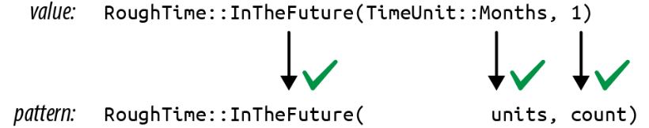
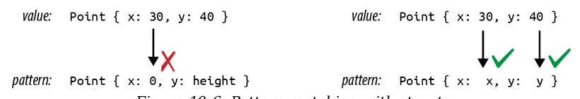
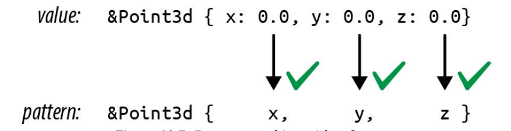

# 枚举与模式

 *Surprising how much computer stuff makes sense viewed as tragic deprivation of sum types (cf. deprivation of lambdas).* 

<p align="right">
    ——Graydon Hoare
</p>

这一章的第一个话题将是一个古老的、强大的、可以帮你在短期内完成很多工作的（有代价地）、并且在许多语言中以不同的名字广为人知的特性。但它并不是魔鬼。而是一种用户自定义的数据类型，它是ML和Haskell程序员们熟知的和类型、也是互斥的联合、还是代数数据类型。在Rust中，它们被称为 *枚举(enumerations)* ，或者简写为 *enum* 。和魔鬼不同的是，它们非常安全、索取的代价也很小。

C++和C#都有枚举，你可以使用它们来定义自己的类型，这种类型的取值范围是一些命名常量的集合。例如，你可能定义过一个叫`Color`的类型，取值范围为`Red`、`Orange`、`Yellow`等等。这种枚举在Rust中也能工作，但Rust进一步扩展了枚举。一个Rust枚举可以包含多种不同类型的数据。例如，Rust的`Result<String, io::Error>`类型就是一个枚举：该类型的值要么是一个包含`String`的`Ok`值要么是一个包含`io::Error`的`Err`值。这就超出了C++和C#中枚举的能力。它更像C中的`union`——但和联合不同的是，Rust的枚举是类型安全的。

枚举适用于一个值有多种可能的情况。使用它们的“代价”是你必须使用模式匹配来安全地访问数据，这也是我们这一章中的第二个话题。

如果你使用过Python的解包或者JavaScript中的解构，那你可能觉得模式也很熟悉，但Rust同样扩展了模式。Rust的模式有点像匹配数据的正则表达式。它们被用来测试一个值是否具有特定的期望的形态。它们可以一次从结构体或这元组中提取出多个字段存入局部变量。并且和正则表达式类似，它们很简洁，通常只用单行代码就能完成任务。

这一章将以枚举的基础开始，展示数据怎么被关联到枚举选项以及枚举是怎么存储在内存中的。然后我们会展示Rust的模式和`match`表达式如何简洁地指定基于枚举、结构体、数组、切片的逻辑。模式也可以包含引用、move和`if`条件，这让它们的功能更加强大。

## 枚举

简单的C风格枚举非常直观：
```Rust
    enum Ordering {
        Less,
        Equal,
        Greater,
    }
```

这里声明了一个有三个可能的值的`Ordering`类型，这些值被称为 *variant* 或者 *constructor* ：`Ordering::Less`、`Ordering::Equal`、`Ordering::Greater`。这个枚举是标准库的一部分，因此Rust代码可以导入它：
```Rust
    use std::cmp::Ordering;

    fn compare(n: i32, m: i32) -> Ordering {
        if n < m {
            Ordering::Less
        } else if n > m {
            Ordering::Greater
        } else {
            Ordering::Equal
        }
    }
```

或者它的所有constructor：
```Rust
    use std::cmp::Ordering::{self, *};  // `*`意思是导入所有的子item

    fn compare(n: i32, m: i32) -> Ordering {
        if n < m {
            Less
        } else if n > m {
            Greater
        } else {
            Equal
        }
    }
```

导入constructor之后，我们可以写`Less`来代替`Ordering::Less`等，但因为这样不够明显，因此一般认为 *不要* 导入它们是更好的风格，除非它能使你的代码可读性更强。

为了导入一个在当前模块中声明的枚举的constructor，可以使用`self`：
```Rust
    enum Pet {
        Orca,
        Giraffe,
        ...
    }

    use self::Pet::*;
```

在内存中，C风格的枚举值被存储为整数。有时告诉Rust使用哪些整数会很有用：
```Rust
    enum HttpStatus {
        Ok = 200,
        NotModified = 304,
        NotFound = 404,
        ...
    }
```

否则，Rust会从0开始自动分配值。

默认情况下，Rust用能容纳所有值的最小的内建整数类型来存储C风格枚举。大多数情况下都是一个单独的字节：
```Rust
    use std::mem::size_of;
    assert_eq!(size_of::<Ordering>(), 1);
    assert_eq!(size_of::<HttpStatus>(), 2); // 404不能存储在u8中
```

你可以通过添加`#[repr]`属性来覆盖Rust选择的内存表示方式。更多的细节见“寻找公共的数据表示”。

将C风格的枚举转换为整数是允许的：
```Rust
    assert_eq!(HttpStatus::Ok as i32, 200);
```

然而，反过来把整数转换为枚举是不允许的。和C和C++不同，Rust保证枚举的值只能是`enum`生命中列出的值之一。未经检查的从整数类型到枚举类型的转换会打破这种保证，所以它是不允许的。你可以写出你自己的带检查的版本：
```Rust
    fn http_status_from_u32(n: u32) -> Option<HttpStatus> {
        match n {
            200 => Some(HttpStatus::Ok),
            304 => Some(HttpStatus::NotModified),
            404 => Some(HttpStatus::NotFound),
            ...
            _ => None,
        }
    }
```

或者使用[`enum_primitive`](https://crates.io/crates/enum_primitive) crate。它包含一个宏可以为你自动生成这种类型的转换代码。

和结构体一样，编译器也可以为枚举自动生成类似`==`运算符这样的特性，但需要显式地要求：
```Rust
    #[derive(Copy, Clone, Debug, PartialEq, Eq)]
    enum TimeUnit {
        Seconds, Minutes, Hours, Days, Months, Years,
    }
```

枚举也和结构体一样可以拥有方法：
```Rust
    impl TimeUnit {
        /// 返回该时间单位的复数名词。
        fn plural(self) -> &'static str {
            match self {
                TimeUnit::Seconds => "seconds",
                TimeUnit::Minutes => "minutes",
                TimeUnit::Hours => "hours",
                TimeUnit::Days => "days",
                TimeUnit::Months => "months",
                TimeUnit::Years => "years",
            }
        }

        /// 返回该时间单位的单数名词。
        fn singular(self) -> &'static str {
            self.plural().trim_end_matches('s')
        }
    }
```

C风格的枚举就这么多内容了。Rust中最有趣的一类枚举是那些带有数据的枚举。我们将展示这些枚举如何存储在内存中、如何通过添加类型参数将它们变为泛型的，以及如何通过枚举构建复杂的数据结构。

### 带有数据的枚举

一些程序总是需要显示完整的日期和时间，并且精确到毫秒。但对于大多数程序，显示大概的时间范围会更加友好，例如“两个月以前”。我们可以用之前定义的枚举编写一个新的枚举来实现这一点：
```Rust
    /// 一个故意舍入的时间戳，因此我们的程序会显示“6个月以前”
    /// 而不是“February 9, 2016, at 9:49 AM”。
    #[derive(Copy, Clone, Debug, PartialEq)]
    enum RoughTime {
        InThePast(TimeUnit, u32),
        JustNow,
        InTheFuture(TimeUnit, u32),
    }
```

这个枚举中的两个variant，即`InThePast`和`InTheFuture`都有参数。这些被称为 *tuple variant* 。就像类元组结构体一样，它们的constructor是创建新的`RoughTime`值的函数：
```Rust
    let four_score_and_seven_years_ago = RoughTime::InThePast(TimeUnit::Years, 4 * 20 + 7);

    let three_hours_from_now = RoughTime::InTheFuture(TimeUnit::Hours, 3);
```

枚举也可以有 *struct variant* ，它们和普通的结构体一样拥有命名字段：
```Rust
    enum Shape {
        Sphere { center: Point3d, radius: f32 },
        Cuboid { corner1: Point3d, corner2: Point3d },
    }

    let unit_sphere = Shape::Sphere {
        center: ORIGIN,
        radius: 1.0,
    };
```

总的来说，Rust有三种枚举variant，分别对应我们在上一章中展示的三种结构体。没有数据的variant对应类单元结构体。元组variant对应类元组结构体。结构体variant对应有花括号和命名字段的结构体。一个枚举可以同时有这三种variant：
```Rust
    enum RelationshipStatus {
        Single,
        InARelationship,
        ItsComplicated(Option<String>),
        ItsExtremelyComplicated {
            car: DifferentialEquation, 
            cdr: EarlyModernistPoem,
        },
    }
```

所有种类的constructor都和枚举自身有相同的可见性。

### 内存中的枚举

在内存中，带有数据的枚举被存储为一个很小的整数 *标签(tag)* ，加上一块足够存储所有variant中最大的那个的内存。标签字段是Rust内部要使用的，它表示是哪一个constructor创建了这个值，进而得知这个值有哪些字段。

在Rust 1.50中，`RoughTime`存储为8个字节，如”图10-1”所示。


<p align="center">图10-1 内存中的<code>RoughTime</code>值</p>

对于枚举的布局Rust不做任何保证。然而，为了给将来的优化留下余地，在一些情况下它可能会用比图中所示更加高效的方式包装一个枚举。例如，一些泛型结构体可以不用标签存储，我们稍后会讲到它。

### 使用枚举实现富数据结构

枚举在实现树形结构时也很有用。例如，假设一个Rust程序要处理任意的Json数据。在内存中，任何Json文档都可以被表示为一个这种Rust类型的值：
```Rust
    use std::collections::HashMap;

    enum Json {
        Null,
        Boolean(bool),
        Number(f64),
        String(String),
        Array(Vec<Json>),
        Object(Box<HashMap<String, Json>>),
    }
```

与Rust代码相比，用英文来解释这个数据结构也不会再有太大的改进了。JSON标准定义了可以出现在JSON文档中的数据类型：`null`、布尔值、数字、字符串、JSON值的数组、以及带有字符串键和JSON值的对象。这个`Json`枚举简单地列出了这些类型。

这并不是一个假想的例子。你可以在`serde_json` crate中找到一个非常相似的枚举，它是一个用于Rust结构体序列化的库，也是crates.io上下载次数最多的crate之一。

用于表示`Object`的`HashMap`外层的`Box`只是为了让`Json`值更加紧凑。在内存中，`Json`类型的值将占据4个机器字。`String`和`Vec`都是3个字，Rust会再添加一个字节的标签，再加上对齐所以总共是4个字。`Null`和`Boolean`值没有足够的数据利用全部的空间，但所有的`Json`值大小必须相同，因此这时多余的空间就被浪费了。”图10-2”展示了一些示例的`Json`值在内存中的实际视图。


<p align="center">图10-2 内存中的<code>Json</code>值</p>

`HashMap`会更大一些，如果我们一定要在每一个`Json`值中给它留出空间，它会变大到8个字。但`Box<HashMap>`是单个字：它只是一个指向堆上分配的数据的指针。我们甚至可以通过装箱更多的字段来让`Json`变得更加紧凑。

这里优秀的地方在于，我们如此简单的就完成了这一切。如果是在C++中，可能要写一个这样的一个类才行：
```Rust
    class JSON {
    private:
        enum Tag {
            Null, Boolean, Number, String, Array, Object
        };
        union Data {
            bool boolean;
            double number;
            shared_ptr<string> str;
            shared_ptr<vector<JSON>> array;
            shared_ptr<unordered_map<string, JSON>> object;

            Data() {}
            ~Data() {}
            ...
        };
        
        Tag tag;
        Data data;
    
    public:
        bool is_null() const { return tag == Null; }
        bool is_boolean const { return tag == Boolean; }
        bool get_boolean() const {
            assert(is_boolean());
            return data.boolean;
        }
        void set_boolean(bool value) {
            this->~JSON();  // 清除string/array/object值
            tag = Boolean;
            data.boolean = value;
        }
        ...
    };
```

30行代码，我们才刚刚开始。这个类还需要构造函数、析构函数、一个赋值运算符。另一种方案是通过继承，首先创建一个基类`JSON`和它的子类`JSONBoolean`、`JSONString`等等。无论哪种方式，等到完成之后，我们的C++ JSON库都要有一堆代码了。其他程序员需要花费不少精力来阅读和使用它。而Rust的整个枚举只需要8行代码。

### 泛型枚举

枚举可以是泛型的。标准库的两个例子几乎是整个语言中使用最广泛的数据类型：
```Rust
    enum Option<T> {
        None,
        Some(T),
    }

    enum Result<T, E> {
        Ok(T),
        Err(E),
    }
```

到现在这些类型你应该已经很熟悉了，泛型枚举的语法和泛型结构体完全相同。

一个不明显的细节是当类型`T`是引用、`Box`或其他智能指针类型时，Rust可以省略`Option<T>`的标签字段。因为这些指针类型中的任何一个都不允许为0，所以Rust可以用单个机器字来表示`Option<Box<i32>>`：用0表示`None`，用非0表示`Some`指针。这使得这样的`Option`类型与C和C++中可以为空的指针值非常相似。不同之处在于Rust的类型系统要求你必须先检查`Option`的值是`Some`，然后才能使用它内含的值。这有效的避免了空指针解引用。

泛型数据结构体可以用很少的几行代码构建：
```Rust
    // 一个`T`类型的有序集合
    enum BinaryTree<T> {
        Empty,
        NonEmpty(Box<TreeNode<T>>),
    }

    // 二叉树的一部分
    struct TreeNode<T> {
        element: T,
        left: BinaryTree<T>,
        right: BinaryTree<T>,
    }
```

这几行代码定义了一个可以存储任意数量的`T`类型值的`BinaryTree`类型。

这两个定义包含了大量信息，所以我们将花费一些时间把代码翻译为中文。每一个`BinaryTree`值是`Empty`或者`NonEmpty`。如果它是`Empty`，那么它不包含任何数据。如果是`NonEmpty`，那么它会包含一个`Box`，这个指针指向一个在堆上分配的`TreeNode`值。

每一个`TreeNode`值包含一个实际的元素，和两个`BinaryTree`值。这意味着一棵树可以包含子树，因此一个`NonEmpty`树可以包含任意数量的后代节点。

一个`BinaryTree<&str>`类型的值的视图如”图10-3”所示。因为对于`Option<Box<T>>`，Rust会省略标签字段，所以一个`BinaryTree`值只占一个机器字。


<p align="center">图10-3 一个包含6个字符串的<code>BinaryTree</code></p>

构建这棵树中的节点非常直观：
```Rust
    use self::BinaryTree::*;
    let jupiter_tree = NonEmpty(Box::new(TreeNode {
        element: "Jupiter",
        left: Empty,
        right: Empty,
    }));
```

更大的树可以通过较小的树构建：
```Rust
    let mars_tree = NonEmpty(Box::new(TreeNode {
        element: "Mars",
        left: jupiter_tree,
        right: mercury_tree,
    }));
```

自然地，这个赋值会把`jupiter_node`和`mercury_node`的所有权移动到新的父节点里。

树的其他部分遵循相同的模式。根节点和其它节点不同：
```Rust
    let tree = NonEmpty(Box::new(TreeNode {
        element: "Saturn",
        left: mars_tree,
        right: uranus_tree,
    }));
```

在这一章的后续部分中，我们将介绍怎么在`BinaryTree`类型上实现一个`add`方法，这样我们就可以这样写：
```Rust
    let mut tree = BinaryTree::Empty;
    for planet in planets {
        tree.add(planet);
    }
```

无论你之前用什么语言，在Rust中创建像`BinaryTree`这样的数据结构都需要一些练习。一开始把`Box`放在哪可能并不明显。一种寻找设计的方法是画一幅像”图10-3”这样的内存布局图。然后根据图设计代码：每一个矩形都是一个结构体或者元组，每一个箭头都是一个`Box`或者其他智能指针。搞清楚每个字段的类型有点困难，但解决难题的回报是控制程序的内存使用。 

现在就到了我们在本章开始时提到的“代价”。枚举的标签字段要占用很小的内存，最糟的情况下要占用8个字节，但这种情况通常非常少见。枚举真正的缺点（如果它能被称为缺点的话）是Rust不能忽略安全性、不管当前的值是什么直接尝试访问字段：
```Rust
    let r = shape.radius;   // 错误：`Shape`类型没有字段`radius`
```

访问枚举中的值的唯一方式是：使用模式，这是一种安全的方式。

## 模式

回顾一下我们在本章中定义过的`RoughTime`：
```Rust
    enum RoughTime {
        InThePast(TimeUnit, u32),
        JustNow,
        InTheFuture(TimeUnit, u32),
    }
```

假设你有一个`RoughTime`值并且你想在网页中显示它。你需要访问值里的`TimeUnit`和`u32`字段。Rust不允许你直接通过`rough_time.0`和`rough_time.1`访问它们，因为毕竟此时值也可能是`RoughTime::JustNow`，而它没有字段。那么，你怎么获取数据呢？

你需要一个`match`表达式：
```Rust
    fn rough_time_to_english(rt: RoughTime) -> String {
        match rt {
            RoughTime::InThePast(units, count) =>
                format!("{} {} ago", count, units.plural()),
            RoughTime::JustNow =>
                format!("just now"),
            RoughTime::InTheFuture(units, count) =>
                format!("{} {} from now", count, units.plural()),
        }
    }
```
`match`会进行模式匹配。在这个例子中， *模式* 是第3、5、7行中出现在`=>`符号左边的部分。匹配`RoughTime`值的模式看起来就像是一个创建`RoughTime`值的表达式。这并不是巧合。表达式 *产生* 值，模式 *消耗* 值。它们使用相同的语法。

让我们逐步看看运行这个 *match* 表达式时发生了什么。假设`rt`的值是`RoughTime::InTheFuture(TimeUnit::Months, 1)`。Rust首先尝试将这个值和第3行的模式匹配。正如”图10-4”所示，它并不能匹配。


<p align="center">图10-4 一个<code>RoughTime</code>值和不匹配的模式</p>

Rust中使用模式来匹配一个枚举、结构体或者元组，它的工作原理就好像简单地从左到右扫描，检查模式中的每个部分来看看是不是和值匹配。如果不是，Rust会移动到下一个模式。

第3和第5行的模式都匹配失败。但第7行的模式成功了（”图10-5”）。


<p align="center">图10-5 一个成功的匹配</p>

如果模式包含像`units`和`count`这样的简单标识符时，在匹配后的代码中它们会变为局部变量。被匹配的值里的任何内容都会被拷贝或移动到新变量中。Rust把`TimeUnit::Months`存储在`units`中，把`1`存储在`count`中，然后运行第8行的代码，最后返回字符串`"1 months from now"`。

这个输出有一点语法上的错误，可以通过给`match`添加另一个分支来修正：
```Rust
    RoughTime::InTheFuture(unit, 1) =>
        format!("a {} from now", unit.singular()),
```

只有当`count`字段恰好是1时这个分支才能匹配。注意这一段新代码必须添加到第7行之前。如果我们把它添加在最后，那么执行流永远不会到达它，因为第7行匹配所有的`InTheFuture`值。如果你犯了这种错误，Rust编译器会给出一个“不可达的模式”警告。

即使有了新的代码，`RoughTime::InTheFuture(TimeUnit::Hours, 1)`仍然有一个问题：结果`"a hour from now"`在英语中并不是完全正确。这可以通过给`match`添加另一个分支来修复。

正如这个例子所示，模式匹配和枚举协同工作，甚至可以测试它们包含的值，这使得`match`表达式成为C的`switch`语句的一个更强大、更灵活的替代。

到目前为止，我们只见到了匹配枚举值的模式。其实它还有更多用途。Rust的模式有它们自己的语言，”表10-1”中进行了总结。我们将用本章中剩下的大部分内容来展示表中的特性。

|          **模式类型**   |   **示例**   |   **注释**   |
| --- | --- | --- |
|         字面量   |  `100` <br> `"name"`  |  匹配一个精确值，也可以使用一个`const`的值的名称     |
|         范围     |  `0 ..= 100` <br> `'a' ..= 'k'`  |  匹配范围内的任何值，包括终点值  |
|         通配符   |  `_`    |  匹配任何值并忽略   |
|         变量     |  `name` <br> `mut count`  |  类似`_`但是把值移动或拷贝进新的局部变量    |
|         `ref`变量     |  `ref field` <br> `ref mut field`    |  借用匹配的值的引用，而不是移动或拷贝它     |
|         带子模式的绑定   |  `val @ 0 ..= 99` <br> `ref circle @ Shape::Circle { .. }`  |  匹配@右侧的模式，使用左侧作为变量名    |
|         枚举模式     |  `Some(value)` <br> `None` <br> `Pet::Orca`  |   |
|         元组模式     |  `(key, value)` <br> `(r, g, b)`  |   |
|         数组模式     |  `[a, b, c, d, e, f, g]` <br> `[heading, carom, correction]`  |   |
|         切片模式     |  `[first, second]` <br> `[first, _, third]` <br> `[first, .., nth]` <br> `[]`  |   |
|         结构体模式   |  `Color(r, g, b)` <br> `Point { x, y }` <br> `Card { suit: Clubs, rank: n }` <br> `Account { id, name, .. }`  |   |
|         引用     |  `&value` <br> `&(k, v)`   |  只匹配引用值  |
|         多重模式     |  `'a' \| 'A'`     |  只能用作可反驳的模式（`match, if let, while let`）  |
|         守卫表达式   |  `x if x * x <= r2`  |  只能在`match`中使用（在`let`等表达式中无效）  |

### 模式中的字面量、变量和通配符

到目前为止，我们已经展示了`match`表达式和枚举一起使用，其实其他类型也可以用模式来匹配。当你需要类似C的`switch`语句的功能时，可以使用处理整数值的`match`表达式。整数字面量例如`0`和`1`可以用作模式：
```Rust
    match meadow.count_rabbits() {
        0 => {} // 什么都不输出
        1 => println!("A rabbit is nosing around in the clover."),
        n => println!("There are {} rabbits hopping about in the meadow", n),
    }
```

当草地上没有兔子时模式`0`会匹配，当只有一只时`1`会匹配。如果有两只或者更多兔子，就会到达第三个模式`n`。这个模式只有一个变量名。它可以匹配任何值，被匹配的值会被移动或拷贝进新的局部变量。因此在这个例子中，`meadow.count_rabbits()`的值被存储在一个新的局部变量`n`中，然后我们打印出它。

其他的字面量也可以用作模式，包括布尔值、字符、甚至字符串：
```Rust
    let calendar = match settings.get_string("calendar") {
        "gregorian" =>  Calendar::Gregorian,
        "chinese" => Calendar::Chinese,
        "ethiopian" => Calendar::Ethiopian,
        other => return parse_error("calendar", other),
    };
```

在这个例子中，`other`和上个例子中的`n`一样用作匹配任何值的模式。这些模式和`switch`语句中的`default`标签一样，用来匹配其他所有模式都匹配不了的值。

如果你需要一个匹配所有值的模式，但又不关心匹配到的值，你可以使用单个下划线`_`作为模式，也就是 *通配模式* ：
```Rust
    let caption = match photo.tagged_pet() {
        Pet::Tyrannosaur => "RRRAAAAAHHHHHH",
        Pet::Samoyed => "*dog thoughts*",
        _ => "I'm cute, love me",   // 通用标题，用于任何宠物
    };
```

通配模式匹配任何值，但并不存储它。因为Rust要求每一个`match`表达式要能处理所有可能的值，因此最后通常需要一个通配符。即使你非常确信其他的情况不会发生，你也必须至少添加一个fallback分支，这个分支里可以直接panic：
```Rust
    // 有很多形状，但我们只支持“选择”文本或者一个矩形区域。
    // 你不能选择一个椭圆或者梯形。
    match document.selection() {
        Shape::TextSpan(start, end) => paint_text_selection(start, end),
        Shape::Rectangle(rect) => paint_rect_selection(rect),
        _ => panic!("unexpected selection type"),
    }
```

### 元组和结构体模式

元组模式匹配元组。当你想在单个`match`中获得数据的多个部分时它们会很有用：
```Rust
    fn describe_point(x: i32, y: i32) -> &'static str {
        use std::cmp::Ordering::*;
        match (x.cmp(&0), y.cmp(&0)) {
            (Equal, Equal) => "at the origin",
            (_, Equal) => "on the x axis",
            (Equal, _) => "on the y axis",
            (Greater, Greater) => "in the first quadrant",
            (Less, Greater) => "in the second quadrant",
            _ => "somewhere else",
        }
    }
```

结构体模式要使用花括号，就和结构体表达式一样。它们可以包含每个字段的子模式：
```Rust
    match balloon.location {
        Point { x: 0, y: height } => println!("straight up {} meters", height),
        Point { x: x, y: y } => println!("at ({}m, {}m)", x, y),
    }
```

在这个例子中，如果第一个分支匹配了，那么`balloon.location.y`会被存储到新的局部变量`height`。

假设`balloon.location`是`Point { x: 30, y: 40 }`。和之前一样，Rust会按照”图10-6”的顺序检查每一个模式的每一个部分。


<p align="center">图10-6 结构体模式匹配</p>

第二个分支可以匹配，因此输出将是`at (30m, 40m)`。

当匹配结构体时类似`Point { x: x, y: y }`的模式非常常见，多余的名字也只会扰乱视觉，因此Rust为此支持一种缩写形式`Point {x, y}`。含义和之前相同，这个模式也会把点的`x`字段存储在新的局部变量`x`、把`y`字段存储在新的局部变量`y`。

即使有了缩写形式，如果我们要匹配一个很大的结构体但又只关心少数字段时还是会很麻烦：
```Rust
    match get_account(id) {
        ...
        Some(Account {
                name, language, // 我们关心的两个字段
                id: _, status: _, address: _, birthday: _, eye_color: _,
                pet: _, security_question: _, hashed_innermost_secret: _,
                is_adamantium_preferred_customer: _, }) =>
            language.show_custom_greeting(name),
    }
```

为了避免这种情况，可以使用`..`告诉Rust你不关心其他的字段：
```Rust
    Some(Account { name, language, .. }) =>
        language.show_custom_greeting(name),
```

### 数字和切片模式

数组模式匹配数组。它们被通常被用来过滤出某些特殊值，当数组的不同位置的含义不同时它们也会变得很有用。

例如，当把色相、饱和度、亮度(HSL)颜色值转换为红绿蓝(RGB)颜色值时，亮度为0的颜色就是黑、而亮度为满的颜色就是白。我们可以使用`match`表达式来简单地处理这些情况：
```Rust
    fn hsl_to_rgb(hsl: [u8; 3]) -> [u8; 3] {
        match hsl {
            [_, _, 0] => [0, 0, 0],
            [_, _, 255] => [255, 255, 255],
            ...
        }
    }
```

切片模式与此类似，但和数组不同的是，切片的长度可以变化。因此切片模式并不只匹配值，还要匹配长度。切片模式中的`..`匹配任意数量的元素：
```Rust
    fn greet_people(names: &[&str]) {
        match names {
            [] => { println!("Hello, nobody.") },
            [a] => { println!("Hello, {}.", a) },
            [a, b] => { println!("Hello, {} and {}.", a, b) },
            [a, .., b] => { println!("Hello, everyone from {} to {}.", a, b) }
        }
    }
```

### 引用模式

Rust模式支持两种和引用有关的特性。`ref`模式会借用被匹配的值，`&`模式匹配引用。我们将首先介绍`ref`模式。

匹配一个非拷贝类型的值会移动这个值。继续上面的例子，下面的代码是无效的：
```Rust
    match account {
        Account { name, language, .. } => {
            ui.greet(&name, &language);
            ui.show_settings(&account); // error: borrow of moved value: `account`
        }
    }
```

这里，字段`account.name`和`account.language`被移动进局部变量`name`和`language`中。`account`的其他部分被丢弃。这就是为什么我们不能再借用它的引用。

如果`name`和`language`都是可拷贝的值，Rust将会拷贝字段而不是移动它们，代码将没有问题。但假设它们就是`String`，那我们该怎么办？

我们需要一种模式 *借用* 被匹配的值而不是移动它们。`ref`关键字就是为此而生：
```Rust
    match account {
        Account { ref name, ref language, .. } => {
            ui.greet(name, language);
            ui.show_settings(&account); // ok
        }
    }
```

现在局部变量`name`和`language`都是`account`中相应字段的引用。因此`account`只是被借用，并没有被消耗，所以继续用它调用方法也是OK的。

你可以使用`ref mut`来借用`mut`引用：
```Rust
    match line_result {
        Err(ref err) => log_error(err), // `err`是&Error(shared ref)
        Ok(ref mut line) => {           // `line`是&mut String(mut ref)
            trim_comments(line);        // 修改String
            handle(line);
        }
    }
```

模式`Ok(ref mut line)`匹配任何成功值，并借用存储在里面的成功值的`mut`引用。

另一种相反的引用模式是`&`模式。一个以`&`开始的模式只能匹配引用：
```Rust
    match sphere.center() {
        &Point3d { x, y, z } => ...
    }
```

在这个例子中，假设`sphere.center()`返回一个`sphere`的私有字段的引用，这在Rust中是很常见的。返回的值是一个`Point3d`的引用。如果中心在原点的话，`sphere.center()`会返回`&Point3d { x: 0.0, y: 0.0, z: 0.0 }`。

模式匹配按照”图10-7”进行。


<p align="center">图10-7 引用的模式匹配</p>

这里有一点诡异，因为Rust在这里解除了引用，也就是`*`运算符的功能。要记住模式和表达式天然是相反的。表达式`(x, y)`把两个值放入一个新的元组中，而模式`(x, y)`恰好相反：它匹配一个元组然后取出两个值。`&`也是一样，在表达式里，`&`创建一个引用；在模式里，`&`匹配一个引用。

匹配一个引用遵循我们期望的所有规则：生命周期是强制的、你不能通过共享引用获取`mut`访问权限、你不能将值移动出引用，即使是`mut`引用。当我们匹配`&Point3d { x, y, z }`时，变量`x, y, z`都是坐标的拷贝，原本的`Point3d`值还是完整的。只有当这些字段都是拷贝类型才可以正常工作。如果我们想对结构体中一个不可拷贝的字段这么做，我们会遇到错误：
```Rust
    match friend.borrow_car() {
        Some(&Car { engine, .. }) => // error: can't move out of borrow
            ...
        None => {}
    }
```

把一辆借来的车报废是不好的，Rust也不会允许这么做。你可以使用`ref`模式来借用一个引用，这样就不用拥有它：
```Rust
    Some(&Car { ref engine, .. }) => // ok, engine is a reference
```

再来看另一个`&`模式的例子。假设我们有一个迭代器`chars`迭代一个字符串里的所有字符，并且它有一个方法`chars.peek()`返回一个`Option<&char>`：一个指向下一个字符的引用，如果有的话。（这类迭代器确实返回一个`Option<&ItemType>`，我们将在”第15章”中见到。）

一个程序可以使用`&`来获得指向的字符：
```Rust
    match chars.peek() {
        Some(&c) => println!("coming up: {:?}", c),
        None => println!("end of chars"),
    }
```

### 匹配守卫

有时一个匹配分支还有附加的条件必须要满足。假设我们在实现一个六边形空间内的棋子游戏，玩家只需要点击即可移动棋子。为了确认点击是有效的，我们可能要尝试类似这样的代码：
```Rust
    fn check_move(current_hex: Hex, click: Point) -> game::Result<Hex> {
        match point_to_hex(click) {
            None =>
                Err("That's not a game space."),
            Some(current_hex) => // 尝试匹配用户是不是点击了当前位置
                                 // (这样是错误的：原因如下)
                Err("You are already there! You must click somewhere else."),
            Some(other_hex) =>
                Ok(other_hex)
        }
    }
```

这样是错误的，因为模式里的标识符会引入 *新的* 变量。模式`Some(current_hex)`会创建一个新的叫`current_hex`的局部变量，然后遮蔽参数`current_hex`。Rust会为这段代码报出好几个警告——尤其是，最后一个`match`分支不可达。一种修复这个问题的方法是简单地在分支中使用一个`if`表达式：
```Rust
    match point_to_hex(click) {
        None => Err("That's not a game space."),
        Some(hex) => {
            if hex == current_hex {
                Err("You are already there! You must click somewhere else")
            } else {
                Ok(hex)
            }
        }
    }
```

不过Rust还提供了 *匹配守卫(match guard)* ：模式和分支的`=>`词元中间的`if CONDITION`条件必须满足才能匹配：
```Rust
    match point_to_hex(click) {
        None => Err("That's not a game space."),
        Some(hex) if hex == current_hex =>
            Err("You are already there! You must click somewhere else"),
        Some(hex) => Ok(hex)
    }
```

如果模式匹配，但条件不满足，那么将会继续匹配下一个分支。

### 匹配多种可能

竖线(`|`)可以用于在一个`match`分支中组合多个模式：
```Rust
    let at_end = match chars.peek() {
        Some(&'\r') | Some(&'\n') | None => true,
        _ => false,
    };
```

在一个表达式中，`|`是位或运算符，但这里它的功能就像是普通表达式中的`||`。如果`chars.peek()`能匹配三个模式中的任意一个，`at_end`就会被设为`true`。

使用`..=`来匹配范围内的值。范围模式包括起点和终点值，因此`'0' ..= '9'`匹配所有的ASCII数字：
```Rust
    match next_char {
        '0'..='9' => self.read_number(),
        'a'..='z' | 'A'..='Z' => self.read_word(),
        ' ' | '\t' | '\n' => self.skip_whitespace(),
        _ => self.handle_punctuation(),
    }
```

Rust（目前）不允许在模式中使用尾开区间例如`0..100`。

### 绑定和`@`模式

最后，`x @ pattern`用给定的`pattern`来匹配，但匹配成功时它会创建单个变量`x`并把整个值移动或拷贝进去，而不是为匹配值的每一部分创建一个变量。例如，假设你有下面的代码：
```Rust
    match self.get_selection() {
        Shape::Rect(top_left, bottom_right) => {
            optimized_paint(&Shape::Rect(top_left, bottom_right))
        }
        other_shape => {
            paint_outline(other_shape.get_outline())
        }
    }    
```
注意第一种情况会解包一个`Shape::Rect`值，然后在下一行中重新构建了一个新的`Shape::Rect`值。这可以被重写为`@`模式：
```Rust
    rect @ Shape::Rect(..) => {
        optimized_paint(&rect)
    }
```

`@`模式和范围一起使用时也很有用：
```Rust
    match chars.next() {
        Some(digit @ '0'..='9') => read_number(digit, chars),
        ...
    },
```

### 模式可以用在哪里

尽管模式最常用在`match`表达式中，但它们也能出现在一些其他地方，例如出现在标识符的位置。含义总是相同的：Rust使用模式匹配来分别取出值中的每一部分，而不是存储在单个变量中。

这意味着模式可以用于……
```Rust
    // ...把一个结构体解包为3个局部变量
    let Track { album, track_number, title, .. } = song;

    // ...解包一个元组类型的函数参数
    fn distance_to((x, y): (f64, f64)) -> f64 { .. }

    // ...迭代一个HashMap的键和值
    for (id, document) in &cache_map {
        println!("Document #{}: {}", id, document.title);
    }

    // ...自动解引用闭包的参数，
    // 当你想要一份拷贝时，其他代码可能会传给你一个引用，
    // 这时这种写法很方便。
    let sum = numbers.fold(0, |a, &num| a + num)
```

这些写法都节省了两到三行重复的样本代码。其它语言中也有相同的概念：JavaScript中它被称为 *解构(destructuring)* ，而在Python中它被称为 *解包(unpacking)* 。

注意这四个例子中，我们都使用了一定能匹配的模式。模式`Point3d { x, y, z }`匹配`Point3d`类型的任意值，[^1]`(x, y)`匹配任意的`(f64, f64)`类型的值，等等。在Rust中总是能匹配的模式是很特殊的，它们被称为 *不可反驳的模式(irrefutable pattern)* ，它们也是唯一能出现在这里展示的四种位置的模式（在`let`之后、在函数参数中、在`for`之后、在闭包的参数中）。

[^1]:译者注：此处应是作者写错了，应该是`Track`对应的例子。

一个 *可反驳的模式(refutable pattern)* 是那些可能不能匹配的模式，例如`Ok(x)`，它不能匹配一个错误的Result，或者`'0' ..= '9'`，它不能匹配字符`'Q'`。可反驳的模式可以用在`match`分支中，因为`match`就是为它们设计的：在`match`中如果匹配失败，那么接下来要怎么做很明显。而上面的四个例子中的位置，Rust不允许匹配失败。

可反驳的模式还可以用在`if let`和`while let`表达式中，它们可以用于……
```Rust
    // ...只有当是特定类型的枚举variant时才进行处理
    if let RoughTime::InTheFuture(_, _) = user.data_of_birth() {
        user.set_time_traveler(true);
    }

    // ...只有当查找成功时才运行代码
    if let Some(document) = cache_map.get(&id) {
        return send_cached_response(document);
    }

    // ...重复尝试执行操作直到它成功
    while let Err(err) = present_cheesy_anti_robot_task() {
        log_robot_attempt(err);
        // 让用户重试
    }

    // ...手动迭代器循环
    while let Some(_) = lines.peek() {
        read_paragraph(&mut lines);
    }
```

有关这些表达式的细节，见“`if let`”和“循环”。

### 填充二叉树

之前我们说过要展示如何实现一个`BinaryTree::add()`方法，它把一个节点添加到`BinaryTree`中：
```Rust
    // 一个类型`T`的顺序集合
    enum BinaryTree<T> {
        Empty,
        NonEmpty(Box<TreeNode<T>>),
    }

    // 二叉树的一个节点
    struct TreeNode<T> {
        element: T,
        left: BinaryTree<T>,
        right: BinaryTree<T>,
    }
```

现在你已经知道了编写这个方法所需的关于模式的知识。对二叉搜索树的解释已经超过了这本书的范围，但对于那些已经对这个话题很熟悉的读者，值得看一下在Rust中如何实现它。

```Rust
    impl<T: Ord> BinaryTree<T> {
        fn add(&mut self, value: T) {
            match *self {
                BinaryTree::Empty => {
                    *self = BinaryTree::NonEmpty(Box::new(TreeNode {
                        element: value,
                        left: BinaryTree::Empty,
                        right: BinaryTree::Empty,
                    }))
                }
                BinaryTree::NonEmpty(ref mut node) => {
                    if value <= node.element {
                        node.left.add(value);
                    } else {
                        node.right.add(value);
                    }
                }
            }
        }
    }    
```

第1行告诉了Rust我们正在为有序类型的`BinaryTree`定义一个方法。这和我们之前为泛型结构体定义方法的语法完全相同，语法的解释见“使用`impl`定义方法”一节。

如果现有的树`*self`是空的，那么就很简单。第5-9行把`Empty`树变成了一个`NonEmpty`的树。`Box::new()`的调用在堆上分配一个新的`TreeNode`。当运行完之后，树就有了一个元素，这个元素的左子树和右子树都是`Empty`。

如果`*self`不是空，第11行的模式就会匹配：
```Rust
    BinaryTree::NonEmpty(ref mut node) => {
```

这个模式会借用一个`Box<TreeNode<T>>`的可变引用，因此我们可以访问并修改这个树节点中的数据。引用叫做`node`，它的作用域是12到16行。因为这个节点中已经有一个元素了，所以需要递归调用`.add()`来给左子树或右子树的节点添加新元素。

新的方法可以像这样使用：
```Rust
    let mut tree = BinaryTree::Empty;
    tree.add("Mercury");
    tree.add("Venus");
    ...
```

## 宏观视图

Rust的枚举对系统编程来说也许很新，但它们并不是一个新的概念。它有过很多学术性的名称，例如 *代数数据类型(algebraic data types)* ，它们在函数式编程语言中已经被使用了40多年。不知道为什么遵循C传统的语言中只有很少的语言有这种特性。可能只是因为对于一个编程语言的设计者来说，将variant、引用、可变性和内存安全融合在一起非常有挑战性。函数式语言不需要考虑可变性。C的`union`相反，有variant、指针和可变性——但它们是如此的不安全以至于即使在C中，它们也是最少用到的特性。Rust的借用检查器是使得在不妥协的情况下把这四者融合在一起变为可能的魔法。

程序就是数据处理的过程。一个小巧、快速、优雅的程序与一个充满缓慢、巨大的类型嵌套和虚拟方法调用的程序之间的区别可能就是是否把数据以正确的方式存储。

这正是枚举专注于解决的问题。它们是一种把数据以正确方式存储的设计工具。对于值可能是这样、也可能是那样、设置可能为空的情况，枚举在每一个维度上都比类层次结构要好：更快、更安全、更少的代码、更容易编写文档。

唯一的限制是灵活性。枚举的最终用户不能添加新的variant来扩展它。Variant只能通过修改枚举的定义来添加，而这么做的话，又会打破现有的代码。每一个单独匹配枚举的每个variant的`match`表达式都需要修改——需要添加一个新的分支来处理新的variant。在某些情况下，牺牲灵活性换取简洁性是明智之举。毕竟，像JSON这样的结构体预计不会改变。而在某些情况下，当枚举改变时修改所有使用的地方正是我们所期望的。例如，当一个编译器使用`enum`来表示语言中的不同运算符时，添加一个新的运算符 *应该* 涉及到所有处理操作符的代码。

但有些时候也需要更多的灵活性。对于这些情况，Rust有trait，也就是我们下一章要讨论的话题。
