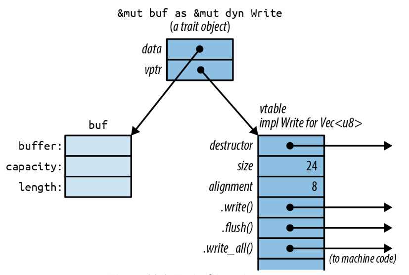
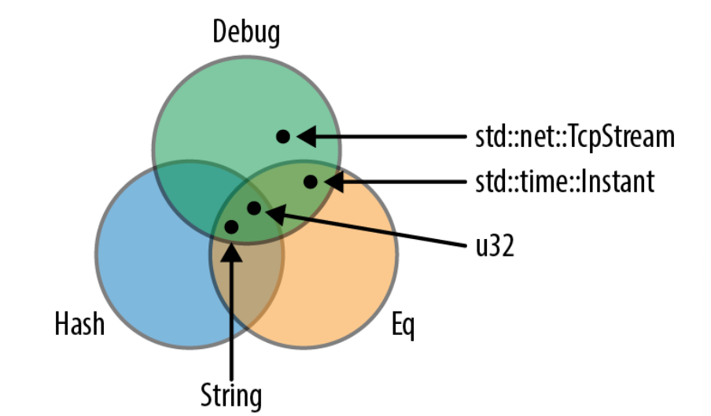

# trait与泛型

 *[A] computer scientist tends to be able to deal with nonuniform structures—case 1, case 2, case 3—while a mathematician will tend to want one unifying axiom that governs an entire system.* 

<p align="right">
    ——Donald Knuth
</p>

编程界中最伟大的发现之一就是可以编写处理多种不同类型的代码， *即使是还没有定义出来的类型也可以* 。这里有两个例子：

- `Vec<T>`是泛型的：你可以创建一个任意类型的vector，包括你自己定义的类型，即使`Vec`的作者完全不知道这个类型。
- 很多类型都有`.write()`方法，包括`File`和`TcpStream`。你的代码可以通过引用获取一个writer(任意的writer)，并向它写入数据。你的代码不需要关心那个writer到底是什么类型。然后，如果有人添加了一个新的writer类型，你的代码将会自动支持它。

当然，这并不是什么新鲜的功能。它被称为 *多态(polymorphism)* ，是20世纪70年代很热门的新的编程语言技术。但现在它已经非常普遍了。Rust使用两个相关的特性来支持多态：trait和泛型。很多程序员可能已经很熟悉这两个概念了，但Rust采用了一种受Haskell的typeclass启发的新方法。

 *trait* 是Rust中的接口或抽象基类。首先，它们看起来很像Java或C#中的接口。用于写入字节的trait叫做`std::io::Write`，它在标准库中的定义看起来像这样：
```Rust
    trait Write {
        fn write(&mut self, buf: &[u8]) -> Result<usize>;
        fn flush(&mut self) -> Result<()>;

        fn write_all(&mut self, buf: &[u8]) -> Result<()> { ... }
        ...
    }
```

这个trait提供了几个方法，我们只展示了前三个。

标准类型`File`和`TcpStream`都实现了`std::io::Write`。`Vec<u8>`也是。这三个类型都提供`.write()`、`.flush()`等方法。使用writer的代码不需要关心它的类型，像这样：
```Rust
    use std::io::Write;

    fn say_hello(out: &mut dyn Write) -> std::io::Result<()> {
        out.write_all(b"hello world\n")?;
        out.flush()
    }
```

`out`的类型是`&mut dyn Write`，意思是“任何实现了`Write` trait的值的可变引用”。我们可以把任何这样的值的可变引用传递给`say_hello`：
```Rust
    use std::fs::File;
    let mut local_file = File::create("hello.txt")?;
    say_hello(&mut local_file)?;    // 可以工作

    let mut bytes = vec![];
    say_hello(&mut bytes)?;         // 也可以工作
    assert_eq!(bytes, b"hello world\n");
```

这一章首先展示trait怎么使用、怎么工作、怎么定义自己的trait。但trait的用途比我们目前提到的更多。我们将使用它们给现有类型添加扩展的方法，甚至像`str`和`bool`这种内建类型也可以。我们将会解释为什么给一个类型添加trait不会消耗多余的内存，以及如何在没有虚方法开销的情况下使用trait。我们将看到一些Rust提供的用于操作符重载和其他特性的语言内建的trait。我们还将介绍`Self`类型、关联函数、关联类型。Rust从Haskell中提取了这三个特性，它们可以优雅地解决其他语言中需要通过变通的方法或者hack才能解决的问题。

 *泛型* 是Rust中另一种形式的多态。类似于C++的模板，一个泛型函数或类型可以用于多种不同的类型：
```Rust
    /// 给定两个值，找出较小的那个
    fn min<T: Ord>(value1: T, value2: T) -> T {
        if value1 <= value2 {
            value1
        } else {
            value2
        }
    }
```

这个函数中的`<T: Ord>`意味着`min`可以用于任何实现了`Ord` trait的类型`T`——也就是，任何有序的类型。这样的一个要求被称为 *约束(bound)* ，因为它列举出了类型`T`需要满足的限制。编译器会为你实际使用的每一个类型`T`生成自定义的机器代码。

泛型和trait紧密相关：泛型函数在约束中使用trait来表明它可以用于哪些类型的参数。所以我们还会讨论`&mut dyn Write`和`<T: Write>`有哪些相似和不同之处，以及如何在这种两种使用trait的方式中选择。

## 使用trait

一个trait就是一个给定的类型可能支持也可能不支持的特性。通常，一个trait代表一种能力：一个类型可以做的事情。

- 一个实现了`std::io::Write`的值可以写入字节。
- 一个实现了`std::iter::Iterator`的值可以产生值的序列。
- 一个实现了`std::clone::Clone`的值可以产生自身在内存中的克隆。
- 一个实现了`std::fmt::Debug`可以使用`println!()`的`{:?}`格式说明符进行打印。

这4个trait都是Rust标准库的一部分，有很多标准类型都实现了它们。例如：

- `std::fs::File`实现了`Write` trait，它把字节写入到本地文件。`std::net::TcpStream`写入到网络连接。`Vec<u8>`也实现了`Write`。在字节vector上调用`.write()`会往尾部添加数据。
- `Range<i32>`(`0..10`的类型)实现了`Iterator` trait，一些和切片、哈希表等相关联的迭代器类型也实现了这个trait。
- 大多数标准库类型实现了`Clone`。一些例外主要是像`TcpStream`这样的不仅仅表示内存中的数据的类型。
- 大多数标准库类型支持`Debug`。

有关trait方法有一个不寻常的规则：trait自身必须在作用域里。否则，所有它的方法都会被隐藏：
```Rust
    let mut buf: Vec<u8> = vec![];
    buf.write_all(b"hello")?;   // 错误：没有叫`write_all`的方法
```

这种情况下，编译器会打印出友好的错误消息建议你添加`std::io::Write`，然后确实能修复这个问题：
```Rust
    use std::io::Write;

    let mut buf: Vec<u8> = vec![];
    buf.write_all(b"hello")?;   // ok
```

Rust会有这个规则是因为，正如我们稍后会在本章中看到的，你可以使用trait来给任意类型添加新的方法——即使是标准库的类型例如`u32`和`str`。第三方的crate也可以做同样的事情。显然，这会导致名称冲突！但因为Rust让你自己导入你需要使用的trait，所以crate可以轻松地利用这种强大的功能。要想导致冲突，你需要导入两个trait，这两个trait要给同一个类型添加相同名称的方法。这在实践中是很少见的。（如果你确实陷入了冲突中，你可以使用本章稍后会介绍的“完全限定方法调用”来指明你想要使用哪一个。）

`Clone`和`Iterator`的方法不需要特殊的导入是因为它们默认总是在作用域里，它们是标准prelude的一部分：Rust会自动导入每个模块中的名称。事实上，prelude就是一个精心挑选的trait的集合。我们将在”第13章”中介绍更多有关它们的内容。

C++和C#程序员可能已经注意到了trait方法很像虚方法。然而，类似上面的函数调用速度很快，与任何其他方法调用一样快。简单来说，这里面并没有多态性。显然`buf`是一个vector，不是一个文件或者网络连接，所以编译器可以简单地生成一个`Vec<u8>::write()`的调用。它甚至可以内联这个方法。（C++和C#通常也会这样，尽管子类化的可能性有时会排除这一点。）只有通过`&mut dyn Write`的调用才会有动态分发的开销，这种调用也被称为虚方法调用，类型里的`dyn`关键字暗示了这一点。`dyn Write`被称为 *trait对象(trait object)* ；我们将会在接下来的小节中看到trait对象的技术细节，以及它们与泛型函数的比较。

### trait对象

在Rust中有两种使用trait来编写多态代码的方式：trait对象和泛型。我们将会首先介绍trait对象，在下一节中介绍泛型。

Rust不允许`dyn Write`类型的变量：
```Rust
    use std::io::Write;

    let mut buf: Vec<u8> = vec![];
    let writer: dyn Write = buf; // 错误：`Write`并没有固定的大小
```

一个变量的大小必须在编译期时已知，然而实现了`Write`的类型可以是任何大小。

如果你来自C#或者Java的话可能会感觉很惊讶，但原因其实很简单。在Java中，一个`OutputStream`（Java中类似`std::io::Write`的标准接口）类型的变量是一个任何实现了`OutputStream`的对象的引用。它是一个引用的事实不言而喻，C#以及其他大多数语言中的接口也是一样。

我们在Rust中想要的也是一样的，但是在Rust中引用是显式的：
```Rust
    let mut buf: Vec<u8> = vec![];
    let writer: &mut dyn Write = &mut buf;  // ok
```

一个trait类型的引用，例如`writer`，被称为一个 *trait对象* 。和其他引用一样，一个trait对象指向某个值、它有生命周期、它可以是可变的或者是共享的。

让一个trait对象与众不同的是Rust在编译期通常不知道被引用值的类型是什么。因此一个trait对象包括一点额外的有关被引用值的类型信息。类型信息被严格限制为只有Rust自己可以在幕后使用：当你调用`writer.write(data)`时，Rust需要这个类型信息来依据`*writer`的类型动态调用正确的`write`方法。你不能直接查询类型信息，Rust也不支持将trait对象`&mut dyn Write`向下转换回精确的类型例如`Vec<u8>`。

#### trait对象的布局
在内存中，一个trait对象是一个胖指针，由指向值的指针加上一个指向表示该值类型的表的指针组成。因此每一个trait对象要占两个机器字，如”图11-1”所示。


<p align="center">图11-1 内存中的trait对象</p>

C++也有这种运行时的类型信息。它被称为 *虚表* 或者 *vtable* 。在Rust中和在C++中一样，vtable只会在编译期生成一次，然后被所有相同类型的对象共享。”图11-1”中较深颜色的阴影显示的内容，包括vtable，都是Rust的私有实现。这些字段和数据结构你不能直接访问。当你调用trait对象的方法时语言本身会自动使用vtable来决定要调用哪个实现。

熟练的C++程序员可能会注意到Rust和C++采取的内存策略有些不同。在C++中，虚表指针或者称为 *vptr* 被存储为结构体的一部分，而Rust使用胖指针来代替。结构体本身不包含任何自身字段之外的东西。这样，一个结构体可以实现一大堆trait而不需要包含一大堆vptr。即使像`i32`这样的大小还不足以容纳一个vptr的类型，也可以实现trait。

当需要时Rust会自动把普通引用转换为trait对象。这就是为什么我们能在这个例子中直接把`&mut local_file`传递给`say_hello`：
```Rust
    let mut local_file = File::create("hello.txt")?;
    say_hello(&mut local_file)?;
```

`&mut local_file`的类型是`&mut File`，而`say_hello`的参数类型是`&mut dyn Write`。因为`File`是一种writer，所以Rust允许这种普通引用到trait对象的转换。

同样的，Rust也乐于把`Box<File>`转换成`Box<dyn Write>`，它拥有一个在堆上的writer：
```Rust
    let w: Box<dyn Write> = Box::new(local_file);
```

`Box<dyn Write>`和`&mut dyn Write`一样是一个胖指针：它包含writer自身的地址和vtable的地址。其他指针类型例如`Rc<dyn Write>`也一样。

这种转换是唯一创建trait对象的方法。编译器做的工作其实很简单，当转换发生时，Rust知道被引用值的真正类型（这个例子中是`File`），因此它只是加上了正确的vtable的地址、把普通指针变成了胖指针。

### 泛型函数和类型参数

在这一章的开始处，我们展示了`say_hello()`函数，它以trait对象为参数。让我们把这个函数重写为泛型函数：
```Rust
    fn say_hello<W: Write>(out: &mut W) -> std::io::Result<()> {
        out.write_all(b"hello world\n")?;
        out.flush()
    }
```

只有类型签名改变了：
```Rust
    fn say_hello(out: &mut dyn Write)   // 普通函数

    fn say_hello<W: Write>(out: &mut W) // 泛型函数
```

让函数变为泛型函数的正是`<W: Write>`短语，它是一个 *类型参数* 。它意味着在整个函数体内，`W`代表任何实现了`Write` trait的类型。按照习惯，类型参数通常是大写字母。

类型`W`到底是什么取决于泛型函数如何被调用：
```Rust
    say_hello(&mut local_file)?;    // 调用say_hello::<File>
    say_hello(&mut bytes)?;         // 调用say_hello::<Vec<u8>>
```

当你把`&mut local_file`传递给泛型的`say_hello()`函数时，你实际是在调用`say_hello::<File>()`。Rust会为这个函数生成机器码，机器码里还会调用`File::write_all()`和`File::flush()`。当你传递`&mut bytes`时，你实际是在调用`say_hello::<Vec<u8>>()`。Rust会为这个版本的函数生成单独的机器码，然后调用相应的`Vec<u8>`的方法。在这两种情况下，Rust都从参数的类型推导出类型`W`，这个过程被称为 *单态化(monomorphization)* ，编译器会自动进行处理。

你也可以指明类型参数：
```Rust
    say_hello::<File>(&mut local_file)?;
```

很少情况下才需要显式写出参数，因为Rust通常可以通过参数推断出类型参数。这里，`say_hello`泛型函数期望一个`&mut W`参数，而我们传入了一个`&mut File`，因此Rust推断出`W = File`。

如果你正在调用的泛型函数并没有足以推断出参数的线索，你需要显式地指明：
```Rust
    // 调用一个没有参数的泛型方法collect<C>()
    let v1 = (0 .. 1000).collect();     // 错误：不能推断出类型
    let v2 = (0 .. 1000).collect::<Vec<i32>>(); // ok
```

有时我们需要一个类型参数可以支持多种功能。例如，如果我们想打印出一个vector中出现次数最多的10个值，我们需要这些值可以打印：
```Rust
    use std::fmt::Debug;

    fn top_ten<T: Debug>(values: &Vec<T>) { ... }
```

但这还不够。我们怎么判断哪个值是出现次数最多的？通常的办法是把每个值当作键存入一个哈希表。这意味着这些值需要支持`Hash`和`Eq`操作。`T`的约束还必须包括`Debug`。这种情况下应该使用的语法是`+`号：
```Rust
    use std::hash::Hash;
    use std::fmt::Debug;

    fn top_ten<T: Debug + Hash + Eq>(values: &Vec<T>) { ... }
```

一些类型实现了`Debug`、一些实现了`Hash`、一些支持`Eq`，还有少数类型例如`u32`和`String`，实现了这三个trait，如”图11-2”所示。


<p align="center">图11-2 trait作为类型的集合</p>

也可以不给类型参数指定任何约束，但这样的话你几乎不能对它进行任何操作。你只能移动它、将它放在box或vector里。

泛型函数可以有多个类型参数：
```Rust
    /// 在一个大规模的分区数据集上进行查询。
    /// 见<http://research.google.com/archive/mapreduce.html>。
    fn run_query<M: Mapper + Serialize, R: Reducer + Serialize>(
        data: &DataSet, map: M, reduce: R) -> Results
    { ... }
```

正如这个例子展示的一样，约束可能太长以至于很难阅读。Rust提供了使用关键字`where`的替代语法：
```Rust
    fn run_query<M, R>(data: &DataSet, map: M, reduce: R) -> Results
        where M: Mapper + Serialize,
              R: Reducer + Serialize
    { ... }
```

类型参数`M`和`R`仍然在前边声明，但约束被移动到单独的行。这种`where`语法可以用于泛型结构体、泛型枚举、类型别名以及方法——任何允许约束的地方。

当然，`where`语法的一个替代是保持简单：寻找一种不需要大量使用泛型的方法来编写程序。

“引用作为函数参数”介绍了生命周期的语法。一个泛型函数可以同时有生命周期参数和类型参数。生命周期参数在前：
```Rust
    /// 返回`candidates`中距离`target`最近的点的引用。
    fn nearest<'t, 'c, P>(target: &'t P, candidates: &'c [P]) -> &'c P
        where P: MeasureDistance
    {
        ...
    }
```

这个函数有两个参数：`target`和`candidates`。它们都是引用，但我们给了它们不同的生命周期`'t`和`'c`（正如在“不同的生命周期参数”中讨论的那样）。这个函数可以用于任何实现了`MeasureDistance` trait的类型`P`，因此我们可以在一个程序中用`Point2d`值调用它，而在另一个程序中用`Point3d`值调用它。

生命周期绝不会影响到机器码。两个`P`的类型相同但生命周期不同的`nearest()`的调用，将会调用同一个编译好的函数。只有不同的类型才会导致Rust编译一个泛型函数的多个拷贝。

当然，函数并不是Rust中唯一的泛型代码：

- 我们已经在“泛型结构体”和“泛型枚举”中介绍过泛型类型了。
- 一个单独的方法也可以是泛型的，就算定义它的类型不是泛型的：
    ```Rust
    impl PancakeStack {
        fn push<T: Topping>(&mut self, goop: T) -> PancakeResult<()> {
            goop.pour(&self);
            self.absorb_topping(goop)
        }
    }
    ```
- 类型别名也可以是泛型的：
    ```Rust
    type PancakeResult<T> = Result<T, PancakeError>;
    ```
- 我们将在本章稍后介绍泛型trait。

所有这一节中介绍的特性——约束、`where`子句、生命周期参数等——可以被用于所有泛型item，而不仅仅是函数。

### 选择哪一种

选择trait对象还是泛型代码是一件很微妙的事情。因为它们都基于trait，有很多相似之处。

任何当你需要一个混合类型的值的集合的情况下trait对象都是正确的选择。从技术上讲创建泛型的沙拉是可行的：
```Rust
    trait Vegetable {
        ...
    }

    struct Salad<V: Vegetable> {
        veggies: Vec<V>
    }
```

然而，这是一个非常糟糕的设计。每一个这样的沙拉都全部是由单一类型的蔬菜组成的。不是所有人都适合这么做，本书的作者之一曾经为一个`Salad<IcebergLettuce>`支付了\$14美元，并且直到现在也没有忘记那次经历。

然而我们怎么构建一个更好的沙拉呢？因为`Vegetable`值可能是不同大小的，我们不能要求Rust创建一个`Vec<dyn Vegetable>`：
```Rust
    struct Salad {
        veggies: Vec<dyn Vegetable> // 错误：`dyn Vegetable`并
                                    // 没有固定大小
    }
```

trait对象就是解决方案:
```Rust
    struct Salad {
        veggies: Vec<Box<dyn Vegetable>>
    }
```

每一个`Box<dyn Vegetable>`可以持有任何类型的蔬菜，但box自身的大小是固定的——两个指针——因此可以存储在vector中。除了在食物里放盒子这个不幸的比喻之外，它确实就是我们需要的。它也同样适用于绘图应用中的形状、游戏中的怪物、网络路由器中的可插拔路由算法等等。

另一个使用trait对象的可能的原因是减小编译出的代码的体积。Rust可能需要编译一个泛型函数很多次，因为它要为每一个用到的类型都编译一次。这可能导致生成的二进制文件很大，这种现象在C++圈子里称为 *代码膨胀(code bloat)* 。近年来内存越来越充裕，因此我们中的大多数人可以忽略代码的体积，但确实还有一些受限制的环境。

除了涉及到沙拉或者资源受限的环境之外，泛型与trait对象相比有三个优势。因此在Rust中泛型是更加普遍的选择。

第一个优势是速度。注意泛型函数签名中没有`dyn`关键字。因为你在编译期指明了确切的类型，不管是显式还是通过类型推导，编译器都知道实际上调用了哪个`write`。没有使用`dyn`关键字是因为没有trait对象——因此也没有涉及动态分发。

引言中展示的泛型`min()`函数就和我们单独编写`min_u8`、`min_i64`、`min_string`等函数一样快。编译器还可以像其他函数一样内联它，因此在release构建中，一个对`min::<i32>`的调用可能只有两三条指令。对于常量的调用，例如`min(5, 3)`可能会更快：Rust可以在编译期对它进行求值，因此不会有任何运行时开销。

或者考虑这个泛型函数调用：
```Rust
    let mut sink = std::io::sink();
    say_hello(&mut sink);
```

`std::io::sink()`返回一个`Sink`类型的writer，它会偷偷丢弃掉所有写入的字节。

当Rust为此生成机器码的时候，它可以产生先调用`Sink::write_all`、再检查错误、最后调用`Sink::flush`的代码。这正是泛型函数体的内容。

或者，Rust可以查看那些方法，然后意识到下列情况：

- `Sink::write_all()`什么也不做。
- `Sink:flush()`什么也不做。
- 两个方法都不可能返回错误。

简单来说，Rust拥有所有优化掉这个函数调用所需的信息。

相比与trait对象的行为，Rust直到运行时才能知道一个trait对象指向的值到底是什么类型。因此即使你传递了一个`Sink`，虚方法的调用开销和检查错误的开销仍然不可避免。

泛型的第二个优势是有的trait不支持trait对象。trait只支持一部分特性，例如关联函数只能使用泛型，这样就完全排除了trait对象。当我们讲到这些特性时会指出它们。

泛型的第三个优势是可以很容易地一次给泛型类型参数添加多个trait约束，例如我们的`top_ten`函数就要求它的参数`T`要实现`Debug + Hash + Eq`。trait对象不能这么做：Rust不支持类似`&mut (dyn Debug + Hash + Eq)`这样的类型。（你可以用本章中稍后会讲到的”子trait”来实现类似的功能，但这样有点复杂。）

## 定义和实现trait

定义一个trait很简单，只需要给出名字和trait方法的签名类型。假设我们在编写一个游戏，我们可能会定义像这样的trait：
```Rust
    /// 一个角色、物品、风景等
    /// 任何可以显示在屏幕上的游戏世界的物体。
    trait Visible {
        /// 在给定的画布上渲染这个对象。
        fn draw(&self, canvas: &mut Canvas);

        /// 如果点击(x, y)会选中这个对象就返回true。
        fn hit_test(&self, x: i32, y: i32) -> bool;
    }
```

为了实现一个trait，需要使用语法`impl TraitName for Type`：
```Rust
    impl Visible for Broom {
        fn draw(&self, canvas: &mut Canvas) {
            for y in self.y - self.height -1 .. self.y {
                canvas.write_at(self.x, y, '|');
            }
            canvas.write_at(self.x, self.y , 'M);
        }

        fn hit_test(&self, x: i32, y: i32) -> bool {
            self.x == x
            && self.y - self.height - 1 <= y
            && y <= self.y
        }
    }
```

注意`impl`包含了一份`Visible` trait中每个方法的实现，除此之外没有别的内容。在trait `impl`中定义的任何东西都必须是trait的特性。如果我们想要添加一个`Broom::draw()`的帮助函数，我们必须在单独的`impl`块中定义它：

```Rust
    impl Broom {
        /// 下面的Broom::draw()用到的帮助函数。
        fn broomstick_range(&self) -> Range<i32> {
            self.y - self.height - 1 .. self.y
        }
    }
```

这些帮助函数可以在trait `impl`块中使用：
```Rust
    impl Visible for Broom {
        fn draw(&self, canvas: &mut Canvas) {
            for y in self.broomstick_range() {
                ...
            }
            ...
        }
        ...
    }
```

### 默认方法

我们之前讨论的`Sink` writer可以用少数几行代码实现。首先，我们定义如下类型：
```Rust
    /// 一个忽略写入数据的writer
    pub struct Sink;
```

`Sink`是一个空结构体，因为我们不需要在里面存储任何数据。接下来，我们为`Sink`提供了一份`Write` trait的实现：
```Rust
    use std::io::{Write, Result};

    impl Write for Sink {
        fn write(&mut self, buf: &[u8]) -> Result<usize> {
            // 假装成功写入了整个缓冲区
            Ok(buf.len())
        }

        fn flush(&mut self) -> Result<()> {
            Ok(())
        }
    }
```

到目前为止，这和`Visible` trait很像。但是我们展示过`Write` trait还有一个`write_all`方法：
```Rust
    let mut out = Sink;
    out.write_all(b"hello world\n")?;
```

为什么Rust允许我们`impl Write for Sink`时不定义`write_all`方法？答案就是标准库中`Write` trait的定义中包含了一个`write_all`的 *默认实现* ：
```Rust
    trait Write {
        fn write(&mut self, buf: &[u8]) -> Result<usize>;
        fn flush(&mut self) -> Result<()>;
        
        fn write_all(&mut self, buf: &[8]) -> Result<()> {
            let mut bytes_written = 0;
            while bytes_written < buf.len() {
                bytes_written += self.write(&buf[bytes_written..])?;
            }
            Ok(())            
        }

        ...
    }
```

`write`和`flush`方法是每一个writer必须实现的基本方法。一个writer可能也实现了`write_all`，但如果没有，将会使用我们上边展示的默认实现。

你自己的trait也可以使用相同的语法包含默认实现。

默认方法最有戏剧性的使用是在标准库的`Iterator` trait，它只有一个需要实现的方法`.next()`，和一堆默认实现的方法。”第15章”中会解释原因。

### trait和其他人的类型

Rust允许你在任意类型上实现任意trait，只要trait或者类型是在当前crate中定义的。

这意味着任何时候如果你想给任何类型添加一个方法，你都可以用trait来做到这一点：
```Rust
    trait IsEmoji {
        fn is_emoji(&self) -> bool;
    }

    /// 为内建的字符类型实现IsEmoji方法
    impl IsEmoji for char {
        fn is_emoji(&self) -> bool {
            ...
        }
    }

    assert_eq!('$'.is_emoji(), false);
```

类似于其他trait方法，只有当`IsEmoji`在作用域中时新的`is_emoji`方法才可见。

这个trait的唯一目的就是给现有类型`char`添加一个方法。这被称为 *扩展trait(extension trait)* 。当然，你可以把这个trait添加给其他类型，例如`impl IsEmoji for str { ... }`等。

你甚至可以使用泛型`impl`块来一次性给一整个家族的类型添加一个扩展trait。这个trait可以在任何类型上实现：
```Rust
    use std::io::{self, Write};

    /// trait for values to which you can send HTML.
    trait WriteHtml {
        fn write_html(&mut self, html: &HtmlDocument) -> io::Result<()>;
    }
```

为所有writer实现这个trait，可以为所有Rust writer添加这个方法：
```Rust
    /// 你可以向任意std::io writer写入HTML
    impl<W: Write> WriteHtml for W {
        fn write_html(&mut self, html: &HtmlDocument) -> io::Reuslt<()> {
            ...
        }
    }
```

`impl<W: Write> WriteHtml for W`这一行意思是“对于任何实现了`Write`的类型`W`，这里有一个为`W`编写的`WriteHtml`的实现”。

`serde`库提供了一个很好的例子，它展示了可以在标准类型上实现用户自定义trait这种能力的重要作用。`serde`是一个序列化库。也就是说，你可以使用它把任何Rust数据结构写入到磁盘，并在稍后加载它们。这个库定义了一个trait `Serialize`，库支持所有实现了这个trait的数据类型。因此在`serde`的源码中，为`bool, i8, i16, i32`，数组和元组类型等，包括标准数据结构例如`Vec`和`HashMap`都实现了`Serialize` trait。

这样的结果是`serde`为所有这些类型添加了一个`.serialize()`方法。它可以像这样使用：
```Rust
    use serde::Serialize;
    use serde_json;

    pub fn save_configuration(config: &HashMap<String, String>) 
        -> std::io::Result<()>
    {
        // 创建一个JSON序列化器来把数据写入到文件。
        let writer = File::create(config_filename())?;
        let mut serializer = serde_json::Serializer::new(writer);

        // serde的`.serialize()`方法负责剩余的内容。
        config.serialize(&mut serializer)?;

        Ok(())
    }
```

我们之前说过当你实现一个tarit时，trait和类型至少有一个必须是在当前crate中新定义的。这被称为 *孤儿规则(orphan rule)* 。它帮助确保tarit的实现是唯一的。你的代码不能`impl Write for u8`，因为`Write`和`u8`都是在标准库中定义的。如果Rust允许crate这么做，那么不同的crate中可能会有不同的`u8`类型的`Write` trait实现。Rust将不知道为一个方法调用选择哪种实现。

（C++也有一个类似的唯一性约束：一次定义规则。在传统的C++风格中，除了最简单的情况之外，编译器并不会强制这一点，如果你打破了这个规则会遇到未定义行为。）

### trait中的`Self`

trait中可以将`Self`关键字用作类型。例如标准的`Clone` trait，看起来像这样（简化版）：
```Rust
    pub trait Clone {
        fn clone(&self) -> Self;
        ...
    }
```

这里使用`Self`作为返回类型意味着`x.clone()`的返回值类型和`x`的类型相同，不管`x`是什么。如果`x`是一个`String`，那么`x.clone()`的类型就是`String`——不是`dyn Clone`或者别的可克隆的类型。

同样，如果我们定义了这个trait：
```Rust
    pub trait Spliceable {
        fn splice(&self, other: &Self) -> Self;
    }
```
还有两个实现：
```Rust
    impl Spliceable for CherryTree {
        fn splice(&self, other: &Self) -> Self {
            ...
        }
    }

    impl Spliceable for Mammoth {
        fn splice(&self, other: &Self) -> Self {
            ...
        }
    }    
```

在第一个`impl`中，`Self`就是`CherryTree`的别名；而在第二个`impl`中，它是`Mammoth`的别名。这意味着我们可以把两棵樱桃树或者两只猛犸象拼接在一起，而不能创建出樱桃树-猛犸象杂交种。`self`的类型和`other`的类型必须相同。

一个使用了`Self`类型的trait和trait对象不兼容：
```Rust
    // 错误：trait `Spliceable`不能转变为一个对象
    fn splice_anything(left: &dyn Spliceable, right: &dyn Spliceable) {
        let combo = left.splice(right);
        // ...
    }
```

当我们在深入研究trait的高级特性时会多次看到原因。Rust拒绝这段代码是因为它没有办法对`left.splice(right)`调用进行类型检查。关键点在于trait对象的类型直到运行时才能知道。Rust没有办法在编译期知道`left`和`right`是不是相同的类型。

trait对象实际上是为最简单的trait设计的，就是那种可以用Java中的接口或者C++中的抽象基类实现的那种trait。trait的还有更多有用的高级特性，但它们不能和现有的trait对象共存。因为使用trait对象时，你会丢失Rust对程序进行类型检查时必须的类型信息。

现在，假设我们想要一个从基因上讲不可能的拼接，我们可以设计一个trait对象友好的trait：
```Rust
    pub trait MegaSpliceable {
        fn splice(&self, other: &dyn MegaSpliceable) -> Box<dyn MegaSpliceable>;
    }
```

这个trait可以和trait对象兼容。调用`.splice()`方法时的类型检查不会有问题，因此参数`other`的类型不需要和`self`的类型相同，尽管它们的类型都是`MegaSpliceable`。

### 子trait

我们可以定义一个trait作为另一个trait的扩展：
```Rust
    /// 游戏世界中的某个生物，可能是玩家或者
    /// 小精灵、石像鬼、松鼠、食人魔等。
    trait Creature: Visible {
        fn position(&self) -> (i32, i32);
        fn facing(&self) -> Direction;
        ...
    }
```

短语`trait Creature: Visible`意味着所有的生物都是可视的。每一个实现了`Creature`的类型都必须实现`Visible` trait：
```Rust
    impl Visible for Broom {
        ...
    }

    impl Creature for Broom {
        ...
    }
```
我们可以以任何顺序实现这两个trait，但为一个没有实现`Visible`的类型实现`Creature`是错误的。这里，我们说`Creature`是`Visible`的一个 *子trait(subtrait)* ，而`Visible`是`Creature`的 *父trait(supertrait)* 。

子trait类似Java或者C#中的子接口，用户可以假定任何实现了子trait的值一定也实现了它的父trait。但在Rust中，一个子trait不会继承父trait中的相关item，如果你想调用方法的话仍然要确保每个trait都在作用域中。

事实上，Rust的子trait只是对`Self`的约束的缩写。`Creature`的定义和下面这个完全等价：
```Rust
    trait Creature where Self: Visible {
        ...
    }
```

### 类型关联函数

在大多数面向对象语言中，接口不能包含静态方法或者构造函数，但trait可以包含类型关联函数，Rust中的关联函数类似于静态方法：
```Rust
    trait StringSet {
        /// 返回一个空的集合。
        fn new() -> Self;
        
        /// 返回一个包含`strings`中所有字符串的集合。
        fn from_slice(strings: &[&str]) -> Self;

        /// 查找集合是否包含`string`。
        fn contains(&self, string: &str) -> bool;

        /// 向集合中添加一个字符串。
        fn add(&mut self, string: &str);
    }
```

每一个实现了`StringSet` trait的类型都必须实现这四个关联函数。前两个函数`new()`和`from_slice()`，没有`self`参数。它们充当构造函数。在非泛型代码中，这些函数可以使用`::`语法调用，就像其他类型关联函数一样：
```Rust
    // 创建两个impl StringSet的多态类型：
    let set1 = SortedStringSet::new();
    let set2 = HashedStringSet::new();
```

在泛型代码中也是一样的。除了类型是一个类型变量，因此这里需要调用`S::new()`：
```Rust
    /// 返回`document`中有但`wordlist`中没有的单词的集合。
    fn unknown_words<S: StringSet>(document: &[String], wordlist: &S) -> S {
        let mut unknowns = S::new();
        for word in document {
            if !wordlist.contains(word) {
                unknowns.add(word)
            }
        }
        unknowns
    }
```

类似Java和C#的接口，trait对象不支持类型关联函数。如果你想使用`&dyn StringSet` trait对象，那你必须修改trait，给那些不接受`self`参数的关联函数加上`where Self: Sized`约束：

```Rust
    trait StringSet {
        fn new() -> Self
            where Self: Sized;

        fn from_slice(strings: &[&str]) -> Self
            where Self: Sized;

        fn contains(&self, string: &str) -> bool;

        fn add(&mut self, string: &str);
    }
```

这个约束告诉Rust trait对象不支持这个关联函数。加上之后，你可以创建`StringSet`的trait对象了，但仍然不能使用`new`和`from_slice`，不过你可以使用它们调用`.contains()`和`.add()`。同样的技巧也适用于其他和trait对象不兼容的方法。（从技术上解释为什么会这样是相当乏味的，因此我们不会解释。不过`Sized` trait将会在”第13章”介绍。）

## 完全限定方法调用

目前为止我们展示过的所有调用trait方法的方式都需要Rust自动为我们填充一些缺失的东西。例如，假设你写了如下代码：
```Rust
    "hello".to_string();
```

显然这里的`to_string`指的是`ToString` trait的`to_string`方法，而我们调用的是`str`类型的实现。因此这场游戏中出现了四个玩家：trait、trait方法、trait方法的实现、调用trait方法实现的值。我们不需要每次调用方法时都完全写出这四个部分是一件好事，但有些情况下你也可能会需要一种精确的方式来表达你的意思。这种情况下就要用到完全限定方法调用。

首先，要知道方法只是一种特殊的函数。这两种调用是等价的：
```Rust
    "hello".to_string()

    str::to_string("hello")
```

第二种形式看起来很像一个关联函数的调用，即使`to_string`方法以`self`为参数也没有问题，只会简单的传递`self`作为函数的第一个参数。

因为`to_string`是标准的`ToString` trait的方法，所以还有两种调用方式：
```Rust
    ToString::to_string("hello")

    <str as ToString>::to_string("hello")
```

这四种方法调用功能完全相同。通常你最可能写`value.method()`。其他的形式是 *限定(qualified)* 方法调用。它们指明了方法关联到的类型或者trait。最后一种带尖括号的形式同时指明了类型和trait，这种形式被称为 *完全限定(fully qualified)* 方法调用。

当你写`"hello".to_string()`时候，使用`.`运算符，你不需要精确地说明你要调用哪个`to_string`方法。Rust有一个依据类型、强制解引用等机制的查找算法来确定是哪个方法。使用完全限定调用，你可以精确地说明你想要调用哪个方法，这可以在一些罕见的情况下有所帮助：

- 当两个方法的名称相同时。经典的例子是`Outlaw`有两个来自不同trait的`.draw()`方法，一个用于在屏幕上绘制它，另一个用于和law交互：
    ```Rust
    outlaw.draw();              // error: draw on screen or draw pistol?

    Visible::draw(&outlaw);     // ok: draw on screen
    HasPistol::draw(&outlaw);   // ok: corral
    ```

    通常你可能更愿意重命名其中一个方法，但有时你不能这么做。

- 当`self`参数的类型不能被推断出来时：
    ```Rust
    let zero = 0;   // 类型为定义：可能是`i8`，`u8`，...

    zero.abs();     // 错误：不能在有歧义的数字类型
                    // 上调用方法`abs`

    i64::abs(zero); // ok
    ```

- 当使用函数本身作为函数类型的值的时候：
    ```Rust
    let words: Vec<String> =
        line.split_whitespace()         // 迭代器会产生&str值
            .map(ToString::to_string)   // ok
            .collect();
    ```

- 当在宏中调用trait方法时。我们将在”第21章”中解释。

完全限定语法也可以用于关联函数。在之前的小节中，我们用了`S::new()`在泛型函数中创建一个新的集合。我们还可以写成`StringSet::new()`或者`<S as StringSet>::new()`。

## 定义类型关系的trait

到目前为止，我们看到过的每个trait都是独立的：一个trait就是一些可以实现的方法的集合。trait也可以用于需要多个类型协同工作的场景。它们可以描述类型之间的关系：

- `std::iter::Iterator` trait将迭代器类型和产生的值的类型联系在了一起。
- `std::ops::Mul` trait将可以做乘法的类型联系了起来。在表达式`a * b`中，值`a`和`b`可以是相同类型，也可以是不同的类型。
- `rand` crate包含一个代表随机数生成器的trait(`rand::Rng`)，和一个代表可以被随机生成的类型的trait(`rand::Distribution`)。这些trait定义了这些类型怎么协同工作。

日常编程中你可能并不需要创建这样的trait，但你会在标准库和第三方crate中看到它们。在这一节中，我们将展示这些例子是怎么实现的、根据需要介绍相关的Rust的语言特性。这里最核心的技能就是读懂trait和方法签名、并搞清楚它们到底想表达什么意思。

### 关联类型(或迭代器是如何工作的)

我们将以迭代器开始。到目前为止每一门面向对象的语言都有内建的对迭代器的支持，迭代器是表示遍历一系列值的对象。

Rust有一个标准的`Iterator` trait，它的定义如下：
```Rust
    pub trait Iterator {
        type Item;

        fn next(&mut self) -> Option<Self::Item>;
        ...
    }
```

这个trait的第一个特性`type Item`，是一个 *关联类型(associated tepe)* 。每一个实现了`Iterator`的类型都必须指明它产生什么类型的值。

第二个特性`next()`方法，在返回值类型中使用了关联类型。`next()`返回一个`Option<Self::Item>`：要么是`Some(item)`，即序列中的下一个值；要么是`None`，表示已经没有值了。这个类型被写作`Self::Item`，而不是普通的`Item`，这是因为`Item`是每一个迭代器类型的一个特性，而不是单独的类型。和往常一样，`self`和`Self`类型需要显式地出现在使用它们的字段、方法等的代码中。

这里有个示例为一个类型实现了`Iterator`：
```Rust
    // (这段代码出自std::env标准库模块)
    impl Iterator for Args {
        type Item = String;

        fn next(&mut self) -> Option<String> {
            ...
        }

        ...
    }
```

我们在”第2章”中使用过标准库函数`std::env::args()`来获取命令行参数，`std::env::Args`就是它返回的迭代器的类型。它产生`String`值，因此`impl`块中声明了`type Item = String;`。

泛型代码也可以使用关联类型：
```Rust
    /// 循环一个迭代器，把值存储到新的vector中。
    fn collect_into_vector<I: Iterator>(iter: I) -> Vec<I::Item> {
        let mut results = Vec::new();
        for value in iter {
            results.push(value);
        }
        results
    }
```

在这个函数体中，Rust为我们推断出了`value`的类型，这很棒。但我们必须指明`collect_into_vector`的返回类型，而`Item`关联类型是唯一的方法。（`Vec<I>`显然是错的：它说明函数会返回一个迭代器的vector！）

上面的代码你可能永远不会自己写出来，因为在阅读了”第15章”后，你就会知道迭代器已经有了一个标准方法`iter.collect()`来做这件事了。因此在继续之前让我们再看一个例子：
```Rust
    /// 打印出一个迭代器产生的所有值
    fn dump<I>(iter: I)
        where I: Iterator
    {
        for (index, value) in iter.enumerate() {
            println!("{}: {:?}", index, value); // error
        }
    }
```

还差一点就完成了。这里只有一个问题：`value`可能不是一个可打印的类型。
```
    error: `<I as Iterator>::Item` doesn't implement `Debug`
      |
    8 |         println!("{}: {:?}", index, value);   // error
      |                                     ^^^^^
      |                          `<I as Iterator>::Item` cannot be formatted
      |                          using `{:?}` because it doesn't implement `Debug`
      = help: the trait `Debug` is not implemented for `<I as Iterator>::Item`
      = note: required by `std::fmt::Debug::fmt`
    help: consider further restricting the associated type
      |
    5 |     where I: Iterator, <I as Iterator>::Item: Debug
      |                      ^^^^^^^^^^^^^^^^^^^^^^^^^^^^^^
```

错误信息有一点混淆，因为Rust使用了语法`<I as Iterator>::Item`，这种方式比`I::Item`更加显式和详细。这是有效的Rust语法，不过你很少会需要用这种方式指明类型。

错误信息的关键是，要想让这段泛型代码能编译，我们必须确保`I::Item`实现了`Debug` trait，这个trait用于使用`{:?}`格式化值。正如错误信息建议的那样，我们可以通过添加一个`I::Item`的约束来解决这个问题：
```Rust
    use std::fmt::Debug;

    fn dump<I>(iter: I)
        where I: Iterator, I::Item: Debug
    {
        ...
    }
```

或者，我们可以写“`I`必须是一个产生`String`值的迭代器”：
```Rust
    fn dump<I>(iter: I)
        where I: Iterator<Item=String>
    {
        ...
    }
```

`Iterator<Item=String>`本身是一个trait。如果你把`Iterator`看作所有可能的迭代器类型的集合，那么`Iterator<Item=String>`就是`Iterator`的一个子集：产生`String`的迭代器类型的集合。这个语法可以用在任何需要一个trait名字的位置，包括trait对象类型：
```Rust
    fn dump(iter: &mut dyn Iterator<Item=String>) {
        for (index, s) in iter.enumerate() {
            println!("{}: {:?}", index, s);
        }
    }
```

带有关联类型的trait，例如`iterator`，和trait对象是兼容的，不过必须像这里展示的一样指明所有的关联类型才可以。否则，`s`的类型可能是任何东西，因此Rust无法对这段代码进行类型检查。

我们已经展示了很多涉及到迭代器的例子，因为目前迭代器是关联类型最突出的用途。但关联类型在任何trait需要涉及方法以外的东西的场景中都很有用：

- 在一个线程池库中，一个`Task` trait表示一个工作单元，它可能有一个关联的`Output`类型。
- 一个`Pattern` trait表示一种搜索字符串的方式，它可能有一个关联的`Match`类型，表示字符串中和模式匹配的所有信息：
    ```Rust
    trait Pattern {
        type Match;

        fn search(&self, string: &str) -> Option<Self::Match>;
    }

    /// 你可以在字符串中搜索一个特定的字符。
    impl Pattern for char {
        /// 一个`Match`只是发现字符的位置
        type Match = usize;

        fn search(&self, string: &str) -> Option<usize> {
            ...
        }
    }
    ```

    如果你熟悉正则表达式，那么很容易就能看出`impl Pattern for RegExp`将会有一个更加精密的`Match`类型，可能是一个包含匹配的开始和结尾、匹配的括号组的位置等内容的结构体。

- 一个用于关系型数据库的库可能有一个`DatabaseConnection` trait，它有一个关联类型表示事务、游标、预处理语句等等。

关联类型完美适用于每一个实现都有 *一个* 特定的相关类型的情况：每一个`Task`的类型产生一个特定类型的`Output`；每一个`Pattern`的类型查找一个特定的`Match`类型。然而，正如我们即将看到的一样，一些类型间的关系并不是这种模式。

### 泛型trait（或运算符重载是如何工作的）

Rust中的乘法使用了这个trait：
```Rust
    /// std::ops::Mul，用于支持乘法(`*`)的类型
    pub trait Mul<RHS> {
        /// `*`运算符产生的结果的类型
        type Output;

        /// `*`运算符用到的的方法
        fn mul(self, rhs: RHS) -> Self::Output;
    }
```

`Mul`是一个泛型类型。类型参数`RHS`是 *右手边(righthand side)* 的缩写。

这里的类型参数和在结构体或函数中的含义一样：`Mul`是一个泛型trait，它实例化出的`Mul<f64>`、`Mul<String>`、`Mul<Size>`等都是不同的trait，正如`min::<i32>`和`min::<String>`是不同的函数、`Vec<i32>`和`Vec<String>`是不同的类型一样。

单个类型例如`WindowSize`，可以同时实现`Mul<f64>`和`Mul<i32>`，甚至更多。你可以将一个`WindowSize`和很多其它类型相乘。每一个实现都有它自己的关联`Output`类型。

泛型trait可以不受孤儿规则的约束：你可以为一个外部类型实现一个外部trait，只要trait的类型参数中有一个是在当前crate中定义的类型。因此，假设你自己已经定义了`WindowSize`，你可以为`f64`实现`Mul<WindowSize>`，即使你既没有定义`Mul`又没有定义`f64`。这些实现甚至也可以是泛型的，例如`impl<T> Mul<WindowSize> for Vec<T>`。之所以可以这样是因为在别的crate中没有任何方法可以为任何类型实现`Mul<WindowSize>`，因此和你的实现之间不可能发生冲突。（我们在“trait和其他人的类型”一节中介绍过孤儿规则。）这正是像`nalgebra`这样的crate为vector定义算术运算的方法。

之前展示的trait忽略了一个小细节。真正的`Mul` trait看起来像这样：
```Rust
    pub trait Mul<RHS=Self> {
        ...
    }
```

语法`RHS=Self`意思是`RHS`的默认值为`Self`。如果我们写`impl Mul for Complex`，而不指明`Mul`的类型参数，那么意味着`impl Mul<Complex> for Complex`。如果我们在一个约束中写`where T: Mul`，那么意味着`T: Mul<T>`。

在Rust中，表达式`lhs * rhs`是`Mul::mul(lhs, rhs)`的缩写。因此在Rust中重载`*`运算符和实现`Mul` trait一样简单。我们将在下一章中展示示例。

### `impl Trait`

你可能想象过，组合使用多种泛型类型可能会变得一团糟。例如，仅仅只使用标准库中的组合器组合几个迭代器会让你的返回类型变得眼花缭乱：
```Rust
    use std::iter;
    use std::vec::IntoIter;
    fn cyclical_zip(v: Vec<u8>, u: Vec<u8>) ->
        iter::Cycle<iter::Chain<IntoIter<u8>, IntoIter<u8>>> {
            v.into_iter().chain(u.into_iter()).cycle()
    }
```

我们可以简单的将返回类型替换为一个triat对象：
```Rust
    fn cyclical_zip(v: Vec<u8>, u: Vec<u8>) -> Box<dyn Iterator<Item=u8>> {
        Box::new(v.into_iter().chain(u.into_iter()).cycle())
    }
```

然而，在大多数情况下，仅仅为了避免丑陋的类型签名，就要在每一次调用这个函数时付出动态分发的开销和一次不可避免的堆分配并不是一个好的折衷。

Rust有一个专为此情形设计的特性叫做`impl Trait`。`impl Trait`允许我们“擦除”返回值的类型，只指明它实现的trait或traits，并且没有动态分发或者堆分配：
```Rust
    fn cyclical_zip(v: Vec<u8>, u: Vec<u8>) -> impl Iterator<Item=u8> {
        v.into_iter().chain(u.into_iter()).cycle()
    }
```

现在，与指明嵌套的迭代器组合器结构体的类型相比，`cyclical_zip`的签名只简单的说明了它返回一种产生`u8`的迭代器。返回类型表达了函数的意图，而不是实现细节。

这确实清理了代码并增强了可读性，但`impl Trait`并不只是一个方便的缩写。使用`impl Trait`意味着你可以在将来修改实际返回的类型，只要新的类型仍然实现了`Iterator<Item=u8>`，任何调用了这个函数的代码将仍然能不出错地继续编译。这为库的作者提供了很大的灵活性，因为只有相关的的功能被编码进类型签名。

例如，如果一个库的第一版按照上面的方法使用迭代器组合器，然后又发现了一个更好的算法，那么库的作者可以使用不同的迭代器组合器或者甚至返回一个自定义的实现了`Iterator`的类型，而库的用户可以在完全不改变代码的情况下享受性能的提升。

使用`impl Trait`类似于面向对象语言中广泛使用的工厂模式的静态分发版本，这很有诱惑力。例如，你可以定义一个这样的trait：
```Rust
    trait Shape {
        fn new() -> Self;
        fn area(&self) -> f64;
    }
```

在为几个类型实现了它之后，你可能想根据一个运行时的值来决定使用不同的`Shape`，例如一个用户输入的字符串。使用`impl Shape`作为返回类型并不可行：
```Rust
    fn make_shape(shape: &str) -> impl Shape {
        match shape {
            "circle" => Circle::new(),
            "triangle" => Triangle::new(),  // 错误：不兼容的类型
            "shape" => Rectangle::new(),
        }
    }
```

从调用者的角度来看，像这样的函数并没有什么意义。`impl Trait`是一种静态分发的版本，因此编译器需要在编译期知道函数内返回的实际类型，这样才能在栈上分配正确数量的空间并调用正确的字段和方法。这里，它可能是`Circle`、`Triganle`或者`Rectangle`，它们的空间大小都不同，而且都有不同的`area()`实现。

很重要的一点是要注意Rust不允许trait方法使用`impl Trait`作为返回类型。要想支持这一点需要对语言的类型系统进行一些改进。在这项工作完成之前，只有自由函数和关联到特定类型的函数可以使用`impl Trait`作为返回值。

`impl Trait`也可以用来在函数中接受泛型参数。例如，考虑下面的简单泛型代码：
```Rust
    fn print<T: Display>(val: T) {
        println!("{}", val);
    }
```

它和下面的使用`impl Trait`的版本相同：
```Rust
    fn print(val: impl Display) {
        println!("{}", val);
    }
```

这里有一个很重要的例外。使用泛型允许函数的调用者指定泛型参数的类型，例如`print::<i32>(42)`，而使用`impl Trait`则不行。

每一个`impl Trait`参数都会被赋予一个自己的匿名类型参数，因此`impl Trait`局限于最简单的泛型函数中，不能表示参数的类型之间的关系。

### 关联常量

像结构体和枚举一样，trait也可以有关联常量。你可以用和结构体或枚举一样的语法给trait声明关联常量：
```Rust
    trait Greet {
        const GREETING: &'static str = "Hello";
        fn greet(&self) -> String;
    }
```

trait中的关联常量也有特殊的作用。像关联类型和函数一样，你可以声明它们但不赋给它们值：
```Rust
    trait Float {
        const ZERO: Self;
        const ONE: Self;
    }
```

然后，实现这些trait的类型可以定义这些值：
```Rust
    impl Float for f32 {
        const ZERO: f32 = 0.0;
        const ONE: f32 = 1.0;
    }

    impl Float for f64 {
        const ZERO: f64 = 0.0;
        const ONE: f64 = 1.0;
    }
```

你可以编写使用这些值的泛型代码：
```Rust
    fn add_one<T: Float + Add<Output=T>>(value: T) -> T {
        value + T::ONE
    }
```

注意关联常量不能和trait对象一起使用，因为编译器依赖实现的类型信息，才能在编译期找出正确的值。

即使是一个没有任何行为的简单trait，例如`Float`，也可以给出足够的类型信息，再搭配上少数运算符，就可以实现一些非常普遍的数学函数例如斐波那契数列：
```Rust
    fn fib<T: Float + Add<Output=T>>(n: usize) -> T {
        match n {
            0 => T::ZERO,
            1 => T::ONE,
            n => fib::<T>(n - 1) + fib::<T>(n - 2)
        }
    }
```

在上面两节中，我们已经展示了用trait描述类型间关系的不同方法。所有这些都可以避免虚方法开销和向下转换，因为它们允许Rust在编译期就知道精确的类型。

## 逆向工程约束

当没有单个trait可以满足你的所有需求时，编写泛型代码可能会变得非常困难。假设我们写了这个做一些计算的函数：
```Rust
    fn dot(v1: &[i64], v2: &[i64]) -> i64 {
        let mut total = 0;
        for i in 0 .. v1.len() {
            total = total + v1[i] * v2[i];
        }
        total
    }
```

现在我们想用相同的代码来处理浮点数值。我们可能会尝试这样写：
```Rust
    fn dot<N>(v1: &[N], v2: &[N]) -> N {
        let mut total: N = 0;
        for i in 0 .. v1.len() {
            total = total + v1[i] * v2[i];
        }
        total
    }
```

这样是行不通的：Rust会抱怨`*`和`+`的使用以及`0`的类型。我们可以用`Add`和`Mul` trait来要求`N`是一个支持`+`和`*`的类型。对于`0`的使用也要修改，因为在Rust中`0`总是整数，而相应的浮点值是`0.0`。幸运的是，那些有默认值的类型有一个标准的`Default` trait。对于数值类型，默认值总是0：
```Rust
    use std::ops::{Add, Mul};

    fn dot<N: Add + Mul + Default>(v1: &[N], v2: &[N]) -> N {
        let mut total = N::default();
        for i in 0 .. v1.len() {
            total = total + v1[i] * v2[i];
        }
        total
    }
```

这已经接近正确答案了，但还不够：
```
    error: mismatched types
      |
    5 | fn dot<N: Add + Mul + Default>(v1: &[N], v2: &[N]) -> N {
      |        - this type parameter
    ...
    8 |         total = total + v1[i] * v2[i];
      |                         ^^^^^^^^^^^^^ expected type parameter `N`,
      |                                       found associated type
      |
      = note: expected type parameter `N`
                found associated type `<N as Mul>::Output`
    help: consider further restricting this bound
      |
    5 | fn dot<N: Add + Mul + Default + Mul<Output = N>>(v1: &[N], v2: &[N]) -> N {
      |                               ^^^^^^^^^^^^^^^^^
```

我们的新代码假设两个`N`类型的值相乘产生另一个`N`类型的值。这并不是绝对的，你可以重载乘法运算符来返回任何你希望的类型。我们需要一种方式来告诉Rust这个泛型函数只能用于有普通乘法的类型，这也就是`N * N`要返回`N`类型的值。错误消息中的建议 *几乎总是* 对的：我们可以把`Mul`换成`Mul<Output=N>`，然后`Add`也进行相同的替换：
```Rust
    fn dot<N: Add<Output=N> + Mul<Output=N> + Default>(v1: &[N], v2: &[N]) -> N
    {
        ...
    }
```

这个时候，约束已经开始逐渐累积，让代码变得难以阅读。让我们把约束移动到`where`子句中：
```Rust
    fn dot<N>(v1: &[N], v2: &[N]) -> N
        where N: Add<Output=N> + Mul<Output=N> + Default
    {
        ...
    }
```

很好。但Rust仍然会抱怨下面这行代码：
```
    error: cannot move out of type `[N]`, a non-copy slice
      |
    8 |         total = total + v1[i] * v2[i];
      |                         ^^^^^
      |                         |
      |                         cannot move out of here
      |                         move occurs because `v1[_]` has type `N`,
      |                         which does not implement the `Copy` trait
```

因为我们没有要求`N`是一个可拷贝的类型，Rust把`v[i]`解释为尝试把一个值移出切片，这是禁止的。但我们根本不希望修改这个切片；我们只希望拷贝这个值来进行操作。幸运的是，所有Rust的内建数值类型都实现了`Copy`，因此我们可以简单地把它添加到`N`的约束中：
```Rust
    where N: Add<Output=N> + Mul<Output=N> + Default + Copy
```

这次，代码可以编译运行了。最终的代码看起来像这样：
```Rust
    use std::ops::{Add, Mul};

    fn dot<N>(v1: &[N], v2: &[N]) -> N
        where N: Add<Output=N> + Mul<Output=N> + Default + Copy
    {
        let mut total = N::default();
        for i in 0 .. v1.len() {
            total = total + v1[i] * v2[i];
        }
        total
    }

    #[test]
    fn test_dot() {
        assert_eq!(dot(&[1, 2, 3, 4], &[1, 1, 1, 1]), 10);
        assert_eq!(dot(&[53.0, 7.0], &[1.0, 5.0]), 88.0);
    }
```

在Rust中偶尔会发生的一种情况是：有一段时间会与编译器激烈斗争，但最后写出来的代码看起来相当不错，好像编写起来轻而易举，并且运行得很漂亮。 

我们在这里做的就是对`N`的约束进行逆向工程，让编译器来指导并检查我们的工作。这段代码写起来很麻烦是因为标准库中没有单独的`Number` trait包含我们需要的所有运算符和方法。有一个流行的开源crate叫做`num`定义了这样一个trait！我们已经知道，我们可以在 *Cargo.toml* 中添加`num`并编写：
```Rust
    use num::Num;

    fn dot<N: Num + Copy>(v1: &[N], v2: &[N]) -> N {
        let mut total = N::zero();
        for i in 0 .. v1.len() {
            total = total + v1[i] * v2[i];
        }
        total
    }
```

正如在面向对象语言中正确的接口让一切变得美好一样，在泛型编程中，正确的trait让一切变得美好。

为什么我们会遇到这种问题？为什么Rust的设计者不让泛型变得类似于C++的模板一样，把约束隐藏在代码中，à la “duck typing”？

Rust的方案的一个优势是泛型代码的向前兼容性。你可以修改一个公有的泛型函数或方法的实现，只要你不修改签名，就不会影响到使用它的用户。

约束的另一个优势是当你遇到编译器的错误时，至少编译器可以告诉你错误在哪。C++编译器涉及到模板的错误消息比Rust的要长很多，并且会指出很多不同行的代码，因为编译器没有办法辨别到底是谁的错误导致了这个问题：是模板、或者是它的调用者？

可能显式写出约束最重要的优势是它们就在代码和文档中。你可以在Rust中查看泛型函数的签名，然后看出它到底接受什么类型的参数。而模板则做不到这一点。在像Boost这样的C++库中为参数类型编写完整的文档的工作甚至比我们在这里经历的工作更加艰巨。Boost的开发者们并没有一个可以检查他们的工作的编译器。

## trait作为基础

trait是Rust最主要的特性之一，并且有充足的理由支持这一观点。设计一个程序或者库时没有什么比设计一个好的接口更重要了。

本章是语法、规则和解释的风暴。现在我们已经铺设好基础了，可以开始讨论Rust中更多trait和泛型的用法。事实上，我们才刚刚触及皮毛。接下来的两章将介绍标准库提供的通用trait。再往后的章节介绍闭包、迭代器、输入/输出、并发。trait和泛型在这些话题中都扮演了中心的角色。
