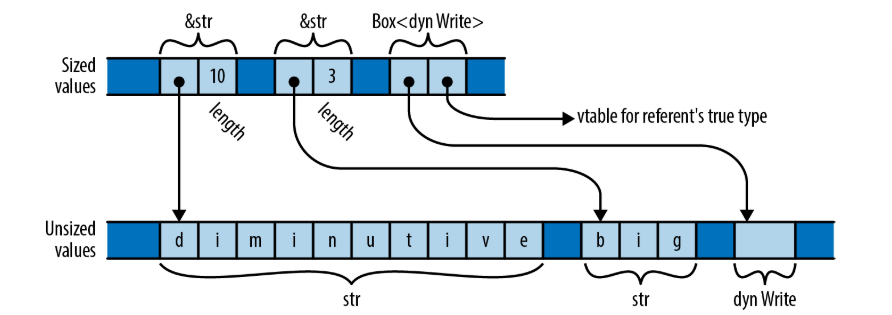

# 实用trait

 *Science is nothing else than the search to discover unity in the wild variety of nature—or, more exactly, in the variety of our experience. Poetry, painting, the arts are the same search, in Coleridge’s phrase, for unity in variety.* 

<p align="right">
    ——Jacob Bronowski
</p>

这一章将介绍Rust中的“实用” trait，它们是标准库中能够显著影响到编写Rust代码的方式的trait，因此你需要熟悉它们才能写出惯用的代码并设计出你的用户会觉得是“Rustic”的crate接口。它们可以分为三大类：

*`语言扩展trait`*

&emsp;&emsp;正如我们上一章介绍的运算符重载trait可以让你对自己的类型使用Rust的表达式运算符，还有几个其他的标准库trait充当Rust的扩展，让你可以把自己的类型更紧密地集成到语言中。这一类包括`Drop`、`Deref`和`DerefMut`，以及转换用的trait `From`和`Into`。我们将在本章介绍所有这些trait。

*`标记trait`*

&emsp;&emsp;有几个trait通常用于约束泛型参数来表达一些特殊的约束。这一类包括`Sized`和`Copy`。

*`公开的词汇表trait`*

&emsp;&emsp;这些trait并没有神秘的编译器集成，你可以在自己的代码中定义等价的trait。但它们服务于为常见问题制定常规解决方案的重要目标。这些trait在crate和模块之间的公共接口中特别有价值：通过减少不必要的变化，它们让接口更容易理解，它们还增加了不同crate的特性可以简单地集成在一起的可能性，并且无需样板或自定义的粘合代码。这一类包括`Default`、引用借用trait `AsRef`、`AsMut`、`Borrow`、`BorrowMut`，可能失败的转换 trait `TryFrom`和`TryInto`，以及`ToOwned` trait，它是`Clone`的泛化。

”表13-1”是对它们的总结。

|          **trait**    |   **说明**   |
| --- | --- |
| “`Drop`”  |  析构器。当一个值被drop时Rust会自动运行的清理代码。     |
| “`Sized`” |  标记trait，标记一个类型有一个编译期已知的固定大小，与动态大小的类型（例如切片）相反。  |
| “`Clone`” |  支持克隆的类型。   |
| “`Copy`”  |  标记trait，标记一个类型可以通过按位拷贝包含值的内存来克隆新值。    |
| “`Deref`与`DerefMut`” |  为智能指针类型准备的trait。    |
| “`Default`” |  有一个有意义的“默认值”的类型。     |
| “`AsRef`与`AsMut`” |  用于从一个类型的值借用另一个类型的引用的转换trait。    |
| “`Borrow`与`BorrowMut`” |  转换trait，类似于`Asref/AsMut`，但额外保证一致的哈希性、顺序性和相等性。    |
| “`From`与`Into`” |  用于将一个类型的值转换为另一个类型的值的转换trait。    |
| “`Tryfrom`与`TryInto`” |  用于将一个类型的值转换为另一个类型的值的转换trait，用于可能失败的转换。    |
| “`ToOwned`” |  将一个引用转换为一个有所有权的值的转换trait。  |

还有一些其它重要的标准库trait。我们将在”第15章”中介绍`Iterator`和`IntoIterator`。用于计算哈希值的`Hash` trait将在”第16章”中介绍。还有一对标记线程安全类型的trait `Send`和`Sync`，将在”第19章”中介绍。

## `Drop`

当一个值的所有者消失时，我们说Rust  *drop* 了这个值。drop一个值意味着释放这个值拥有的所有其他值、堆上的存储空间和系统资源。drop会在各种情况下发生：当变量离开作用域时、处于表达式语句的末尾时、截断vector时从尾部移除元素时，等等。

在大多数情况下，Rust会自动为你处理drop过程。例如，假设你定义了下面的类型：
```Rust
    struct Appellation {
        name: String,
        nicknames: Vec<String>
    }
```

字符串的内容和vector的元素缓冲区都在堆上分配了空间，`Appellation`拥有这些空间。当一个`Appellation`被drop时，Rust会清理所有这些内容，你不需要编写任何代码。然而，如果你想的话，你可以通过实现`std::ops::Drop` trait来自定义Rust如何drop你的类型的值：
```Rust
    trait Drop {
        fn drop(&mut self);
    }
```

`Drop`的实现类似于C++中的析构函数，或者其它语言中的终结函数。当一个值被drop时，如果它实现了`std::ops::Drop`，Rust会在清理它的字段或元素之前先调用它的`drop`方法。这种`drop`的隐式调用是唯一一种调用这个方法的方式，如果你尝试显式地调用这个方法，Rust会标记为错误。

因为Rust会在drop一个值的字段或方法之前先用这个值调用`Drop::drop`，所以这个方法接收到的值总是保持完全初始化的状态。我们的`Appellation`类型的一个`Drop`的实现可以充分利用它的字段：
```Rust
    impl Drop for Appellation {
        fn drop(&mut self) {
            print!("Dropping {}", self.name);
            if !self.nicknames.is_empty() {
                print!(" (AKA {})", self.nicknames.join(", "));
            }
            println!("");
        }
    }
```

有了这个实现，我们可以写出下列代码：
```Rust
    {
        let mut a = Appellation {
            name: "Zeus".to_string(),
            nicknames: vec!["cloud collector".to_string(),
                            "king of the gods".to_string()]
        };

        println!("before assignment");
        a = Appellation { name: "Hera".to_string(), nicknames: vec![] };
        println!("at end of block");
    }
```

当我们把第二个`Appellation`赋给`a`的时候，第一个值会被drop，当我们离开`a`的作用域时，第二个值也会被drop。这段代码会打印出如下内容：
```
    before assignment
    Dropping Zeus (AKA cloud collector, king of the gods)
    at end of block
    Dropping Hera
```

既然我们的`Appellation`的`std::ops::Drop`实现只打印了一条消息，那么它的内存到底是怎么被精确地清理掉的？`Vec`类型也实现了`Drop`，drop它的每个元素，然后释放在堆上分配的缓冲区。一个`String`在内部使用`Vec<u8>`来保存文本，因此`String`自身没有实现`Drop`，它让它的`Vec`来清理字符。同样的规则也适用于`Appellation`值：当一个值被drop时，它的`Vec`的`Drop`实现负责清理每一个字符串的内容，并最终释放存储元素的缓冲区。保存`Appellation`值的内存本身也有一个拥有者，可能是一个局部变量或者一些数据结构，它们负责释放它。

如果一个变量的值被移动走，导致当它离开作用域时是未初始化的状态，那么Rust会避免drop这个变量：它里面没有值可以drop。即使按照控制流一个变量的值可能被移动走、也可能没有的情况下，这个原则也会生效。Rust会使用一个不可见的标记来追踪变量的状态，它指示变量的值是否需要被drop：
```Rust
    let p;
    {
        let q = Appellation { name: "Cardamine hirsuta".to_string(),
                              nicknames: vec!["shotweed".to_string(),
                                              "bittercress".to_string()] };
        if complicated_condition() {
            p = q;
        }
    }
    println!("Sproing! What was that?");
```

根据`complicated_condition`返回`true`还是`false`，`p`或者`q`最后将会拥有这个`Appellation`，另一个变为未初始化。这个值最终落在哪个变量里决定了它会在`println!`之前还是之后被drop。因为`q`在`println!`之前离开作用域，而`p`在之后。尽管一个值可能会被移来移去，但Rust只会drop它一次。

你通常不需要实现`std::ops::Drop`，除非你想定义一个拥有一些Rust不知道的资源的类型。例如，在Unix系统上，Rust的标准库内部使用下面的类型来表示一个操作系统文件描述符：
```Rust
    struct FileDesc {
        fd: c_int,
    }
```

`FileDesc`的`fd`字段就是当程序使用完它之后应该被关闭的文件描述符的序号。`c_int`是`i32`的一个别名。标准库中按照如下方式为`FileDesc`实现了`Drop`：
```Rust
    impl Drop for FileDesc {
        fn drop(&mut self) {
            let _ = unsafe { libc::close(self.fd) };
        }
    }
```

这里，`libc::close`是C库中的`close`函数的Rust名称。Rust代码只能在`unsafe`块中调用C函数，因此这里标准库使用了`unsafe`块。

如果一个类型实现了`Drop`，它就不能再实现`Copy`。如果一个类型是`Copy`的，那意味着按位复制就可以创建一个新的独立拷贝。但通常在同样的数据上调用同一个`drop`方法不止一次是一个错误。

标注prelude中包含了一个drop值的函数`drop`，但它的定义一点也不神奇：
```Rust
    fn drop<T>(_x: T) { }
```

换句话说，它以值接收参数，从调用者那里获取所有权——然后什么也不做。当`_x`离开作用域时Rust会drop它的值，正如它对其他任何变量做的一样。

## `Sized`

 *固定大小的类型(sized type)* 是指那些所有实例值都占用相同大小的内存空间的类型。Rust中几乎所有的类型都是固定大小的：每一个`u64`都是8字节，每一个`(f32, f32, f32)`类型的值都占12个字节。即使枚举也是固定大小的：不管它当前实际的variant是哪一个，一个枚举总是占用能存下最大的variant的空间。即使`Vec<T>`拥有一个大小可变的堆上缓冲区，`Vec`值本身的大小就是一个缓冲区的指针，加上容量和长度。因此`Vec<T>`是一个固定大小的类型。

所有的固定大小的类型都实现了`std::marker::Sized` trait，它没有任何方法或关联类型。Rust为所有适合的类型自动实现它，你不能自己实现它。`Sized`唯一的用途是作为类型参数的约束：一个类似`T: Sized`的约束要求`T`是一个大小在编译期已知的类型。这种类型的trait被称为 *标记trait(marker trait)* ，因为Rust语言本身使用它们来标记有特定特点的类型。

然而，Rust还有少量 *大小不固定的类型(unsized type)* ，它们的值的大小并不相同。例如，字符串切片类型`str`（注意，没有`&`）就是大小不固定的。字符串`"diminutive"`和`"big"`分别是占用了10个和3个字节的`str`切片的引用。如”图13-1”所示。数组切片类型例如`[T]`（再次注意，这里也没有`&`）也是大小不固定的：一个共享引用例如`&[u8]`可以指向一个任意大小的`[u8]`切片。因为`str`和`[T]`类型表示不同大小的值的集合，因此它们是大小不固定的类型。


<p align="center">图13-1 指向大小不固定的值的引用</p>

Rust中另一种常见的大小不固定类型是`dyn`类型，它是trait对象引用的目标。正如我们在“trait对象”中解释的一样，一个trait对象是一个指向实现了给定trait的值的指针。例如，类型`&dyn std::io::Write`和`Box<dyn std::io::Write>`是指向实现了`Write` trait的值的指针。被引用的目标可能是一个文件或者网络套接字，或者是实现了`Write`的自定义类型。因为实现了`Write`的类型的集合是开放的，所以`dyn Write`也是大小不固定的类型：它的值可能有任意的大小。

Rust不能在变量中存储大小不固定的值或者将它们传递为参数。你只能通过指针例如`&str`或`Box<dyn Write>`来处理它们，指针本身是固定大小的。正如”图13-1”所示，一个指向大小不固定的值的指针总是一个 *胖指针(fat pointer)* ，占用两个字节：一个指向切片的指针加上切片的长度、一个trait对象加上一个指向方法实现的vtable的指针。

trait对象和切片的指针是对称的。在这两种情况下，都缺乏相应的类型信息：你不能在不知道`[u8]`长度的情况下索引它，也不能在不知道被指向的值的具体`Write`实现的情况下调用`Box<dyn Write>`的方法。在这两种情况下，胖指针填充了类型缺失的信息，加上了一个长度或者vtable的指针。被省略的静态信息被替换为了动态信息。

因为大小不固定的类型限制太多，所以大多数泛型类型参数都被限制为`Sized`类型。事实上，它几乎总是必须的，因此在Rust中它是默认的：如果你写`struct S<T> { ... }`，Rust认为你的意思是`struct S<T: Sized> { ... }`。如果你不想让`T`有这个约束，你必须显式写出来，即`struct S<T: ?Sized> { ... }`。`?Sized`语法专门用于这种场景，含义是“不需要是`Sized`”。例如，如果你写了`struct S<T: ?Sized> { b: Box<T> }`，那么Rust将允许你写`S<Str>`和`S<dyn Write>`，这时`b`将是一个胖指针；而`S<i32>`和`S<String>`中，`b`是一个普通指针。

抛开它们的限制不谈，大小不固定的类型让Rust的类型系统工作得更加顺畅。如果阅读标准库的文档，你偶尔会看到类型参数中的`?Sized`约束，这几乎总是意味着给定的类型只能被指向，同时允许相关的代码既能处理普通类型、又能处理切片和trait对象。当一个类型参数有`?Sized`约束时，人们通常会说它是 *可能大小不固定(questionably sized)* ：它可能是`Sized`，也可能不是。

除了切片和trait对象之外，还有另一种大小不固定的类型。一个结构体的最后一个字段（也只有最后一个字段）可能是大小不固定的，此时这个结构体本身也是大小不固定的。例如，`Rc<T>`引用计数指针内部被实现为私有类型`RcBox<T>`的指针，它存储了`T`和引用计数。这里有一个`RcBox`的简化版的定义：
```Rust
    struct RcBox<T: ?Sized> {
        ref_count: usize,
        value: T,
    }
```

`value`字段就是`Rc<T>`引用的`T`值，`Rc<T>`解引用之后就是一个这个字段的指针。`ref_count`字段保存引用计数。

真正的`RcBox`是标准库的实现细节，不能用于公开使用。但假设我们在处理一个上面的定义。你可以将`RcBox`和固定大小的类型一起使用，例如`RcBox<String>`，结果将是一个固定大小的结构体类型。或者你可以将它和大小不固定的类型一起使用，例如`RcBox<dyn std::fmt::Display>`（其中`Display`表示可以被`println!`以及类似的宏格式化的类型），`RcBox<dyn Display>`是一个大小不固定的结构体类型。

你不能直接创建一个`RcBox<dyn Display>`值。你必须先创建一个普通的、固定大小的`RcBox`，它的`value`字段的类型需要实现`Display`，例如`RcBox<String>`。然后Rust允许你把一个它的引用`&RcBox<String>`转换为胖指针引用`&RcBox<dyn Display>`：
```Rust
    let boxed_lunch: RcBox<String> = RcBox {
        ref_count: 1,
        value: "lunch".to_string()
    };

    use std::fmt::Display;
    let boxed_displayable: &RcBox<dyn Display> = &boxed_lunch;
```

当向函数传递参数时会隐式发生这个转换，因此你可以向接受`&RcBox<dyn Display>`参数的函数传递一个`&RcBox<String>`：
```Rust
    fn display(boxed: &RcBox<dyn Display>) {
        println!("For your enjoyment: {}", &boxed.value);
    }

    display(&boxed_lunch);
```

这将会产生下列输出：
```
    For your enjoyment: lunch
```

## `Clone`

`std::clone::Clone` trait用于那些可以拷贝自身的类型。`Clone`的定义如下：
```Rust
    trait Clone: Sized {
        fn clone(&self) -> Self;
        fn clone_from(&mut self, source: &Self) {
            *self = source.clone()
        }
    }
```

`clone`方法应该构建一个`self`的独立拷贝并返回它。因为这个方法的返回类型是`Self`，并且函数不能返回大小不固定的值，因此`Clone` trait扩展了`Sized` trait：它会约束实现的`Self`类型是`Sized`。

拷贝一个值通常意味着拷贝它拥有的所有内容，因此`clone`可能在时间和内存上的开销都比较大。例如，克隆一个`Vec<String>`不止要拷贝vector，还要拷贝它的每一个`String`元素。这就是为什么Rust不会自动拷贝值，而是要求你显式地调用方法来拷贝。引用计数指针例如`Rc<T>`和`Arc<T>`是例外：拷贝它们只会简单地递增引用计数并返回给你一个新的指针。

`clone_from`方法将`self`修改为`source`的拷贝。`clone_from`的默认实现简单地拷贝`source`，然后将它移动进`*self`。这总是能正确工作，但对于某些类型，还有更快的方法达成相同的效果。例如，假设`s`和`t`都是`String`。语句`s = t.clone();`必须先克隆`t`，drop掉`s`的旧值，然后将克隆的值移动进`s`，因此这里面有一次堆分配和堆释放。但如果`s`原本的堆缓冲区有足够的容量存下`t`的内容，那么没有必要进行释放和分配操作：可以简单地将`t`的文本拷贝进`s`的缓冲区，然后调整它的长度。在泛型代码中，你应该使用`clone_from`，这样可以充分利用优化过的实现的优势。

如果你的类型的`Clone`实现只是简单地调用每一个字段或者元素的`clone`方法，然后利用这些克隆的值构造一个新的值，那么`clone_from`的默认定义就已经够了，Rust将会为你实现它：只要在类型的定义上方加上`#[derive(Clone)]`。

标准库中几乎所有应该能拷贝的类型都实现了`Clone`。基本类型例如`bool`和`i32`实现了。容器类型例如`String, Vec<T>, HashMap`也实现了。一些不应该能拷贝的类型例如`std::sync::Mutex`没有实现`Clone`。一些类型例如`std::fs::File`可以拷贝，但如果操作系统没有足够的资源那么拷贝可能会失败，这些类型也没有实现`Clone`，因为`clone`不允许失败。作为替代，`std::fs::File`提供了一个`try_clone`方法，它返回一个`std::io::Result<File>`来报告失败。

## `Copy`

在”第4章”中，我们解释过，对于大多数类型，赋值操作会移动它的值，而不是拷贝它们。移动值让我们可以更容易地追踪它们拥有的资源。但在“Copy类型：move的例外”中，我们指出了例外情况：不持有任何资源的简单类型可以是`Copy`类型，这种类型的赋值操作会拷贝源值，而不是移动值并把源值设为未初始化。

那个时候，我们并没有确切地说明`Copy`到底是什么，但现在我们可以告诉你：如果一个类型实现了`std::marker::Copy`标记trait，那么它就是`Copy`的，`Copy`的定义如下：
```Rust
    trait Copy: Clone { }
```

很容易就可以为你自己的类型实现它：
```Rust
    impl Copy for MyType { }
```

但因为`Copy`是一个有特殊含义的标记trait，所以Rust只允许可以通过逐字节的浅拷贝来拷贝自身的类型实现`Copy`。如果一个类型拥有任何其他资源，例如堆缓冲区或者操作系统句柄，那么它将不能实现`Copy`。

任何实现了`Drop` trait的类型不能实现`Copy`。Rust假定如果一个类型需要特殊的清理代码，那么它肯定也需要特殊的拷贝代码，所以不能是`Copy`。

和`Clone`一样，你可以使用`#[derive(Copy)]`来让Rsut为你实现`Copy`。你通常能一次性看到它们两个，即`#[derive(Copy, Clone)]`。

在将类型变为`Copy`之前请仔细思考。尽管这样做会让类型更容易使用，但却对类型本身的实现添加了很大的限制。而且隐式的拷贝可能会有很大的开销。我们已经在“Copy类型：move的例外”中详细解释了这些因素。

## `Deref`与`DerefMut`

你可以通过实现`std::ops::Deref`和`std::ops::DerefMut` trait来指定解引用运算符`*`和`.`的行为。像`Box<T>`和`Rc<T>`这样的指针类型都实现了这些triat，因此它们的行为可以和Rust内建的指针类型一样。例如，如果你有一个`Box<Complex>`类型的值`b`，那么`*b`就是`b`指向的`Complex`值，`b.re`就是它的实部。如果上下文赋值给被引用的对象，或者借用了被引用对象的可变引用，那么Rust会自动使用`DerefMut`（“可变地解引用”）trait；否则，只读的访问就已经足够了，所以它会使用`Deref`。

这个trait的定义类似于这样：
```Rust
    trait Deref {
        type Target: ?Sized;
        fn deref(&self) -> &Self::Target;
    }

    trait DerefMut: Deref {
        fn deref_mut(&mut self) -> &mut Self::Target;
    }
```

`deref`和`deref_mut`方法以`Self`的引用为参数，并返回`Self::Target`的引用。`Target`应该是`Self`包含、拥有或指向的东西：对于`Box<Complex>`，`Target`类型就是`Complex`。注意`DerefMut`扩展了`Deref`：如果你可以解引用某个值并修改它，那么你当然也应该能借用它的共享引用。因为方法返回一个和`&self`生命周期相同的引用，只要返回的引用还存在，`self`就会保持被借用的状态。

`Deref`和`DerefMut` trait还扮演着另一个角色。因为`deref`以`Self`的引用作为参数并返回`Self::Target`的引用，所以Rust会自动把前者的类型转换为后者。换句话说，如果插入一个`deref`方法调用可以让类型变得匹配，那么Rust就会自动插入。实现`DerefMut`允许可变引用的相应转换。这些被称为 *强制解引用(deref coercions)* ：一个类型被“强迫”表现得和另一个类型一样。

尽管你也可以自己显式写出转换来代替强制解引用，但它们确实很方便：

- 如果你有一个`Rc<String>`的值`r`，并想用它调用`String::find`，你可以简单地写`r.find('?')`来代替`(*r).find('?')`：这个方法调用隐式地借用`r`，`&Rc<String>`被强迫为`&String`，因为`Rc<T>`实现了`Deref<Target=T>`。
- 你可以对`String`值调用类似`split_at`的方法，即使它原本是`str`切片类型的方法，这是因为`String`实现了`Deref<Target=str>`。没有必要让`String`重新实现`str`的所有方法，因为你可以把一个`&String`强迫为一个`&str`。
- 如果你有一个字节的vector `v`，然后你想把它传递给一个接受`&[u8]`字节序列的函数，那你只需要传递`&v`作为参数，因为`Vec<T>`实现了`Deref<Target=[T]>`。

如果需要的话，Rust会尝试多次强制解引用。例如，使用上面提到的强制解引用，你可以直接用`Rc<String>`调用`split_at`方法，因为`&Rc<String>`解引用为`&String`，它再解引用为`&str`，而`&str`有`split_at`方法。

例如，假设你有下面的类型：
```Rust
    struct Selector<T> {
        /// 这个`Selector`中可用的元素
        elements: Vec<T>,

        /// 当前的元素在`elements`中的索引。
        /// 一个`Selector`的行为类似于当前的元素的指针。
        current: usize
    }
```

为了让`Selector`的行为像文档中声明的一样，你必须为它实现`Deref`和`DerefMut`：
```Rust
    use std::ops::{Deref, DerefMut};

    impl<T> Deref for Selector<T> {
        type Target = T;
        fn deref(&self) -> &T {
            &self.elements[self.current]
        }
    }

    impl<T> DerefMut for Selector<T> {
        fn deref_mut(&mut self) -> &mut T {
            &mut self.elements[self.current]
        }
    }
```

有了上面的实现之后，你可以像这样使用一个`Selector`：
```Rust
    let mut s = Selector { elements: vec!['x', 'y', 'z'],
                           current: 2 };

    // 因为`Selector`实现了`Deref`，我们可以使用`*`运算符来
    // 引用它的当前的元素。
    assert_eq!(*s, 'z');

    // 断言`z`是字母，通过强制解引用直接在`Selector`上调用`char`的方法
    assert!(s.is_alphabetic());

    // 通过给`Selector`的引用赋值把'z'改为'w'。
    *s = 'w';

    assert_eq!(s.elements, ['x', 'y', 'w']);
```

`Deref`和`DerefMut` trait是为智能指针例如`Box, Rc, Arc`，以及那些经常以引用的方式使用并且充当另一种类型的类型准备的，例如`Vec<T>`和`String`充当`[T]`和`str`。你不应该仅仅为了让一个类型能自动使用`Target`类型的方法（类似于C++的子类可以使用基类的方法）而实现`Deref`和`DerefMut`。这可能不会按照你预想的工作，并且当事情变得复杂时可能会变得令人迷惑。

强制解引用有时可能会导致困惑：Rust使用它们来解决类型冲突，但不把它们用于满足类型变量的约束。例如，下面的代码可以正常工作：
```Rust
    let s = Selector { elements: vec!["good", "bad", "ugly"],
                       current: 2};
    fn show_it(thing: &str) { println!("{}", thing); }
    show_it(&s);
```

在调用`show_it(&s)`中，Rust看到了一个`&Selector<&str>`类型的实参，和一个`&str`类型的形参，然后它发现了`Deref<Target=str>`实现，并根据需要把调用重写为`show_it(s.deref())`。

然而，如果你把`show_it`改为一个泛型函数，Rust突然变得不配合了：
```Rust
    use std::fmt::Display;
    fn show_it_generic<T: Display>(thing: T) { println!("{}", thing); }
    show_it_generic(&s);
```

Rust会报错：
```
    error: `Selector<&str>` doesn't implement `std::fmt::Display`
        |
     33 |     fn show_it_generic<T: Display>(thing: T) { println!("{}", thing); }
        |                           ------- required by this bound in
        |                                   `show_it_generic`
     34 |     show_it_generic(&s);
        |                     ^^
        |                     |
        |                     `Selector<&str>` cannot be formatted with the
        |                     default formatter
        |                     help: consider adding dereference here: `&*s`
        |
```

这可能看起来非常奇怪：为什么把函数改为泛型的就会导致这么一个错误？事实上，`Selector<&str>`自身没有实现`Display`，但它可以解引用成`&str`，后者实现了。

因为你传递了一个`&Selector<&str>`类型的参数，而函数的形参类型是`&T`，因此类型参数`T`必须是`Selector<&str>`。然后，Rust会检查`T: Display`约束是否满足：因为Rust不会使用强制解引用来满足类型参数的约束，所以检查会失败。

为了解决这个问题，你可以使用`as`运算符显式转换：
```Rust
    show_it_generic(&s as &str);
```

或者，像编译器建议的一样，你可以使用`&*`来强制解引用：
```Rust
    show_it_generic(&*s);
```

## `Default`

一些类型会有一些有意义的默认值：vector或string的默认值就是空，默认的数字是0，默认的`Option`是`None`，等等。这样的类型可以实现`std::default::Default` trait：
```Rust
    trait Default {
        fn default() -> Self;
    }
```

`default`方法简单地返回一个`Self`类型的新值。例如，`String`的`Default`实现非常的直观：
```Rust
    impl Default for String {
        fn default() -> String {
            String::new()
        }
    }    
```

Rust的所有集合类型——`Vec, HashMap, BinaryHeap`等都实现了`Default`，它们的`default()`方法都返回一个空集合。当你需要创建一个集合来存储一些值，但你希望代码的调用者来决定创建什么类型的集合时这会非常有用。例如，`Iterator` trait的`partition`方法把迭代器产生的值划分为两个集合，使用一个闭包来决定每个值被分到哪个集合：
```Rust
    use std::collections::HashSet;
    let squares = [4, 9, 16, 25, 36, 49, 64];
    let (powers_of_two, impure): (HashSet<i32, HashSet<i32>)
        = squares.iter().partition(|&n| n & (n-1) == 0);
    
    assert_eq!(powers_of_two.len(), 3);
    assert_eq!(impure.len(), 4);
```

闭包`|&n| n & (n-1) == 0`使用了位操作来分辨一个数字是不是2的幂，`partition`使用它来产生两个`HashSet`。当然，`partition`并不是只能用于`HashSet`，你可以用它产生任何类型的集合，只要这个集合实现了`Default`来创建空的集合，以及`Extend<T>`来向集合中添加一个`T`类型的值。`String`实现了`Default`和`Extend<char>`，所以你可以写：
```Rust
    let (upper, lower): (String, String)
        = "Great Teacher Onizuka".chars().partition(|&c| c.is_uppercase());
    assert_eq!(upper, "GTO");
    assert_eq!(lower, "reat eacher nizuka");
```

`Default`的另一个常见用法是为一个结构体生成默认值，它代表一些固定的参数的集合。例如，`glium` crate为强大且复杂的OpenGL图形库提供Rust绑定。`glium::DrawParameters`结构体包含24个字段，每一个字段都控制一部分OpenGL渲染图形位的细节。`glium`里的`draw`函数接受一个`DrawParameters`结构体作为参数。因为`DrawParameters`实现了`Default`，你可以创建一个默认的值，然后只修改想要修改的字段，最后传给`draw`：
```Rust
    let params = glium::DrawParameters {
        line_width: Some(0.02),
        point_size: Some(0.02),
        .. Default::default()
    };

    target.draw(..., &params).unwrap();
```

`Default::default()`调用创建了一个`DrawParameters`的默认值，然后使用`..`语法创建一个新的只有`line_width`和`point_size`字段改变了的新值，最后把它传给`target.draw`。

如果一个类型`T`实现了`Default`，那么标准库会自动为`Rc<T>`、`Arc<T>`、`Box<T>`、`Cell<T>`、`RefCell<T>`、`Cow<T>`、`Mutex<T>`、`RwLock<T>`实现`Default`。例如，`Rc<T>`类型的默认值，是一个类型`T`的默认值的`Rc`指针。

如果一个元组类型的所有元素的类型都实现了`Default`，那么元组也会自动实现`Default`，它的默认值就是每个元素的默认值组成的元组。

Rust不会隐式为结构体类型实现`Default`，但如果一个结构体的所有字段都实现了`Default`，你可以使用`#[derive(Default)]`来为结构体自动生成`Default`。

## `AsRef`与`AsMut`

如果一个类型实现了`AsRef<T>`，那么意味着你可以从它高效地借用一个`&T`。`AsMut`用于可变引用。它们的定义如下：
```Rust
    trait AsRef<T: ?Sized> {
        fn as_ref(&self) -> &T;
    }

    trait AsMut<T: ?Sized> {
        fn as_mut(&mut self) -> &mut T;
    }
```

例如，`Vec<T>`实现了`AsRef<[T]>`，`String`实现了`AsRef<str>`。你可以从一个`String`的内容借用一个字节的数组，因为`String`也实现了`AsRef<[u8]>`。

`AsRef`通常用于让函数在接受参数时更加灵活。例如，`std::fs::File::open`函数的声明如下：
```Rust
    fn open<P: AsRef<Path>>(path: P) -> Result<File>
```

`open`真正想要的是一个`&Path`，这个类型表示一个文件系统路径。但有了这个签名以后，`open`接受任何可以被借用一个`&Path`的类型——也就是说，实现了`AsRef<Path>`的任何类型。这样的类型包括`String`和`str`，操作系统接口字符串类型`OsString`和`OsStr`、当然还有`PathBuf`和`Path`。完整的列表见标准库的文档。它允许你向`open`传递字符串字面量：
```Rust
    let dot_emacs = std::fs::File::open("/home/jimb/.emacs")?;
```

标准库中所有的文件系统函数都用这种方式接受路径参数。对于调用者来说，它的作用就像是C++中重载的函数一样，尽管Rust用了不同的方法来表示可以接受哪些类型的参数。

但只有这些还不够。字符串字面量是`&str`，但实现了`AsRef<Path>`的类型是`str`，没有`&`。正如我们在“`Deref`与`DerefMut`”一节中解释的一样，Rust不会尝试通过强制解引用来满足类型参数的约束，因此它们也不能解决这个问题。

幸运的是，标准库中包含了全面的实现：
```Rust
    impl<'a, T, U> AsRef<U> for &'a T
        where T: AsRef<U>,
              T: ?Sized, U: ?Sized
    {
        fn as_ref(&self) -> &U {
            (*self).as_ref()
        }
    }
```

换句话说，对于任意的类型`T`和`U`，如果有`T: AsRef<U>`，那么也会有`&T: AsRef<U>`：简单地先解引用然后就和之前一样继续。这里，因为有`str: AsRef<Path>`，所以也会有`&str: AsRef<Path>`。某种意义上，这是一种在检查类型参数中的`AsRef`约束时受限的强制解引用方式。

你可能会假设如果一个类型实现了`AsRef<T>`，那它也应该实现`AsMut<T>`。然而，还有一些不适合这样的情况。例如，我们提到过`String`实现了`AsRef<[u8]>`；这是有意义的，因为每一个`String`都包含一个字节缓冲区，可以被当做二进制数据访问。然而，`String`还保证这些字节是有效的UTF-8文本；如果`String`实现了`AsMut<[u8]>`，那么调用者将能把`String`的字节缓冲区修改为任何内容，那么你将不能再信任`String`里存储的是有效的UTF-8。只有那些修改返回的`T`不会破坏一致性的类型实现`AsMut<T>`才有意义。

尽管`AsRef`和`AsMut`非常简单，但它提供了一种标准化、泛型的方式来进行引用转换，进而避免了更多特化的转换trait。当实现`AsRef<Foo>`就足够的时候，你应该避免实现你自己的`AsFoo` trait。

## `Borrow`与`BorrowMut`

`std::borrow::Borrow` trait和`AsRef`很相似：如果一个类型实现了`Borrow<T>`，那么它的`borrow`方法可以高效地借用一个`&T`。但`Borrow`有更多的限制：只有当借用的`&T`和被借用的值的哈希值和比较方式相同时，这个类型才应该实现`Borrow<T>`。（Rust并不强迫这一点，这只是这个trait被设计的意图。）这让`Borrow`在处理哈希表和树的key时非常有用，在处理其他可能会被哈希或者比较的值也很有用。

当从`String`借用时，这种不同很重要，例如：`String`实现了`AsRef<str>`、`AsRef<[u8]>`、`AsRef<Path>`，但这三种类型会有不同的哈希值。只有`&str`保证和等价的`String`有相同的哈希值，因此`String`只实现了`Borrow<str>`。

`Borrow`的定义和`AsRef`的定义几乎完全相同，只有名字变了：
```Rust
    trait Borrow<Borrowed: ?Sized> {
        fn borrow(&self) -> &Borrow;
    }
```

`Borrow`被设计用来解决泛型哈希表和其他关联集合类型的特性问题。例如，假设你有一个`std::collections::HashMap<String, i32>`，把字符串映射到数字。这个表的key是`String`，所以每一个表项都拥有一个`String`。那么在一个这样的表中查找一个表项的方法的签名应该是什么样的？这是第一次尝试：
```Rust
    impl<K, V> HashMap<K, V> where K: Eq + Hash
    {
        fn get(&self, key: K) -> Option<&V> { ... }
    }
```

这么做是有道理的：为了查找一个表项，你必须提供一个和表的key相同的类型。但在这个情况中，`K`是`String`，这样的签名会强迫你每次调用`get`时以值传递一个`String`，显然这很浪费。你实际上只需要一个key的引用：
```Rust
    impl<K, V> HashMap<K, V> where K: Eq + Hash
    {
        fn get(&self, key: &K) -> Option<&V> { ... }
    }
```

这样好一点，但你现在必须传递`&String`作为key，所以如果你想查找一个常量字符串，你必须这么写：
```Rust
    hashtable.get(&"twenty-two".to_string());
```

这显然很离谱：它在堆上分配了一个`String`的缓冲区并把文本拷贝进去，然后借用它得到一个`&String`，传给`get`之后再drop掉。

如果可以传递任何可以被哈希或者可以与key比较的类型，那么显然会更好。例如，一个`&str`完美满足条件。因此这是最终的版本，你可以在标准库中找到它：
```Rust
    impl<K, V> HashMap<K, V> where K: Eq + Hash
    {
        fn get<Q: ?Sized>(&self, key: &Q) -> Option<&V>
            where K: Borrow<Q>,
                  Q: Eq + Hash
        { ... }
    }
```

换句话说，如果你可以将一个表项的key借用为一个`&Q`，并且引用的哈希值和比较结果就和用key本身所得的结果一样，那么`&Q`就是一个可以接受的key类型。因为`String`实现了`Borrow<str>`和`Borrow<String>`，所以`get`的最终版本可以传递`&String`或者`&str`作为key。

`Vec<T>`和`[T; N]`实现了`Borrow<[T]>`。每一个类似字符串的类型都允许借用相应的切片类型：`String`实现了`Borrow<str>`，`PathBuf`实现了`Borrow<Path>`，等等。所有标准库的关联集合类型都使用了`Borrow`来决定哪些类型可以被传入查找函数。

标准库包含了完备的实现，因此每一个类型`T`都可以从它自身借用：`T: Borrow<T>`。这保证了在一个`HashMap<K, V>`中查找表项时`&K`总是可接受的类型。

为了方便，每一个`&mut T`类型也实现了`Borrow<T>`，返回一个共享引用`&T`。这允许你直接向集合的查找函数传递可变引用，不需要重新借用共享引用，它模拟了Rust通常把可变引用转换为共享引用的隐式强制解引用。

`BorrowMut` trait是`Borrow`的可变引用版本：
```Rust
    trait BorrowMut<Borrowed: ?Sized>: Borrow<Borrowed> {
        fn borrow_mut(&mut self) -> &mut Borrowed;
    }
```

`Borrow`应该满足的条件也适用于`BorrowMut`。

## `From`与`Into`

`std::convert::From`和`std::convert::Into` trait代表消耗一个值并返回另一个值的转换。与`AsRef`和`AsMut` trait从一个类型借用另一个类型的引用不同，`From`和`Into`会获取参数的所有权，对它进行变换，然后把最后的结果的所有权返回给调用着。

它们的定义完美对称：
```Rust
    trait Into<T>: Sized {
        fn into(self) -> T:
    }

    trait From<T>: Sized {
        fn from(other: T) -> Self;
    }
```

标准库自动实现每一个类型到自身的转换：每个类型`T`都实现了`From<T>`和`Into<T>`。

尽管这两个trait看起来像是提供了两种不同的方式做同一件事情，但实际上它们用不同的用途。

通常使用`Into`来让函数可以更灵活的接收参数。例如，如果你写：
```Rust
    use std::net::Ipv4Addr;
    fn ping<A>(address: A) -> std::io::Result<bool>
        where A: Into<Ipv4Addr>
    {
        let ipv4_address = address.into();
        ...
    }
```

那么`ping`不止可以接受`Ipv4Addr`作为参数，还可以接受一个`u32`或者一个`[u8; 4]`数组，因为这些类型都实现了`Into<Ipv4Addr>`。（有时把IPv4地址当成单个32位整数或者一个四个字节的数组会很有用）因为`ping`唯一知道的就是`address`实现了`Into<Ipv4Addr>`，所以当你调用`into`时没有必要指明你想要什么类型。只有一种类型可能成功，所以类型推导会自动为你填充它。

类似于上一节的`AsRef`，它的效果也很像C++中的重载函数。有了上面的`ping`定义，我们可以像下面这样调用：
```Rust
    println!("{:?}", ping(Ipv4Addr::new(23, 21, 68, 141))); // 传递一个Ipv4Addr
    println!("{:?}", ping([66, 146, 219, 98]));             // 传递一个[u8; 4]
    println!("{:?}", ping(0xd076eb94_u32));                 // 传递一个u32
```

`From` trait则扮演不同的角色。`from`方法充当泛型的构造函数，从别的值构造一个该类型的实例。例如，`Ipv4Addr`简单地实现了`From<[u8; 4]>`和`From<u32>`，而不是定义两个名叫`from_array`和`from_u32`的方法：
```Rust
    let addr1 = Ipv4Addr::from([66, 146, 219, 98]);
    let addr2 = Ipv4Addr::from(0xd076eb94_u32);
```

我们可以让类型推导来决定使用哪个实现。

给定一个合适的`From`实现，标准库会自动生成相应的`Into` trait的实现。当你定义自己的类型时，如果它需要单个参数的构造函数，你可以将它写成`From<T>`的实现，而不是定义一个新的构造函数。你可以免费得到相应的`Into`实现。

因为`from`和`into`转换会获取参数的所有权，转换可以重用原始值的资源来构造转换后的值。例如，假设你写了：
```Rust
    let text = "Beautiful Soup".to_string();
    let bytes: Vec<u8> = text.into();
```

`String`的`Into<Vec<u8>>`的实现简单地获取`String`的堆缓冲区的所有权，并重用它作为返回的vector的元素缓冲区。这个转换中不需要分配或拷贝文本。这是另一个使用move来实现高效的方法的例子。

这些转换还提供了一种很好的方式来放松类型的约束，灵活的同时又没有减弱被约束类型的保证。例如，一个`String`保证它的内容总是有效的UTF-8；它的方法都有很谨慎的限制，来保证你不能引入无效的UTF-8。但这个例子高效地把一个`String`转换成了一个普通的字节块，你可以对它做任何事：也许你准备压缩它，或者将它和其他不是UTF-8的二进制数据混合。因为`into`会获取参数的所有权，转换之后`text`将变为未初始化，这意味着我们可以自由地访问之前的`String`的缓冲区，而不需要破坏任何现有的`String`。

然而，低开销的转换并不是`Into`和`From`的约定的一部分。与`AsRef`和`AsMut`被期望开销很小不同，`From`和`Into`转换可能会分配、赋值、或者处理值的内容。例如，String实现了`From<&str>`，它把字符串切片拷贝到`String`分配的新的堆上的缓冲区。还有`std::collections::BinaryHeap<T>`实现了`From<Vec<T>>`，它根据算法的要求对元素进行比较和重新排序。

`?`运算符使用`From`和`Into`通过按需将特定的错误类型自动转换为通用的错误类型来帮忙处理函数中可能会失败的代码。

例如，想象一个系统需要读取二进制数据并把其中一部分被写作UTF-8文本的10进制数字转换回数字。这意味着要使用`std::str::from_utf8`和`i32`的`FromStr`实现，它们可能会返回不同类型的错误。假设我们使用了在”第7章”中定义的`GenericError`和`GenericResult`类型，那么`?`运算符将会为我们做这个转换：
```Rust
    type GenericError = Box<dyn std::error::Error + Send + Sync + 'static>;
    type GenericResult<T> = Result<T, GenericError>;

    fn parse_i32_bytes(b: &[u8]) -> GenericResult<i32> {
        Ok(std::str::from_utf8(b)?.parse::<i32>()?)
    }
```

类似大多数错误类型，`Utf8Error`和`ParseIntError`实现了`Error` trait，并且标准库给了我们完备的`From impl`来把任何实现了`Error`的类型转换为`Box<dyn Error>`，`?`将会自动使用它：
```Rust
    impl<'a, E: Error + Send + Sync + 'a> From<E>
        for Box<dyn Error + Send + Sync + 'a> {
            fn from(err: E) -> Box<dyn Error + Send + Sync + 'a> {
                Box::new(err)
            }
        }
```

它将原本需要两个`match`语句的复杂函数转变为只需要一行。

在`From`和`Into`被添加进标准库中之前，Rust代码中充满了单独的转换trait和构造方法，每一个都用于单个类型。`From`提供了标准的转换方式，你可以使用它们来让你的类型更加易于使用，因为你的用户已经对它们很熟悉了。其他的库和语言本身也可以使用这些trait作为约定的、标准的方式来处理转换。

`From`和`Into`是不可失败的trait——它们的API要求转换不能失败。不幸的是，很多转换更加复杂。例如，大整数例如`i64`可以存储比`i32`大很多的数字，将一个类似`2_000_000_000_000i64`这样的数字转换为`i32`没有意义。如果直接把前32位丢掉，那么并不会总是返回我们期望的结果：
```Rust
    let huge = 2_000_000_000_000i64;
    let smaller = huge as i32;
    println!("{}", smaller);    // -1454759936
```

有很多处理这种问题的方法。取决于上下文，这种“折断”的方式也可能很合适。另一方面，数字信号处理和控制系统等应用通常可以使用“饱和”转换：超过最大可表示的值的数字会被限制为可表示的最大值。

## `TryFrom`与`TryInto`

因为这种转换到底该怎么做并不是很清楚，所以Rust并没有为`i32`实现`From<i64>`，也没有实现任何其他可能丢失信息的数制转换。作为代替，`i32`实现了`TryFrom<i64>`。`TryFrom`和`TryInto`是`From`和`Into`的可能失败的版本，实现`TryFrom`意味着`TryInto`也会自动实现。

它们的定义只比`From`和`Into`复杂一点：
```Rust
    pub trait TryFrom<T>: Sized {
        type Error;
        fn try_from(value: T) -> Result<Self, Self::Error>;
    }

    pub trait TryInto<T>: Sized {
        type Error;
        fn try_into(self) -> Result<T, Self::Error>;
    }
```

`try_into()`方法返回一个`Result`，因此我们可以选择在失败的情况下做什么，例如一个数字太大不能存放在结果类型中：
```Rust
    use std::convert::TryInto;
    // 溢出时选择饱和，而不是折断
    let smaller: i32 = huge.try_into().unwrap_or(i32::MAX);
```

如果我们想同时处理负数的情况，我们可以使用`Result`的`unwrap_or_else()`的方法：
```Rust
    let smaller: i32 = huge.try_into().unwrap_or_else(|_| {
        if huge >= 0 {
            i32::MAX
        } else {
            i32::MIN
        }
    });
```

为你自己的类型实现可能失败的转换也非常简单。`Error`类型既可以很简单，也可以像某个应用的需求一样复杂。这里标准库使用了一个空的结构体，没有提供转换失败的原因相关的信息，因为唯一可能失败的原因就是溢出。另一方面，在更复杂的类型之间转换可能会需要返回更多的信息：
```Rust
    impl TryInto<LinearShift> for Transform {
        type Error = TransformError;

        fn try_into(self) -> Result<LinearShift, Self::Error> {
            if !self.normalized() {
                return Err(TransformError::NotNormalized);
            }
            ...
        }
    }
```

`From`和`Into`将只需要简单的转换的类型联系起来，`TryFrom`和`TryInto`用`Result`的强大的错误处理能力扩展了`From`和`Into`的简单转换。这四个trait可以一起使用来联系一个crate中的多种类型。

## `ToOwned`

给定一个引用，产生一个有所有权的拷贝的通常方式是调用`clone`，假设这个类型实现了`std::clone::Clone`。但如果你想拷贝一个`&str`或者一个`&[i32]`呢？你想要的可能是一个`String`或者一个`Vec<i32>`，但`Clone`的定义不允许那样做：从定义上讲，拷贝一个`&T`必须返回一个`T`类型的值，而`str`和`[u8]`是大小不固定的，它们甚至不能作为函数的返回类型。

`std::borrow::ToOwned` trait提供了一种更简单的方式来把一个引用转换成一个有所有权的值：
```Rust
    trait ToOwned {
        type Owned: Borrow<Self>;
        fn to_owned(&self) -> Self::Owned;
    }
```

与`clone`必须返回`Self`不同，`to_owned`可以返回任何你可能借用一个`&Self`的对象：`Owned`类型必须实现了`Borrow<Self>`。你可以从`Vec<T>`借用一个`&[T]`，所以`[T]`可以实现`ToOwned<Owned=Vec<T>>`，只要`T`实现了`Clone`，因此我们可以把切片的元素拷贝进vector中。类似的，`str`实现了`ToOwned<Owned=String>`，`Path`实现了`ToOwned<Owned=PathBuf>`，等等。

## `Borrow`和`ToOwned`的配合：`Cow`

想用好Rust就必须想好所有权的问题、例如一个函数应该以值还是以引用接受参数。通常你可以选择其中一种，并且类型的参数反应出了你的决定。但在某些情况下，在程序实际运行之前你都不能决定到底是借用还是拥有；`std::borrow::Cow`类型（用于“写时克隆”）提供了一个处理这种情况的方法。

它的定义如下所示：
```Rust
    enum Cow<'a, B: ?Sized>
        where B: ToOwned
    {
        Borrowed(&'a B),
        Owned(<B as ToOwned>::Owned);
    }
```

一个`Cow<B>`可能是一个`B`的一个共享引用，也可能拥有一个我们可以借用到这样一个引用的值。因为`Cow`实现了`Deref`，你可以将它当做`B`的共享引用来调用方法；如果它是`Owned`，它会借用一个拥有的值的共享引用；如果它是`Borrowed`，它直接使用它存储的引用。

你也可以通过调用`to_mut`方法来获取一个`Cow`值的可变引用，它会返回一个`&mut B`。如果`Cow`恰巧是`Cow::Borrowed`，`to_mut`简单地调用`to_owned`方法来获取它引用的值的拷贝，然后把`Cow`修改为`Cow::Owned`，然后借用新的拥有的值的可变引用。这是这个类型的名字表示的“写时克隆”的行为。

类似的，`Cow`还有一个`into_owned`方法，如果需要的话它会通过引用拷贝一个值，然后返回它，把所有权移动给调用者，然后在这个过程中消耗掉`Cow`。

`Cow`的一个常见用途是返回一个静态分配的字符串常量或者一个计算之后得到的字符串。例如，假设你需要把一个表示错误的枚举转换为消息，其中大多数variant都用固定的字符串来处理，但有些variant应该在消息里包含一些数据。你可以返回一个`Cow<'static str>`：
```Rust
    use std::path::PathBuf;
    use std::borrow::Cow;
    fn describe(error: &Error) -> Cow<'static, str> {
        match *error {
            Error::OutOfMemory => "out of memory".into(),
            Error::StackOverflow => "stack overflow".into(),
            Error::MachineOnFire => "machine on fire".into(),
            Error::Unfathomable => "machine bewildered".into(),
            Error::FileNotFound(ref path) => {
                format!("file not found: {}", path.display()).into()
            }
        }
    }
```

这段代码使用了`Into`的`Cow`实现来构造值。这个`match`语句的大多数分支都返回一个指向静态分配字符串的`Cow::Borrowed`。但当我们到达`FileNotFound` variant时，我们使用了`format!`来构造一个插入了给定文件名的消息。这个`match`语句的分支会产生一个`Cow::Owned`值。

`describe`的调用者不需要修改值，就可以把`Cow`用作`&str`：
```Rust
    println!("Disaster has struct: {}", describe(&error));
```

如果调用者需要一个拥有所有权的值，那么它可以产生一个：
```Rust
    let mut log: Vec<String> = Vec::new();
    ...
    log.push(describe(&error).into_owned());
```

使用`Cow`可以帮助`describe`和它的调用者推迟内存分配，直到必须进行分配的时候。
