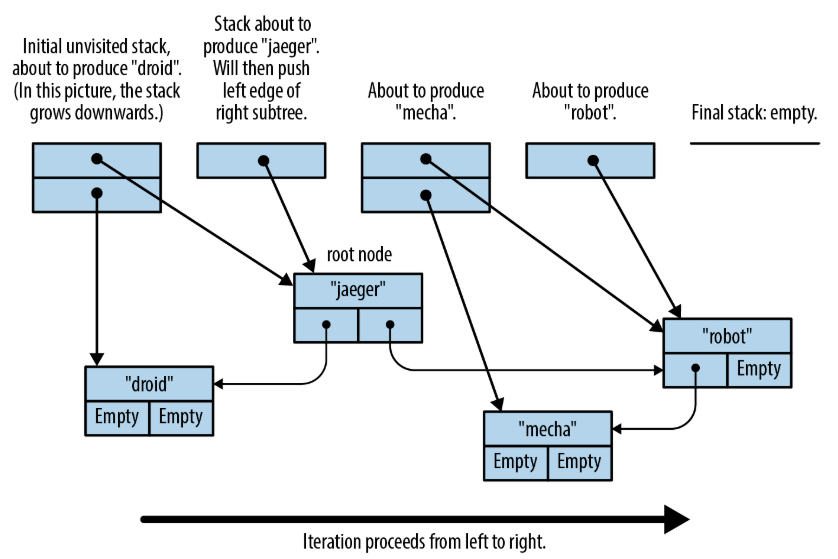

# 迭代器

 *It was the end of a very long day.* 

<p align="right">
    ——Phil
</p>

一个 *迭代器(iterator)* 可以产生一个值的序列，通常会使用一个循环来进行处理。Rust的标准库提供了遍历vector、字符串、哈希表和其他集合的迭代器，以及从一个输入流中产生若干行文本的迭代器、到达网络服务器的连接的迭代器、通过通道从其他线程接收到的值的迭代器，等等。当然，你可以实现自己的迭代器。Rust的`for`循环提供了一种自然地使用迭代器的语法，但迭代器自身也提供了丰富的方法集合用于映射、过滤、连接、收集等用途。

Rust的迭代器灵活、表达力强、高效。考虑下面的函数，它返回前`n`个正数的和（通常也被称为 *第n个三角数(nth triangle number)* ：
```Rust
    fn triangle(n: i32) -> i32 {
        let mut sum = 0;
        for i in 1..=n {
            sum += i;
        }
        sum
    }
```

表达式`1..=n`是一个`RangeInclusive<i32>`值。一个`RangeInclusive<i32>`是一个产生从起点到终点的所有整数的迭代器（包含起点和终点），因此你可以将它用作`for`循环的操作数来求`1`到`n`的和。

但迭代器也有一个`fold`方法，你可以使用它实现如下的等价定义：
```Rust
    fn triangle(n: i32) -> i32 {
        (1..=n).fold(0, |sum, item| sum + item)
    }
```

以`0`作为起始的总和，`fold`会获取`1..=n`产生的每个值，然后用总和和产生的值调用闭包`|sum, item| sum + item`，每一次闭包的返回值就是新的总和。它最后返回的值就是`fold`自身返回的值——在这个例子中，就是整个序列的总和。如果你习惯使用`for`和`while`循环，那么这看起来会有些奇怪，但一旦你习惯了它，`fold`就是一个可读性强而简洁的替代方案。

这种写法是函数式编程语言的标准写法，这使得表达式有更强的表现力。但Rsut的迭代器是精心设计的，为了保证编译器可以把它们翻译成优秀的机器代码。在release构建模式下构建上面第二个定义时，Rust知道`fold`的定义，并且把它内联进`triangle`。然后，闭包`|sum, item| sum + item`也会被内联。最后，Rust会检查组合之后的代码，然后发现有一种更简单的方法计算从1到`n`的和：和总是等于`n * (n+1) / 2`。Rust会把`triangle`的整个函数体，包括循环、闭包等所有内容，变成一次乘法指令和一些其他的位运算。

这个例子恰巧可以转换成简单的算术，但在更复杂的使用中迭代器也可以表现的很好。它们是Rust提供灵活抽象的同时只有很小甚至没有开销的另一个例子。

在本章中，我们将会解释：

- `Iterator`和`IntoIterator` trait，它们是Rust迭代器的基础
- 经典迭代器流水线的三个阶段：从初始的值创建一个迭代器；通过选择或处理值将一种迭代器变成另一种；消耗迭代器产生的值
- 如何为自己的类型实现迭代器

迭代器有很多方法，所以一旦你了解了大概的思路，就可以跳过那一节。但迭代器在Rust的习惯用法中非常普遍，熟悉这些随附的工具对掌握这门语言至关重要。

## `Iterator`与`IntoIterator trait`

一个迭代器是任何实现了`std::iter::Iterator` trait的类型：
```Rust
    trait Iterator {
        type Item;
        fn next(&mut self) -> Option<Self::Item>;
        ... // 很多默认方法
    }
```

`Item`是迭代器产生的值的类型。`next`方法可能返回`Some(v)`，其中`v`是迭代器的下一个值；或者返回`None`，表示已经到达序列的终点。这里我们省略了`Iterator`的很多默认方法；我们将在本章的剩余部分分别介绍它们。

如果某个类型有一种很自然的迭代方法，那么它可以实现`std::iter::IntoIterator`，它的`into_iter`方法获取一个值并返回一个迭代它的迭代器：
```Rust
    trait IntoIterator where Self::IntoIter: Iterator<Item=Self::Item> {
        type Item;
        type IntoIter: Iterator;
        fn into_iter(self) -> Self::IntoIter;
    }
```

`IntoIter`是迭代器本身的类型，`Item`是它产生的值的类型。我们称所有实现了`IntoIterator`的类型为 *可迭代对象(iterable)* ，因为你可以迭代它。

Rust的`for`循环将这些部分漂亮地组合在一起。为了迭代一个迭代器的元素，你可以写：
```Rust
    println!("There's:");
    let v = vec!["antimony", "arsenic", "alumium", "selenium"];

    for element in &v {
        println!("{}", element);
    }
```

在底层，每一个`for`循环只是`IntoIterator`和`Iterator`的方法调用的缩写：
```Rust
    let mut iterator = (&v).into_iter();
    while let Some(element) = iterator.next() {
        println!("{}", element);
    }
```

`for`循环使用了`IntoIterator::into_iter`来把操作数`&v`转换成一个迭代器，然后重复调用`Iterator::next`。每一次返回`Some(element)`时，`for`循环会执行循环体；如果它返回`None`，循环会终止。

考虑这个例子，其中有一些迭代器的术语：

- 正如我们所说， *迭代器(iterator)* 是任何实现了`Iterator`的类型。
-  *可迭代对象(iterable)* 是任何实现了`IntoIterator`的类型：你可以调用它的`into_iter`方法获得一个迭代它的迭代器。这个例子中vector的引用`&v`就是可迭代对象。
- 一个迭代器 *产生(produce)* 值。
- 迭代器产生的值是 *item* 。这里item是`"antimony", "arsenic"`，等等。
- 接受迭代器产生的item的代码是 *消费者(consumer)* 。这个例子中，`for`循环就是消费者。

尽管`for`循环总是调用操作数的`into_iter`，你也可以直接向`for`循环传递迭代器；例如，当你在`Range`上循环时就是这种情况。所有的迭代器都会自动实现`IntoIterator`，它们的`into_iter`方法简单地返回迭代器自身。

如果在迭代器返回了`None`之后，你再调用它的`next`方法，那么`Iterator` trait并没有指定这种情况下该怎么做。大多数会再次返回`None`，但不是所有。（如果这导致了问题，“fuse”中介绍的`fuse`适配器可能会有帮助。）

## 创建迭代器

Rust标准库文档中详细解释了每种类型提供哪些种类的迭代器，但标准库提供了一些通用的约定来帮助你找到需要的迭代器。

### `iter`和`iter_mut`方法

大多数集合类型提供`iter`和`iter_mut`方法，它们返回一个迭代器，迭代器会产生每一个item的共享引用或可变引用。数组切片例如`&[T]`和`&mut [T]`也有`iter`和`iter_mut`方法。除了使用`for`循环自动处理之外，这些方法是最常用的获得迭代器的方法：
```Rust
    let v = vec![4, 20, 12, 8, 6];
    let mut iterator = v.iter();
    assert_eq!(iterator.next(), Some(&4));
    assert_eq!(iterator.next(), Some(&20));
    assert_eq!(iterator.next(), Some(&12));
    assert_eq!(iterator.next(), Some(&8));
    assert_eq!(iterator.next(), Some(&6));
    assert_eq!(iterator.next(), None);
```

这个迭代器的item类型是`&i32`：每一次调用`next`都会产生下一个元素的引用，直到到达vector的终点。

每一个类型都可以实现`iter`和`iter_mut`，不管它们的实现是否有意义。`std::path::Path`的`iter`返回的迭代器一次产生路径的一段：
```Rust
    use std::ffi::OsStr;
    use std::path::Path;

    let path = Path::new("C:/Users/JimB/Downloads/Fedora.iso");
    let mut iterator = path.iter();
    assert_eq!(iterator.next(), Some(OsStr::new("C:")));
    assert_eq!(iterator.next(), Some(OsStr::new("Users")));
    assert_eq!(iterator.next(), Some(OsStr::new("JimB")));
    ...
```

这个迭代器的item类型是`&std::ffi::OsStr`，它是操作系统调用接受的一种字符串类型的引用切片。

如果某个类型有不止一种迭代方式，那么这个类型通常为每种遍历方式提供特定的方法，因为这时普通的`iter`方法将会导致歧义。例如，`&str`字符串切片类型没有`iter`方法。作为替代，假设`s`是`&str`，那么`s.bytes()`返回一个产生`s`的每个字节的迭代器，而`s.chars()`会以UTF-8编码解析它的内容，然后产生每一个Unicode字符。

### `IntoIterator`实现

当一个类型实现了`IntoIterator`之后，你可以自己调用它的`into_iter`方法，正如`for`循环做的一样：
```Rust
    // 你通常应该使用HashSet，但它的迭代顺序是不确定的，
    // 因此这个例子中BTreeSet会工作得更好。
    use std::collections::BTreeSet;
    let mut favorites = BTreeSet::new();
    favorites.insert("Lucy in the Sky With Diamonds".to_string());
    favorites.insert("Liebesträume No. 3".to_string());

    let mut it = favorites.into_iter();
    assert_eq!(it.next(), Some("Liebesträume No. 3".to_string()));
    assert_eq!(it.next(), Some("Lucy in the Sky With Diamonds".to_string()));
    assert_eq!(it.next(), None);
```

大多数集合实际上都提供了好几个`IntoIterator`的实现，分别是为共享引用(`&T`)、可变引用(`&mut T`)、移动(`T`)提供的实现：

- 给定一个集合的 *共享引用(shared reference)* ，`into_iter`返回一个产生item的共享引用的迭代器。例如，在上面的代码中，`(&favorites).into_iter()`将会返回一个`Item`类型是`&String`的迭代器。
- 给定一个集合的 *可变引用(mutable reference)* ，`into_iter`返回一个产生item的可变引用的迭代器。例如，如果`vector`是`Vec<String>`，那么`(&mut vector).into_iter()`将返回一个`Item`类型是`&mut String`的迭代器。
- 当集合 *以值* 传递时，`into_iter`返回一个获取集合所有权并返回item自身的迭代器；item的所有权从集合移动到消费者，原来的集合在这个过程中被消耗。例如，上面代码中的`favorites.into_iter()`会返回一个产生每个字符串值的迭代器；消费者会接受每个字符串的所有权。当迭代器被drop时，`BTreeSet`中剩余的所有元素也都会被drop，并且集合会变为未初始化。

因为`for`循环会对操作数调用`IntoIterator::into_iter`，这三种实现会导致有下面三种迭代方式：迭代集合的共享引用、迭代集合的可变引用、或者消耗集合并获取它的元素的所有权：
```Rust
    for element in &collection { ... }
    for element in &mut collection { ... }
    for element in collection { ... }
```

这三种写法会调用上面列出的`IntoIterator`实现之一。

并不是每个类型都提供了全部这三种实现。例如，`HashSet`、`BTreeSet`、`BinaryHeap`没有实现可变引用的`IntoIterator`，因为修改它们的元素可能会破坏类型的不变量：修改后的值可能会有不同的哈希值、或者和它的邻居的顺序关系会改变，因此修改元素会导致它们被放在错误的地方。其他的类型支持可变性，但只支持部分。例如，`HashMap`和`BTreeMap`产生表项的value的可变引用，以及key的共享引用，原因和上面类似。

一般的准则是迭代应该高效和可预测，因此Rust不提供开销很大或者可能展现出令人惊讶的行为的实现（例如，重新哈希被修改的`HashSet`条目并因此导致之后的迭代中可能再次遇到它们）。

切片实现了三种`IntoIterator`变体中的两个；因为它们并不拥有自己引用的元素，因此没有“以值”的实现。作为代替，`&[T]`和`&mut [T]`的`into_iter`返回一个产生共享引用和可变引用的迭代器。如果你把底层切片类型`[T]`想象成一种集合，那么它就落入了之前的模式。

你可能已经注意到前两种`IntoIterator`的变体产生共享和可变的引用，这和调用`iter`或者`iter_mut`是等价的。为什么Rust同时提供两者？

`IntoIterator`使`for`循环能正常工作，因此它显然是必要的。但当你不使用`for`循环时，使用`favorites.iter()`比`(&favorites).into_iter()`更加清晰。你可能会频繁需要以共享引用迭代，因此`iter`和`iter_mut`也很有用。

`IntoIterator`在泛型代码中也很有用：你可以使用一个约束例如`T: IntoIterator`来限制类型参数`T`必须是可以迭代的类型。或者，你可以写`T: IntoIterator<Item=U>`来进一步要求迭代会产生`U`类型的值。例如，这个函数打印出任何item可以用`"{:?}"`格式打印的可迭代对象：
```Rust
    use std::fmt::Debug;

    fn dump<T, U>(t: T)
        where T: IntoIterator<Item=U>,
              U: Debug
    {
        for u in t {
            println!("{:?}", u);
        }
    }
```
你不能在这个泛型函数中使用`iter`或者`iter_mut`，因为它们不是任何trait的方法，大多数可迭代类型只是恰好有这两个方法。

### `from_fn`和`successors`

一个简单而通用的产生一个值序列的方式是提供一个返回它们的闭包。

给定一个返回`Option<T>`的函数，`std::iter::from_fn`返回一个迭代器，它简单地调用那个函数来产生item。例如：
```Rust
    use rand::random;   // 在Cargo.toml中添加依赖：rand = "0.7"
    use std::iter::from_fn;
    // 产生1000个随机数，在[0, 1]之间均匀分布。
    // （这并不是你想在`rand_distr` crate中找到的分布，
    // 但你可以很容易地自己实现它）
    let lengths: Vec<f64> =
        from_fn(|| Some((random::<f64>() - random::<f64>()).abs()))
        .take(1000)
        .collect();
```

这里调用了`from_fn`来制作一个产生随机数的迭代器。因为这个迭代器总是返回`Some`，因此这个序列永远不会终止，但我们调用了`take(1000)`来限制只要前1000个元素。然后`collect`从最后的迭代器构建一个vector。这是一种高效地构建初始化的vector的方式。我们将在本章稍后的“构建集合:`collect`和`FromIterator`”中介绍为什么。

如果每一个item都依赖上一个，那么`std::iter::successors`函数可以漂亮地工作。你需要提供一个初始item和一个函数，这个函数要获取上一个item并返回下一个item的`Option`。如果返回`None`，那么迭代终止。例如，这里有另一种编写”第2章”中的曼德勃罗集绘制器的`escape_time`函数的方法：
```Rust
    use num::Complex;
    use std::iter::successors;

    fn escape_time(c: Complex<f64>, limit: usize) -> Option<usize> {
        let zero = Complex { re: 0.0, im: 0.0 };
        successors(Some(zero), |&z| { Some(z * z + c) })
            .take(limit)
            .enumerate()
            .find(|(_i, z)| z.norm_sqr() > 4.0)
            .map(|(i, _z)| i)
    }
```

从zero开始，`successors`调用通过重复平方再加上参数`c`来产生一个复平面上点的序列。当绘制曼德勃罗集时，我们希望知道这个序列会一直在原点附近还是远离原点。`take(limit)`调用设置了序列长度的限制，`enumerate`为每一个点加上一个序号、把每个点`z`变为元组`(i, z)`。然后我们使用`find`来查找第一个离原点足够远可以逃离的点。如果存在这样的点，`find`方法返回一个`Option::Some((i, z))`，否则返回`None`。`Option::map`的调用会把`Some((i, z))`变为`Some(i)`，但不会改变`None`：这正是我们想要的返回值。

`from_fn`和`successors`都接受`FnMut`闭包，因此你的闭包可以捕获并修改作用域中的变量。例如，这个`fibonacci`函数使用一个`move`闭包来捕获一个变量并使用它作为运行状态：
```Rust
    fn fibonacci() -> impl Iterator<Item=usize> {
        let mut state = (0, 1);
        std::iter::from_fn(move || {
            state = (state.1, state.0 + state.1);
            Some(state.0)
        })
    }

    assert_eq!(fibonacci().take(8).collect::<Vec<_>>(),
               vec![1, 1, 2, 3, 5, 8, 13, 21]);
```

注意：`from_fn`和`successors`方法非常灵活，你可以把对迭代器的任何使用变成对其中一个的单一调用，通过复杂的闭包来获得你需要的行为。但这样做会忽略迭代器提供的表明数据流动和使用标准名称用于通用模式的能力。在你使用这两个函数之前请确保你已经熟悉了本章中的其他迭代器方法，它们通常是更好的完成工作的方式。

### `drain`方法

很多集合类型提供一个`drain`方法来获取集合的可变引用，并返回一个迭代器把每个元素的所有权传递给消费者。然而，和`into_iter()`以值获取集合并消耗它不同，`drain`借用一个集合的可变引用，并且当迭代器被drop时，它会移除集合中剩余的所有元素，让集合变为空。

对于可以用范围索引的类型，例如`String`、vector、`VecDeque`，`drain`方法获取一个要移除的元素的范围，而不是消耗整个序列：
```Rust
    use std::iter::FromIterator;

    let mut outer = "Earth".to_string();
    let inner = String::from_iter(outer.dran(1..4));

    assert_eq!(outer, "Eh");
    assert_eq!(inner, "art");
```

如果你确实要消耗整个序列，使用整个范围`..`作为参数。

### 其他迭代器源

上面的几节基本都是关于像vector和`HashMap`这样的集合类型的，但标准库中还有很多其他类型支持迭代。”表15-1”总结了一些有趣的类型，但还有更多没有列出。我们将在专门介绍特定类型的章节（即”第16章”、”第17章”、”第18章”）中详细介绍其中的一些方法。

|      **类型或trait**   |   **表达式**   |   **注意**   |
| --- | --- | --- |
| `std::ops::Range` |  `1..10`  |  端点必须是整数才能迭代。包括起点但不包括终点。  |
| `std::ops::Range` |  `(1..10).step_by(2)`   |  产生1，3，5，7，9。   |
|     `std::ops::RangeFrom`  |  `1..`  |  无限迭代。起点必须是整数。当值到达了这种类型的极限时可能会panic或者溢出。  |
|     `std::ops::RangeInclusive`  |  `1..=10`  |  类似`Range`，但包括终点值。  |
|     `Option<T>`  |  `Some(10).iter()`  |  类似于一个长度为0(`None`)或1的vector(`Some(v)`)。  |
|     `Result<T, E>`  |  `Ok("blah").iter()`  |  类似于`Option`，产生`Ok`值。  |
|     `Vec<T>, &[T]`  |  `v.windows(16)`  |  从左到右产生重叠的、连续的给定长度的切片。  |
|     `Vec<T>, &[T]` |  `v.chunks(16)`   |  从左到右产生非重叠的、连续的给定长度的切片。   |
|     `Vec<T>, &[T]` |  `v.chunks_mut(1024)`  |  类似`chunks`，不过切片是可变的。  |
|     `Vec<T>, &[T]` |  `v.split(\|byte\| byte & 1 != 0)`   |  产生被满足条件的元素分隔的切片。   |
|     `Vec<T>, &[T]` |  `v.split_mut(...)`  |  同上，但产生可变切片。  |
|     `Vec<T>, &[T]` |  `v.rsplit(...)`   |  类似`split`，但从右向左产生切片。   |
|     `Vec<T>, &[T]` |  `v.splitn(n, ...)`  |  类似`split`，但最多产生`n`个切片。  |
|     `String, &str`  |  `s.bytes()`   |  产生UTF-8字符串的字节。   |
|     `String, &str` |  `s.chars()`  |  产生UTF-8字符串的`char`。  |
|     `String, &str` |  `s.split_whitespace()`   |  以空格分隔字符串，产生非空字符们的切片。   |
|     `String, &str` |  `s.lines()`  |  产生字符串的每一行的切片。  |
|     `String, &str` |  `s.split('/')`   |  用给定的模式分隔字符串，产生每两个匹配之间的内容的切片。模式可以是字符、字符串或者闭包。 |
| `std::collections::HashMap, std::collections::BTreeMap` |  `s.matches(char:: is_numeric)`  |  产生匹配给定模式的切片。  |
| `std::collections::HashMap, std::collections::BTreeMap` |  `map.keys(), map.values()`   |  产生map的key或value的共享引用。   |
| `std::collections::HashMap, std::collections::BTreeMap` |  `map.values_mut()`  |  产生条目的value的可变引用。  |
| `std::collections::HashSet, std::collections::BTreeSet` |  `set1.union(set2)`   |  产生`set1`和`set2`的并集的元素的共享引用。   |
| `std::collections::HashSet, std::collections::BTreeSet` |  `set1.intersection(set2)`  |  产生`set1`和`set2`的交集的元素的共享引用。  |
|  `std::sync::mpsc::Receiver`  |  `rev.iter()`  |  产生另一个线程通过相应的`Sender`发送的值。  |
|  `std::io::Read`  |  `stream.bytes()`  |  产生来自I/O流的字节。  |
|  `std::io::Read`  |  `stream.chars()`   |  以UTF-8解析流，产生`char`。   |
|  `std::io::BufRead`  |  `bufstream.lines()`  |  以UTF-8解析流，产生`String`。  |
|  `std::io::BufRead`  |  `bufstream.split(0)`   |  用给定的字节切分流，产生`Vec<u8>`缓冲区。   |
|     `std::fs::ReadDir`  |  `std::fs::read_dir(path)`  |  产生目录项。  |
|     `std::net::TcpListener`  |  `listener.incoming()`  |  产生到来的网络连接。  |
|  自由函数  |  `std::iter::empty()`  |  立即返回`None`。  |
|  自由函数  |  `std::iter::once(5)`   |  产生给定值然后结束。   |
|   自由函数  |  `std::iter::repeat("#9")`  |  永远产生给定值。  |

## 迭代器适配器

一旦你得到了一个迭代器，`Iterator` trait还提供了广泛的 *适配器方法(adapter method)* ，或者简称为 *适配器(adapter)* ，它们消耗一个迭代器然后构建一个新的迭代器。为了展示适配器如何工作，我们将从两个最流行的适配器`map`和`filter`开始。然后我们会介绍其他的适配器，它们包括几乎所有你能想到的把一个序列的值变成另一个序列的方法：截断、跳过、组合、反向、连接、重复，等等。

### `map`和`filter`

`Iterator` trait的`map`适配器让你通过对每一个item应用一个闭包来产生新迭代器。`filter`迭代器让你通过一个闭包决定保留哪些item丢弃哪些item，以此过滤迭代器中的某些item。

例如，假设你在迭代文本的每一行，并且想省略每一行的前导和尾部的空格。标准库的`str::trim`方法排除一个`&str`中的前导和尾部空格，返回一个新的借用`&str`。你可以使用`map`适配器来对迭代器返回的每一行应用`str::trim`：
```Rust
    let text = "  ponies \n   giraffes\niguanas  \nsquid".to_string();
    let v: Vec<&str> = text.lines()
        .map(str::trim)
        .collect();
    assert_eq!(v, ["ponies", "giraffes", "iguanas", "squid"]);
```

`text.lines()`调用返回一个产生每一行的迭代器。对迭代器调用`map`返回第二个迭代器，它会对每一行调用`str::trim`，然后将结果作为产生的item。最后，`collect`把所有item聚集成一个vector。

当然，`map`返回的迭代器，本身也可以继续适配。如果你想从结果中排除“iguanas”，你可以像下面这样写：
```Rust
    let text = "  ponies \n   giraffes\niguanas  \nsquid".to_string();
    let v: Vec<&str> = text.lines()
        .map(str::trim)
        .filter(|s| *s != "iguanas")
        .collect();
    assert_eq!(v, ["ponies", "giraffes", "squid"]);
```

这里`filter`返回第三个迭代器，只有当`map`返回的迭代器产生的item调用闭包`|s| *s != "iguanas"`后返回`true`时，第三个迭代器才会产生这个item。一个这样的迭代器适配器链就像Unix shell中的管道：每一个适配器都有单个功能，很容易就能看清楚值的序列是如何从左到右转换的。

这两个适配器的签名如下：
```Rust
    fn map<B, F>(self, f: F) -> impl Iterator<Item=B>
        where Self: Sized, F: FnMut(Self::Item) -> B;

    fn filter<P>(self, predicate: P) -> impl Iterator<Item=Self::Item>
        where Self: Sized, P: FnMut(&Self::Item) -> bool;
```

在标准库中，`map`和`filter`实际上返回特定的不透明`struct`类型，分别是`std::iter::Map`和`std::iter::Filter`。然而它们的名字提供的信息量很少，所以在本书中我们将用`-> impl Iterator<Item=...>`来代替，因为它们能告诉我们我们实际想要知道的信息：这个方法返回一个产生给定类型的item的`Iterator`。

因为大多数适配器以值获取`self`，所以它们需要`Self`是`Sized`（大多数迭代器都是）。

`map`迭代器会依次把所有item以值传递给闭包，然后把结果返回给消费者。`filter`迭代器以共享引用把所有的item传递给闭包，保留选中的item的所有权，然后把它们传递给消费者。这就是为什么上面的例子要先解引用`s`再和`"iguanas"`比较：`filter`迭代器的item类型是`&str`，所以闭包参数的类型是`&&str`。

有关迭代器适配器有两个重要的点。

首先，在一个迭代器上调用适配器并不会消耗任何item，它只会返回一个新的迭代器，这个迭代器按需处理第一个迭代器产生的item来产生自己的item。在一个适配器链中，唯一会消耗item的方式就是对最后的迭代器调用`next`。

因此在我们之前的例子中，`text.lines()`方法调用本身并不从字符串解析行，它只是返回一个迭代器，只有当需要的时候这个迭代器 *才会* 解析行。类似的，`map`和`filter`只是返回需要时 *才会* 映射或过滤的新迭代器。在最后一个`collect`开始对`filter`迭代器调用`next`之前，将不会有任何计算发生。

当你的适配器有副作用时这一点尤其重要。例如，下面的代码什么也不打印：
```Rust
    ["earth", "water", "air", "fire"]
        .iter().map(|elt| println!("{}", elt));
```

`iter`调用返回一个迭代数组元素的迭代器，`map`调用返回第二个迭代器，第二个迭代器对第一个迭代器产生的每个值调用闭包。但如果整个链中没有要求产生值的操作，那么将不会有`next`方法被调用。事实上，Rust会警告你这种情况：
```
    warning: unused `std::iter::Map` that must be used
      |
    7 | /     ["earth", "water", "air", "fire"]
    8 | |          .iter().map(|elt| println!("{}", elt));
      | |________________________________________________^
      |
      = note: iterators are lazy and do nothing unless consumed
```

错误消息中的术语“lazy”并不是贬义词；它只是对任何直到需要时才进行计算的机制的一种称呼。迭代器应该做最少的必要的工作来满足`next`调用是Rust的习惯；在这个例子中，并没有`next`调用，因此不会有任何计算发生。

第二个重要的点是迭代器适配器是0成本抽象。因为`map`、`filter`以及它们的同伴都是泛型的，将它们用于迭代器会生成特定迭代器类型的代码。这意味着Rust有足够的信息把每一个迭代器`next`方法内联到消费者中，然后把整个操作作为一个单元翻译为机器码。因此我们上面展示的`lines/map/filter`迭代器链和你手写的代码一样高效：
```Rust
    for line in text.lines() {
        let line = line.trim();
        if line != "iguanas" {
            v.push(line);
        }
    }
```

这一节剩余的部分将介绍`Iterator` trait可用的适配器。

### `filter_map`和`flat_map`

`map`适配器适用于一个输入item产生一个输出item的情况。但如果你想删除迭代中的某些item而不是处理它们，或者想将一个item替换成0个或更多的item时该怎么做呢？`filter_map`和`flat_map`适配器赋予了你这种灵活性。

`filter_map`适配器类似于`map`，除了它的闭包要么将一个item转换成一个新的item（和`map`一样），要么从迭代中丢弃这个item。因此，它有些像`filter`和`map`的结合。它的签名如下：
```Rust
    fn filter_map<B, F>(self, f: F) -> impl Iterator<Item=B>
        where Self: Sized, F: FnMut(Self::Item) -> Option<B>;
```

除了闭包返回`Option<B>`之外，而不是`B`之外，它和`map`的签名是一样的。当闭包返回`None`时，这个item会从迭代器中丢弃；当它返回`Some(b)`时，`b`就是`filter_map`迭代器产生的下一个item。

例如，假设你想扫描一个字符串中空格分隔的单词，找到其中可以被解析为数字的并处理它，然后丢弃其他单词。那你可以写：
```Rust
    use std::str::FromStr;

    let text = "1\nfrond .25 289\n3.1415 estuary\n");
    for number in text
        .split_whitespace()
        .filter_map(|w| f64::from_str(w).ok())
    {
        println!("{:4.2}", number.sqrt());
    }
```
打印结果如下：
```
    1.00
    0.50
    17.00
    1.77
```

传给`filter_map`的闭包尝试对每一个空格分隔的切片调用`f64::from_str`。这会返回一个`Result<f64, ParseFloatError>`，它的`.ok()`返回一个`Option<f64>`：解析错误时是`None`，解析成功时是`Some(v)`。`filter_map`迭代器丢弃所有的`None`值，然后对每一个`Some(v)`产生值`v`。

但为什么要将`map`和`filter`融合成这样的单个操作，而不是直接使用两个适配器？`filter_map`适配器适用于刚刚展示过的这种情况，即只有实际尝试处理过item才知道应不应该包含这个item的情况。你可以只用`filter`和`map`做到同样的事情，但这样会很笨拙：
```Rust
    text.split_whitespace()
        .map(|w| f64::from_str(w))
        .filter(|r| r.is_ok())
        .map(|r| r.unwrap())
```

你可以认为`flat_map`适配器和`map`、`filter_map`是同一类的，区别在于现在闭包不是只能返回一个item(`map`)或者0或1个item(`filter_map`)，而是可以返回任意数量的item。`flat_map`迭代器产生闭包返回的序列的串联。

`flat_map`的签名如下：
```Rust
    fn flat_map<U, F>(self, f: F) -> impl Iterator<Item=U::Item>
        where F: FnMut(Self::Item) -> U, U: IntoIterator;
```
传给`flat_map`的闭包必须返回一个可迭代对象，但任何类型的可迭代对象都可以。[^1]

[^1]:事实上，因为`Option`也是一个可迭代对象，行为就像一个有0个或者1个item的序列。所以假设`closure`返回一个`Option<T>`，那么`iterator.filter_map(closure)`等价于`iterator.flat_map(closure)`。

例如，假设我们有一个把国家映射到主要城市的表。给定一个国家的列表，那我们怎么遍历它们的主要城市？
```Rust
    use std::collections::HashMap;

    let mut major_cities = HashMap::new();
    major_cities.insert("Japan", vec!["Tokyo", "Kyoto"]);
    major_cities.insert("The United States", vec!["Portland", "Nashville"]);
    major_cities.insert("Brazil", vec!["São Paulo", "Brasilia"]);
    major_cities.insert("Kenya", vec!["Nairobi", "Mombasa"]);
    major_cities.insert("The Netherlands", vec!["Amsterdam", "Utrecht"]);

    let countries = ["Japan", "Brazil", "Kenya"];

    for &city in countries.iter().flat_map(|country| &major_cities[country]) {
        println!("{}", city);
    }
```
这会打印出下列内容：
```
    Tokyo
    Kyoto
    São Paulo
    Brasilia
    Nairobi
    Mombasa
```

这段代码的意思是，对于每一个国家，我们都获取它的城市的vector，然后将所有vector连接成单个序列，然后打印出来。

但记住迭代是惰性的：只有当`for`循环调用了`flat_map`迭代器的`next`方法时才会开始计算。完全连接的序列从来不会在内存中构造。实际上，这里只有一个小的状态机，对于每一个城市迭代器，一次打印一个item，直到耗尽，然后为下一个国家产生一个新的城市迭代器。效果就类似于嵌套的循环，但被打包用作迭代器。

### `flatten`

`flatten`适配器把迭代器的item连接起来，假设每一个item都是可迭代对象：
```Rust
    use std::collections::BTreeMap;

    // 把城市映射到公园的表：每一个value都是一个vector。
    let mut parks = BTreeMap::new();
    parks.insert("Portland",  vec!["Mt. Tabor Park", "Forest Park"]);
    parks.insert("Kyoto",     vec!["Tadasu-no-Mori Forest", "Maruyama Koen"]);
    parks.insert("Nashville", vec!["Percy Warner Park", "Dargon Park"]);

    // 构建一个所有公园的vector。`values`返回一个产生vector的迭代器，
    // 然后`flatten`按顺序产生每一个vector的元素。
    let all_parks: Vec<_> = parks.values().flatten().cloned().collect();

    assert_eq!(all_parks,
               vec!["Tadasu-no-Mori Forest", "Maruyama Koen", "Percy Warner Park", 
                    "Dragon Park", "Mt. Tabor Park", "Forest Park"]);
```

“flatten”这个名字来自于想象把一个两层的结构压扁成一层的结构：`BTreeMap`和它的`Vec`的元素被压成一个产生所有元素的迭代器。

`flatten`的签名如下：
```Rust
    fn flatten(self) -> impl Iterator<Item=Self::Item::Item>
        where Self::Item: IntoIterator;
```

换句话说，迭代器的item自身必须实现了`IntoIterator`，这样它才是一个高效的序列的序列。`flatten`方法返回一个这些序列连接之后的迭代器。当然，这都是惰性完成的，只有当我们迭代完了一个序列才会从`self`产生一个新的item。

`flatten`方法还有一些令人惊讶的用法。如果你有一个`Vec<Option<...>>`并且你想只迭代其中的`Some`值，那么`flatten`可以漂亮地工作：
```Rust
    assert_eq!(vec![None, Some("day"), None, Some("one")]
               .into_iter()
               .flatten()
               .collect::<Vec<_>>(),
               vec!["day", "one"]);
```

这种方式可以工作是因为`Option`自身实现了`IntoIterator`，代表一个有0或1个元素的序列。`None`元素对迭代过程没有贡献，而每一个`Some`元素贡献一个值。类似的，你可以使用`flatten`来迭代`Option<Vec<...>>`：`None`和空vector的行为一样。

`Result`也实现了`IntoIterator`，`Err`时代表一个空的序列，因此对一个产生`Result`值的迭代器调用`flatten`可以高效地排除所有`Err`，产生一个解包之后的成功值的序列。我们不推荐在代码中忽略错误，但当用户知道自己在做什么时这是一个巧妙的技巧。

当你需要`flatten`时你可能会发现你真正需要的是`flat_map`。例如，标准库的`str::to_uppercase`方法把一个字符串转换成大写，工作方式类似于下面的代码：
```Rust
    fn to_uppercase(&self) -> String {
        self.chars()
            .map(char::to_uppercase)
            .flatten() // 有更好的方式
            .collect()
    }
```

这里必须使用`flatten`的原因是`char::to_uppercase()`并不是返回单个字符，而是返回一个可能产生一个或更多字符的迭代器。map调用会返回一个产生字符迭代器的迭代器，`flatten`将它们拼接在一起，因此我们最后可以调用`collect`把它们转换为一个`String`。

但这种`map`和`flatten`的组合使用如此普遍，以至于`Iterator`提供了`flat_map`适配器来处理这种情况。（事实上，`flat_map`比`flatten`更先加入标准库。）因此上面的代码可以写成：
```Rust
    fn to_uppercase(&self) -> String {
        self.chars()
            .flat_map(char::to_uppercase)
            .collect()
    }
```

### `take`和`take_while`

`Iterator` trait的`take`和`take_while`适配器让你可以在迭代了一定的次数或者当一个闭包决定截断时停止迭代。它们的签名如下：
```Rust
    fn take(self, n: usize) -> impl Iterator<Item=Self::Item>
        where Self: Sized;
    
    fn take_while<P>(self, predicate: P) -> impl Iterator<Item=Self::Item>
        where Self: Sized, P: FnMut(&Self::Item) -> bool;
```

这两个方法都获取一个迭代器的所有权，返回一个新的迭代器，新的迭代器从第一个item开始迭代，可能会提前终止序列。在产生最多`n`个item之后`take`迭代器会返回`None`。`take_while`迭代器对每个item引用`predicate`，当有一个item使`predicate`返回`false`时返回`None`，之后对`next`的调用也都会返回`None`。

例如，给定一个电子邮件的消息，其中消息头和消息主体用一个空行分隔，那么你就可以使用`take_while`来只迭代器消息头：
```Rust
    let message = "To: jimb\r\n\
                   From: superego <editor@oreilly.com>\r\n\
                   \r\n\
                   Did you get any writing done today?\r\n\
                   When will you stop wasting time plotting fractals?\r\n";
    for header in message.lines().take_while(|l| !l.is_empty()) {
        println!("{}", header);
    }
```

回顾“字符串字面量”，当字符串行以反斜杠结尾时，Rust并不会把下一行的缩进包含进字符串里，因此这个字符串中的任何一行都没有前导空格。这意味着`message`的第三行是空行。`take_while`适配器第一次看到空行时就会停止迭代，因此这段代码只会打印出两行：
```
    To: jimb
    From: superego <editor@oreilly.com>
```

### `skip`和`skip_while`

`Iterator` trait的`skip`和`skip_while`方法是`take`和`take_while`的补充：它们丢弃迭代起始的一定数量的item，或者直到一个闭包找到一个可接受的item时，按原样传递这个和剩余的item。它们的签名如下：
```Rust
    fn skip(self, n: usize) -> impl Iterator<Item=Self::Item>
        where Self: Sized;

    fn skip_while<P>(self, predicate: P) -> impl Iterator<Item=Self::Item>
        where Self: Sized, P: FnMut(&Self::Item) -> bool;
```

`skip`适配器的一个常见用法是在迭代命令行参数时跳过命令的名字。在”第2章”中，我们的最大公约数计算器就用了下面的代码来迭代它的命令行参数：
```Rust
    for arg in std::env::args().skip(1) {
        ...
    }
```

`std::env::args`函数返回一个迭代器，以`String`类型产生程序的参数，其中第一个item就是程序自身的名字。我们并不想在这个循环中处理它。对这个迭代器调用`skip(1)`返回一个新的迭代器，新的迭代器会丢弃程序名，然后产生剩余的参数。

`skip_while`适配器使用闭包来决定丢弃序列开头的多少item。你可以像这样迭代上一节的消息的主体行：
```Rust
    for body in message.lines()
        .skip_while(|l| !l.is_empty())
        .skip(1)
        println!("{}", body);
```

这里使用了`skip_while`来跳过非空的行，但这个迭代器会产生那个空行——也就是使闭包返回`false`的那个item。因此我们使用了`skip`方法来丢弃那个空行，这样最后的迭代器的第一个item就是消息主体的第一行。结合上一节中的`message`，这段代码会打印出：
```
    Did you get any writing done today?
    When will you stop wasting time plotting fractals?
```

### `peekable`

peekable迭代器让你可以窥视下一个将被产生的item，而不实际消耗它。你可以通过调用`Iterator` trait的`peekable`方法把一个迭代器转换成一个peekable迭代器：
```Rust
    fn peekable(self) -> std::iter::Peekable<Self>
        where Self: Sized;
```
这里，`Peekable<Self>`是一个实现了`Iterator<Item=Self::Item>`的`struct`，其中`Self`是底层迭代器的类型。

`Peekable`迭代器有一个额外的`peek`方法返回一个`Option<&Item>`：如果底层迭代器已经迭代完就返回`None`，否则返回`Some(r)`，其中`r`是下一个item的共享引用。（注意如果底层迭代器的item的类型已经是一个引用，那么最后返回的将是一个引用的引用。）

调用`peek`会尝试获取底层迭代器的下一个item，如果确实还有item，就缓存它直到下一次调用`next`。`Peekable`的其他`Iterator`的方法都知道这个缓存：例如，一个peekable迭代器`iter`的调用`iter.last()`知道在耗尽了底层的迭代器之后检查缓存。

当你必须要遍历之后才知道到底要消耗多少item时，peekable迭代器就很重要了。例如，如果你正在一个字符流解析数字，只有当你看到了数字之后的第一个非数字字符时你才能知道数字在哪里结束：
```Rust
    use std::iter::Peekable;

    fn parse_number<I>(tokens: &mut Peekable<I>) -> u32
        where I: Iterator<Item=char>
    {
        let mut n = 0;
        loop {
            match tokens.peek() {
                Some(r) if r.is_digit(10) => {
                    n = n * 10 + r.to_digit(10).unwrap();
                }
                _ => return n;
            }
            tokens.next();
        }
    }

    let mut chars = "226153980,1766319049".chars().peekable();
    assert_eq!(parse_number(&mut chars), 226153980);
    // `parse_number`不会消耗逗号！因此下面不会出错。
    assert_eq!(chars.next(), Some(','));
    assert_eq!(parse_number(&mut chars), 1766319049);
    assert_eq!(chars.next(), None);
```

`parse_number`函数使用`peek`方法来检查下一个字符，并且只有当它是数字时才消耗它。如果它不是数字或者迭代器被耗尽（也就是，如果`peek`返回`None`），我们将会返回已经解析的数字，将下一个字符留在迭代器里，之后再消耗。

### `fuse`

一旦一个`Iterator`返回`None`，trait并没有指定如果你继续调用`next`方法时它的行为。大多数迭代器都是再次返回`None`，但并不是所有。如果你的代码依赖这种行为，那你有时可能会遇到奇怪的行为。

`fuse`适配器接受任何迭代器，并产生一个保证第一次返回`None`之后一直返回`None`的迭代器：
```Rust
    struct Flaky(bool);

    impl Iterator for Flaky {
        type Item = &'static str;
        fn next(&mut self) -> Option<Self::Item> {
            if self.0 {
                self.0 = false;
                Some("totally the last item")
            } else {
                self.0 = true;  // D'oh!
                None
            }
        }
    }

    let mut flaky = Flaky(true);
    assert_eq!(flaky.next(), Some("totally the last item"));
    assert_eq!(flaky.next(), None);
    assert_eq!(flaky.next(), Some("totally the last item"));

    let mut not_flaky = Flaky(true).fuse();
    assert_eq!(not_flaky.next(), Some("totally the last item"));
    assert_eq!(not_flaky.next(), None);
    assert_eq!(not_flaky.next(), None);
```

`fuse`适配器最有用的场景可能是需要使用不确定来源的迭代器的泛型代码。与其希望每一个要处理的迭代器都是良定义的，不如使用`fuse`来确保这种行为。

### 可逆迭代器和`rev`

一些迭代器可以从序列的任意一端产生item。你可以通过使用`rev`适配器来反转这样的迭代器。例如，一个vector的迭代器可以简单的从尾部到头部产生item。这样的迭代器可以实现`std::iter::DoubleEndedIterator` trait，它是`Iterator`的扩展：
```Rust
    trait DoubleEndedIterator: Iterator {
        fn next_back(&mut self) -> Option<Self::Item>;
    }
```

你可以将这样的双端迭代器看做有两个标记分别指向正向和反向迭代的位置。每次从其中一个产生item，都会让它向另一个的方向移动；当它们交汇的时候，迭代就结束了：
```Rust
    let bee_parts = ["head", "thorax", "abdomen"];

    let mut iter = bee_parts.iter();
    assert_eq!(iter.next(),      Some(&"head"));
    assert_eq!(iter.next_back(), Some(&"abdomen"));
    assert_eq!(iter.next(),      Some(&"thorax"));

    assert_eq!(iter.next_back(), None);
    assert_eq!(iter.next_back(), None);
```

切片的迭代器可以很容易的实现这种行为：它利用两个指针分别指向还未产生的元素范围的起点和终点；`next`和`next_back`简单地从其中一个产生一个item。有序集合的迭代器例如`BTreeSet`和`BTreeMap`也是双端迭代器：它们的`next_back`方法以最大元素或条目优先的顺序返回item。一般来说，标准库在可行时都会提供双端迭代器。

但并不是所有的迭代器都可以简单地做到这一点：一个产生其他线程发给通道的`Receiver`的值的迭代器没有办法预测最后一个到达的值会是什么。一般来说，你应该检查标准库的文档来看看哪些迭代器实现了`DoubleEndedIterator`，哪些没有。

如果一个迭代器是双端的，你可以使用`rev`适配器来反转它：
```Rust
    fn rev(self) -> impl Iterator<Item=Self>
        where Self: Sized + DoubleEndedIterator;
```

返回的迭代器也是一个双端迭代器：它的`next`和`next_back`方法被简单地交换了：
```Rust
    let meals = ["breakfast", "lunch", "dinner"];

    let mut iter = meals.iter().rev();
    assert_eq!(iter.next(), Some(&"dinner"));
    assert_eq!(iter.next(), Some(&"lunch"));
    assert_eq!(iter.next(), Some(&"breakfast"));
    assert_eq!(iter.next(), None);
```

大多数迭代器适配器如果被用于可逆迭代器，会返回另一个可逆迭代器。例如，`map`和`filter`会保留可逆性。

### `inspect`

`inspect`适配器在调试迭代器适配器的流水线时很有用，但通常不用在生产代码中。它简单地对每一个item的共享引用应用一个闭包然后传递它们。闭包不能影响到item，但可以做一些类似于打印或进行断言的操作。

这个例子展示了一个将字符串转换为大写会改变长度的例子：
```Rust
    let upper_case: String = "große".chars()
        .inspect(|c| println!("before: {:?}", c))
        .flat_map(|c| c.to_uppercase())
        .inspect(|c| println!(" after:     {:?}", c))
        .collect();
    assert_eq!(upper_case, "GROSSE");
```

小写德语字母“ß”的大写形式是“SS”，这就是为什么`char::to_uppercase`会返回一个产生字符的迭代器，而不是单个字符。上面的代码中使用`flat_map`来把所有`to_uppercase`序列连接成单个`String`，它会打印出下列内容：
```
    before: 'g'
     after:     'G'
    before: 'r'
     after:     'R'
    before: 'o'
     after:     'O'
    before: 'ß'
     after:     'S'
     after:     'S'
    before: 'e'
     after:     'E'
```

### `chain`

`chain`迭代器适配器将一个迭代器附加到另一个之后。更确切地说，`i1.chain(i2)`返回的迭代器会首先产生`i1`的item，当`i1`耗尽后，再继续产生`i2`的item。

`chain`适配器的签名如下：
```Rust
    fn chain<U>(self, other: U) -> impl Iterator<Item=Self::Item>
        where Self: Sized, U: IntoIterator<Item=Self::Item>;
```

换句话说，你可以将任何产生相同类型item的迭代器连接起来。
例如：
```Rust
    let v: Vec<i32> = (1..4).chain(vec![20, 30, 40]).collect();
    assert_eq!(v, [1, 2, 3, 20, 30, 40]);
```

如果两个底层迭代器都是可逆的，那么`chain`迭代器也是可逆的：
```Rust
    let v: Vec<i32> = (1..4).chain(vec![20, 30, 40]).rev().collect();
    assert_eq!(v, [40, 30, 20, 3, 2, 1]);
```

一个`chain`迭代器会追踪是否两个底层迭代器返回过`None`，并正确地调用`next`或者`next_back`。

### `enumerate`

`Iterator` trait的`enumerate`适配器把一个索引附加到序列中，它以一个产生`A, B, C, ...`的迭代器为参数，返回一个产生`(0, A), (1, B), (2, C), ...`的迭代器。第一眼可能会觉得它用处不大，但实际上它非常常用。

消费者可以使用索引来区分不同的item并建立起处理每个item的上下文。例如，”第2章”中的曼德勃罗集绘制器将图像分割成了8个水平的条带，并把每个条带分到不同的线程中进行处理。那段代码使用了`enumerate`来告诉每个线程它的条带是图像中的哪一部分。

它以一个矩形像素的缓冲区开始：
```Rust
    let mut pixels = vec![0; columns * rows];
```
然后，它使用了`chunks_mut`把图像分割成水平的条带，每个线程一个条带：
```Rust
    let threads = 8;
    let band_rows = rows / threads + 1;
    ...
    let bands: Vec<&mut [u8]> = pixels.chunks_mut(band_rows * columns).collect();
```

然后它迭代条带，为每个条带开启一个新线程：
```Rust
    for (i, band) in bands.into_iter().enumerate() {
        let top = band_rows * i;
        // 启动一个线程渲染`top..top + band_rows"范围内的行
        ...
    }
```

每一次迭代会得到一个`(i, band)`，其中`band`是这个线程应该绘制的像素缓冲区的`&mut [u8]`切片，`i`是条带在整个图片中的索引，由`enumerate`适配器产生。给定图像的长宽和条带的大小，一个线程就获取了足够的信息来判断它要处理的是图像的哪一部分，并且因此能正确绘制`band`。

你可以将`enumerate`产生的`(index, item)`类比迭代`HashMap`或其他关联集合时得到的`(key, value)`对。如果你在迭代一个切片或者vector，那么`index`就是`item`出现的“key”。

### `zip`

`zip`适配器将两个迭代器组合成单个迭代器，它一次产生一个pair，pair里分别是两个迭代器产生的item，就像是一条拉链一样把两边汇聚成单条缝隙。当两个底层迭代器中有任何一个结束时，zip迭代器也会结束。

例如，你可以通过把无限范围`0..`和另一迭代器zip在一起来达到`enumerate`适配的效果：
```Rust
    let v: Vec<_> = (0..).zip("ABCD".chars()).collect();
    assert_eq!(v, vec![(0, 'A'), (1, 'B'), (2, 'C'), (3, 'D')]);
```

从这个意义上讲，你可以将`zip`看做`enumerate`的泛化版：`enumerate`把索引附加序列中，`zip`把任意另一个迭代器的item附加到序列中。我们之前建议过`enumerate`可以帮助提供处理item的上下文；`zip`是一种更灵活的实现同样功能的方式。

`zip`的参数不需要是一个和调用者自己同类型的迭代器；它可以是任意的可迭代对象：
```Rust
    use std::iter::repeat;

    let endings = vec!["once", "twice", "chicken soup with rice"];
    let rhyme: Vec<_> = repeat("going")
        .zip(endings)
        .collect();
    assert_eq!(rhyme, vec![("going", "once"),
                           ("going", "twice"),
                           ("going", "chicken soup with rice")]);
```

### `by_ref`

在本节中，我们已经见过很多次把适配器附加到迭代器上。但一旦这么做了之后，还可以把适配器去除掉吗？通常是不行的：适配器会获取底层迭代器的所有权，而且不提供方法返回底层迭代器。

迭代器的`by_ref`方法借用一个迭代器的可变引用，然后你可以对这个引用应用适配器。当你消耗完这些适配器的item之后，你会drop它们，然后借用结束，你可以重新访问原本的迭代器。

例如，本章前面我们展示过怎么使用`take_while`和`skip_while`来处理邮件消息的消息头或者主体。但如果你想用同一个底层迭代器同时处理两者呢？使用`by_ref`，我们可以使用`take_while`来处理消息头，然后等它结束之后重新获得底层迭代器的访问权，而`take_while`结束之后底层迭代器恰好留在消息主体的位置上：
```Rust
    let message = "To: jimb\r\n\
                  From: id\r\n\
                  \r\n\
                  Oooooh, donuts!!\r\n";

    let mut lines = message.lines();

    println!("Headers:");
    for header in liens.by_ref().take_while(|l| !l.is_empty()) {
        println!("{}", header);
    }

    println!("\nBody:");
    for body in lines {
        println!("{}", body);
    }
```
`line.by_ref()`调用借用了迭代器的可变引用，然后`take_while`获取的是这个可变引用的所有权。当第一个`for`循环结束时，这个引用就离开了作用域，这意味着借用结束了，因此你可以在第二个`for`循环中再次使用`lines`。这会打印出下面的内容：
```
    Headers:
    To: jimb
    From: id

    Body:
    Oooooh, donuts!
```

`by_ref`适配器的定义很简单，它返回一个迭代器的可变引用。然后，标准库包含这个奇怪的实现：
```Rust
    impl<'a, I: Iterator + ?Sized> Iterator for &'a mut I {
        type Item = I::Item;
        fn next(&mut self) -> Option<I::Item> {
            (**self).next()
        }
        fn size_hint(&self) -> (usize, Option<usize>) {
            (**self).size_hint()
        }
    }
```

换句话说，如果`I`是迭代器，那么`&mut I`也是一个迭代器，它的`next`和`size_hint`方法指向它引用的对象的相应方法。当你在一个迭代器的可变引用上调用适配器时，适配器会获取 *引用* 的所有权，而不是迭代器本身的所有权。它只是一个当适配器离开作用域时就会结束的借用。

### `cloned`和`copied`

`cloned`适配器获取一个产生引用的迭代器，然后返回一个产生这些引用的拷贝操作返回的值的迭代器。就类似于`iter.map(|item| item.clone())`。自然地，被引用的类型必须实现`Clone`。例如：
```Rust
    let a = ['1', '2', '3', '='];
    assert_eq!(a.iter().next(),          Some(&'a'));
    assert_eq!(a.iter().cloned().next(), Some('1'));
```

`copied`适配器也是相同的思路，但更加严格：被引用的类型必须实现`Copy`。`iter.copied()`调用类似于`iter.map(|r| *r)`。因为每个实现了`Copy`的类型都实现了`Clone`，所以`cloned`通常更一般化，但根据item的类型不同，`clone`调用可以做任意次的分配和拷贝操作。如果你假设你的item的类型足够简单所以永远不会发生这种情况，那么最好的方法还是使用`copied`来让类型检查器检查你的假设。

### `cycle`

`cycle`适配器返回一个无限重复底层迭代器产生的序列的迭代器。底层迭代器必须实现了`std::clone::Clone`，这样`cycle`才可以保存它的初始状态，然后在每一次循环开始时重用它。

例如：
```Rust
    let dirs = ["North", "East", "South", "West"];
    let mut spin = dirs.iter().cycle();
    assert_eq!(spin.next(), Some(&"North"));
    assert_eq!(spin.next(), Some(&"East"));
    assert_eq!(spin.next(), Some(&"South"));
    assert_eq!(spin.next(), Some(&"West"));
    assert_eq!(spin.next(), Some(&"North"));
    assert_eq!(spin.next(), Some(&"East"));
```

或者，完全没有任何开销地使用它：
```Rust
    use std::iter::{once, repeat};

    let fizzes = repeat("").take(2).chain(once("fize")).cycle();
    let buzzes = repeat("").take(4).chain(once("buzz")).cycle();
    let fizzes_buzzes = fizzes.zip(buzzes);

    let fizz_buzz = (1..100).zip(fizzes_buzzes)
        .map(|tuple|
             match tuple {
                 (i, ("", "")) => i.to_string(),
                 (_, (fizz, buzz)) => format!("{}{}", fizz, buzz)
             });
    
    for line in fizz_buzz {
        println!("{}", line);
    }
```

这样就完成了一个小孩子的单词游戏，现在有时也会被用作程序员的面试题目。在这个游戏中，玩家要轮流计数，把任何能被3整除的数替换成单词`fizz`，任何能被5整除的数替换成`fizzbuzz`。能被3和5同时整除的数替换为`fizzbuzz`。

## 消耗迭代器

到目前为止，我们已经介绍了创建迭代器和用适配器将它们包装成新的迭代器；接下来我们将展示如何消耗它们来结束这个过程。

当然，你可以使用`for`循环来消耗一个迭代器，或者显式地调用`next`，但有很多常见的任务没必要一次又一次地写出来。`Iterator` trait提供了许多的方法来处理很多常用的情况。

### 简单的累计：`count, sum, product`

`count`方法不断从一个迭代器获取item直到它返回`None`，然后告诉你它到底获得了多少个item。这里有一个简短的程序来统计标准输入的行数：
```Rust
    use std::io::predule::*;

    fn main() {
        let stdin = std::io::stdin();
        println!("{}", stdin.lock().lines().count());
    }
```

`sum`和`product`方法计算迭代器的item的和或者积，item必须是整数或者浮点数：
```Rust
    fn triangle(n: u64) -> u64 {
        (1..=n).sum()
    }
    assert_eq!(triangle(20), 210);

    fn factorial(n: u64) -> u64 {
        (1..=n).product()
    }
    assert_eq!(factorial(20), 2432902008176640000);
```

（你可以通过实现`std::iter::Sum`和`std::iter::Product` trait来扩展`sum`和`product`以支持其他类型，但本书中不会介绍。）

### `max, min`

`Iterator`的`min`和`max`方法分别返回迭代器产生的item中最小的和最大的。item的类型必须实现了`std::cmp::Ord`，这样才可以互相比较。例如：
```Rust
    assert_eq!([-2, 0, 1, 0, -2, -5].iter().max(), Some(&1));
    assert_eq!([-2, 0, 1, 0, -2 ,-5].iter().min(), Some(&-5));
```

这些方法返回`Option<Self::Item>`，这样如果迭代器没产生值的时候可以返回`None`。

正如“相等性比较”中解释的一样，Rust的浮点数类型`f32`和`f64`只实现了`std::cmp::PartialOrd`，没有实现`std::cmp::Ord`，因此你不能使用`min`和`max`方法来计算浮点数序列中的最小值或最大值。这不是Rust设计中的优势，但它是故意的：因为不清楚这样的函数如果遇到了IEEE NaN值时该怎么处理。简单地忽略它们可能会导致代码中更严重的问题。

如果你知道如何处理NaN值，你可以使用`max_by`和`min_by`迭代器方法作为代替，它允许你提供自己的比较函数。

### `max_by, min_by`

`max_by`和`min_by`方法分别返回迭代器产生的最大值和最小值，通过一个你提供的比较函数来判断大小：
```Rust
    use std::cmp::Ordering;

    // 比较两个f64值，如果有NaN就panic
    fn cmp(lhs: &f64, rhs: &f64) -> Ordering {
        lhs.partial_cmp(rhs).unwrap()
    }
    
    let numbers = [1.0, 4.0, 2.0];
    assert_eq!(numbers.iter().copied().max_by(cmp), Some(4.0));
    assert_eq!(numbers.iter().copied().min_by(cmp), Some(1.0));

    let numbers = [1.0, 4.0, std::f64::NAN, 2.0];
    assert_eq!(numbers.iter().copied().max_by(cmp), Some(4.0)); // panic
```

`max_by`和`min_by`方法以引用的方式把item传递给比较函数，这样不管迭代器产生什么类型的值它们都可以高效工作。因此这里`cmp`要以引用获取参数，即使我们已经使用`copied`获取过一个产生`f64` item的迭代器。

### `max_by_key, min_by_key`

`Iterator`的`max_by_key`和`min_by_key`方法通过比较对item调用闭包返回的值来分别返回最大值和最小值。闭包可以选择item的某些字段或者对item进行计算。因为你通常对最大和最小值相关联的数据感兴趣，而不是对极值本身感兴趣，因此这些方法通常比`max`和`min`更有用。它们的签名如下：
```Rust
    fn min_by_key<B: Ord, F>(self, f: F) -> Option<Self::Item>
        where Self: Sized, F: FnMut(&Self::Item) -> B;

    fn max_by_key<B: Ord, F>(self, f: F) -> Option<Self::Item>
        where Self: Sized, F: FnMut(&Self::Item) -> B;
```

这两个方法接受一个闭包`f`作为参数，`f`需要接受一个item并返回一个有序的类型`B`。然后这两个方法对每个item都调用`f`，根据返回的`B`类型的值来比较大小，最后分别返回最大和最小的item，或者如果没有item产生时返回`None`。

例如，如果你需要扫描一个城市的哈希表来查找人口最多和最少的城市，你可以写：
```Rust
    use std::collections::HashMap;

    let mut populations = HashMap::new();
    populations.insert("Portland",  583_776);
    populations.insert("Fossil",        449);
    populations.insert("Greenhorn",       2);
    populations.insert("Boring",      7_762);
    populations.insert("The Dalles", 15_340);

    assert_eq!(populations.iter().max_by_key(|&(_name, pop)| pop),
               Some((&"Portland", &583_776)));
    assert_eq!(populations.iter().min_by_key(|&(_name, pop)| pop),
               Some((&"Greenhorn", &2)));
```

闭包`|&(_name, pop)| pop`会应用到迭代器产生的每个item，然后返回用于比较的值——在这个例子中，就是城市的人口。最后返回的值是整个item，而不仅仅是闭包返回的值。（当然，如果你经常进行这样的查询，你可能会需要一种更高效的存储方式来查找，而不是在这样的表上进行线性查找。）

### 比较item序列

你可以使用`<`和`==`运算符来比较字符串、vector、切片，假设它们的元素可以被比较。尽管迭代器不支持Rust的比较运算符，但它们确实提供了方法例如`eq`和`lt`来做相同的工作，这些方法每次从两个迭代器各取一个item进行比较，直到可以比较出结果。例如：
```Rust
    let packed =  "Helen of Troy";
    let spaced =  "Helen   of    Troy";
    let obscure = "Helen of Sandusky";  // 好人，只是没名气

    assert!(packed != spaced);
    assert!(packed.split_whitespace().eq(spaced.split_whitespace()));

    // 比较为真，因为' ' < 'o'
    assert!(spaced < obscure);

    // 比较为真，因为'Troy' > 'Sandusky'
    assert!(spaced.split_whitespace().gt(obscure.split_whitespace()));
```

`split_whitespace`的调用返回一个迭代字符串中空格分隔的单词的迭代器。对这些迭代器使用`eq`和`gt`方法会进行逐单词的比较，而不是逐字符比较。这些比较都是可行的，因为`&str`实现了`PartialOrd`和`PartialEq`。

迭代器提供`eq`和`ne`方法进行相等性比较，以及`lt, le, gt, ge`方法用于顺序性比较。`cmp`和`partial_cmp`方法的行为类似于`Ord`和`PartialOrd` trait的相应方法。

### `any`和`all`

`any`和`all`方法对迭代器产生的每一个item都应用一个闭包，分别当任意item使闭包返回`true`和所有item都使闭包返回`true`时返回`true`：
```Rust
    let id = "Iterator";

    assert!( id.chars().any(char::is_uppercase));
    assert!(!id.chars().all(char::is_uppercase));
```

只有当需要的时候这两个方法才会继续消耗item。例如，如果已经有一个item让闭包返回`true`，那么`any`会立刻返回`true`，不会再继续消耗剩余的item。

### `position, rposition, ExactSizeIterator`

`position`方法应用到迭代器的每一个item上，返回第一个使闭包返回`true`的item的索引。更确切地说，它返回一个索引的`Option`：如果没有item使闭包返回`true`，`position`会返回`None`。只要闭包有一次返回`true`它就会立刻停止。例如：
```Rust
    let text = "Xerxes";
    assert_eq!(text.chars().position(|c| c == 'e'), Some(1));
    assert_eq!(text.chars().position(|c| c == 'z'), None);
```

`rposition`方法功能相同，不过它是从最后一个元素往前开始搜索。例如：
```Rust
    let bytes = b"Xerxes";
    assert_eq!(bytes.iter().rposition(|&c| c == b'e'), Some(4));
    assert_eq!(bytes.iter().rposition(|&c| c == b'X'), Some(0));
```
`rposition`方法要求一个可逆迭代器这样它才可以从最后往前遍历。它还要求一个exact-size迭代器这样它才可以返回一个和`position`一样的索引，即从前往后数情况下的索引。exact-size迭代器是一个实现了`std::iter::ExactSizeIterator` trait的迭代器：
```Rust
    trait ExactSizeIterator: Iterator {
        fn len(&self) -> usize { ... }
        fn is_empty(&self) -> bool { ... }
    }
```

`len`方法返回剩余item的数量，当迭代结束时`is_empty`方法返回`true`。

当然，不是每一个迭代器都知道它还会产生多少个item。例如，之前使用的`str::chars`迭代器就做不到（因为UTF-8是可变宽度的编码），因此你不能对字符串使用`rposition`。但一个迭代字节数组的迭代器当然知道数组的长度，因此它可以实现`ExactSizeIterator`。

### `fold`和`rfold`

在进行某种需要累计所有item的计算时`fold`方法是非常通用的工具。给定一个初始值（我们称之为 *累加器(accumulator)* ）和一个闭包，`fold`会重复对当前的累加器和下一个item应用这个闭包。闭包返回的值被用作新的累加器，然后和下一个item一起传递给闭包。最终累加器的值就是`fold`自身的返回值。如果序列为空，`fold`直接返回初始的累加器。

很多其他消耗迭代器的方法都可以用`fold`来实现：
```Rust
    let a = [5, 6, 7, 8, 9, 10];

    assert_eq!(a.iter().fold(0, |n, _| n+1), 6);        // count
    assert_eq!(a.iter().fold(0, |n, i| n+i), 45);       // sum
    assert_eq!(a.iter().fold(1, |n, i| n*i), 151200);   // product

    // max
    assert_eq!(a.iter().cloned().fold(i32::min_value(), std::cmp::max), 10);
```

`fold`方法的签名如下：
```Rust
    fn fold<A, F>(self, init: A, f: F) -> A
        where Self: Sized, F: FnMut(A, Self::Item) -> A;
```

其中，`A`是累加器的类型。`init`参数就是一个`A`类型的值，`A`也是闭包的第一个参数和返回值的类型，也是`fold`本身的返回值的类型。

注意累加器值被移动进和移出闭包，因此你可以用非`Copy`的累加器类型调用`fold`：
```Rust
    let a = ["Pack", "my", "box", "with",
             "five", "dozen", "liquor", "jugs"];
    
    // See also：切片的`join`方法，最后不会有多余的空格。
    let pangram = a.iter().fold(String::new(), |s, w| s + w + " ");
    assert_eq!(pangram, "Pack my box with five dozen liquor jugs");
```

`rfold`方法和`fold`方法相同，除了它需要双端迭代器，并且从最后开始往前处理item：
```Rust
    let weird_pangram = a.iter().rfold(String::new(), |s, w| s + w + " ");
    assert_eq!(weird_pangram, "jugs liquor dozen five with box my Pack ");
```

### `try_fold`和`try_rfold`

`try_fold`方法和`fold`基本一样，除了它的迭代过程可以提前退出，不需要消耗迭代器里的所有值。传递给`try_fold`的闭包需要返回一个`Result`：如果它是`Err(e)`，`try_fold`会立刻返回`Err(e)`作为返回值。否则，它会继续处理成功的值。闭包也可以返回一个`Option`：返回`None`会提前退出，最后的返回值是个`Option`。

这里有一个求来自标准输入的数字之和的程序：
```Rust
    use std::error::Error;
    use std::io::predule::*;
    use std::str::FromStr;

    fn main() -> Result<(), Box<dyn Error>> {
        let stdin = std::io::stdin();
        let sum = stdin.lock()
            .lines()
            .try_fold(0, |sum, line| -> Result<u64, Box<dyn Error>> {
                Ok(sum + u64::from_str(&line?.trim())?)
            })?;
        println!("{}", sum);
        Ok(())
    }
```

输入流的`lines`迭代器产生`Result<String, std::io::Error>`类型的item，把`String`解析为整数也可能会失败。这里使用`try_fold`需要闭包返回`Result<u64, ...>`，所以我们可以使用`?`运算符来把闭包里的错误传播到`main`函数中。

因为`try_fold`如此灵活，它常被用于实现`Iterator`的很多其他消耗方法。例如，这里有一个`all`的实现：
```Rust
    fn all<P>(&mut self, mut predicate: P) -> bool
        where P: FnMut(Self::Item) -> bool,
              Self: Sized
    {
        self.try_fold((), |_, item| {
            if predicate(item) { Some(()) } else { None }
        }).is_some()
    }
```

注意这个实现不能使用普通的`fold`：`all`保证只要有一个item使`predicate`返回false就会停止消耗item，但`fold`总是消耗整个迭代器。

如果你正在实现自己的迭代器类型，那么思考一下你的迭代器是否能比`Iterator` trait的默认实现更高效地实现`try_fold`方法是值得的。如果你可以加速`try_fold`，所有其他基于它的方法都会获益。

`try_rfold`方法，就如它的名字所示，和`try_fold`一样，除了它从最后开始往前处理item，并因此需要一个双端迭代器。

### `nth, nth_back`

`nth`方法接受一个索引`n`，跳过迭代器中接下来`n`个item，然后返回下一个item，或者如果迭代器已经在这个过程中到达终点就返回`None`。调用`.nth(0)`等价于调用`.next()`。

它不会像很多适配器一样获取迭代器的所有权，所以你可以调用它很多次：
```Rust
    let mut squares = (0..10).map(|i| i*i);

    assert_eq!(squares.nth(4), Some(16));
    assert_eq!(squares.nth(0), Some(25));
    assert_eq!(squares.nth(6), None);
```

它的签名如下：
```Rust
    fn nth(&mut self, n: usize) -> Option<Self::Item>
        where Self: Sized;
```

`nth_back`方法类似，除了它是从双端迭代器的尾部往前移动。调用`.nth_back(0)`等价于调用`.next_back()`：它返回最后一个item，或者如果迭代器已经为空时返回`None`。

### `last`

`last`方法返回迭代器产生的最后一个item，或者如果迭代器为空时返回`None`。它的签名如下：
```Rust
    fn last(self) -> Option<Self::Item>;
```

例如：
```Rust
    let squares = (0..10).map(|i| i*i);
    assert_eq!(squares.last(), Some(81));
```

它会消耗迭代器的所有item，即使迭代器可逆。如果你有一个可逆迭代器并且不想让它消耗所有item，那你应该调用`iter.next_back()`。

### `find, rfind, find_map`

`find`方法从迭代器查找item，返回第一个使给定闭包返回`true`的item，或者如果没有任何item满足条件就返回`None`。它的签名是：
```Rust
    fn find<P>(&mut self, predicate: P) -> Option<Self::Item>
        where Self: Sized,
              P: FnMut(&Self::Item) -> bool;
```

`rfind`方法类似，不过它需要双端迭代器并且从最后往前搜索，返回 *最后一个* 使闭包返回`true`的item。

例如，使用“`max_by, min_by`”中的城市和人口的表，你可以写：
```Rust
    assert_eq!(populations.iter().find(|&(_name, &pop)| pop > 1_000_000), None);
    assert_eq!(populations.iter().find(|&(_name, &pop)| pop > 500_000), Some((&"Portland", &583_776)));
```

表中没有人口超过一百万的城市，但有超过50万的城市。

有时你的闭包并不是一个简单的对item进行布尔判断的判别式：它可能会更加复杂，并且返回一个它自己产生的有趣的值。在这种情况下，`find_map`正是你需要的。它的签名是：
```Rust
    fn find_map<B, F>(&mut self, f: F) -> Option<B> where
        F: FnMut(Self::Item) -> Option<B>;
```

这类似于`find`，区别在于它接受的闭包不是返回`bool`，而是返回一个`Option`。`find_map`返回第一个是`Some`的`Option`。

例如，如果我们有一个每个城市的公园的数据库，我们可能想看看其中是否有火山，并且如果有的话返回公园的名字：
```Rust
    let big_city_with_volcano_park = populations.iter()
        .find_map(|(&city, _)| {
            if let Some(park) = find_volcano_park(city, &parks) {
                // find_map返回这个值，
                // 因此我们的调用者会知道我们找到了 *哪个* 公园
                return Some((city, park.name));
            }

            // 继续搜索
            None
        });

    assert_eq!(big_city_with_volcano_park,
               Some(("Portland", "Mt. Tabor Park")));
```

### 构建集合：`collect`和`FromIterator`

在这本书中，我们曾多次看见使用`collect`方法来构建vector。例如，在”第2章”中，我们调用了`std::env::args()`来获取一个程序命令行参数的迭代器，然后调用了迭代器的`collect`方法来把它们收集到一个vector中：
```Rust
    let args: Vec<String> = std::env::args().collect();
```

但`collect`并不是只能用于vector：事实上，它可以用于构建Rust标准库中的任意集合，只要迭代器产生合适的item类型：
```Rust
    use std::collections::{HashSet, BTreeSet, LinkedList, HashMap, BTreeMap};

    let args: HashSet<String> = std::env::args().collect();
    let args: BTreeSet<String> = std::env::args().collect();
    let args: LinkedList<String> = std::env::args().collect();

    // 收集map需要(key, value)对，因此在这个例子中，
    // 使用zip将字符串序列和整数序列绑定。
    let args: HashMap<String, usize> = std::env::args().zip(0..).collect();
    let args: BTreeMap<String, usize> = std::env::args().zip(0..).collect();

    // 等等
```

当然，`collect`方法本身并不知道如何构建这些类型。当一些集合类型例如`Vec`或者`HashMap`知道如何从一个迭代器构建自身时，它会实现`std::iter::FromIterator` trait，`collect`只是它的便捷用法：
```Rust
    trait FromIterator<A>: Sized {
        fn from_iter<T: IntoIterator<Item=A>>(iter: T) -> Self;
    }
```
如果一个集合类型实现了`FromIterator<A>`，那么它的类型关联函数`from_iter`可以从一个产生`A`类型值的迭代器构建一个自身类型的集合。

在最简单的情况下，这个trait的实现可以只简单地构建一个空集合，然后把迭代器产生的item一个个添加进去。例如，`std::collections::LinkedList`的`FromIterator`实现就是按这种方式工作。

然而，一些方式可以有更好的实现。例如，从一个迭代器`iter`构造一个vector可以非常简单地实现：
```Rust
    let mut vec = Vec::new();
    for item in iter {
        vec.push(item);
    }
    vec
```

但这并不是个好主意：随着vector的增长：它可能需要扩展缓冲区，需要调用堆分配器，还要拷贝现有元素。vector确实通过算法措施来保证这个开销很低，但如果有更简单的方式直接在最开始就分配一个正确大小的缓冲区，那么就完全没必要再次调整大小。

这就是迭代器的`Iterator` trait的`size_hint`方法出现的原因：
```Rust
    trait Iterator {
        ...
        fn size_hint(&self) -> (usize, Option<usize>) {
            (0, None)
        }
    }
```

这个方法返回迭代器可以产生的item数量的下界和一个可选的上界。默认的实现返回0作为下界，并拒绝指定上界，实际上就是在说“我不知道”，但很多迭代器可以做得更好。例如`Range`的迭代器就精确地知道它将产生多少个item，`Vec`和`HashMap`的迭代器也一样。这样的迭代器会提供自己的`size_hint`的特化定义。

这两个界限正是`Vec`的`FromIterator`的实现所需要知道的信息，这样它就能从一开始就分配正确大小的缓冲区。插入新元素仍然会检查缓冲区是否足够大，因此即使提示不正确，也只会影响性能，而不会影响安全性。其他类型也可以选择类似的策略：例如，`HashSet`和`HashMap`也实现了`Iterator::size_hint`来为哈希表选择合适的初始大小。

有关于类型推导的一个提示：在本节的开始处，同样的调用`std::env::args().collect()`根据上下文会产生四种不同类型的集合，这看起来可能有些奇怪。`collect`的返回值类型是它的类型参数，因此前两个调用等价于下面的调用：
```Rust
    let args = std::env::args().collect::<Vec<String>>();
    let args = std::env::args().collect::<HashSet<String>>();
```

但如果`collect`的类型参数只有唯一一种可能，那么Rust会自动为你填充它。当你写出`args`的类型时，就是确保了这种情况。

### `Extend` trait

如果一个类型实现了`std::iter::Extend` trait，那么它的`extend`方法可以把一个可迭代对象的item添加到集合中：
```Rust
    let mut v: Vec<i32> = (0..5).map(|i| 1 << i).collect();
    v.extend(&[31, 57, 99, 163]);
    assert_eq!(v, &[1, 2, 4, 8, 16, 31, 57, 99, 163]);
```

所有的标准集合都实现了`Extend`，因此它们都有这个方法，就算是`String`也有。而数组和切片这种长度固定的集合没有这个方法。

这个trait的定义如下：
```Rust
    trait Extend<A> {
        fn extend<T>(&mut self, iter: T)
            where T: IntoIterator<Item=A>;
    }
```
显然，这和`std::iter::FromIterator`非常相似：不过后者创建一个新集合，而`Extend`扩展一个已有集合。事实上，标准库中好几个类型的`FromIterator`实现都是简单地创建一个新的空集合，然后调用`extend`来填充它。例如，`std::collections::LinkedList`的`FromIterator`就是以这种方式工作：
```Rust
    impl<T> FromIterator<T> for LinkedList<T> {
        fn from_iter<I: IntoIter<Item = T>>(iter: I) -> Self {
            let mut list = Self::new();
            list.extend(iter);
            list
        }
    }
```

### `partition`

`partition`方法将一个迭代器的item分成两个集合，使用一个闭包来决定每个item属于哪个集合：
```Rust
    let things = ["doorknob", "mushroom", "noodle", "giraffe", "grapefruit"];

    // 一个令人震惊的事实：活物的名字都以奇数字母开头。
    let (living, nonliving): (Vec<&str>, Vec<&str>)
        = things.iter().partition(|name| name.as_bytes()[0] & 1 != 0);
    
    assert_eq!(living,    vec!["mushroom", "giraffe", "grapefruit"]);
    assert_eq!(nonliving, vec!["doorknob", "noodle"]);
```

类似于`collect`，`partition`也可以创建任意类型的集合，不过两个集合的类型必须相同。类似于`collect`，你必须指明返回类型：上面的例子中写出了`living`和`nonliving`的类型并让类型推导选择合适的类型参数来调用`partition`。

`partition`的签名如下：
```Rust
    fn partition<B, F>(self, f: F) -> (B, B)
        where Self: Sized,
              B: Default + Extend<Self::Item>,
              F: FnMut(&Self::Item) -> bool;
```
`collect`要求返回类型实现了`FromIterator`，而`partition`要求`std::default::Default`（所有的Rust集合都实现了它来返回一个空集合）和`std::default::Extend`。

其他语言提供把一个迭代器分成两个迭代器的`partition`操作，而不是构建两个集合。但这并不适合Rust：如果要实现分成两个迭代器，那么那些由底层迭代器产生但还未被分类后的迭代器产生的item必须被缓存；无论如何，最终都需要在内部构建某种类型的集合。

### `for_each`和`try_for_each`

`for_each`方法简单地对每一个item应用一个闭包：
```Rust
    ["doves", "hens", "birds"].iter()
        .zip(["turtle", "french", "calling"].iter())
        .zip(2..5)
        .rev()
        .map(|((item, kind), quantity)| {
            format!("{} {} {}", quantity, kind, item)
        })
        .for_each(|gift| {
            println!("You have received: {}", gift);
        });
```

这会打印出：
```
    You have received: 4 calling birds
    You have received: 3 french hens
    You have received: 2 turtle doves
```

它非常类似于一个简单的`for`循环，在循环中你还可以使用`break`和`countinue`控制语句。但使用`for`循环处理这种很长的链式适配器调用会有一点尴尬：
```Rust
    for gift in ["doves", "hens", "birds"].iter()
        .zip(["turtle", "french", "calling"].iter())
        .zip(2..5)
        .rev()
        .map(|((item, kind), quantity)| {
            format!("{} {} {}", quantity, kind, item)
        })
    {
        println!("You have received: {}", gift);
    }
```

用于绑定的模式`gift`最终可能会距离使用它的循环体非常远。

如果你的闭包需要容错或者提前退出，你可以使用`try_for_each`：
```Rust
    ...
        .try_for_each(|gift| {
            writeln!(&mut output_file, "You have received: {}", gift)
        })?;
```

## 实现自己的迭代器

你可以为自己的类型实现`IntoIterator`和`Iterator` trait，这样本章之前展示过的所有适配器和消耗器，还有其他可以和标准库迭代器接口协同工作的库和crate都可以使用。在本节中，我们将展示一个简单的范围类型的迭代器，然后展示一个更复杂的二叉树类型的迭代器。

假设我们有下面的范围类型（标准库的`std::ops::Range<T>`类型的简化）：
```Rust
    struct I32Range {
        start: i32,
        end: i32
    }
```

迭代一个`I32Range`需要两个状态：当前的值和终点值。`I32Range`类型本身非常适合存储这两个状态：使用`start`作为下一个值，`end`作为终点。因此你可以这么实现`Iterator`：
```Rust
    impl Iterator for I32Range {
        type Item = i32;
        fn next(&mut self) -> Option<i32> {
            if self.start >= self.end {
                return None;
            }
            let result = Some(self.start);
            self.start += 1;
            result
        }
    }
```
这个迭代器产生`i32` item，所以`i32`就是`Item`类型。如果迭代已经结束，`next`应该返回`None`；否则，它产生下一个值并更新当前的状态准备好下一次调用。

当然，`for`循环会使用`IntoIterator::into_iter`来把操作数转换成迭代器。但标准库为每一个实现`Iterator`的类型自动提供了`IntoIterator`实现，因此`I32Range`已经可以使用：
```Rust
    let mut pi = 0.0;
    let mut numerator = 1.0;

    for k in (I32Range { start: 0, end: 14 }) {
        pi += numerator / (2*k + 1) as f64;
        numerator /= -3.0;
    }
    pi *= f64::sqrt(12.0);

    // IEEE 754标准指定了精确的结果。
    assert_eq!(pi as f32, std::f32::consts::PI);
```

但`I32Range`是一种特殊情况，它的可迭代对象和迭代器恰好是同一种类型。很多情况并不是这么简单。例如，这里有一个”第10章”的二叉树类型：
```Rust
    enum BinaryTree<T> {
        Empty,
        NonEmpty(Box<TreeNode<T>>)
    }

    struct TreeNode<T> {
        element: T,
        left: BinaryTree<T>,
        right: BinaryTree<T>
    }
```

经典的遍历二叉树的方法是递归，使用函数调用栈来追踪在树中的位置和已经访问过的节点。但当为`BinaryTree<T>`实现`Iterator`时，每一次`next`调用都必须产生一个值并且返回。为了追踪要产生的树节点，迭代器必须保持自己的栈。这里有一个`BinaryTree`的可能的迭代器类型：
```Rust
    use self::BinaryTree::*;

    // 中序遍历`BinaryTree`时的状态
    struct TreeIter<'a, T> {
        // 一个树节点的引用的栈。因为我们要使用`Vec`的
        // `push`和`pop`方法，栈的顶部是vector的尾部。
        //
        // 迭代器下一个要访问的节点在栈顶，
        // 那些还没访问的祖先节点在它下面。如果栈为空，
        // 就代表迭代结束了。
        unvisited: Vec<&'a TreeNode<T>>
    }
```

当我们创建一个新的`TreeIter`时，它的初始状态应该是即将产生树中最左边的节点。根据`unvisited`栈的规则，它的栈顶应该是那个叶节点，再往下就是它的祖先节点：树中左侧边缘上的节点。我们可以从根节点访问左侧边缘一直到叶节点，把遇到的所有节点都入栈，来初始化`unvisited`，因此我们为`TreeIter`定义一个方法来实现这个过程：
```Rust
    impl<'a, T: 'a> TreeIter<'a, T> {
        fn push_left_edge(&mut self, mut tree: &'a BinaryTree<T>) {
            while let NonEmpty(ref node) = *tree {
                self.unvisited.push(node);
                tree = &node.left;
            }
        }
    }
```

用`mut tree`可以让循环在遍历左侧边缘的过程中改变`tree`指向的节点，但因为`tree`是一个共享引用，所以它不能改变那些节点本身。

有了这个辅助方法，我们可以给`BinaryTree`一个`iter`方法来返回一个迭代树的迭代器：
```Rust
    impl<T> BinaryTree<T> {
        fn iter(&self) -> TreeIter<T> {
            let mut iter = TreeIter { unvisited: Vec::new() };
            iter.push_left_edge(self);
            iter
        }
    }
```

`iter`方法先构造了一个`unvisited`栈为空的`TreeIter`，然后调用`push_left_edge`来初始化它。按照`unvisited`栈的规则，最左侧的节点在栈顶。

遵循标准库的实践，我们可以为二叉树的引用实现`IntoIterator`，然后在里面调用`BinaryTree::iter`：
```Rust
    impl<'a, T: 'a> IntoIterator for &'a BinaryTree<T> {
        type Item = &'a T;
        type IntoIter = TreeIter<'a, T>;
        fn into_iter(self) -> Self::IntoIter {
            self.iter()
        }
    }
```

`IntoIter`定义将`TreeIter`设置为`&BinaryTree`的迭代器类型。

最后，在`Iterator`的实现中，我们需要实际遍历这棵树。类似于`BinaryTree`的`iter`方法，迭代器的`next`方法也需要遵守栈的规则：
```Rust
    impl<'a, T> Iterator for TreeIter<'a, T> {
        type Item = &'a T;
        fn next(&mut self) -> Option<&'a T> {
            // 找到这一次迭代要产生的节点，
            // 或者结束迭代。（如果结果是`None`就通过
            // `?`运算符立即返回。）
            let node = self.unvisited.pop()?;

            // 在`node`之后，下一个产生的应该是`node`的右子树
            // 中的最左侧的节点，因此添加这条线上的节点。我们的辅助函数
            // 恰好就是我们需要的。
            self.push_left_edge(&node.right);

            // 产生这个节点的值的引用。
            Some(&node.element);
        }
    }
```

如果栈为空，就表明迭代结束了。否则，`node`是现在要访问的节点的引用，这次调用会返回一个它的`element`字段的引用。但首先，我们必须把迭代器的状态更新到下一个节点。如果这个节点有一个右子树，那么下一个要访问的就是这棵子树中最左侧的节点，我们可以调用`push_left_edge`来添加它和它的未访问的祖先节点到栈里。但如果这个节点没有右子树，那么`push_left_edge`没有效果，这正是我们想要的：这时新的栈顶就是`node`的第一个未被访问的祖先节点。

有了`IntoIterator`和`Iterator`实现，我们最终可以使用一个`for`循环来迭代`BinaryTree`的引用。这里用到了“填充二叉树”中`BinaryTree`的`add`方法：
```Rust
    // 建造一棵小树。
    let mut tree = BinaryTree::Empty;
    tree.add("Jaeger");
    tree.add("robot");
    tree.add("droid");
    tree.add("mecha");

    // 迭代它。
    let mut v = Vec::new();
    for kind in &tree {
        v.push(*kind);
    }
    assert_eq!(v, ["droid", "Jaeger", "mecha", "robot"]);
```

”图15-1”展示了当我们遍历这棵树的过程中`unvisited`栈的行为。在每一次迭代中，下一个要被访问的节点都是栈顶，所有还未访问过的祖先节点都在它之下。


<p align="center">图15-1 迭代二叉树</p>

所有常用的迭代器适配器和消耗器都已经准备好在我们的树上使用：
```Rust
    assert_eq!(tree.iter()
               .map(|name| format!("mega-{}", name))
               .collect::<Vec<_>>(),
               vec!["mega-droid", "mega-jaeger",
                    "mega-mecha", "mega-robot"]);
```

迭代器是Rust哲学的体现，即提供强大的、零成本、能提高代码的表现力和可读性的抽象。迭代器并不能完全替代循环，但它们提供了一种功能强大的原语，同时具有内建的惰性求值和高性能的特点。
