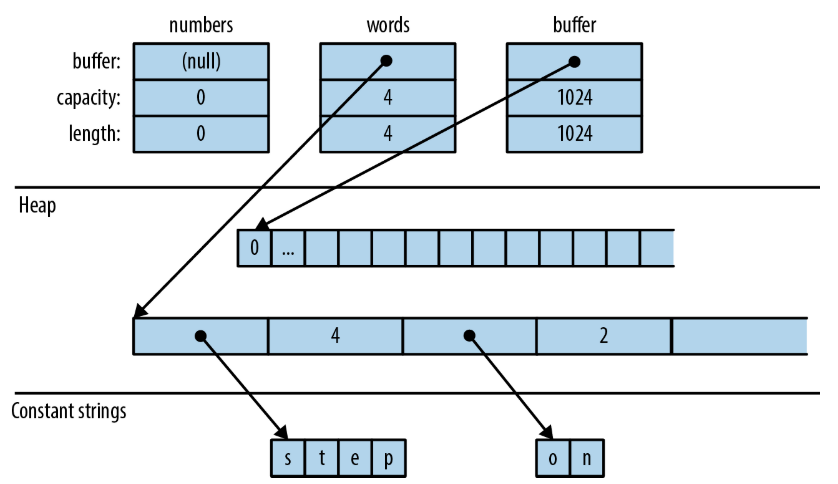

# 集合

 *We all behave like Maxwell’s demon. Organisms organize. In everyday experience lies the reason sober physicists across two centuries kept this cartoon fantasy alive. We sort the mail, build sand castles, solve jigsaw puzzles, separate wheat from chaff, rearrange chess pieces, collect stamps, alphabetize books, create symmetry, compose sonnets and sonatas, and put our rooms in order, and all this we do requires no great energy, as long as we can apply intelligence.*

<p align="right">
    ——James Gleick, The Information: A History, a Theory, a Flood
</p>

Rust标准库里包含几种 *集合(collection)* ，它们是在内存中存储数据的泛型类型。我们已经在本书的很多地方使用过集合，例如`Vec`和`HashMap`。在本章中，我们将详细介绍这两种类型的方法，以及其他六种标准集合。但在我们开始之前，让我们先讨论一下Rust的集合和其他语言中的集合的一些不同之处。

首先，移动和借用无处不在。Rust使用移动来避免深拷贝。这就是为什么`Vec<T>::push(item)`方法以值获取参数，而不是以引用。值会被移动进vector。”第4章”中的图展示了实践中的表现：在Rust中把一个`String`添加到`Vec<String>`中很快，因为Rust不需要拷贝字符串的字符数据，字符串的所有权归属也总是很清楚。

其次，当集合改变大小或者被修改的同时还有指向它们的数据的指针时，Rust不会有无效性错误——即悬垂指针。无效性错误是C++中另一种未定义行为的来源，即使在内存安全的语言中也可能导致`ConcurrentModificationException`。Rust借用检查器会在编译器检查出它们。

最后，Rust没有`null`，因此我们将在其他语言中需要`null`的地方看到`Option`。

除了这些不同之外，Rust的集合可能和你预期的差不多。如果你是经验丰富的程序员并且时间不多，你可以跳过这部分，但不要跳过“条目”。

## 概述

”表16-1”展示了Rust的8种标准集合。它们都是泛型类型。

|   **集合**  |  **说明** |  **C++**  | **Jave** | **Python** |
| --- | --- | --- | --- | --- |
|         `Vec<T>`  |  可增长的数组   |  `vector`  |  `ArrayList`  |  `list`   |
|         `VecDeque<T>`  |  双端队列(可增长环形缓冲区)  |  `deque`  |  `ArrayDeque`  |  `collections.deque`  |
|         `LinkedList<T>`  |  双向链表  |  `list`  |  `LinkedList`  |  ——  |
|         `BinaryHeap<T> where T: Ord`  |  大顶堆  |  `priority_queue`  |  `PriorityQueue`  |  `heapq`  |
|         `HashMap<K, V> where K: Eq + Hash`  |  键值哈希表  |  `unordered_map`  |  `HashMap`  |  `dict`  |
|         `BTreeMap<K, V> where K: Ord`  |  有序键值表  |  `map`  |  `TreeMap`  |  ——  |
|         `HashSet<T> where T: Eq + Hash`  |  基于哈希的无序集合  |  `unordered_set`  |  `HashSet`  |  `set`  |
|         `BTreeSet<T> where T: Ord`  |  有序集合  |  `set`  |  `TreeSet`  |  ——  |

`Vec<T>`、`HashMap<K, V>`、`HashSet<T>`是最常用的集合类型。其他的集合都有适用的场景。这一章将轮流讨论每一个集合类型：

*`Vec<T>`*

&emsp;&emsp;一个可增长的、在堆上分配的、`T`类型值的数组。本章中大约一半的篇幅专门介绍`Vec`和它的常用方法。

*`VecDeque<T>`*

&emsp;&emsp;类似于`Vec<T>`，但是用作先进先出队列会更好。它支持高效地在首部和尾部添加或移除元素，但这种能力的代价是其他操作会稍微慢一点。

*`BinaryHeap<T>`*

&emsp;&emsp;一个优先队列。`BinaryHeap`中的值按照一定结构组织，因此总是可以高效地找到和移除最大值。

*`HashMap<K, V>`*

&emsp;&emsp;一个键值对的表。通过键查找值很快速。表中的条目以任意顺序存储。

*`BTreeMap<K, V>`*

&emsp;&emsp;类似于`HashMap<K, V>`，但按键的顺序保持条目有序。一个`BTreeMap<String, i32>`按照`String`的比较顺序存储条目。除非你需要条目保持有序，否则`HashMap`会更快。

*`HashSet<T>`*

&emsp;&emsp;类型`T`的值的集合。添加和删除元素都很快，查询一个值是否在集合中也很快。

*`BTreeSet<T>`*

&emsp;&emsp;类似于`HashSet<T>`，但保持元素有序。同样，除非你想要数据保持有序，否则`HashSet`会更快。

因为`LinkedList`很少使用（并且在大多数情况下都有更好的替代，无论是性能还是接口），因此我们不会在这里介绍它。

## `Vec<T>`

我们假设你对`Vec`已经有了一定了解，因为我们在本书的很多地方都已经使用过它。简要的介绍见“vector”。这里我们只会描述它的方法以及深入它的内部工作原理。

最简单的创建vector的方式是使用`vec!`宏：
```Rust
    // 创建一个空的vector
    let mut numbers: Vec<i32> = vec![];

    // 用给定的内容创建一个vector
    let words = vec!["step", "on", "no", "pets"];
    let mut buffer = vec![0u8; 1024];   // 1024个0字节
```

正如我们在”第4章”所述，vector有三个字段：长度、容量、和一个指向堆上分配的缓冲区的指针。”图16-1”展示了上面的vector在内存中的视图。空vector `numbers`的初始长度为0。在它添加第一个元素之前不会有堆内存被分配。


<p align="center">图16-1 vector的内存布局：words的每个元素是一个由指针和长度组成的<code>&str</code>值</p>

类似于所有集合，`Vec`实现了`std::iter::FromIterator`，因此你可以对任何迭代器调用`.collect()`方法来创建一个vector，正如“构建集合：`collect`和`FromIterator`”中所述：
```Rust
    // 将一个其他集合转换成vector
    let my_vec = my_set.into_iter().collect::<Vec<String>>();
```

### 访问元素

通过索引访问数组、切片或vector的元素非常直观：
```Rust
    // 获取一个元素的引用
    let first_line = &lines[0];

    // 获取一个元素的拷贝
    let fifth_number = numbers[4];          // 需要Copy
    let second_number = lines[1].clone();   // 需要Clone

    // 获取一个切片的引用
    let my_ref = &buffer[4..12];

    // 获取一个切片的拷贝
    let my_copy = buffer[4..12].to_vec();   // 需要Clone
```

当索引越界时所有这些方式都会panic。

Rust对数字类型很挑剔，vector也不例外。vector的长度和索引都是`usize`类型。尝试使用`u32`、`u64`、`isize`作为vector的索引会导致错误。必要时你可以使用`n as usize`来转换，见“类型转换”。

有几种方法提供了便捷地访问vector或切片的特定元素的方法（注意所有的切片方法都能用于数组和vector）：

*`slice.first()`*

&emsp;&emsp;返回`slice`的第一个元素的引用。返回类型是`Option<&T>`，因此如果`slice`为空时返回值为`None`，不为空时返回值为`Some(&slice[0])`：

```Rust
    if let Some(item) = v.first() {
        println!("We got one! {}", item);
    }
```

*`slice.last()`*

&emsp;&emsp;和上边相似，不过返回最后一个元素的引用。

*`slice.get(index)`*

&emsp;&emsp;返回`slice[index]`的引用，如果存在的话。如果`slice`的元素数量小于`index+1`，那么返回`None`：

```Rust
    let slice = [0, 1, 2, 3];
    assert_eq!(slice.get(2), Some(&2));
    assert_eq!(slice.get(4), None);
```

*`slice.first_mut(), slice.last_mut(), slice.get_mut(index)`*

&emsp;&emsp;与上面的类似，不过借用`mut`引用：

```Rust
    let mut slice = [0, 1, 2, 3];
    {
        let last = slice.last_mut().unwrap();   // 最后一个元素类型：&mut i32
        assert_eq!(*last, 3);
        *last = 100;
    }
```

因为以值返回`T`意味着移动它，因此访问元素的方法通常返回元素的引用。

一个例外是`.to_vec()`方法，它获取拷贝：

*`slice.to_vec()`*

&emsp;&emsp;克隆整个切片，返回一个新的vector：

```Rust
    let v = [1, 2, 3, 4, 5, 6, 7, 8, 9];
    assert_eq!(v.to_vec(),
               vec![1, 2, 3, 4, 5, 6, 7, 8, 9]);
    assert_eq!(v[0..6].to_vec(),
               vec![1, 2, 3, 4, 5, 6]);
```

&emsp;&emsp;只有当元素可以拷贝时这个方法才可用，即`where T: Clone`
。

### 迭代

vector和切片可以以值或者以引用迭代，遵循“`IntoIter`实现”中介绍的模式：

- 迭代`Vec<T>`会产生`T`类型的item。元素被逐个移出vector消耗掉。
- 迭代`&[T; N], &[T], &Vec<T>`——即数组、切片或vector的引用——会产生`&T`类型的item，每一个item指向一个元素，不会移动元素。
- 迭代`&mut [T; N], &mut [T], &mut Vec<T>`产生`&mut T`类型的item。

数组、切片和vector还有`.iter()`和`.iter_mut()`方法（见“`iter`和`iter_mut`方法）创建产生元素的引用的迭代器。

我们将在“切分”中介绍一些更有趣的迭代切片的方法。

### 增长和缩减vector

数组、切片或vector的 *长度(length)* 是它包含的元素的数量：

*`slice.len()`*

&emsp;&emsp;返回一个`slice`的长度，类型为`usize`。

*`slice.is_empty()`*

&emsp;&emsp;当`slice`不包含元素时为真（即`slice.len() == 0`）。

本节剩余的方法都是关于增长和缩减vector。它们不能用于数组和切片，因为这两种类型一旦被创建之后就不能改变大小。

vector的所有元素都存储在一个在堆上分配的连续内存块中。vector的 *容量(capacity)* 是指当前的内存块最多能存储的元素数量。`Vec`通常会替你管理容量，当需要增长时它会自动分配更大的缓冲区并把元素都移动过去。还有一些显式管理容量的方法：

*`Vec::with_capacity(n)`*

&emsp;&emsp;创建一个容量为`n`的新的空vector。

*`vec.capacity()`*

&emsp;&emsp;返回`vec`的容量，类型是`usize`。`vec.capacity() >= vec.len()`总是为真。

*`vec.reserve(n)`*

&emsp;&emsp;保证vector的剩余空间至少还能再存储`n`个或更多元素：即`vec.capacity()`至少是`vec.len() + n`。如果已经有足够的空间，它不做任何事。否则，它会分配一个更大的缓冲区并且把vector的内容移动过去。

*`vec.reserve_exact(n)`*

&emsp;&emsp;类似于`vec.reserve(n)`，但告诉`vec`不要为未来的增长分配额外的空间。调用它之后，`vec.capacity()`等于`vec.len() + n`。

*`vec.shrink_to_fit()`*

&emsp;&emsp;当`vec.capacity()`大于`vec.len()`时尝试释放额外的内存。

`Vec<T>`有很多添加或移除元素的方法，同时改变vector的长度。所有这些方法都以`mut`引用获取`self`参数。

下面这两个方法在vector的末尾添加或移除一个元素：

*`vec.push(value)`*

&emsp;&emsp;把`value`添加到`vec`的末尾。

*`vec.pop()`*

&emsp;&emsp;移除并返回最后一个元素。返回类型是`Option<T>`。当vector已经为空时返回`None`，否则返回`Some(x)`。

注意`.push()`以值而不是以引用获取参数。类似的，`.pop()`返回被弹出的值，而不是引用。本节中剩余的大部分方法也是这样。它们从vector移出或移进值。

这两个方法向vector中添加值或者从vector中移出值：

*`vec.insert(index, value)`*

&emsp;&emsp;在`vec[index]`处插入给定的`value`，把`vec[index..]`中的值都向后移动一个位置来腾出空间。如果`index > vec.len()`会panic。

*`vec.remove(index)`*

&emsp;&emsp;移除并返回`vec[index]`，把`vec[index+1..]`中的值向左移动一个位置来消除缝隙。

`.insert()`和`.remove()`都很慢，因为有很多元素需要移动。

有四个方法可以将vector的长度调整为指定值：

*`vec.resize(new_len, value)`*

&emsp;&emsp;将`vec`的长度设为`new_len`。如果这会增大`vec`的长度，将会用`value`的拷贝填充新空间。元素的类型必须实现了`Clone` trait。

*`vec.resize_with(new_len, closure)`*

&emsp;&emsp;类似于`vec.resize`，但调用闭包来构造每一个新元素。它可以用于元素没有实现`Clone`的vector。

*`vec.truncate(new_len)`*

&emsp;&emsp;将`vec`的长度缩减到`new_len`，丢弃`vec[new_len..]`范围内的所有元素。若`vec.len()`小于等于`new_len`，则什么也不做。

*`vec.clear()`*

&emsp;&emsp;删除`vec`的所有元素。等价于`vec.truncate(0)`。

有四个方法可以一次添加或移除很多元素：

*`vec.extend(iterable)`*

&emsp;&emsp;将`iterable`的所有item按顺序添加到`vec`的末尾。它类似于多值版本的`.push()`。`iterable`参数可以是任何实现了`IntoIterator<Item=T>`。

&emsp;&emsp;这个方法如此有用以至于有一个专门的trait `Extend`，所有的标准集合都实现了它。不幸的是，这导致`rustdoc`将`.extend()`和其他trait的方法放在生成的HTML底部的一堆方法中，因此当你需要它时很难找到它。你必须记住它！更多内容见“`Extend` trait”。

*`vec.split_off(index)`*

&emsp;&emsp;类似于`vec.truncate(index)`，除了它返回一个`Vec<T>`包含`vec`尾部被移除的元素。它类似于`.pop()`的多值版本。

*`vec.append(&mut vec2)`*

&emsp;&emsp;这会把`vec2`的所有元素移动进`vec`，其中`vec2`是另一个`Vec<T>`类型的vector。调用之后，`vec2`变为空。

&emsp;&emsp;这类似于`vec.extend(vec2)`，除了调用之后`vec2`仍然存在，并且容量不变。

*`vec.drain(range)`*

&emsp;&emsp;这会从`vec`中移除范围`vec[range]`，并返回一个迭代被移除元素的迭代器，其中`range`是一个范围值，例如`..`或`0..4`。

还有一些选择性移除vector元素的古怪方法：

*`vec.retain(test)`*

&emsp;&emsp;移除所有没有通过给定测试的方法。`test`参数是一个实现了`FnMut(&T) -> bool`的函数或闭包。对于`vec`的每一个元素，它会调用`test(&element)`，如果返回`false`，元素将会被移出vector然后丢弃。

&emsp;&emsp;不考虑性能的话，这类似于：

```Rust
    vec = vec.into_iter().filter(test).collect();
```

*`vec.dedup()`*

&emsp;&emsp;丢弃相邻的重复元素。它类似于Unix的`uniq` shell工具。它会扫描`vec`中寻找相邻的重复元素，然后丢弃掉多余的重复值，只留下一个：

```Rust
    let mut byte_vec = b"Missssssissippi".to_vec();
    byte_vec.dedup();
    assert_eq!(&byte_vec, b"Misisipi");
```

&emsp;&emsp;注意最后的输出中仍然有两个`'s'`字符。这个方法只移除 *相邻的(adjacent)* 重复值。为了移除所有的重复值，你有三种选择：调用`.dedup()`之前先排序vector，将数据移动到一个“`hashSet<T>`和`BTreeSet<T>`”，或者（为了保持元素原本的顺序）使用这个`.retain()`技巧：

```Rust
    let mut byte_vec = b"Missssssissippi".to_vec();

    let mut seen = HashSet::new();
    byte_vec.retain(|r| seen.insert(*r));

    assert_eq!(&byte_vec, b"Misp");
```

&emsp;&emsp;这段代码的原理是当集合中已经包含要插入的item时`.insert()`会返回`false`。

*`vec.dedup_by(same)`*

&emsp;&emsp;类似于`vec.dedup()`，但它使用函数或者闭包`same(&mut elem1, &mut elem2)`，而不是`==`运算符，来检查两个相邻元素是否被认为相等。

*`vec.dedup_by_key(key)`*

&emsp;&emsp;类似于`vec.dedup()`，但当`key(&mut elem1) == key(&mut elem2)`时它认为两个元素相等。

&emsp;&emsp;例如，如果`errors`是一个`Vec<Box<dyn Error>>`，你可以写：

```Rust
    // 移除消息重复的错误。
    errors.dedup_by_key(|err| err.to_string());
```

这一节介绍的所有方法中，只有`.resize()`可能会拷贝值。其他的通过移动值来工作。

### 连接

两个方法可以用于 *数组的数组(array of array)* ，即元素类型是数组、切片、vector的数组、切片、vector：

*`slices.concat()`*

&emsp;&emsp;返回一个所有切片连接成的vector：

```Rust
    assert_eq!([[1, 2], [3, 4], [5, 6]].concat(),
               vec![1, 2, 3, 4, 5, 6]);
```

*`slices.join(&separator)`*

&emsp;&emsp;同上，除了会在切片之间插入`separator`的拷贝：

```Rust
    assert_eq!([[1, 2], [3, 4], [5, 6]].join(&0),
               vec![1, 2, 0, 3, 4, 0, 5, 6]);
```

### 切分

很容易一次获得数组、切片、vector中的很多元素的非`mut`引用：
```Rust
    let v = vec![0, 1, 2, 3];
    let a = &v[i];
    let b = &v[j];

    let mid = v.len() / 2;
    let front_half = &v[..mid];
    let back_half = &v[mid..];
```

但一次获得多个`mut`引用不是这么容易：
```Rust
    let mut v = vec![0, 1, 2, 3];
    let a = &mut v[i];
    let b = &mut v[j];  // error: 不能同时借用`v`的
                        // 多个可变引用。

    *a = 6;             // 引用`a`和`b`在这里使用了，
    *b = 7;             // 因此它们的生命周期一定会重叠。
```

Rust禁止这样，因为如果`i == j`，那么`a`和`b`将是同一个整数的两个`mut`引用，这违背了Rust的安全性的规则。（见“共享vs可变”）。

Rust有几个方法可以一次借用数组、切片、vector的两个或更多元素的`mut`引用。和上面的代码不同，这些方法是安全的，因为它们从设计上保证了只会把数组分割成 *非重叠(nonoverlapping)区域* 。这些方法也可以用于非`mut`切片，因此它们有`mut`和非`mut`版本。

”图16-2”展示了这些方法。


<p align="center">图16-2 分割方法展示（注意：<code>slice.split()</code>输出中的小矩形是空的切片，因为两侧都是分隔符，<code>rsplitn</code>的输出是按照从后往前的顺序，这一点和其他的不同）。</p>

这些方法中没有一个会直接修改数组、切片或vector，它们都返回部分数据的引用：

*`slice.iter(), slice.iter_mut()`*

&emsp;&emsp;产生`slice`的每个元素的引用。我们在“迭代”中已经介绍过它们。

*`slice.split_at(index), slice.split_at_mut(index)`*

&emsp;&emsp;把切片分成两半，返回一个pair。`slice.split_at(index)`等价于`(&slice[..index], &slice[index..])`。如果`index`越界会panic。

*`slice.split_first(), slice.split_first_mut()`*

&emsp;&emsp;返回一个pair：第一个元素的引用(`slice[0]`)和其余所有元素的切片(`slice[1..]`)。

&emsp;&emsp;`.spilt_first()`的返回值类型是`Option<(&T, &[T])>`；如果`slice`为空，返回`None`。

*`slice.split_last(), slice.split_last_mut()`*

&emsp;&emsp;类似上一个，不过划分出最后一个元素而不是第一个。

&emsp;&emsp;`.split_last()`的返回类型也是`Option<(&T, &[T])>`。

*`slice.split(is_sep), slice.split_mut(is_sep)`*

&emsp;&emsp;将`slice`切分成一个或更多子切片，使用函数或闭包`is_sep`来判断在哪里切分。它们返回一个迭代子切片的迭代器。

&emsp;&emsp;当消耗迭代器时，它们会对切片中的每个元素调用`is_sep(&element)`。如果返回`true`，那么这个元素就是一个分隔符。分隔符不包含在任何输出的字切片中。

&emsp;&emsp;输出总是包含至少一个子切片，每有一个分隔符就加一个子切片。如果有相邻的分隔符或者`slice`的两端是分隔符都会产生空的子切片。

*`slice.rsplit(is_sep), slice.rsplit_mut(is_sep)`*

&emsp;&emsp;类似于`slice`和`slice_mut`，但从最后一个切片开始。

*`slice.splitn(n, is_sep), slice.splitn_mut(n, is_sep)`*

&emsp;&emsp;类似上面的方法，不过最多产生`n`个子切片。当发现了前`n-1`个切片之后就不会再调用`is_sep`。最后一个子切片将包含剩余的所有元素。

*`slice.rsplitn(n, is_sep), slice.rsplitn_mut(n, is_sep)`*

&emsp;&emsp;类似于`.splitn()`和`.splitn_mut()`，除了反向扫描切片。就是说，这个方法会在切片中 *最后* `n-1`个分隔符处切分，而不是前`n-1`个，并且从尾部开始产生子切片。

*`slice.chunks(n), slice.chunks_mut(n)`*

&emsp;&emsp;返回一个产生长度为`n`的非重叠子切片的迭代器。如果`n`不能整除`slice.len()`，最后一个块的元素数量将小于`n`。

*`slice.rchunks(n), slick.rchunks_mut(n)`*

&emsp;&emsp;类似于`slice.chunks()`和`slice.chunks_mut()`，但是从切片的尾部开始。

*`slice.chunks_exact(n), slice.chunks_exact_mut(n)`*

&emsp;&emsp;返回一个产生长度为`n`的非重叠子切片的迭代器。如果`n`不能整除`slice.len()`，最后一个块(元素数量小于`n`)可以通过结果的`remainder()`方法获得。

*`slice.rchunks_exact(n), slice.rchunks_exact_mut(n)`*

&emsp;&emsp;类似于`slice.chunks_exact`和`slice.chunks_exact_mut`，但从切片的尾部开始。

还有一些其他迭代子切片的方法：

*`slice.windows(n)`*

&emsp;&emsp;返回一个效果类似于“滑动窗口”的迭代器。它产生`slice`中相邻的`n`个元素的子切片。第一个产生的值是`&slice[0..n]`，第二个是`&slice[1..n+1]`，以此类推。

&emsp;&emsp;如果`n`大于`slice`的长度，将不会产生切片。如果`n`是0，这个方法会panic。

&emsp;&emsp;例如，如果`days.len() == 31`，那么我们可以调用`days.windows(7)`产生`days`中所有7天的区间。

&emsp;&emsp;在探索数据列的变化趋势时一个大小为2的滑动窗口会很有用：

```Rust
    let changes = daily_high_temperatures
                      .windows(2)           // 获得相邻天的温度
                      .map(|w| w[1] - w[0]) // 温度改变了多少
                      .collect::<Vec<_>>();
```

&emsp;&emsp;因为子切片是重叠的，所以这个方法没有返回`mut`引用的版本。

### 交换

有一些交换切片内容的便捷方法：

*`slice.swap(i, j)`*

&emsp;&emsp;交换元素`slice[i]`和`slice[j]`。

*`slice_a.swap(&mut slice_b)`*

&emsp;&emsp;交换`slice_a`和`slice_b`的全部内容。`slice_a`和`slice_b`长度必须相同。

vector有一个高效地移除任何元素的方法：

*`vec.swap_remove(i)`*

&emsp;&emsp;移除并返回`vec[i]`。这类似于`vec.remove(i)`，除了它不是把剩余的元素往前移动来消除间隙，而是把`vec`的最后一个元素移动到间隙。当你不关心vector中元素的顺序时这很有用。

### 排序和搜索

切片提供了三个用于排序的方法：

*`slice.sort()`*

&emsp;&emsp;按增序排序元素。只有当元素类型实现了`Ord`，这个方法才可用。

*`slice.sort_by(cmp)`*

&emsp;&emsp;使用函数或闭包`cmp`指定顺序来排序`slice`的元素。`cmp`必须实现了`Fn(&T, &T) -> std::cmp::Ordering`。

&emsp;&emsp;手动实现`cmp`很麻烦，除非你用`.cmp`方法：

```Rust
    students.sort_by(|a, b| a.last_name.cmp(&b.last_name));
```

&emsp;&emsp;如果要先比较一个字段，再比较第二个字段，可以直接比较元组：

```Rust
    students.sort_by(|a, b| {
        let a_key = (&a.last_name, &a.first_name);
        let b_key = (&b.last_name, &b.first_name);
        a_key.cmp(&b_key)
    });
```

*`slice.sort_by_key(key)`*

&emsp;&emsp;以给定的函数或闭包`key`作为排序键将`slice`的元素按照增序排序。`key`的类型必须实现了`Fn(&T) -> K where K: Ord`
。

&emsp;&emsp;当`T`包含一个或更多有序字段时这很有用，因为它可以按照多种方式排序：

```Rust
    // 按照平均绩点排序，低的靠前
    students.sort_by_key(|s| s.grade_point_average());
```

&emsp;&emsp;注意这些排序键在排序过程中并不会被缓存，因此`key`函数可能会被调用超过`n`次。

&emsp;&emsp;出于技术上的原因，`key(element)`不能返回任何从元素借用的引用。这样不能工作：

```Rust
    students.sort_by_key(|s| &s.last_name); // 错误：无法推断生命周期
```

&emsp;&emsp;Rust无法查明生命周期。但在这种情况下，可以调用`.sort_by()`作为替代。

这三种方法都是稳定性排序。

为了实现反向排序，你可以使用`sort_by`，然后在`cmp`闭包中交换两个参数。将参数写为`|b, a|`而不是`|a, b|`可以高效地产生相反的顺序。或者你可以在排序之后调用`.reverse()`方法：

*`slice.reverse()`*

&emsp;&emsp;反转一个切片。

一旦一个切片被排过序，它就可以被高效地搜索：

*`slice.binary_search(&value), slice.binary_search_by(&value, cmp), slice.binary_search_by_key(&value, key)`*

&emsp;&emsp;这些方法都在有序的`slice`中搜索`value`。注意`value`是以引用传递。

&emsp;&emsp;它们的返回类型都是`Result<usize, usize>`。如果`slice[index]`在指定的排序顺序下等于`value`它们会返回`Ok(index)`。如果没有这样的元素会返回`Err(insertion_point)`，在`insertion_point`处插入`value`将保持有序。

当然，二分搜索只在切片在指定的顺序下有序时才能工作。否则，结果将是任意值——garbage in, garbage out。

因为`f32`和`f64`有NaN值，它们没有实现`Ord`，因此不能被直接用作排序或二分搜索的键。为了得到可以用于浮点数的类似方法，使用`ord_subset` crate。

还有一个在无序vector中搜索元素的方法：

*`slice.contains(&value)`*

&emsp;&emsp;如果`slice`中有任何一个元素等于`value`则返回`true`。它简单地检查切片的每个元素，直到找到要查找的值。另外，`value`也是以引用传递。

为了查找一个切片中某一个值的位置，类似于JavaScript中的`array.indexOf(value)`，使用迭代器：
```Rust
    slice.iter().position(|x| *x == value)
```
这会返回`Option<usize>`。

### 比较切片

如果类型`T`支持`==`和`!=`运算符（`PartialEq` trait，见“相等性比较”），那么数组`[T; N]`、切片`[T]`、vector `Vec<T>`也支持这些运算符。当两个切片的长度和相应的元素都相等时两个切片才相等。数组和vector也是一样。

如果`T`支持运算符`<`、`<=`、`>`、`>=`（`PartialOrd` trait，见“顺序性比较”），那么`T`的数组、切片和vector也支持。切片的比较按照字典序进行。

有两个便捷的方法进行常用的切片比较：

*`slice.starts_with(other)`*

&emsp;&emsp;如果`slice`起始的值序列等于`other`的元素则返回`true`：

```Rust
    assert_eq!([1, 2, 3, 4].starts_with(&[1, 2]), true);
    assert_eq!([1, 2, 3, 4].starts_with(&[2, 3]), false);
```

*`slice.ends_with(other)`*

&emsp;&emsp;和上边类似但检查`slice`的末尾：

```Rust
    assert_eq!([1, 2, 3, 4].ends_with(&[3, 4]), true);
```

### 随机元素

Rust的标准库中并不包含随机数。`rand` crate提供了它们，还提供了两个方法从数组、切片、vector中获取随机元素：

*`slice.choose(&mut rng)`*

&emsp;&emsp;返回切片中随机一个元素的引用。类似于`slice.first()`和`slice.last()`，除了它返回一个`Option<&T>`，如果切片为空，返回值为`None`。

*`slice.shuffle(&mut rng)`*

&emsp;&emsp;随机打乱切片中的元素的顺序。切片必须以`mut`引用传递。

这些是`rand::Rng` trait的方法，因此为了调用它们你需要一个`Rng`，它是一个随机数生成器。幸运的是，可以调用`rand::thread_rng()`来获得一个。要想打乱vector `my_vec`，你可以写：
```Rust
    use rand::seq::SliceRandom;
    use rand::thread_rng;

    my_vec.shuffle(&mut thread_rng());
```

### Rust排除了无效性错误

大多数主流编程语言都有集合和迭代器，而且都有这个规则的变体：不要在遍历集合的同时修改它。例如，Python中vecotr等价的是list：
```Rust
    my_list = [1, 3, 5, 7, 9]
```

假设我们想移除`my_list`中大于4的元素；
```python
    for index, val in enumerate(my_list):
        if val > 4:
            del my_list[index]  # bug: 在迭代的同时修改

    print(my_list)
```
（Python中的`enumerate`函数等价于Rust中的`.enumerate()`方法，见“`enumerate`”。）

这个程序令人惊讶地打印出`[1, 3, 7]`。但7比4大，为什么它没被移除？这就是无效性错误：程序在迭代数据的同时修改它，将迭代器 *无效化(invalidate)* 。在Java中，结果可能是一个异常；在C++中是未定义行为。而在Python中，这个行为是有定义的，虽然不太直观：
迭代器会跳过一个元素。`val`永远不会是`7`。

让我们尝试在Rust中复现这个bug：
```Rust
    fn main() {
        let mut my_vec = vec![1, 3, 5, 7, 9];

        for (index, &val) in my_vec.iter().enumerate() {
            if val > 4 {
                my_vec.remove(index);   // error: can't borrow `my_vec` as mutable
            }
        }
        println!("{:?}", my_vec);
    }
```

Rust自然会在编译期拒绝这个程序。当我们调用`my_vec.iter()`时，它借用了vector的一个共享（非`mut`）引用。引用的生命周期和迭代器一样长，也就是直到`for`循环的结尾。我们不能在有非`mut`引用存在时调用`my_vec.remove(index)`修改vector。

编译器能指出这个错误非常好，但当然，你仍然需要一种方法来得到期望的行为！这里最简单的修复方法是：
```Rust
    my_vec.retain(|&val| val <= 4);
```

或者，你可以采用在Python或其他任何语言中也可以实现的方法：使用`filter`来创建一个新的vector。

## `VecDeque<T>`

`Vec`只支持在尾部高效地添加和删除元素。当一个程序需要存储“排队”的值时，`Vec`会变得很慢。

Rust的集合`std::collections::VecDeque<T>`是一个 *双端队列(deque)* （读作“deck”）。它支持在头部和尾部高效地添加和移除元素：

*`deque.push_front(value)`*

&emsp;&emsp;在队列的头部添加一个值。

*`deque.push_back(value)`*

&emsp;&emsp;在尾部添加一个值。（这个方法比`.push_front()`用得更多，因为队列的通常用法是从尾部添加并从头部移除，就像人在排队一样。）

*`deque.pop_front()`*

&emsp;&emsp;移除并返回队列头部的值，返回`Option<T>`，如果队列为空则返回`None`，类似于`vec.pop()`。

*`deque.pop_back()`*

&emsp;&emsp;移除并返回尾部的元素，同样返回`Option<T>`。

*`deque.front(), deque.back()`*

&emsp;&emsp;类似于`vec.first()`和`vec.last()`。它们返回队列中头部或者尾部元素的引用。返回类型是`Option<&T>`，当队列为空时返回`None`。

*`deque.front_mut(), deque.back_mut()`*

&emsp;&emsp;类似于`vec.first_mut()`和`vec.last_mut()`，返回`Option<&mut T>`
。

`VecDeque`的实现是一个环形缓冲区，如”图16-3”所示。


<p align="center">图16-3 <code>VecDeque</code>在内存中如何存储</p>

类似于`Vec`，它有一个堆上分配的缓冲区用来存储元素。和`Vec`不同的是，数据并不总是从区域的起点开始存储，并且可以在结尾处“回环”。图中这个队列的元素，按顺序分别是`['A', 'B', 'C', 'D', 'E']`。`VecDeque`有私有的字段标记图中的`start`和`stop`，用来记录缓冲区中数据的起点和终点。

向队列首部或者尾部添加值，意味着要占用一个未使用的位置（图中颜色较深的块），如果需要的话可能会回环或者分配更大的内存块。

`VecDeque`负责管理回环，因此你不需要考虑它。”图16-3”是Rust保证`.pop_front()`速度很快的幕后视图。

很多时候，当你需要双端队列的时候，你可能只需要`.push_back()`和`.pop_front()`两个方法。类型关联函数`VecDeque::new()`和`VecDeque::with_capacity(n)`用于创建队列，类似于`Vec`的相应函数。很多`Vec`的方法在`VecDeque`中都有实现：`.len(), .is_empty(), .insert(index, value), .remove(index), .extend(iterable)`，等等。

双端队列和vector一样可以以值、以共享引用或者以`mut`引用迭代。它们都有三个迭代器方法`.into_iter(), .iter(), .iter_mut()`。它可以用通常的方式索引：`deque[index]`。

因为双端队列在内存中并不是连续存储元素，因此它不能继承切片的方法。但如果你愿意承受移动元素的开销，`VecDeque`提供了一个方法来修复它：

*`deque.make_contiguous()`*

&emsp;&emsp;以`&mut self`为参数，把`VecDeque`重新排布到连续的内存中，返回`&mut [T]`。

`Vec`和`VecDeque`高度相关，标准库提供了两个trait实现来轻松地互相转换：

*`Vec::from(deque)`*

&emsp;&emsp;`Vec<T>`实现了`From<VecDeque<T>>`，因此这会把一个双端队列变成一个vector。这会消耗O(n)时间，因为它可能要重新排布元素。

*`VecDeque::from(vec)`*

&emsp;&emsp;`VecDeque<T>`实现了`From<Vec<T>>`，因此这会把一个vector转换成一个双端队列。这也是O(n)复杂度，但它通常会很快，即使vector很大，因为vector的堆缓冲区可以简单地移动到新的双端队列中。

&emsp;&emsp;它可以让我们简单地用指定元素创建一个双端队列，即使没有标准的`vec_deque![]`宏：

```Rust
    use std::collections::VecDeque;

    let v = VecDeque::from(vec![1, 2, 3, 4]);
```

## `BinaryHeap<T>`

`BinaryHeap<T>`集合始终以某种形式组织元素，其中最大的元素总是会被移动到队列的首部。这里是`BinaryHeap`最常用的几个方法：

*`heap.push(value)`*

&emsp;&emsp;向堆中添加一个元素

*`heap.pop()`*

&emsp;&emsp;移除并返回堆中最大的值。它返回`Option<T>`，如果堆为空时返回`None`。

*`heap.peek()`*

&emsp;&emsp;返回堆中最大的值的引用。返回类型是`Option<&T>`。

*`heap.peek_mut()`*

&emsp;&emsp;返回一个`PeekMut<T>`，它可以用作堆中最大值的一个可变引用，并提供类型关联函数`pop()`来从堆中弹出这个值。使用这个方法，我们可以根据最大的元素的值来决定要不要从堆中弹出这个元素：

```Rust
    use std::collections::binary_heap::PeekMut;

    if let Some(top) = heap.peek_mut() {
        if *top > 10 {
            PeekMut::pop(top);
        }
    }
```

`BinaryHeap`支持`Vec`的方法的一个子集，包括`BinaryHeap::new(), .len(), .is_empty(), .capacity(), .clear(), .append(&mut heap2)。`

例如，假设我们用一些数字填充一个`BinaryHeap`：
```Rust
    use std::collections::BinaryHeap;

    let mut heap = BinaryHeap::from(vec![2, 3, 8, 6, 9, 5, 4]);
```

值`9`在堆的顶部：
```Rust
    assert_eq!(heap.peek(), Some(&9));
    assert_eq!(heap.pop(), Some(9));
```

移除`9`也会重新排布其他元素，把`8`移动到头部，等等：
```Rust
    assert_eq!(heap.pop(), Some(8));
    assert_eq!(heap.pop(), Some(6));
    assert_eq!(heap.pop(), Some(5));
    ...
```

当然，`BinaryHeap`并不仅限于数字。它可以包含任何实现了内建的`Ord` trait的类型。

这让`BinaryHeap`可以用作一个工作队列。你可以定义一个任务结构体，然后根据任务的优先级实现`Ord`，让高优先级的任务大于低优先级的任务。然后，创建一个`BinaryHeap`来保存所有待办的任务。它的`.pop()`方法将总是返回最重要的任务。

注意：`BinaryHeap`是可迭代的对象，并且它有`.iter()`方法，但这个迭代器以任意顺序产生堆中的元素，而不是按照从大到小的顺序。为了按照大小顺序消耗`BinaryHeap`中的值，可以使用`while`循环：
```Rust
    while let Some(task) = heap.pop() {
        handle(task);
    }
```

## `HashMap<K, V>`和`BTreeMap<K, V>`

 *map(映射)* 是键值对（称为 *条目(entry)* ）的集合。任何两个条目的键都不同，所有的条目按照一定结构组织，如果有一个键就可以高效地在map中查找到相应的值。简而言之，map是一个查找表。

Rust提供两者两种map类型：`HashMap<K, V>`和`BTreeMap<K, V>`。这两种类型共享了很多相同的方法；不同之处在于它们组织条目的方式。

`HashMap`把键和值都存储在哈希表中，因此它要求键的类型`K`实现了`Hash`和`Eq`，这两个trait分别用于哈希和相等性比较。

”图16-4”展示了`HashMap`如何在内存中排布。深色区域表示没有使用。所有的键、值和缓存的哈希值都被存储在单个堆上分配的表中。添加条目最终会迫使`HashMap`分配更大的表，并把所有数据移动进去。


<p align="center">图16-4 <code>HashMap</code>的内存布局</p>

`BTreeMap`按照键的顺序在树形结构中存储条目，因此它要求键的类型`K`实现了`Ord`。”图16-5”展示了一个`BTreeMap`。同样，深色区域表示没有被使用的空间。


<p align="center">图16-5 <code>BTreeMap</code>的内存布局</p>

`BTreeMap`把条目存储在 *节点(node)* 中。一个`BTreeMap`中大多数的节点都只包含键值对。而非叶节点，例如图中所示的根节点，还需要存储指向子节点的指针。`(20, 'q')`和`(30, 'r')`之间的指针指向包含`20`和`30`之间的键的子节点。添加条目通常需要把某个节点的部分现有条目向右移动，来保持它们有序，有时还需要分配新的节点。

图中的示例经过简化来适应页面。例如，实际的`BTreeMap`节点有11个条目的空间，而不是`4`个。

Rust标准库使用B树而不是二叉平衡树，因为在现代硬件上B树更快。查找时二叉树可能比B树的比较次数更少，但在B树中查找有更好的 *局部性(locality)* ——即，内存被成组访问，而不是扫描整个堆。这让CPU缓存的命中率更高，这能显著地提高速度。

这里有几种创建map的方法：

*`HashMap::new(), BTreeMap::new()`*

&emsp;&emsp;创建新的空map。

*`iter.collect()`*

&emsp;&emsp;从键值对创建并填充新的`HashMap`或`BTreeMap`。`iter`必须是一个`Iterator<Item=(K, V)>`。

*`HashMap::with_capacity(n)`*

&emsp;&emsp;创建一个新的空哈希表，并分配至少能存储`n`个条目的空间。`HashMap`和vector一样把数据存储在单个堆上的内存中，因此它也有容量以及相关的方法`hash_map.capacity(), \texttt{hash_map.reserve(additional)`, hash_map.shrink_to_fit()}。`BTreeMap`则没有。

`HashMap`和`BTreeMap`有相同的处理键和值的核心方法：

*`map.len()`*

&emsp;&emsp;返回条目的数量。

*`map.is_empty()`*

&emsp;&emsp;返回`map`里是否没有条目

*`map.contains_key(&key)`*

&emsp;&emsp;如果`map`里有给定`key`的条目则返回`true`。

*`map.get(&key)`*

&emsp;&emsp;在`map`中查找给定`key`的条目。如果找到了匹配的条目，就返回`Some(r)`，其中`r`是相应的值的引用。否则返回`None`。

*`map.get_mut(&key)`*

&emsp;&emsp;与上面类似，但返回值的`mut`引用。

&emsp;&emsp;一般来讲，map让你可以获取值的`mut`访问能力，但不能获取键的`mut`访问。值属于你，你可以随意修改它。但键术语map本身，它需要保证键不会改变，因为条目按照键来组织。原地修改键将会导致bug。

*`map.insert(key, value)`*

&emsp;&emsp;向`map`中插入条目`(key, value)`，并返回旧的值（如果有的话）。返回类型是`Option<V>`，如果map中已经有了`key`的条目，那么新插入的`value`会覆盖旧值。

*`map.extend(iterable)`*

&emsp;&emsp;迭代`iterable`中的`(K, V)` item，并把每一个键值对插入`map`。

*`map.append(&mut map2)`*

&emsp;&emsp;把`map2`中的所有条目移动到`map`中。完成之后，`map2`变为空。

*`map.remove(&key)`*

&emsp;&emsp;查找并移除`map`中给定的`key`的条目，返回被移除的值（如果有的话）。返回类型是`Option<V>`。

*`map.remove_entry(&key)`*

&emsp;&emsp;查找并移除`map`中给定的`key`的条目，返回被移除的键和值（如果有的话）。返回类型是`Option<(K, V)>`。

*`map.retain(test)`*

&emsp;&emsp;移除所有未通过测试的元素。参数`test`参数是一个实现了`FnMut(&K, &mut V) -> bool`的函数或者闭包。它会对`map`中的每一个元素调用`test(&key, &mut value)`，如果返回`false`，就移除掉这个元素并丢弃。

&emsp;&emsp;不考虑性能的话，这类似于如下写法：

```Rust
    map = map.into_iter().filter(test).collect();
```

*`map.clear()`*

&emsp;&emsp;移除所有元素。

map可以使用方括号`map[&key]`进行查询。这是因为map实现了内建的`Index` trait。然而，如果没有给定的`key`的条目存在，这会panic，就类似越界访问数组一样。因此只有当你确定要查找的条目在map中时再使用这个语法。

`.contains_key(), .get(), .get_mut(), .remove()`方法的`key`参数的类型不一定要是精确的`&K`。这些方法都是泛型方法，只要能从`K`类型借用参数的类型的引用即可。假设`fish_map`是一个`HashMap<String, Fish>`，那么即使`"conger"`并不是`String`，我们也可以调用`fish_map.contains_key("conger")`，。因为`String`实现了`Borrow<&str>`，所以可以从`String`借用一个`&str`。详情见“`Borrow`与`BorrowMut`”。

因为一个`BTreeMap<K, V>`按照键的顺序保存条目，所以它支持一个附加的操作：

*`btree_map.split_off(&key)`*

&emsp;&emsp;把`btree_map`分割成两个。键小于`key`的条目被留在`btree_map`中，返回一个包含其余条目的新`BTreeMap<K, V>`。

### 条目

`HashMap`和`BTreeMap`都有相应的`Entry`类型。这个类型的意义是避免重复的查找。例如，这里有一些代码获取或者创建一个学生的记录：
```Rust
    // 我们已经有了这名学生的记录了吗？
    if !student_map.contains_key(name) {
        // 没有：创建一条记录
        student_map.insert(name.to_string(), Student::new());
    }
    // 现在确定这条记录肯定存在了。
    let record = student_map.get_mut(name).unwrap();
    ...
```

这可以正常工作，但它访问了`student_map`两次或者三次，每次都做相同的查找。

条目的思路是我们只查找一次，产生一个`Entry`值，然后后续的操作都通过它进行。下面的单行代码等于上面的所有代码，除了它只查找一次：
```Rust
    let record = student_map.entry(name.to_string()).or_insert_with(Student::new);
```

`student_map.entry(name.to_string())`返回的`Entry`值就像一个可变引用，它指向map中一个已经被键值对 *占据(occupied)* 的位置，或者是 *空的(vacant)* ，意思是还没有条目占据这个位置。如果为空，条目的`.or_insert_with()`方法会插入一个新的`Student`。条目的大多数使用都类似这样：简短而方便。

所有的`Entry`值都只能用同一个方法创建：

*`map.entry(key)`*

&emsp;&emsp;对给定的`key`返回一个`Entry`。如果map中没有这个key，它会返回一个空的`Entry`。

&emsp;&emsp;这个方法以`mut`引用获取`self`参数，并返回一个生命周期相同的`Entry`：

```Rust
    pub fn entry<'a>(&'a mut self, key: K) -> Entry<'a, K, V>
```

&emsp;&emsp;`Entry`类型有一个生命周期参数`'a`，因为它是map的一种`mut`借用。只要`Entry`存在，它就有map的独占访问权限。

&emsp;&emsp;回顾“包含引用的结构体”，我们看到过如何在一个类型中存储引用以及这样对生命周期的影响。现在我们从用户的视角看看它是什么样的。也正是`Entry`的情况。

&emsp;&emsp;不幸的是，如果map的键的类型为`String`，那么不能向这个方法传递`&str`类型的参数。这种情况下的`.entry()`方法需要一个真实的`String`。

`Entry`值提供了三个处理空条目的方法：

*`map.entry(key).or_insert(value)`*

&emsp;&emsp;确保`map`包含给定的`key`的条目，如果需要的话用给定的`value`插入一个新的条目。它返回新插入的或者现有的值的`mut`引用。

&emsp;&emsp;假设我们需要计数投票。我们可以写：

```Rust
    let mut vote_counts: HashMap<String, usize> = HashMap::new();
    for name in ballots {
        let count = vote_counts.entry(name).or_insert(0);
        *count += 1;
    }
```

&emsp;&emsp;`.or_insert()`返回一个可变引用，因此`count`的类型是`&mut usize`。

*`map.entry(key).or_default()`*

&emsp;&emsp;确保`map`包含给定的`key`的条目，如果需要的话用`Default::default()`返回的值插入一个新条目。只有当值的类型实现了`Default`时这个方法才能工作。类似于`or_insert`，这个方法返回新插入的或者现有的值的`mut`引用。

*`map.entry(key).or_insert_with(default_fn)`*

&emsp;&emsp;这个方法也一样，除了当它需要创建新的条目时，它会调用`default_fn()`来产生默认值。如果`map`中已经有了`key`的条目，那么`default_fn`将不会被调用。

&emsp;&emsp;假设我们想知道哪个单词在哪个文件中出现。我们可以写：

```Rust
    // 这个map中包含每个单词和出现它的文件的集合。
    let mut word_occurrence: HashMap<String, HashSet<String>> = HashMap::new();
    for file in files {
        for word in read_words(file)? {
            let set = word_occurrence
                .entry(word)
                .or_insert_with(HashSet::new);
            set.insert(file.clone());
        }
    }
```

`Entry`还提供了一个只修改现存条目的便捷方法。

*`map.entry(key).and_modify(closure)`*

&emsp;&emsp;如果给定的`key`的条目存在就调用`closure`，把值的可变引用传进闭包。它返回一个`Entry`，因此它可以和其它方法链式调用。

&emsp;&emsp;例如，我们可以使用它来统计一个字符串中每个单词出现的次数：

```Rust
    // 这个map包含给定字符串中的所有单词，
    // 以及它们出现的次数。
    let mut word_frequency: HashMap<&str, u32> = HashMap::new();
    for c in text.split_whitespace() {
        word_frequency.entry(c)
            .and_modify(|count| *count += 1)
            .or_insert(1);
    }
```

`Entry`类型是一个枚举，`HashMap`的`Entry`定义类似于这样（`BTreeMap`的`Entry`类似）：
```Rust
    // (in std::collections::hash_map)
    pub enum Entry<'a, K, V> {
        Occupied(OccupiedEntry<'a, K, V>),
        Vacant(VacantEntry<'a, K, V>)
    }
```

`OccupiedEntry`和`VacantEntry`类型的方法用于在不需要重复查找的情况下插入、移除和访问条目。你可以在在线文档中找到它们。偶尔可以使用这些附加的方法来减少一次或两次查找，但`.or_insert()`和`.or_insert_with()`就能覆盖大多数的情况。

### 迭代map

有几种迭代map的方法：

- 以值迭代(`for (k, v) in map`)，产生`(K, V)`对。这会消耗掉map。
- 迭代共享引用(`for (k, v) in &map`)，产生`(&K, &V)对`。
- 迭代可变引用(`for (k, v) in &mut`)，产生`(&K, &mut V)`对。（再提醒一次，没有获取map中键的`mut`访问的方法，因为条目是按照键来组织的。

类似于vector，map有`.iter()`和`.iter_mut()`方法返回以引用迭代的迭代器，就类似于迭代`&map`或者`&mut map`。另外：

*`map.keys()`*

&emsp;&emsp;返回一个只迭代键的迭代器，以引用的形式返回。

*`map.values()`*

&emsp;&emsp;返回一个只迭代值的迭代器，以引用的形式返回。

*`map.values_mut()`*

&emsp;&emsp;返回一个只迭代值的迭代器，以`mut`引用的形式返回。

所有的`HashMap`迭代器都会以任意顺序访问map的条目。`BTreeMap`的迭代器会按照键的顺序访问它们。

## `HashSet<T>`和`BTreeSet<T>`

 *set* 是值的集合，它可以快速地测试元素：
```Rust
    let b1 = large_vector.contains(&"needle");      // 很慢，检查每一个元素
    let b2 = large_hash_set.contains(&"needle");    // 很快，哈希查找
```

一个set绝不会包含同一个值的多个拷贝。

map和set有不同的方法，但其实一个set就是一个只有键而不是键值对的map。事实上，Rust的`HashSet<T>`和`BTreeSet<T>`被实现为`HashMap<T, ()>`和`BTreeMap<T, ()>`的包装。

*`HashSet::new(), BTreeSet::new()`*

&emsp;&emsp;创建新的set。

*`iter.collect()`*

&emsp;&emsp;可以用于从任何迭代器创建set。如果`iter`产生某个值不止一次，那么重复的值将会被丢弃。

*`HashSet::with_capacity(n)`*

&emsp;&emsp;创建一个空的`HashSet`，有至少能存储`n`个元素的空间。

`HashSet<T>`和`BTreeSet<T>`有相同的公共基础方法：

*`set.len()`*

&emsp;&emsp;返回set中值的数量。

*`set.is_empty()`*

&emsp;&emsp;如果set不包含任何元素则返回`true`。

*`set.contains(&value)`*

&emsp;&emsp;如果set包含给定的`value`则返回`true`。

*`set.insert(value)`*

&emsp;&emsp;向set中添加一个`value`。如果添加了值则返回`true`，如果set中已经有这个值了则返回`false`。

*`set.remove(&value)`*

&emsp;&emsp;从set中删除`value`。如果有值被删除则返回`true`，如果没有这个值则返回`false`。

*`set.retain(test)`*

&emsp;&emsp;删除没有通过测试的元素。`test`参数是一个实现了`FnMut(&T) -> bool`的函数或者闭包。对于`set`的每一个元素，都会调用`test(&value)`，如果返回`false`，这个元素就会从set中删除，并且被丢弃。

&emsp;&emsp;不考虑性能的话，这类似于：

```Rust
    set = set.into_iter().filter(test).collect();
```

和map一样，通过引用查找值的方法接受任何可以从`T`借用的类型。细节见“`Borrow`与`BorrowMut`”。

### 迭代set

有两种迭代set的方法:

- 以值迭代(`for v in set`)产生set的成员(并消耗这个set)。
- 以共享引用迭代(`for v in &set`)产生set中成员的共享引用。

不支持以`mut`引用迭代set。没有方法获取set中值的`mut`引用。

*`set.iter()`*

&emsp;&emsp;返回一个以共享引用方式迭代`set`的迭代器。

`HashSet`迭代器类似于`HashMap`的迭代器，也会以任意顺序产生值。`BTreeSet`迭代器按照顺序产生值，类似于一个排序过的vector。

### 当相等的值不同时

set还有一些方法，只有当你关心“相等”值的差异时才会用到。

这样的差异经常出现。例如，两个完全相同的`String`值，在内存中的不同位置存储它们的字符：

```Rust
    let s1 = "hello".to_string();
    let s2 = "hello".to_string();
    println!("{:p}", &s1 as &str);  // 0x7f8b32060008
    println!("{:p}", &s2 as &str);  // 0x7f8b32060010
```

通常我们并不会关心这些。

但在你需要的情况下，你可以使用下面的方法获得set中存储的值。这些方法都返回一个`Option`，当`set`不包含匹配的值时为`None`：

*`set.get(&value)`*

&emsp;&emsp;返回`set`中等于`value`的成员的共享引用，如果有的话。返回`Option<&T>`。

*`set.take(&value)`*

&emsp;&emsp;类似于`set.remove(&value)`，但它会返回被删除的值，如果有的话。返回`Option<T>`。

*`set.replace(value)`*

&emsp;&emsp;类似于`set.insert(value)`，但如果`set`已经包含一个等于`value`的值，它会替换并返回旧的值。返回`Option<T>`。

### 集合操作

到目前为止，我们看到的set方法都只关注单个set中的单个值。set还有一些操作整个集合的方法：

*`set1.intersection(&set2)`*

&emsp;&emsp;返回一个迭代器，迭代所有既在`set1`又在`set2`中的值。

&emsp;&emsp;例如，如果我们想打印出所有同时选择了脑外科和火箭课程的学生的名字，我们可以写：

```Rust
    for student in &brain_class {
        if rocket_class.contains(student) {
            println!("{}", student);
        }
    }
```

&emsp;&emsp;或者，更短的写法：

```Rust
    for student in brain_class.intersection(&rocket_class) {
        println!("{}", student);
    }
```

令人惊奇的是，有专门的运算符来进行这种操作。

`&set1 & &set2`返回一个新的set，它是`set1`和`set2`的交集。这是一元的按位AND运算符，用于两个引用。它会找到既在`set1`中又在`set2`中的值：
```Rust
    let overachievers = &brain_class & &rocket_class;
```

*`set1.union(&set2)`*

&emsp;&emsp;返回一个迭代器，迭代要么在`set1`中要么在`set2`中的值。

&emsp;&emsp;`&set1 | &set2`返回一个新的set，包含所有在`set1` *或* `set2`中的值。

*`set1.difference(&set2)`*

&emsp;&emsp;返回一个迭代器，迭代在`set1`中但不在`set2`中的值。

&emsp;&emsp;`&set1 - &set2`返回一个新的set，包含所有这样的值。

*`set1.symmetric_difference(&set2)`*

&emsp;&emsp;返回一个迭代器，迭代`set1`或`set2`独有的值。

&emsp;&emsp;`&set1 ^ &set2`返回一个新的set，包含所有这样的值。

还有三个方法用来测试两个set的关系：

*`set1.is_disjoint(set2)`*

&emsp;&emsp;如果`set1`和`set2`没有相同的元素则返回`true`——即它们的交集为空。

*`set1.is_subset(set2)`*

&emsp;&emsp;如果`set1`是`set2`的子集则返回`true`——即`set1`中的所有值也都在`set2`。

*`set1.is_superset(set2)`*

&emsp;&emsp;和上面相反，如果`set1`是`set2`的超集则返回true。

set也支持使用`==`和`!=`进行相等性测试；如果两个set包含相同的值则它们相等。

## 哈希

`std::hash::Hash`是标准库用于可哈希类型的trait。`HashMap`的键和`HashSet`的元素必须实现了`Hash`和`Eq`。

大多数实现了`Eq`的内建类型也都实现了`Hash`。整数类型、`char`、`String`都是可哈希类型；当元素是可哈希类型时，元组、数组、切片、vector也是可哈希类型。

标准库的一个原则是不管你把一个值存储到哪里或者如何指向它，它必须有相同的哈希值。因此，引用和被引用的值有相同的哈希值。`Box`和被装箱的值有相同的哈希值。一个vector `vec`和包含它的所有元素的切片`&vec[..]`有相同的哈希值。一个`String`和一个有相同字符的`&str`有相同的哈希值。

结构和枚举默认没有实现`Hash`，但可以派生实现：
```Rust
    /// 大英博物馆藏品中的对象的ID
    #[derive(Clone, PartialEq, Eq, Hash)]
    enum MuseumNumber {
        ...
    }
```
只要所有的字段都是可哈希的就可以正常工作。

如果你手动为一个类型实现了`PartialEq`，那你也应该手动实现`Hash`。例如，假设我们有一个类型表示无价的文物：
```Rust
    struct Artifact {
        id: MuseumNumber,
        name: String,
        cultures: Vec<Culture>,
        date: RoughTime,
        ...
    }
```

并且有相同ID的两个`Artifact`被认为相等：
```Rust
    impl PartialEq for Artifact {
        fn eq(&self, other: &Artifact) -> bool {
            self.id == other.id
        }
    }

    impl Eq for Artifact {}
```

因为我们比较两个文物时只根据ID进行比较，因此我们必须用相同的方式哈希它们：
```Rust
    use std::hash::{Hash, Hasher};

    impl Hash for Artifact {
        fn hash<H: Hasher>(&self, hasher: &mut H) {
            // 把哈希操作委托给MuseumNumber
            self.id.hash(hasher);
        }
    }
```
（否则，`HashSet<Artifact>`将不能合适地工作；和所有哈希表一样，它要求如果`a == b`那么`hash(a) == hash(b)`。）

这样我们就可以创建一个`Artifact`的`HashSet`：
```Rust
    let mut collection = HashSet::<Artifact>::new();
```

如上面的代码所示，即使你手动实现了`Hash`，你也不需要知道有关哈希算法的信息。`.hash()`接受一个`Hasher`的引用，后者代表哈希算法。你只需要把所有和`==`运算符相关的数据喂给`Hasher`。`Hasher`会从你给的内容计算出一个哈希值。

## 使用一个自定义的哈希算法

`hash`算法是泛型的，因此上面的`Hash`实现可以把数据喂给任何实现了`Hasher`的类型。这是Rust支持可插拔哈希算法的方式。

第三个trait，`std::hash::BuildHasher`，用于表示一个哈希算法的初始状态。每个`Hasher`只能使用一次，类似于一个迭代器：你只能使用它一次，然后就丢弃掉它。`BuildHasher`可以重用。

每一个`HashMap`都包含一个`BuildHasher`，每当需要计算一个哈希值都会使用它。`BuildHasher`值包含哈希算法每次运行时需要的密钥、初始状态或其他参数。

计算一个哈希值的完整流程看起来像这样：
```Rust
    use std::hash::{Hash, Hasher, BuildHasher};

    fn compute_hash<B, T>(builder: &B, value: &T) -> u64
        where B: BuildHasher, T: Hash
    {
        let mut hasher = builder.build_hasher();  // 1. 开始算法
        value.hash(&mut hasher);                  // 2. 喂数据
        hasher.finish()                           // 3. 结束，产生一个u64
    }
```

`HashMap`每次需要计算哈希值时都会调用这三个方法。所有的方法都是内联的，因此它的速度很快。

Rust的默认哈希算法是知名的SipHash-1-3算法。SipHash很快，并且擅长最小化哈希冲突。事实上，它是一种密码学安全算法：没有已知的有效方法来产生SipHash-1-3冲突。只要哈希表使用不同、不可预知的键，Rust可以抵御一种称为HashDos的拒绝服务攻击，这种攻击中攻击者故意利用哈希冲突来触发服务器性能最差的情况。

但你自己的应用可能不需要这样。如果你正在存储很多很小的键，例如整数或很短的字符串，那么你可以牺牲HashDos安全性来实现更快的哈希函数。`fnv` crate实现了这样一个算法，Fowler-Noll-Vo(FNV)哈希。在 *Cargo.toml* 中加上一行来尝试它：
```toml
    [dependencies]
    fnv = "1.0"
```

然后从`fnv`中导入map和set类型：
```Rust
    use fnv::{FnvHashMap, FnvHashSet};
```

你可以用这两种类型作为`HashMap`和`HashSet`的替代。看一眼`fnv`的源码就知道它们是如何定义的：
```Rust
    /// 一个使用默认FNV hasher的 `HashMap`
    pub type FnvHashMap<K, V> = HashMap<K, V, FnvBuildHasher>;

    /// 一个使用默认FNV hasher的 `HashSet`
    pub type FnvHashSet<T> = HashSet<T, FnvBuildHasher>;
```

标准的`HashMap`和`HashSet`接受一个可选的额外类型参数来指定哈希算法。`FnvHashMap`和`FnvHashSet`是`HashMap`和`HashSet`的泛型类型别名，它将最后一个参数指定为FNV hasher。

## 标准集合之外

在Rust中创建一个新的自定义集合类型和在其他语言中差不多。通过组合语言提供的各个部分来排列数据：结构体和枚举、标准集合、`Option`、`Box`等等。例如，“泛型枚举”中定义了`BinaryTree<T>`类型。

如果你习惯在C++中使用原始指针、手动内存管理、placement `new`、和手动析构调用来实现数据结构以获得最佳的性能，那么毫无疑问你会遇到安全Rust中的很多限制。所有这些工具都是天然不安全的。它们在Rust中也是可行的，但只能用于unsafe代码。”第22章”展示了为什么，并且还包含一个使用unsafe代码实现safe的自定义集合的示例。

到目前为止，我们都沉浸在标准集合及其安全、高效的API的温暖光芒中。和Rust标准库中很多其他部分一样，它们设计的目的之一是确保`unsafe`代码的需求尽可能减少。
