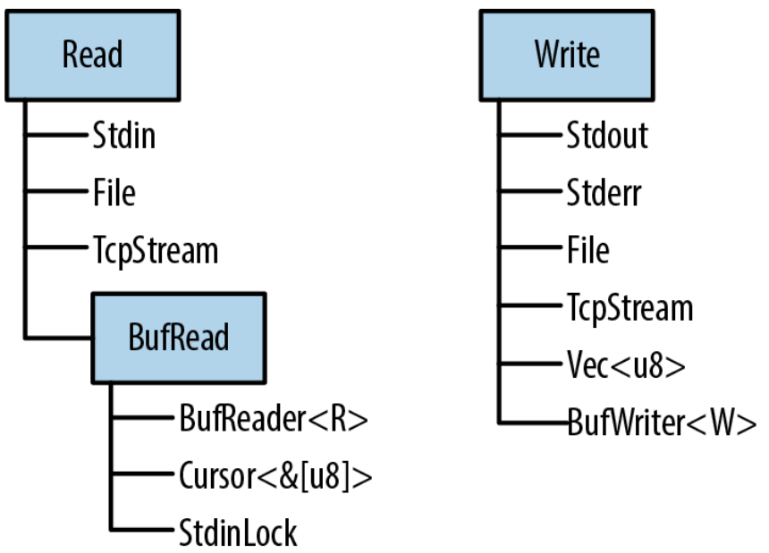
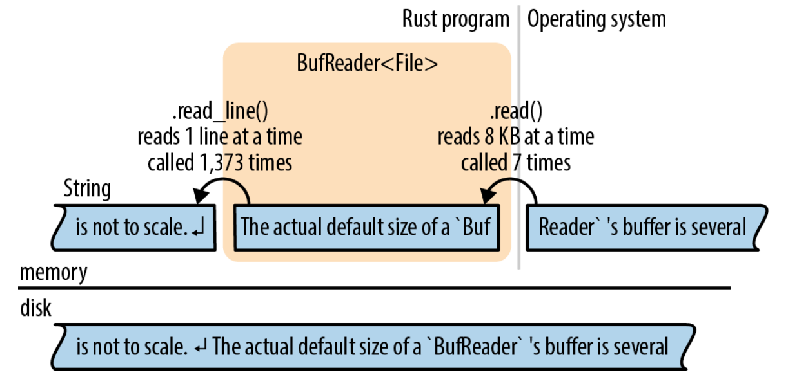

# 输入输出

*Doolittle: What concrete evidence do you have that you exist?*

*Bomb #20: Hmmmm... well... I think, therefore I am.*

*Doolittle: That’s good. That’s very good. But how do you know that anything else exists?*

*Bomb #20: My sensory apparatus reveals it to me.*

<p align="right">
    ——Dark Star
</p>

Rust中有关输入输出的特性围绕着三个trait：`Read`、`BufRead`、`Write`来组织：

- 实现了`Read`的值有读取字节输入的方法。它们被称为 *读者(reader)* 。
- 实现了`BufRead`的值是 *buffered reader(有缓存的读者)* 。它们支持`Read`的所有方法，加上读取文本的一行的方法，等等。
- 实现了`Write`的值支持字节和UTF-8文本输出。它们被称为 *写者(writer)* 。

”图18-1”展示了这三个trait以及一些reader和writer类型的示例。

在本章中，我们将解释如何使用这些trait和它们的方法，包括图中出现的reader和writer类型，还有一些其他的和文件、终端、网络交互的方法。


<p align="center">图18-1 Rust的三个主要的I/O trait以及一些实现了它们的类型</p>

## Reader和Writer

 *Reader* 是你的程序可以从中读取字节的值。例如：

- 使用`std::fs::File::open(filename)`打开的文件
- 用于从网络中接收数据的`std::net::TcpStream`
- 进程用来读取标准输入的`std::io::stdin()`
- `std::io::Cursor<&[u8]>`和`std::io::Cursor<Vec<u8>>`值，它们是从内存中的字节数组或vector中“读取”数据的reader

 *Writer* 是你的程序可以向其中写入字节的值。例如：

- 使用`std::fs::File::create(filename)`打开的文件
- 用于向网络中发送数据的`std::net::TcpStream`
- 用于写入到终端的`std::io::stdout()`和`std::io::stderr()`
- `Vec<u8>`，它也是一个writer，它的`write`方法把数据附加到尾部
- `std::io::Cursor<Vec<u8>>`，类似于上面，但允许你同时读取和写入数据，并可以在vector中定位到不同位置
- `std::io::Cursor<&mut [u8]>`，和`std::io::Cursor<Vec<u8>>`很像，除了它不能让缓冲区增长，因为它只是已经存在的字节数组的切片

因为有为reader和writer设计的标准trait（`std::io::Read`和`std::io::Write`），所以编写可以处理多种输入输出通道的泛型代码是非常普遍的。例如，这里有一个函数拷贝任意reader中的所有字节到任意writer：
```Rust
    use std::io::{self, Read, Write, ErrorKind};

    const DEFAULT_BUF_SIZE: usize = 8 * 1024;

    pub fn copy<R: ?Sized, W: ?Sized>(reader: &mut R, writer: &mut W)
        -> io::Result<u64>
        where R: Read, W: Write
    {
        let mut buf = [0; DEFAULT_BUF_SIZE];
        let mut written = 0;
        loop {
            let len = match reader.read(&mut buf) {
                Ok(0) => return Ok(written),
                Ok(len) => len,
                Err(ref e) if e.kind() == ErrorKind::Interrupted => continue,
                Err(e) => return Err(e),
            };
            writer.write_all(&buf[..len])?;
            written += len as u64;
        }
    }
```

这是Rust的标准库中的`std::io::copy()`的实现。因为它是泛型的，你可以使用它从`File`中读取数据然后写入到`TcpStream`，或者从`Stdin`读取，然后写入到内存中的`Vec<u8>`，等等。

如果你看不明白这里的错误处理代码，请复习”第7章”。我们将在接下来的内容中一直使用`Result`类型，掌握它的工作原理很重要。

这三个`std::io`的trait：`Read`、`BufRead`、`Write`，以及`Seek`如此常用，以至于有一个只包含这些trait的`prelude`模块：
```Rust
    use std::io::prelude::*;
```

本章中你还会见到它一到两次。我们通常也习惯导入`std::io`模块自身：
```Rust
    use std::io::{self, Read, Write, ErrorKind};
```

这里的`self`关键字声明了`io`作为`std::io`模块的一个别名。这样，`std::io::Result`和`std::io::Error`可以用`io::Result`和`io::Error`更简洁地表示出来，等等。

### Reader

`std::io::Read`有几个方法用于读取数据。所有这些方法都通过`mut`引用获取self参数。

*`reader.read(&mut buffer)`*

&emsp;&emsp;从数据源读取一些字节，并存储到给定的`buffer`中。`buffer`参数的类型是`&mut [u8]`。它最多读取`buffer.len()`个字节。

&emsp;&emsp;返回类型是`io::Result<u64>`，它是`Result<u64, io::Error>`的类型别名。当成功时，`u64`值是读取到的字节数，它可能等于或者小于`buffer.len()`， *即使还有更多的数据可以读取* 。`Ok(0)`意味着没有更多的输入可以读取。

&emsp;&emsp;当出错时，`.read()`返回`Err(err)`，其中`err`是一个`io::Error`值。为了便于人类阅读，`io::Error`是可打印的；而对于程序，它有一个`.kind()`方法返回一个`io::ErrorKind`类型的错误码。这个枚举的成员有例如`PermissionDenied`和`ConnectionReset`。大多数的错误都不能被忽略，但有一种错误应该进行特殊处理。`io::ErrorKind::Interrupted`对应Unix的错误码`EINTR`，它意味着读取过程恰好被一个信号打断。除非你的程序想设计为根据信号做一些聪明的操作，否则它应该简单地重试读取操作。上一节中的`copy()`的代码，就是一个例子。

&emsp;&emsp;如你所见，`.read()`方法非常底层，甚至直接继承了底层操作系统的怪癖。如果你要为一个新的数据源类型实现`Read` trait，这会赋予你极大的灵活性。但如果你尝试读取一些数据，就会非常难受。因此，Rust提供了几个更高级的便捷方法。它们都有基于`.read()`的默认实现。它们都处理了`ErrorKind::Interrupted`，因此你不需要再处理。

*`reader.read_to_end(&mut byte_vec)`*

&emsp;&emsp;读取reader中剩余的所有输入，将读到的数据附加到`byte_vec`尾部，`byte_vec`是一个`Vec<u8>`。返回一个`io::Result<uszie>`，表示读取到的字节数。

&emsp;&emsp;这个方法读取的数据的大小没有限制，因此不要将它用于不受信任的源。（你可以使用`.take()`方法施加限制，如后文所述。）

*`reader.read_to_string(&mut string)`*

&emsp;&emsp;和上面相同，不过把数据附加到给定的`String`。如果流不是有效的UTF-8，它会返回一个`ErrorKind::InvalidData`错误。

&emsp;&emsp;在一些编程语言中，字节输入和字符输入由不同的类型来处理。如今，UTF-8占据主导地位，Rust承认这一事实标准，并且完全支持UTF-8。其他字符集由开源的`encoding` crate提供支持。

*`reader.read_exact(&mut buf)`*

&emsp;&emsp;读取恰好足以填满给定缓冲区的数据。参数的类型是`&mut [u8]`，如果在读取够`buf.len()`个字节之前reader的数据就已经耗光，那么会返回一个`ErrorKind:: UnexpectedEof`错误。

上面这些是`Read` trait的主要方法。除此之外，还有三个以值获取`reader`的适配器方法，将它转换为一个迭代器或者一个不同的reader：

*`reader.bytes()`*

&emsp;&emsp;返回一个输入流的字节的迭代器。item的类型是`io::Result<u8>`，因此每一个字节都需要进行错误检查。另外，它会逐字节调用`reader.read()`，因此如果reader没有缓存的话会非常低效。

*`reader.chain(reader2)`*

&emsp;&emsp;返回一个新的reader，首先产生`reader`的所有输入，然后产生`reader2`的所有输入。

*`reader.take(n)`*

&emsp;&emsp;返回一个新的reader，从和`reader`相同的数据源读取数据，但最多只读取`n`个字节。

没有关闭reader的方法。reader和writer通常实现了`Drop`，因此它们会自动关闭。

### 有缓冲的Reader

出于性能考虑，reader和writer可以进行 *缓存(buffer)* ，意思是它们有一块内存（缓冲区）用来存储一些输入或输出数据。这样可以减少系统调用的次数，如”图18-2”所示。在这个例子中，应用调用`.read_line()`方法从`BufReader`中读取数据，`BufReader`从操作系统获取更大块的输入。


<p align="center">图18-2 一个有缓冲的文件reader</p>

这张图并不是按比例的，一个`BufReader`的实际大小是几千字节，因此一次系统的`read`调用可以提供上百次`.read_line()`调用。这么做之所以能提高性能是因为系统调用很慢。（如图所示，操作系统也有一个缓冲区，原因与此相同：系统调用很慢，但从磁盘读取数据更慢。）

有缓冲的reader实现了`Read`和另一个trait `BufRead`，它添加了下面的方法：

*`reader.read_line(&mut line)`*

&emsp;&emsp;读取一行文本并将它附加到`line`，`line`是一个`String`。行尾的换行符`'\n'`
也会包含在`line`中。如果输入中有Windows风格的换行符`"\r\n"`，这两个字符都会包含进`line`。

&emsp;&emsp;返回值是一个`io::Result<usize>`，代表读取到的字节数，包括行尾的换行符。

&emsp;&emsp;如果reader到达输入结尾，`line`会保持不变，并返回`Ok(0)`。

*`reader.lines()`*

&emsp;&emsp;返回一个迭代输入中每一行的迭代器。item的类型是`io::Result<String>`。换行符 *不* 包含在字符串中。如果输入中有Windows风格的换行符`"\r\n"`，这两个字符都会被丢弃。

&emsp;&emsp;这个方法几乎总是你需要的文本输入方法。下面的两节会通过例子展示如何使用它。

*`reader.read_until(stop_byte, &mut byte_vec), reader.split(stop_byte)`*

&emsp;&emsp;这两个方法类似于`.read_line()`和`.lines()`，但是是面向字节的，产生`Vec<u8>`而不是`String`。你可以选择终止符`stop_byte`。

`BufRead`还提供两个底层的方法`.fill_buf()`和`.consume(n)`，用来直接访问reader的内部缓冲区。更多有关这些方法的信息，可以查阅在线文档。

接下来的两节详细介绍了有缓冲的reader。

### 读取行

这里有一个实现了Unix `grep`工具的函数。它搜索文本的每一行，文本通常通过管道从另一个命令输入。对于一个给定的字符串：
```Rust
    use std::io;
    use std::io::prelude::*;

    fn grep(target: &str) -> io::Result<()> {
        let stdin = io::stdin();
        for line_result in stdin.lock().lines() {
            let line = line_result?;
            if line.contains(target) {
                println!("{}", line);
            }
        }
        Ok(())
    }
```

因为我们想调用`.lines()`，所以我们需要一个实现了`BufRead`的输入源。在这个例子中，我们调用了`io::stdin()`来获取通过管道传入的数据。然而，Rust标准库使用了一个mutex来保护`stdin`，我们调用`.lock()`来锁住`stdin`以让当前的线程独占使用，它返回一个实现了`BufRead`的`StdinLock`值。在循环的结尾，`StdinLock`被丢弃，释放mutex。（如果没有mutex，那么如果两个线程同时从`stdin`中读取数据，会导致未定义行为。C里也有这个问题，它通过这种方式解决它：C中所有的输入和输出函数会在幕后获取一个锁。Rust中唯一的不同就是锁是API的一部分。）

函数的剩余部分非常直观：它调用`.lines()`并迭代返回的迭代器。因为这个迭代器产生`Result`值，所以我们使用`?`操作符来检查错误。

假设我们想进一步扩展我们的`grep`程序，让它支持搜索磁盘中的文件。我们可以把函数修改为泛型的：
```Rust
    fn grep<R>(target: &str, reader: R) -> io::Result<()>
        where R: BufRead
    {
        for line_result in reader.lines() {
            let line = line_result?;
            if line.contains(target) {
                println!("{}", line);
            }
        }
        Ok(())
    }
```

现在我们可以向它传递一个`StdinLock`或者一个有缓存的`File`：
```Rust
    let stdin = io::stdin();
    grep(&target, stdin.lock())?;   // ok

    let f = File::open(file)?;
    grep(&target, BufReader::new(f))?;  // ok
```

注意`File`并不是自动缓存的。`File`实现了`Read`但没有实现`BufRead`。然而，很容易为`File`或者其他任何无缓存的reader创建一个有缓存的reader。`BufReader::new(reader)`可以实现这个功能。（可以使用`BufReader::with_capacity(size, reader)`设置缓冲区的大小。）

在大多数语言中，文件都是默认有缓存的。如果你想要无缓存的输入或输出，你必须知道如何关闭缓存。在Rust中，`File`和`BufReader`是两个单独的库特性，因为有时你可能需要没有缓冲的文件，或者需要缓存文件之外的内容（例如，你可能会想要缓存来自网络的输入）。

包含错误处理和一些参数解析的完整的程序，如下所示：
```Rust
    // grep - 搜索stdin或文件中匹配给定string的行
    use std::error::Error;
    use std::io::{self, BufReader};
    use std::io::prelude::*;
    use std::fs::File;
    use std::path::PathBuf;

    fn grep<R>(target: &str, reader: R) -> io::Result<()>
        where R: BufRead
    {
        for line_result in reader.lines() {
            let line = line_result?;
            if line.contains(target) {
                println!("{}", line);
            }
        }
        Ok(())
    }

    fn grep_main() -> Result<(), Box<dyn Error>> {
        // 获取命令行参数。第一个参数是要搜索的字符串；
        // 剩余的是文件名。
        let mut args = std::env::args().skip(1);
        let target = match args.next() {
            Some(s) => s,
            None => Err("usage: grep PATTERN FILE...")?
        };
        let files: Vec<PathBuf> = args.map(PathBuf::from).collect();

        if files.is_empty() {
            let stdin = io::stdin();
            grep(&target, stdin.lock())?;
        } else {
            for file in files {
                let f = File::open(file)?;
                grep(&target, BufReader::new(f))?;
            }
        }

        Ok(())
    }

    fn main() {
        let result = grep_main();
        if let Err(err) = result {
            eprintln!("{}", err);
            std::process::exit(1);
        }
    }
```

### 收集行

包括`.lines()`在内的几个reader方法返回产生`Result`的迭代器。当你第一次尝试将一个文件的每一行收集到一个很大的vector中时，你可能会遇到需要摆脱`Result`的问题：
```Rust
    // ok，但不是你想要的
    let results: Vec<io::Result<String>> = reader.lines().collect();

    // error: 不能将Result的集合转换成Vec<String>
    let lines: Vec<String> = reader.lines().collect();
```

第二次尝试不能编译：哪里出错了？直观的解决方法是编写一个`for`循环并为每一个item检查错误：
```Rust
    let mut lines = vec![];
    for line_result in reader.lines() {
        lines.push(line_result?);
    }
```

不错；但这里如果使用`.collect()`会更好，并且我们确实可以这么做。我们只需要知道需要什么样的类型：
```Rust
    let lines = reader.lines().collect::<io::Result<Vec<String>>>()?;
```

为什么这能工作？标准库里为`Result`包含了一个`FromIterator`的实现——在在线文档中容易忽略——让这变为了可能：
```Rust
    impl<T, E, C> FromIterator<Result<T, E>> for Result<C, E>
        where C: FromIterator<T>
    {
        ...
    }
```
这个签名需要仔细阅读，但它是一个漂亮的技巧。假设`C`是任意集合类型，例如`Vec`或者`HashSet`。只要我们已经知道了如何从一个产生`T`值的迭代器构建一个`C`，我们就可以从一个产生`Result<T, E>`值的迭代器构建一个`Result<C, E>`。我们只需要遍历迭代器产生的值，用其中的`Ok`值构建集合，但如何遇到了一个`Err`，就停止并传递它。

换句话说，`io::Result<Vec<String>>`是一个集合类型，所以`.collect()`方法可以创建并填充这种类型的值。

### Writer

正如我们所见，使用方法就基本可以完成输入。输出有一些不同。

在整本书中，我们都在使用`println!()`来产生普通文本输出：
```Rust
    println!("Hello, world!");

    println!("The greatest common divisor of {:?} is {}", numbers, d);

    println!();     // 打印空白行
```

还有一个`print!()`宏，它不会在最后加上一个换行符，`eprintln!`和`eprint!`宏写入到标准错误流。这些函数的格式化代码都和`format!`宏一样，见“格式化”。

使用`write!()`和`writeln!()`宏可以把输出写入一个writer。它们与`print!()`和`println!()`类似，除了两个不同点：
```Rust
    writeln!(io::stderr(), "error: world not helloable")?;

    writeln!(&mut byte_vec, "The greatest common divisor of {:?} is {}", numbers, d)?;
```

一是`write`宏有一个额外的第一个参数：writer。另一个不同是它们返回一个`Result`，因此必须进行错误处理。这就是为什么我们在每一行的结尾都使用了`?`运算符。

`print`宏不返回一个`Result`，如果写入失败它们会直接panic。因为它们会写入到终端，写入终端很少会失败。

`Write` trait有这些方法：

*`writer.write(&buf)`*

&emsp;&emsp;将切片`buf`中的字节写入到底层的流中。它返回一个`io::Result<usize>`。成功时，它返回写入的字节数量，可能会小于`buf.len()`，取决于流。

&emsp;&emsp;类似于`Reader::read()`，这是一个你应该避免直接使用的底层方法。

*`writer.write_all(&buf)`*

&emsp;&emsp;写入切片`buf`中的所有字节。返回`Result<()>`。

*`writer.flush()`*

&emsp;&emsp;冲洗底层流中所有缓存的数据。返回`Result<()>`。

&emsp;&emsp;注意尽管`println!`和`eprintln!`宏会自动冲洗标准输出和标准错误流，但`print!`和`eprint!`不会。使用它们之后你可能需要手动调用`flush()`。

类似于reader，writer也是在丢弃时自动关闭。

类似于`BufReader::new(reader)`为任意reader添加缓存，`BufWriter::new(writer)`为任意writer添加缓存：
```Rust
    let file = File::create("tmp.txt")?;
    let writer = BufWriter::new(file);
```

为了设置缓冲区的大小，使用`BufWriter::with_capacity(size, writer)。`

当`BufWriter`被丢弃时，它剩余的所有被缓存的数据都会被写入到底层的writer。然而，如果这次写入时出现了错误，这个错误会被 *忽略* 。（因为这个错误是在`BufWriter`的`.drop()`方法中发生，没有汇报错误的地方。）为了保证你的应用能够注意到所有的输出错误，可以在drop有缓存的writer之前手动调用`.flush()`。

### File

我们已经看到过两种打开文件的方式：

*`File::open(filename)`*

&emsp;&emsp;打开一个已存在的文件。它返回一个`io::Result<File>`，如果文件不存在将返回一个错误。

*`File::create(filename)`*

&emsp;&emsp;创建一个新的文件用于写入。如果已经有同名文件，它会被截断。

注意`File`类型在文件系统模块`std::fs`中，而不是在`std::io`中。

当这两个文件都不符合要求时，你可以使用`OpenOptions`来指定额外的期望行为：
```Rust
    use std::fs::OpenOptions;

    let log = OpenOptions::new()
        .append(true)   // 如果文件存在，就追加到末尾
        .open("server.log")?;

    let file = OpenOptions::new()
        .write(true)
        .create_new(true)   // 如果文件存在就失败
        .open("new_file.txt")?;
```

方法`.append(), .write(), .create_new()`等，被设计用来进行类似这样的链式调用：每一个都返回`self`。这种链式方法的设计模式在Rust中太过普遍以至于有一个专门的名字：它被称为 *builder(构建器)* 。`std::process::Command`是另一个例子。更多关于`OpenOptions`的细节可以查阅在线文档。

`File`被打开后，它的行为就类似于其他的reader和writer。如果需要的话你可以添加一个缓冲区。当你drop一个`File`时它会自动关闭。

### Seek

`File`还实现了`Seek` trait，它意味着你可以在一个`File`中跳来跳去，而不是只能从开始单调地读到尾。`Seek`的定义类似如下：
```Rust
    pub trait Seek {
        fn seek(&mut self, pos: SeekFrom) -> io::Result<u64>;
    }

    pub enum SeekFrom {
        Start(u64),
        End(i64),
        Current(i64)
    }
```

得益于这个枚举，`seek`方法变得很有表达力：使用`file.seek(SeekFrom::Start(0))`来定位到开始，使用`file.seek(SeekFrom::Current(-8))`来回退一些字节，等等。

在一个文件中定位很慢。不管你是在硬盘还是固态盘(SSD)上，定位都要消耗和读取几M数据一样长的时间。

### 其他Reader和Writer类型

目前为止，本章主要使用了`File`作为示例，但还有很多其他有用的reader和writer类型：

*`io::stdin()`*

&emsp;&emsp;返回一个标准输入流的reader。它的类型是`io::Stdin`。因为它被多个线程共享，所以每一次读取都需要请求并释放mutex。

&emsp;&emsp;`Stdin`有一个`.lock()`方法获取mutex并返回一个`io::StdinLock`，这是一个有缓存的reader，它会持有mutex，直到它被丢弃。因此对`StdinLock`的单独操作可以避免mutex的开销。我们在“读取行”中展示过使用这个方法的示例代码。

&emsp;&emsp;出于技术原因，`io::stdin().lock()`不能工作。这个锁持有一个`Stdin`值的引用，这意味着`Stdin`值必须被存储起来，这样它才能生存的足够久：

```Rust
    let stdin = io::stdin();
    let lines = stdin.lock().lines();   // ok
```

*`io::stdout(), io::stderr()`*

&emsp;&emsp;返回标准输出和标准错误流的`Stdout`和`Stderr` writer类型。这两个类型也持有互斥锁和`.lock()`方法。

*`Vec<u8>`*

&emsp;&emsp;实现了`Write`。写入到一个`Vec<u8>`会把新的数据附加到vector尾部。

&emsp;&emsp;然而，`String` *并没有* 实现`Write`。为了使用`Write`构建一个字符串，首先要写入到一个`Vec<u8>`，然后使用`String::from_utf8(vec)`来把vector转换为字符串。

*`Cursor::new(buf)`*

&emsp;&emsp;创建一个`Cursor`，它是一个从`buf`中读取的有缓存的reader。这也是一个创建从`String`读取的reader的方法。参数`buf`可以是任何实现了`AsRef<[u8]>`的类型，因此你也可以传递一个`&[u8], &str, Vec<u8>`。

&emsp;&emsp;`Cursor`内部的结构非常简单。它只有两个字段：`buf`和一个整数，用来表示下一次读取开始的偏移量。初始时为0。

&emsp;&emsp;`Cursor`实现了`Read, BufRead, Seek`。如果`buf`的类型是`&mut [u8]`或者`Vec<u8>`，那么`Cursor`还会实现`Write`。写入一个`Cursor`会覆盖`buf`中从当前位置开始的字节。如果你试图越界写入一个`&mut [u8]`，结果会是部分写入或者一个`io::Error`。使用Cursor越界写入一个`Vec<u8>`没有问题，因为它会让vector变长。因此`Cursor<&mut [u8]>`和`Cursor<Vec<u8>>`实现了`std::io::prelude`中全部的4个trait。

*`std::net::TcpStream`*

&emsp;&emsp;代表一个TCP网络连接。因为TCP允许双向连接，所以它既是reader又是writer。

          

&emsp;&emsp;类型关联函数`TcpStream::connect(("hostname", PORT))`尝试连接到服务器，并返回一个`io::Result<TcpStream>`。

*`std::process::Command`*

&emsp;&emsp;支持创建一个子进程并把数据管道连接到它的标准输入，例如：

```Rust
    use std::process::{Command, Stdio};

    let mut child =
        Command::new("grep")
         .arg("-e")
         .arg("a.*e.*i.*o.*u")
         .stdin(Stdio::piped())
         .spawn()?;
    
    let mut to_child = child.stdin.take().unwrap();
    for word in my_words {
        writeln!(to_child, "{}", word)?;
    }

    drop(to_child); // 关闭grep的stdin，所以它会退出
    child.wait()?;
```

&emsp;&emsp;`child.stdin`的类型是`Option<std::process:ChildStdin>`；这里我们在创建子进程的时候使用了`.stdin(Stdio::piped())`，因此`.spawn()`成功后`child.stdin`肯定是`Some`。否则`child.stdin`将是`None`。

&emsp;&emsp;`Command`还有类似的`.stdout()`和`.stderr()`方法，它们可以用来请求`child.stdout`和`child.stderr`中的reader。

`std::io`模块还提供了很多返回简单reader和writer的函数：

*`io::sink()`*

&emsp;&emsp;这是一个无操作的writer。所有的写入方法都会返回`Ok`，但数据都会被丢弃。

*`io::empty()`*

&emsp;&emsp;这是一个无操作的reader。所有的读取都会成功，但总是返回输入结束。

*`io::repeat(byte)`*

&emsp;&emsp;返回一个无限重复给定字节的reader。

### 二进制数据，压缩和序列化

有很多基于`std::io`框架的开源crate提供额外的特性。

`byteorder` crate提供`ReadBytesExt`和`WriteBytesExt` trait，它们为所有reader和writer添加二进制输入和输出的方法：
```Rust
    use byteorder::{ReadBytesExt, WriteBytesExt, LittleEndian};

    let n = reader.read_u32::<LittleEndian>()?;
    writer.write_i64::<LittleEndian>(n as i64)?;
```

`flate2` crate提供读取和写入`gzip`数据的适配器方法：
```Rust
    use flate2::read::GzDecoder;
    let file = File::open("access.log.gz")?;
    let mut gzip_reader = GzDecoder::new(file);
```

`serde` crate以及它关联的格式化crate例如`serde_json`，实现了序列化和反序列化：它们在Rust结构体和字节流之间来回转换。我们之前在“trait和其他人的类型”中提到过它们一次。现在让我们仔细看看。

假设我们有一些数据，即一个文字冒险游戏的地图，存储在一个`HashMap`中：
```Rust
    type RoomId = String;                       // 每一个房间有一个独一无二的名字
    type RoomExits = Vec<(char, RoomId)>;       // ...和一个通向的房间的名字的列表
    type RoomMap = HashMap<RoomId, RoomExits>;

    // 创建一个简单的地图。
    let mut map = RoomMap::new();
    map.insert("Cobble Crawl".to_string(),
               vec![('W', "Debris Room".to_string())]);
    map.insert("Debris Room".to_string(),
               vec![('E', "Cobble Crawl".to_string()),
                    ('W', "Sloping Canyon".to_string())]);
    ...
```

将这个数据转换为JSON并输出只需要一行代码：
```Rust
    serde_json::to_writer(&mut std::io::stdout(), &map)?;
```

在内部，`serde_json::to_writer`使用了`serde::Serialize` trait的`serialize`方法。这个库给所有它知道如何序列化的类型附加了这个trait，其中包括我们的数据中出现的类型：字符串、字符、元组、vector、`HashMap`。

`serde`非常灵活。在我们的程序中，输出是JSON数据，因为我们选择了`serde_json`序列化器。其他格式例如`MessagePack`也是可用的。同样地，你可以把输出送到文件、`Vec<u8>`或其他任何writer中。上面的代码通过`stdout`打印了数据，内容如下：
```json
    {"Debris Room":[["E","Cobble Crawl"],["W","Sloping Canyon"]],"Cobble Crawl": [["W","Debris Room"]]}
```

`serde`还包括派生两个关键trait的支持：
```Rust
    #[derive(Serialize, Deserialize)]
    struct Player {
        location: String,
        items: Vec<String>,
        health: u32
    }
```

这个`#[derive]`属性会让编译过程稍微变长，因此当你在 *Cargo.toml* 文件中将`serde`列为依赖时需要要求它支持这个特性。这是我们上面的代码用到的依赖：
```toml
    [dependencies]
    serde = { version = "1.0", features = ["derive"] }
    serde_json = "1.0"
```

更多的细节可以查阅`serde`的文档。简单来说，构建系统可以自动为`Player`生成`serde::Serialize`和`serde::Deserialize`，因此序列化一个`Player`值非常简单：
```Rust
    serde_json::to_writer(&mut std::io::stdout(), &player)?;
```

输出看起来是这样的：
```json
    {"location":"Cobble Crawl","items":["a wand"],"health":3}
```

## 文件和目录

现在我们已经展示了如何使用reader和writer，下面的几节将介绍Rust中处理文件和目录的特性，它们在`std::path`和`std::fs`模块中。这些特性都涉及到文件名，所以我们将以文件名类型开始。

### `OsStr`和`Path`

很不方便的一点是，你的操作系统并不一定强制文件名是有效的Unicode。这里有两个创建文本文件的Linux shell命令。只有第一个是有效的UTF-8文件名：
```
    $ echo "hello world" > ô.txt
    $ echo "O brave new world, that has such filenames in't" > $'\xf4'.txt
```

两条命令都可以运行，因为Linux内核不知道来自Ogg Vorbis的UTF-8。对于内核来说，任何字节（除了null字节和斜杠）组成的字符串都是可接受的文件名。Windows上也类似：几乎任何16位“宽字符”组成的字符串都是可接受的文件名，即使字符串并不是有效的UTF-16。操作系统处理的其他字符串也是这样，例如命令行参数和环境变量。

Rust的字符串总是有效的Unicode。在实践中文件名 *几乎* 总是Unicode，但Rust必须提供方式以应对少数不是Unicode的情况。这就是为什么Rust有`std::ffi::OsStr`和`OsString`。

`OsStr`是一个作为UTF-8超集的字符串类型。它的任务是能表示当前系统中的所有文件名、命令行参数、环境变量， *不管它们是不是Unicode* 。在Unix上，`OsStr`可以存储任意字节序列。在Windows上，`OsStr`以UTF-8的扩展格式存储，它可以编码任何16位值的序列。

所以我们有了两种字符串类型：`str`用于实际的Unicode字符串；`OsStr`用于操作系统可能用到的字符串。我们将再介绍一个用于文件名的`std::path::Path`，它纯粹是为了方便。`Path`实际上很像`OsStr`，但它添加了很多和文件名相关的方法，我们将在下一节中介绍。可以使用`Path`表示绝对路径和相对路径。对于路径中每个单独的部分，使用`OsStr`。

最后，每个字符串类型都有一个相应的 *有所有权的(owning)* 类型：`String`拥有一个堆上分配的`str`，一个`std::ffi::OsString`拥有一个堆上分配的`OsStr`，一个`std::path::PathBuf`拥有一个堆上分配的`Path`。”表18-1”列出了每个类型的一些特性。

|          |   **str**   |   **OsStr**   |   **Path**   |
| --- | --- | --- | --- |
|         非固定大小类型，总是以引用传递  |  是  |  是  |  是  |
|         包含任意Unicode文本  |  是  |  是  |  是  |
|         通常看起来就像UTF-8  |  是  |  是  |  是  |
|         可以包含非Unicode数据  |  否  |  是  |  是  |
|         文本处理方法     |  是  |  否  |  否  |
|         文件名相关方法   |  否  |  是  |  是  |
|         对应的有所有权、可增长的、堆上分配的类型  |  `String`  |  `OsString`  |  `PathBuf`  |
|         转换为有所有权的类型   |  `.to_string()`  |  `.to_os_string()`  |  `.to_path_buf()`  |

所有这些类型都实现了一个公共的trait：`AsRef<Path>`，所以我们可以轻易地声明一个泛型函数接受“任何文件名类型”作为参数。这使用到了我们之前展示过的“`AsRef`与`AsMut`”：
```Rust
    use std::path::Path;
    use std::io;

    fn swizzle_file<P>(path_arg: P) -> io::Result<()>
        where P: AsRef<Path>
    {
        let path = path_arg.as_ref();
        ...
    }
```

所有接受`path`参数的标准函数和方法都使用了这项技术，因此你可以自由地向它们传递字符串字面量。

### `Path`和`PathBuf`方法

`Path`提供了下面这些方法：

*`Path::new(str)`*

&emsp;&emsp;将一个`&str`或者`&OsStr`转换为`&Path`。它不会拷贝字符串，新的`&Path`和原本的`&str`或`&OsStr`指向相同的字节流：

```Rust
    use std::path::Path;
    let home_dir = Path::new("/home/fwolfe");
```

&emsp;&emsp;（类似的方法`OsStr::new(str)`将`&str`转换为`&OsStr`。）

*`path.parent()`*

&emsp;&emsp;返回`path`的父目录，如果有的话。返回类型是`Option<&Path>`。

&emsp;&emsp;它也不会拷贝路径，`path`的父目录总是`path`的一个子串：

```Rust
    assert_eq!(Path::new("/home/fwolfe/program.txt").parent(),
               Some(Path::new("/home/fwolfe")));
```

*`path.file_name()`*

&emsp;&emsp;返回`path`的最后一个部分，如果有的话。返回类型是`Option<&OsStr>`。

&emsp;&emsp;在通常的情况下，`path`由一个目录、一个斜杠、然后是一个文件名组成，这会返回文件名：

```Rust
    use std::ffi::OsStr;
    assert_eq!(Path::new("/home/fwolfe/program.txt").file_name(),
               Some(OsStr::new("program.txt")));
```

*`path.is_absolute(), path.is_relative()`*

&emsp;&emsp;这些方法判断路径是绝对的（例如Unix路径 */usr/bin/advent* 或者Windows路径*C:\Program Files* ）还是相对的（例如 *src/main.rs* ）。

*`path1.join(path2)`*

&emsp;&emsp;连接两个路径，返回一个新的`PathBuf`：

```Rust
    let path1 = Path::new("/usr/share/dict");
    assert_eq!(path1.join("words"),
               Path::new("/usr/share/dict/words"));
```

&emsp;&emsp;如果`path2`是一个绝对路径，这会简单地返回`path2`的拷贝，因此这个方法可以用于将任何路径转换为一个绝对路径：

```Rust
    let abs_path = std::env::current_dir()?.join(any_path);
```

*`path.components()`*

&emsp;&emsp;返回一个从左到右迭代给定路径的所有部分的迭代器。这个迭代器的item类型是`std::path::Component`，它可以代表任何可能出现在文件名中的部分：

```Rust
    pub enum Component<'a> {
        Prefix(PrefixComponent<'a>),  // 一个驱动器字母或者共享设备（在Windows上）
        RootDir,            // 根目录，`/`或`\`
        CurDir,             // `.`特殊目录
        ParentDir,          // `..`特殊目录
        Normal(&'a OsStr)   // 普通的文件和目录名
    }
```

&emsp;&emsp;例如，Windows路径 *\\\\venice\Music\A Love Supreme\04-Psalm.mp3* 由一个`Prefix`（表示 *\\\\venice\Music* ）、后跟一个`RootDir`，然后是两个`Normal`组件（分别是 *A Love Supreme* 和 *04-Psalm.mp3* ）组成。

&emsp;&emsp;细节见[在线文档](https://doc.rust-lang.org/std/path/struct.Path.html#method.components)。

*`path.ancestors()`*

&emsp;&emsp;返回一个从`path`一直回溯到根目录的迭代器。每一个产生的item都是一个`Path`：第一个是`path`本身，然后是它的父目录、它的父目录的父目录，等等：

```Rust
    let file = Path::new("/home/jimb/calendars/calendar-18x18.pdf");
    assert_eq!(file.ancestors().collect::<Vec<_>>(),
               vec![Path::new("/home/jimb/calendars/calendar-18x18.pdf"),
                    Path::new("/home/jimb/calendars"),
                    Path::new("/home/jimb"),
                    Path::new("/home"),
                    Path::new("/")]);
```

&emsp;&emsp;这很像一直调用`parent`直到它返回`None`。最终的item总是一个根目录或者前缀路径。

这些方法只考虑内存中的字符串。`Path`还有一些会查询文件系统的方法：`.exists(), .is_file(), .is_dir(), .read_dir(), .canonicalize()`等等。更多内容请查阅在线文档。

有三个将`Path`转换为字符串的方法。每一个都允许`Path`中可能含有无效的UTF-8：

*`path.to_str()`*

&emsp;&emsp;将一个`Path`转换成字符串，返回一个`Option<&str>`。如果`path`不是有效的UTF-8，它返回`None`：

```Rust
    if let Some(file_str) = path.to_str() {
        println!("{}", file_str);
    }   // ...否则跳过这个文件名
```

*`path.to_string_lossy()`*

&emsp;&emsp;这个方法功能基本和上面一样，但它在所有情况下都会返回字符串。如果`path`不是有效的UTF-8，这个方法会创建拷贝，然后将每一个无效的字节序列替换为Unicode占位字符：U+FFFD('�')。

&emsp;&emsp;返回值类型是`std::borrow::Cow<str>`：可能是字符串的借用也可能是有所有权的字符串。为了从这个值得到一个`String`，使用它的`.to_owned()`方法。（更多有关`Cow`的内容，见“`Borrow`和`ToOwned`的配合：`Cow`”。）

*`path.display()`*

&emsp;&emsp;这用于打印路径：

```Rust
    println!("Download found. You put it in: {}", dir_path.display());
```

&emsp;&emsp;它返回的值并不是字符串，但它实现了`std::fmt::Display`，所以它可以和`format!(), println!()`等一起使用。如果路径不是有效的UTF-8，输出可能会含有�字符。

### 文件系统访问函数

”表18-2”展示了`std::fs`中的一些函数以及它们在Unix和Windows中的类似等价物。所有这些函数都返回`io::Result`值。除非特意提及，不然就是`io::Result<()>`。

|          |   **Rust函数**   |   **Unix**   |   **Windows**   |
| --- | --- | --- | --- |
| 创建和删除 |  `create_dir(path)`  |  `mkdir()`  |  `CreateDirectory()`  |
| 创建和删除 |  `create_dir_all(path)`  |  类似`mkdir -p`  |  类似`mkdir`  |
| 创建和删除 |  `remove_dir(path)`  |  `rmdir()`  |  `RemoveDirectory()`  |
| 创建和删除 |  `remove_dir_all(path)`  |  类似`rm -r`  |  类似`rmdir /s`  |
| 创建和删除 |  `remove_file(path)`  |  `unlink()`  |  `DeleteFile()`  |
| 拷贝，移动和链接 |  `copy(src_path, dest_path) -> Result<u64>`  |  类似`cp -p`  |  `CopyFileEx()`  |
| 拷贝，移动和链接 |  `rename(src_path, dest_path)`  |  `rename()`  |  `MoveFileex()`  |
| 拷贝，移动和链接 | `hard_link(src_path, dest_path)`  |  `link()`  |  `CreateHardLink()`  |
| 检查 |  `canonicalize(path) -> Result<PathBuf>`  |  `realpath`  |  `GetFinalPathNameByHandle()`  |
| 检查 |  `metadata(path) -> Result<Metadata>`  | `stat()` | `GetFileInformationByHandle()` |
| 检查 |  `symlink_metadata(path) -> Result<Metadata>`  |  `lstat()`  |  `GetFileInformationByHandle()`  |
| 检查 |  `read_dir(path) -> Result<ReadDir>`  |  `opendir()`  |  `FindFirstFile()`  |
| 检查 |  `read_link(path) -> Result<PathBuf>`  |  `readlink()`  |  `FSCTL_GET_REPARSE_POINT`  |
|         权限  |  `set_permission(path, perm)`  |  `chmod()`  |  `SetFileAttributes()`  |

（`copy()`返回的数字是被拷贝的文件的大小，以字节为单位。有关创建符号链接，见“平台特定特性”。）

如你所见，Rust努力提供可以在Windows、macOS、Linux以及其他Unix系统上工作的可移植函数。

文件系统的完整说明超出了本书的范围，但如果你对这些函数中的某些更感兴趣，你可以在网上轻松地找到有关他们的更多信息。我们将在下一节中展示更多示例。

所有这些函数都是通过调用操作系统的功能来实现。例如`std::fs::canonicalize(path)`不只是使用字符串处理来消除给定的`path`中的`.`和`..` 。它使用当前的工作目录来解析相对路径，并且它会解析符号链接。如果路径不存在它会报错。

`std::fs::metadata(path)`和`std::fs::symlink_metadata(path)`产生的`Metadata`类型包含类似于文件类型和大小、权限、时间戳等信息。同样，详细的内容请查阅文档。

为了方便，`Path`类型将一些这样的函数内建为方法：例如`path.metadata()`和`std::fs::metadata(path)是一样的。`

### 读取目录

可以使用`std::fs::read_dir`列出目录中的内容。或者等价的`Path`的`.read_dir()`方法：
```Rust
    for entry_result in path.read_dir()? {
        let entry = entry_result?;
        println!("{}", entry.file_name().to_string_lossy());
    }
```

注意这段代码中`?`的两次使用。第一行的检查打开目录的错误。第二行的检查读取下一个条目的错误。

`entry`的类型是`std::fs::DirEntry`，它有如下方法：

*`entry.file_name()`*

&emsp;&emsp;文件或目录的名字，是一个`OsString`。

*`entry.path()`*

&emsp;&emsp;和上面相同，但和原本的路径连接在一起，产生一个新的`PathBuf`。如果我们正在列出的目录是`"/home/jimb"`，并且`entry.file_name()`是`".emacs"`，那么`entry.path()`将会返回`PathBuf::from("/home/jimb/.emacs")`。

*`entry.file_type()`*

&emsp;&emsp;返回一个`io::Result<FileType>`。`FileType`类型有`.is_file()`、`.is_dir()`、`.is_symlink()`方法。

*`entry.metadata()`*

&emsp;&emsp;获取这个条目的其他元数据。

在读取目录时特殊目录`.`和`..` *不会被* 列出。

这里还有另一个示例。下面的代码递归拷贝磁盘上的一个目录树：
```Rust
    use std::fs;
    use std::io;
    use std::path::Path;

    /// 拷贝现有的目录`src`到目标路径`dst`
    fn copy_dir_to(src: &Path, dst: &Path) -> io::Result<()> {
        if !dst.is_dir() { 
            fs::create_dir(dst)?;
        }

        for entry_result in src.read_dir()? {
            let entry = entry_result?;
            let file_type = entry.file_type()?;
            copy_to(&entry.path(), &file_type, &dst.join(entry.file_name()))?;
        }

        Ok(())
    }
```

用一个单独的函数`copy_to`来拷贝单独的目录项：
```Rust
    /// 拷贝`src`中的所有东西到目标路径`dst`。
    fn copy_to(src: &Path, src_type: &fs::FileType, dst: &Path)
        -> io::Result<()>
    {
        if src_type.is_file() {
            fs::copy(src, dst)?;
        } else if src_type.is_dir() {
            copy_dir_to(src, dst)?;
        } else {
            return Err(io::Error::new(io::ErrorKind::Other,
                                      format!("don't know how to copy: {}", src.display())));
        }                                                            
        Ok(())
    }
```

### 平台特定特性

到目前为止，我们的`copy_to`函数可以拷贝文件和目录。假设我们还想在Unix上支持符号链接。

目前并没有可移值的方式能创建同时在Unix和Windows上工作的符号链接，但标准库提供了一个Unix特定的`symlink`函数：
```Rust
    use std::os::unix::fs::symlink;
```

有了这个，我们的工作就变得很简单。我们只需要给`copy_to`里的`if`表达式添加一个分支：
```Rust
    ...
    } else if src_type.is_symlink() {
        let target = src.read_link()?;
        symlink(target, dst)?;
    ...
```

只要我们在Unix系统例如Linux和macOS上编译程序，它就可以工作。

`std::os`模块包含很多平台特定的特性，例如`symlink`。`std::os`在标准库中的实际内容看起来像这样（取得了许可）：
```Rust
    //! OS特定的功能

    #[cfg(unix)]                pub mod unix;
    #[cfg(windows)]             pub mod windows;
    #[cfg(target_os = "ios")]   pub mod ios;
    #[cfg(target_os = "linux")] pub mod linux;
    #[cfg(target_os = "macos")] pub mod macos;
```

`#[cfg]`属性表示条件编译：这些模块中的每一个都只在特定平台上可用。这也是为什么我们的修改后使用了`std::os::unix`的程序在Unix上将会成功编译：在其他平台上，`std::os::unix`不存在。

如果我们想让我们的代码在所有平台上编译，并且支持Unix上的符号链接，我们必须在我们的程序中也使用`#[cfg]`。在这种情况下，最简单的方法是在Unix上时导入`symlink`，而在其它系统上定义我们自己的`symlink`：
```Rust
    #[cfg(unix)]
    use std::os::unix::fs::symlink;

    /// 为不支持`symlink`的平台的实现
    #[cfg(not(unix))]
    fn symlink<P: AsRef<Path>, Q: AsRef<Path>>(src: P, _dst: Q)
        -> std::io::Result<()>
    {
        Err(io::Error::new(io::ErrorKind::Other,
                           format!("can't copy symbolic link: {}", 
                                   src.as_ref().display())))
    }
```

事实证明`symlink`是一种特殊情况。大多数Unix特定的特性并不是单独的函数而是一些扩展的trait，它们为标准库类型添加了一些的方法（我们在“trait和其他人的类型”中介绍过扩展trait）。这里有一个可以一次性启用所有这些扩展的`prelude`模块：
```Rust
    use std::os::unix::prelude::*;
```

例如，在Unix上这会给`std::fs::Permissions`添加一个`.mode()`方法，它提供Unix上表示权限的底层`u32`值的访问。类似的，它还扩展了`std::fs::Metadata`，添加了一些访问底层的`struct stat`的字段的方法——例如`.uid()`返回文件所有者的ID。

总而言之，`std::os`中的内容非常基础。更多的平台特定功能通过第三方crate提供，例如[`winreg`](https://crates.io/crates/winreg)提供了访问Windows注册表的支持。

## 网络

有关网络编程的教程超出了本书的范围。然而，如果你已经知道一些有关网络编程的知识，那么这一节可以帮助你在Rust中开始网络编程。

底层的网络编程需要使用`std::net`模块，它提供了TCP和UDP网络的跨平台支持。使用`native_tls` crate来提供SSL/TLS支持。

这些模块提供了通过网络的直观的、阻塞式的输入和输出。你可以通过`std::net`用很少的代码编写一个简单的服务器，为每一个连接创建一个线程。例如，这里有一个“echo”服务器：
```Rust
    use std::net::TcpListener;
    use std::io;
    use std::thread::spawn;

    /// 一直等待并接受连接，为每个连接新建一个线程处理。
    fn echo_main(addr: &str) -> io::Result<()> {
        let listener = TcpListener::bind(addr)?;
        println!("listening on {}", addr);
        loop {
            // 等待客户端连接。
            let (mut stream, addr) = listener.accept()?;
            println!("connection received from {}", addr);

            // 创建一个线程来服务这个客户端。
            let mut write_stream = stream.try_clone()?;
            spawn(move || {
                // 把我们从`stream`接收到的所有内容写回。
                io::copy(&mut stream, &mut write_stream)
                    .expect("error in client thread: ");
                println!("connection closed");
            });
        }
    }

    fn main() {
        echo_main("127.0.0.1:17007").expect("error: ");
    }
```

一个回声服务器简单地把你发送给它的数据返回。这些代码和你在Java或Python中编写的代码并没有多少不同。（我们将在”下一章”中介绍`std::thread::spawn()`）

然而，对于高性能的服务器，你将需要使用异步的输入和输出。”第20章”会介绍Rust对异步编程的支持，并展示编写网络客户端和服务器的完整代码。

更高层的协议由第三方crate支持。例如，`reqwest` crate为HTTP客户端提供了一个漂亮的API。这里有一个完整的命令行程序获取`http:`或者`https:` URL的文档并输出到终端。这段代码使用`reqwest = "0.11"`编写，并启用了它的`"blocking"`特性。`reqwest`还提供了一套异步的接口。
```Rust
    use std::error::Error;
    use std::io;

    fn http_get_main(url: &str) -> Result<(), Box<dyn Error>> {
        // 发送HTTP请求并获取一个响应。
        let mut response = reqwest::blocking::get(url)?;
        if !response.status().is_success() {
            Err(format!("{}", response.status()))?;
        }

        // 读取响应的body并写入到标准输出。
        let stdout = io::stdout();
        io::copy(&mut response, &mut stdout.lock())?;

        Ok(())
    }

    fn main() {
        let args: Vec<String> = std::env::args().collect();
        if args.len() != 2 {
            eprintln!("usage: http-get URL");
            return;
        }

        if let Err(err) = http_get_main(&args[1]) {
            eprintln!("error: {}", err);
        }
    }
```

用于HTTP服务器的`actix-web`框架提供了更高层的特性，例如`Service`和`Transform` trait，它们可以帮助你通过可组合的部分构建一个app。`websocket` crate实现了WebSocket协议，等等。Rust是一门年轻的语言，有一个繁荣的开源生态系统。对网络的支持正在快速扩张。
