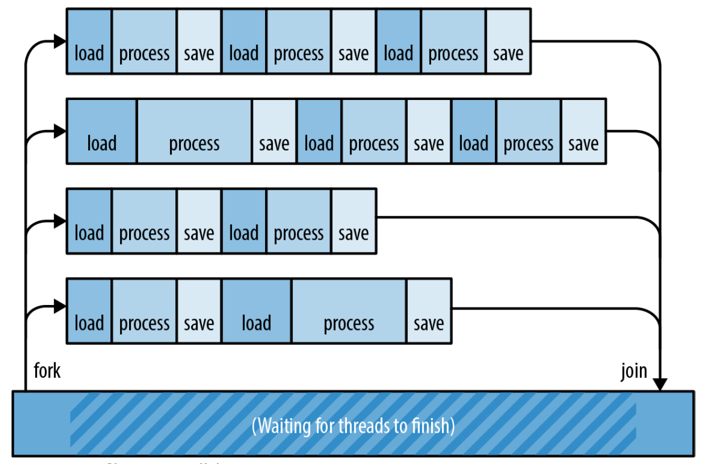
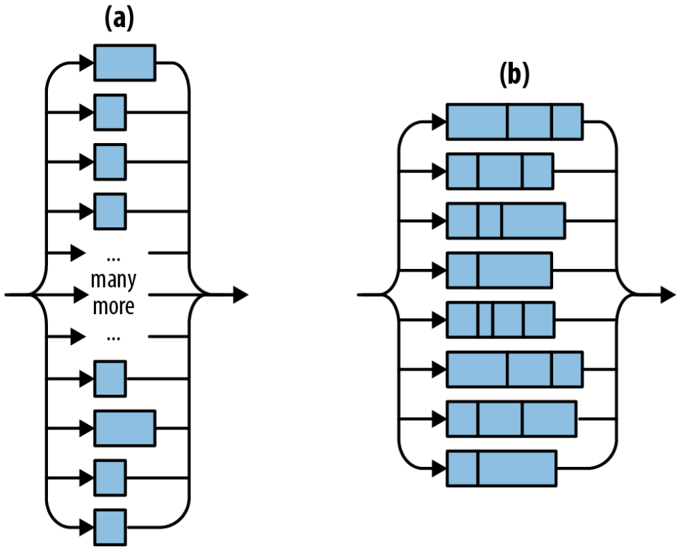
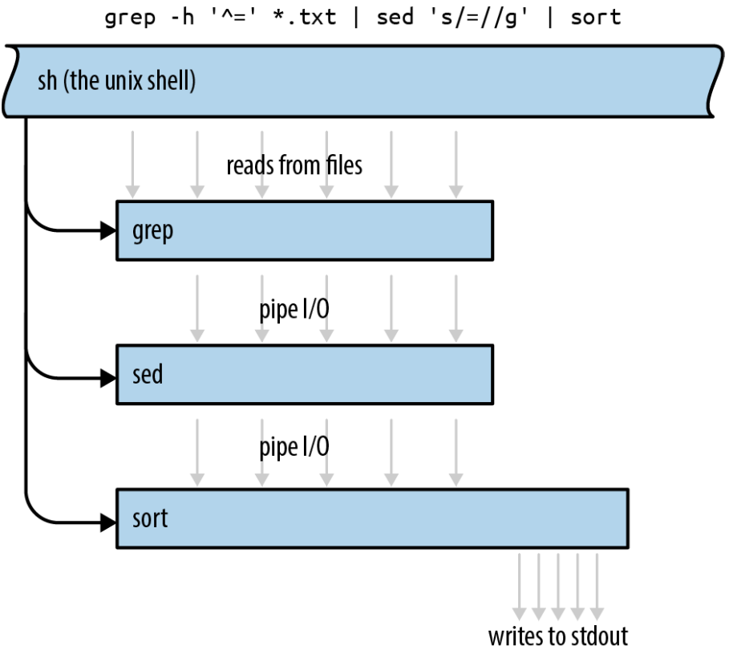
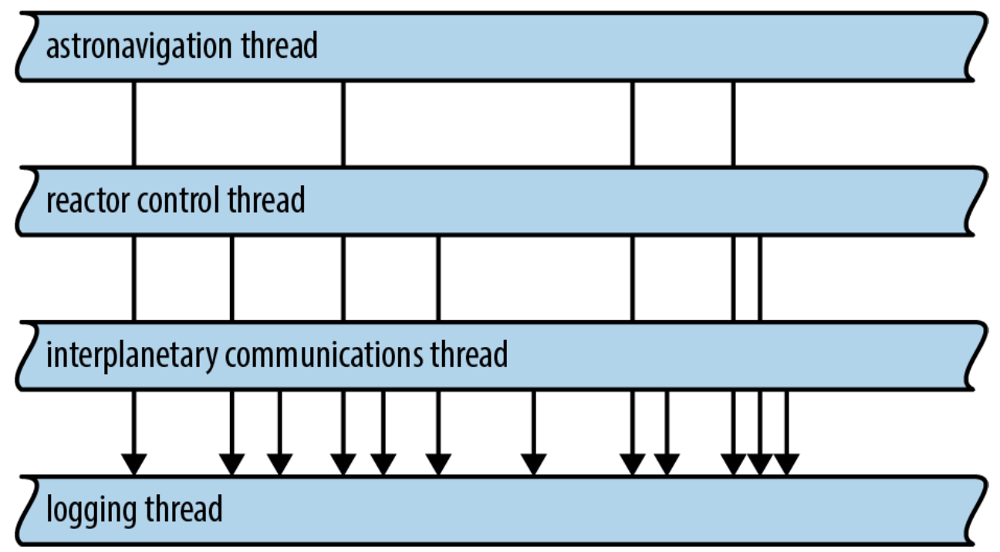
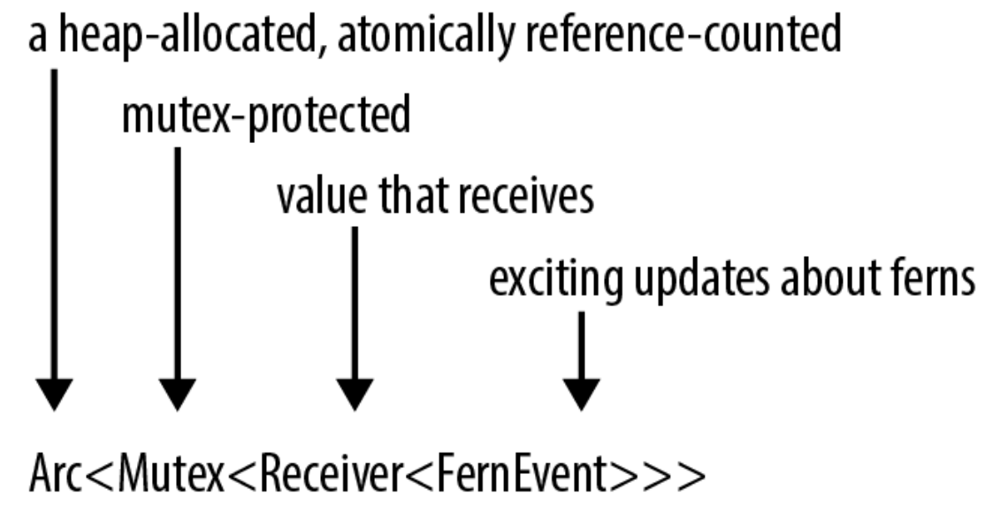

# 并发

 *In the long run it is not advisable to write large concurrent programs in machine-oriented languages that permit unrestricted use of store locations and their addresses. There is just no way we will be able to make such programs reliable (even with the help of complicated hardware mechanisms).* 

<p align="right">
    ——Per Brinch Hansen (1977)
</p>

 *Patterns for communication are patterns for parallelism.* 

<p align="right">
    ——Whit Morriss
</p>

如果你在职业生涯之中对并发的态度发生了改变，那你并不孤单，这是一种很常见的情况。

一开始的时候，编写并发代码是轻松并且愉快的。那些工具——线程，锁，队列等等——很容易上手和使用。虽然说实话也有很多的陷阱，但幸运的是你知道它们都是什么，所以你可以小心地不犯错误。

但有时，你不得不调试一些别人的多线程代码，然后你被迫得出结论： *有些人* 确实不应该使用这些工具。

然后有时你必须调试你自己的多线程代码。

经验会让你怀疑所有的多线程代码是否健康。少数的文章解释了为什么一些明显正确的多线程惯用写法完全不能工作，它们也许会有帮助。（它与“内存模型”有关。）但你最终会找到一种并发的方式，并且你觉得你能实际使用它且不会一直出错。你可能会把很多东西都塞进这种方法中，并且（如果你 *真的* 很优秀）你学会了对添加的复杂性说“不”。

当然，有很多种这样的方法。系统程序员经常使用的方法包括下面这些：

- 一个只处理单个任务的 *后台线程(background thread)* ，周期性地唤醒它执行任务。
- 通用的 *线程池(worker pool)* ，通过 *任务队列(task queue)* 和客户端交互。
-  *流水线(pipeline)* ，数据从一个线程流向下一个，每个线程都做一些工作。
-  *数据并行(data parallelism)* ，假设整个计算机主要在做很大型的计算，因此将数据分成 *n* 片然后在 *n* 个线程上运行，以让机器的 *n* 个核心一起工作。
-  *同步对象之海(a sea of synchronized objects)* ，多个线程都有同一个数据的访问权限，使用基于底层原语例如mutex的ad hoc  *锁(lock)* 方案来避免竞争。（Java内建了对这种模型的支持，这种模型在20世纪90年代和21世纪初非常流行。）
-  *原子整数操作(atomic integer operation)* 允许多个核通过一个机器字大小的字段传递信息来通信。（这比其他方式更难正确实现，除非交换的数据实际上只是整数值。在实践中，它通常是指针。）

随着时间的推移，你可能可以使用多种方式并安全地组合在一起。这时，你就是大师。如果没有其他人被允许修改系统，那么一切都会正常运作。正确使用线程的程序充满了不成文的规则。

Rust提供了一种更好的方式来使用并发，它并不强迫所有的程序使用单一的风格（这对系统程序员来说并不是解决方案），而是安全地支持多种风格。不成文的规则现在被写下来了——就在代码中——并且被编译器强迫遵循。

你可能听说过Rust可以让你编写安全、快速、并发的程序。本章我们将向你展示如何做到这些。我们将介绍三种使用Rust线程的方式：

- fork-join并行
- channel
- 共享可变状态

在此过程中，你将用到目前为止学过的所有Rust语言的知识。Rust关心的引用、可变性、生命周期在单线程程序中也很有价值，但只有在并发程序中这些规则真正的重要性才会显现出来。它们可以扩展你的工具箱，快速正确地破解多种风格的多线程代码——没有skepticism，没有cynicism，没有fear。

## fork-join并行

多线程最简单的使用场景是我们有几个想同时执行的完全独立的任务。例如，假设我们要对非常多的文档进行自然语言处理。我们可以编写一个循环：
```Rust
    fn process_files(filenames: Vec<String>) -> io::Result<()> {
        for document in filenames {
            let text = load(&document)?;    // 读取源文件
            let results = process(text);    // 计算数据
            save(&document, results)?;      // 写入到输出文件
        }
        Ok(())
    }
```

这个程序的运行情况如”图19-1”所示：


<p align="center">图19-1 单线程的<code>process_files()</code>执行过程</p>

因为每一个文档都是被单独处理，所以可以很容易的把所有文档分成几块、每一块在单独的线程中进行处理来加快速度，如”图19-2”所示。


<p align="center">图19-2 使用fork-join方法的多线程文件处理</p>

这个模式被称为 *fork-join并行* 。 *fork* 是启动一个新的线程， *join* 一个线程是等待它结束。我们已经看到过这个技术了：我们在”第2章”中使用了它来加速曼德勃罗集程序。

fork-join并行的优势主要在以下几个方面：

- 它太简单了。fork-join非常容易实现，并且Rust能帮你很轻松地保证它正确。
- 它避免了瓶颈。fork-join中没有共享资源的加锁，因此线程等待其他线程的唯一情况就是结束时。同时，每一个线程都可以自由地运行。这有助于保证很低的任务切换开销。
- 性能也非常直观。在最好的情况下，通过启动4个线程，我们可以用 $\frac{1}{4}$ 的时间完成任务。”图19-2”展示了为什么我们不应该期待这种理想的加速：我们可能不能均匀地把工作分布到所有的线程上。另一个要注意的原因是一些fork-join程序在所有的线程结束之后还要花费一些时间 *组合(combine)* 所有线程计算出的结果。即，完全分割任务可能要花费一些额外的工作。如果不考虑这两个原因，一个任务可以分割为独立单元的CPU密集的程序可以期待显著的性能提升。
- 很容易推断程序的正确性。只要每个线程真的被隔离，那么一个fork-join程序是 *确定性的(deterministic)* ，例如曼德勃罗集程序中的计算线程。程序总是会产生相同的结果，和线程速度的变化无关。它是一种没有竞争条件的并发模型。

fork-join的主要缺点是它需要无关的任务单元。本章稍后我们会考虑一些不能分割的这么清晰的问题。

现在，让我们继续看自然语言处理的例子。我们将展示一些将fork-join模式应用于`process_files`函数的方式。

### `spawn`和`join`

函数`std::thread::spawn`启动一个新线程：
```Rust
    use std::thread;

    thread::spawn(|| {
        println!("hello from a child thread");
    });
```

它接受一个参数：一个`FnOnce`闭包或者函数。Rust启动一个新的线程来运行这个闭包或者函数。新的线程是一个真实的操作系统线程，有自己的栈，就类似于C++、C#、Java中的线程。

这里有一个例子，使用`spawn`来实现之前的`process_files`函数的一个并行版本：
```Rust
    use std::{thread, io};

    fn process_files_in_parallel(filenames: Vec<String>) -> io::Result<()> {
        // 把工作分成几块。
        const NTHREADS: usize = 8;
        let worklists = split_vec_into_chunks(filenames, NTHREADS);

        // Fork：创建一个新线程来处理每一个块。
        let mut thread_handles = vec![];
        for worklist in worklists {
            thread_handles.push(
                thread::spawn(move || process_files(worklist))
            );
        }

        // Join：等待所有线程结束。
        for handle in thread_handles {
            handle.join().unwrap()?;
        }

        Ok(())
    }
```

让我们逐行分析这个函数。
```Rust
    fn process_files_in_parallel(filenames: Vec<String>) -> io::Result<()> {
```

我们的新函数和原本的`process_files`有完全相同的类型签名，这让它可以更轻松地替换原来的函数。

```Rust
        // 把工作分成几块。
        const NTHREADS: usize = 8;
        let worklists = split_vec_into_chunks(filenames, NTHREADS);
```

我们使用了一个工具函数`split_vec_into_chunks`来分割任务，不过这里没有展示。分割的结果`worklists`是一个vector的vector。它包含原本的vector `filenames`均匀分配的8个部分。

```Rust
        // Fork：创建一个新线程来处理每一个块。
        let mut thread_handles = vec![];
        for worklist in worklists {
            thread_handles.push(
                thread::spawn(move || process_files(worklist))
            );
        }
```

我们为每一个`worklist`启动了一个线程。`spawn()`返回一个称为`JoinHandle`的值，我们之后会使用它。现在，我们只是将所有的`JoinHandle`放进一个vector里。

注意我们如何把文件名的列表传进工作线程里：

- `worklist`在父线程的`for`循环中定义和初始化。
- 一旦`move`闭包创建完成，`worklist`就会被移动进闭包里
- 然后`spawn`把闭包（包括`worklist`）移动进新的子线程。

这些移动操作开销很小。正如我们在”第4章”中讨论的`Vec<String>`的移动一样，`String`并不会被拷贝。事实上，没有任何东西被分配或者释放。唯一被移动的数据是`Vec`自己：三个机器字。

你创建的大多数线程都同时需要代码和数据才能运行。Rust闭包可以便捷地包含你需要的代码和数据。

继续：
```Rust
        // Join：等待所有线程结束。
        for handle in thread_handles {
            handle.join().unwrap()?;
        }
```

我们使用了之前收集的`JoinHandle`的`.join()`方法来等待8个线程全部结束。为了保证正确性，join线程通常是必须的，因为一旦`main`返回Rust程序就会退出，即使其他的线程仍然在运行。析构器不会被调用，额外的线程被简单地杀死。如果这不是你想要的，确保在`main`返回之前join所有你关心的线程。

如果这个循环结束了，那么意味着8个子线程都已经成功结束。我们的函数返回一个`Ok(())`并结束：
```Rust
        Ok(())
    }
```

### 跨线程的错误处理

我们的例子中用来join子线程的代码比看起来更加有趣，因为还要考虑错误处理。让我们回顾这一行代码：
```Rust
    handle.join().unwrap()?;
```

`.join()`方法给我们带来了两个问题。

首先，`handle.join()`返回一个`std::thread::Result`， *如果子线程panic* 那么它的值将是一个错误。这使得Rust中的线程比C++中更健壮。在C++中，一个越界的数组访问是未定义行为，并且没有办法保护系统中的其他部分不受其影响。在Rust中，”panic是安全的并且以线程为单位”。线程之间的边界充当panic时的防火墙；panic并不会自动从一个线程传播到依赖它的线程。一个线程中的panic在其他线程中作为一个值为错误的`Result`汇报。整个程序可以不受其影响。

在我们的程序中，我们没有尝试任何panic的处理。我们简单地对返回的`Result`调用`.unwrap()`，假定它一定是一个`Ok`的结果而不是`Err`的结果。如果一个子线程 *确实* panic了，那么这个断言会失败，因此父线程也会panic。我们显式地把子线程的panic传播到父线程。

其次，`handle.join()`会把子线程返回的值传递给父线程。我们传递给`spawn`的闭包的返回类型是`io::Result<()>`，因为`process_files`返回这个类型。这个返回值不会被丢弃，当子线程结束时，它的返回值会被保存，`JoinHandle::join()`会把值传递给父线程。

这个程序中`handle.join()`返回的类型是`std::thread::Result<std::io::Result<()>>`。`thread::Result`是`spawn/join` API的一部分；`io::Result`是我们程序的一部分。

在我们的例子中，解包了`thread::Result`之后，我们对`io::Result`使用了`?`运算符，显式地把子线程的I/O错误传播给父线程。

整个过程看起来可能很复杂，但这其实也只是一行代码的功能。将它与其它语言比较：Java和C#中的默认行为是将子线程的异常转储到终端，然后忽略。在C++中，默认行为是终止进程。在Rust中，错误是`Result`值（数据）而不是异常（控制流）。它们像其他任何值一样在线程之间传递。每一次使用底层线程的API时，你都必须小心地编写错误处理代码，但考虑到 *你必须编写它们* ，所以Rust在这一点上做得很好。

### 跨线程共享不可变数据

假设我们正在进行的分析需要一个非常大的由英文单词和短语组成的数据库：
```Rust
    // 之前
    fn process_files(filenames: Vec<String>)

    // 之后
    fn process_files_in_parallel(filenames: Vec<String>, glossary: &GigabyteMap)
```

`glossary`可能很大，所以我们通过引用传递它。我们应该如何更新`process_files_in_parallel`来在多个工作线程间传递词汇表呢？

显而易见的修改方法并不能工作：
```Rust
    fn process_files_in_parallel(filenames: Vec<String>,
                                 glossary: &GigabyteMap)
        -> io::Result<()>
    {
        ...
        for worklist in worklists {
            thread_handles.push(
                spawn(move || process_files(worklist, glossary))    // 错误
            );
        }
        ...
    }
```

我们只是简单地给函数添加了一个`glossary`参数并把它传递给`process_files`。Rust会报错：
```
    error[E0621]: explicit lifetime required in the type of `glossary`
      --> src/lib.rs:75:17
       |
    61 |     glossary: &GigabyteMap)
       |               ------------ help: add explicit lifetime `'static` to the 
                                    type of `glossary`: `&'static BTreeMap<String,
                                    String>`
    ...
    75 |                 spawn(move || process_files(worklist, glossary))
       |                 ^^^^^ lifetime `'static` required
```

Rust在抱怨我们传递给`spawn`的闭包的生命周期，编译器给出的“有帮助的”信息实际上也没有一点帮助。

`spawn`启动独立的线程。Rust没有办法知道子线程会运行多长时间，因此它假设最坏的情况：它假设子线程会一直保持运行，然而在父线程结束之后父线程里的所有值都会消失。显然，如果子线程要持续很长时间，那么它运行所需要的闭包也应该持续这么长时间。但这个闭包有一个有界的生命周期：它依赖于引用`glossary`，但引用并不会一直有效。

注意Rust拒绝这段代码是正确的！按照我们编写这个函数的方式， *有可能* 一个线程遇到I/O错误，导致`process_files_in_parallel`在其他线程结束之前结束。子线程可能会在主线程释放`glossary`之后仍然尝试使用它。这会导致未定义行为。Rust不允许出现这种情况。

看起来`spawn`太过开放以至于不能支持跨线程共享引用。事实上，我们已经在“偷取值的闭包”中见到过一个类似于这样的例子。那一次我们的解决方案是使用`move`闭包把数据的所有权移动到新线程里。但那种方法在这里不能生效，因为我们有很多线程需要使用相同的数据。一个安全的替代方案是为每一个线程`clone`一份词汇表，但因为它很庞大，我们希望避免这些开销。幸运的是，标准库提供了另一种方案：自动引用计数。

我们在“Rc和Arc：共享所有权”中介绍过`Arc`。现在正是使用它的时候：
```Rust
    use std::sync::Arc;

    fn process_files_in_parallel(filenames: Vec<String>,
                                 glossary: Arc<GigabyteMap>)
        -> io::Result<()>
    {
        ...
        for worklist in worklists {
            // 这里的.clone()调用只会克隆Arc并递增引用计数。
            // 它并不会克隆GigabyteMap。
            let glossary_for_child = glossary.clone();
            thread_handles.push(
                spawn(move || process_files(worklist, &glossary_for_child))
            );
        }
        ...
    }
```

我们改变了`glossary`的类型：为了进行并行分析，调用者必须传递一个`Arc<GigabyteMap>`，它是使用`Arc::new(giga_map)`创建的一个指向堆上的`GigabyteMap`的智能指针。

当我们调用`glossary.clone()`时，我们是在创建`Arc`智能指针的一个拷贝，而不是整个`GigabyteMap`的拷贝。它只会递增一个引用计数。

修改之后，程序就可以编译运行了，因为它不再依赖引用的生命周期。只要有 *任何* 线程还持有一个`Arc<GigabyteMap>`，它就会保持词汇表仍然存在，即使父线程提前退出。也不会有任何数据竞争，因为`Arc`里的数据是不可变的。

### Rayon

标准库的`spawn`函数是一个重要的原语，但它并不是专为fork-join并行设计的。还有基于它们构建的更好的fork-join API。例如，”第2章”中我们使用了Crossbeam库把一些任务分割给8个进程。Crossbeam的 *scoped thread(作用域线程)* 非常自然地支持fork-join并行。

Niko Matsakis和Josh Stone编写的Rayon库是另外一个例子。它提供两种并发运行任务的方法：
```Rust
    use rayon::prelude::*;

    // 并行做2件事
    let (v1, v2) = rayon::join(fn1, fn2);

    // 并行做N件事
    giant_vector.par_iter().for_each(|value| {
        do_thing_with_value(vaue);
    });
```

`rayon::join(fn1, fn2)`同时调用两个函数并返回两个结果。`.par_iter()`方法创建一个`ParallelIterator`，它有`map`、`filter`以及其它的方法，非常像Rust中的`Iterator`。在这两种情况下，Rayon都会尽可能使用它自己的工作线程池来处理任务。你只需要告诉Rayon什么样的任务 *可以* 并行完成；Rayon负责管理线程并尽可能好地分发任务。

”图19-3”展示了有关调用`giant_vector().par_iter().for_each(...)`的两种思考方式：(a) Rayon为vector中的每个元素创建一个线程。(b) Rayon在幕后维护等同于CPU核数个工作线程，每个工作线程运行在每个CPU核上，这样会更加高效。工作线程池被程序的所有线程共享，当同时有上千个任务到达时，Rayon会划分任务。


<p align="center">图19-3 理论和实践中的Rayon</p>

这里有一个使用Rayon的`process_files_in_parallel`的版本，并且它要运行的`process_file`函数，不再需要`Vec<String>`，而是需要`&str`：
```Rust
    use rayon::prelude::*;

    fn process_files_in_parallel(filenames: Vec<String>, glossary: &GigabyteMap)
        -> io::Result<()>
    {
        filenames.par_iter()
            .map(|filename| process_file(filename, glossary))
            .reduce_with(|r1, r2| {
                if r1.is_err() { r1 } else { r2 }
            })
            .unwrap_or(Ok(()))
    }
```

这段代码比使用`std::thread::spawn`的版本更加简短，也更加容易理解。让我们逐行分析它：

- 首先，我们使用了`filenames.par_iter()`来创建一个并行迭代器。
- 我们使用`.map()`来对每一个文件名调用`process_file`。这会返回一个产生`io::Result<()>`值的序列的`ParallelIterator`。
- 我们使用`.reduce_with()`来组合结果。这里我们保留了第一个错误并丢弃剩余的内容。如果我们想累计所有的错误，或者打印它们，我们可以在这里完成。
- 当你向`.map()`传递一个在成功时会返回有用值的闭包时，`.reduce_with()`方法也非常方便。你可以向`.reduce_with()`传递一个知道如何组合两个成功结果的闭包。
- `reduce_with`返回一个`Option`，只有当`filenames`为空时它是`None`。我们使用了`Option`的`.unwrap_or()`方法以在这种情况下产生一个`Ok(())`。

在幕后，Rayon会使用一种叫做 *work-stealing* 的技术动态地实现多个线程的负载均衡。通常保持所有CPU核心忙碌比“`spawn`和`join`”中的事先手动划分任务效果会更好。

作为奖励，Rayon支持在线程之间共享引用。所有幕后的并行处理都保证在`reduce_with`返回之前结束。这解释了为什么我们可以向`process_file`传递`glossary`，即使这个闭包将会在多个线程间调用。

（顺便说一下，我们使用`map`和`reduce`方法并不是巧合。被Google和Apache Hadoop推广的MapReduce编程模型和fork-join方法有很多相同之处。它可以被看做处理分布式数据的fork-join方法。

### 回顾曼德勃罗集

回顾”第2章”，我们使用了fork-join并发来渲染曼德勃罗集。这让渲染过程变快了四倍——这很有吸引力，但考虑我们是把程序分割为8个工作线程并在一台8核机器上运行它，它似乎还能做得更好。

问题在于我们没有平均分配工作负载。计算图像的一个像素点等同于运行一次循环（见“曼德勃罗集到底是什么”）。事实证明对于图像的淡灰色部分的像素点，循环会快速退出，比渲染那些需要循环255次的黑色部分要快很多。因此尽管我们把区域分成了大小相等的水平条带，实际上我们创建的还是不同等的工作负载，如”图19-4”所示。


<p align="center">图19-4 曼德勃罗集程序中不均匀的工作划分</p>

使用Rayon可以很容易地解决这个问题。我们可以简单地为输出中的每一行启动一个并行任务。这会创建几百个任务，Rayon可以把它们分配给不同的线程。得益于work-stealing，不同任务的大小不同并不会导致问题。Rayon会在运行时均衡任务。

这里是代码。第一行和最后一行是我们在“一个并发的曼德勃罗集程序”展示过的`main`函数的一部分，但我们修改了中间的渲染部分代码：
```Rust
    let mut pixels = vec![0; bounds.0 * bounds.1];

    // 将`pixels`切割为水平条带的作用域
    {
        let bands: Vec<(usize, &mut [u8])> = pixels
            .chunks_mut(bounds.0)
            .enumerate()
            .collect();
        
        bands.into_par_iter()
            .for_each(|(i, band)| {
                let top = i;
                let band_bounds = (bounds.0, 1);
                let band_upper_left = pixel_to_point(bounds, (0, top),
                                                     upper_left, lower_right);
                let band_lower_right = pixel_to_point(bounds, (bounds.0, top + 1),
                                                      upper_left, lower_right);
                render(band, band_bounds, band_upper_left, band_lower_right);
            });
    }

    write_image(&args[1], &pixels, bounds).expect("error writing PNG file");
```

首先我们创建了`bands`，它是我们要传递给Rayon的任务的集合。每一个任务都只是一个类型为`(usize, &mut [u8])`的元组：行号（计算时要用到它）以及要填充的`pixels`的切片。我们使用了`chunks_mut`方法把图像缓冲区分割成很多行，`enumerate`来给每一行附加一个行号，使用`collect`来把所有行号-切片对收集成vector。（我们需要vector是因为Rayon只能根据数组和vector创建并行迭代器。）

接下来，我们把`bands`变为一个并行迭代器，使用`.for_each()`方法来告诉`Rayon`我们想要做什么工作。

因为我们在使用Rayon，因此我们必须在 *main.rs* 中加上下面这一行：
```Rust
    use rayon::prelude::*;
```
并在 *Cargo.toml* 中加上：
```Rust
    [dependencies]
    rayon = "1"
```

有了这些修改，这个程序现在在8核机器上大概使用了7.75个核。它比之前手动分割任务快了75%，代码也短了一些，这反映出让crate完成一些工作（负载分发）比我们自己来做的优势。

## 通道

 *通道(channel)* 是一种从一个线程向另一个线程发送数据的管道。换句话说，它是一个线程安全的队列。

”图19-5”展示了通道应该怎么使用。它们和Unix管道有些像：一端发送数据，另一端接收。两端通常被两个不同的线程持有。但Unix管道用来发送字节，通道用来发送Rust值。`sender.send(item)`把一个值放入通道中；`receiver.recv()`从通道中取出一个值。所有权从发送线程移动到接收线程。如果通道是空的，`receiver.recv()`会阻塞，直到有一个值被发送。


<p align="center">图19-5 一个<code>String</code>的通道：字符串<code>msg</code>的所有权从线程1移动到线程2</p>

有了通道，不同的线程可以通过传递值来进行通信。这是一种非常简单的让线程在没有锁或共享内存的情况下协同工作的方法。

这并不是一种新技术。Erlang有隔离进程和消息传递已经30年了。Unix的管道大概已经50年了。我们更倾向于管道是一种提供灵活性和组合性的机制，而不是并发的机制，但事实上，它可以完成所有这些功能。Unix管道的一个示例如”图19-6”所示。显然三个程序同时工作是可能的。

Rust的通道比Unix的管道更快。发送一个值只是移动它而不是拷贝它，并且即使你要移动一个包含很多MB的数据结构也很快速。


<p align="center">图19-6 Unix流水线的执行</p>

### 发送值

在接下来的几节中，我们会使用通道构建一个创建 *倒排索引(inverted index)* 的并发程序，倒排索引是搜索引擎的一项关键技术。每一个搜索引擎工作在一个文档的集合上。倒排索引是一个指示哪个单词在哪里出现过的数据库。

我们将展示使用线程和通道的部分代码，[完整的程序](https://github.com/ProgrammingRust/fingertips)很短，总共只有大约1千行。

我们的程序被组织为流水线架构，如”图19-7”所示。流水线只是使用通道的很多方式中的一种——我们之后将会讨论少数其他的方式——但它们是一种直观地把并发引入现有的单线程程序的方式。


<p align="center">图19-7 构建索引的流水线，箭头代表值通过通道被从一个线程送到另一个线程（磁盘I/O没有显示出来）</p>

我们总共将使用5个线程，每一个都做不同的任务。每一个线程都会在整个程序的生命周期中持续产生输出。例如第一个线程，简单地把源文档一个个地从磁盘读取到内存中。（我们用一个单独的线程来执行这个任务，是因为我们要使用`fs::read_to_string`来编写尽可能简单的代码，它是一个阻塞的API。我们不想让CPU在磁盘工作时一直闲置。）这一阶段的输出是每一个文档转换成的长`String`，因此这个线程和下一个线程通过一个`String`的通道连接。

我们的程序将以创建一个读取文件的线程开始。假设`document`是一个`Vec<PathBuf>`，即文件名的vector。启动读取文件的线程的代码如下：
```Rust
    use std::{fs, thread};
    use std::sync::mpsc;

    let (sender, receiver) = mpsc::channel();

    let handle = thread::spawn(move || {
        for filename in documents {
            let text = fs::read_to_string(filename)?;

            if sender.send(text).is_err() {
                break;
            }
        }
        Ok(())
    });
```

通道是`std::sync::mpsc`模块的一部分。我们稍后将解释这个名字的含义；首先，让我们看看这段代码怎么工作。我们首先创建一个通道：
```Rust
    let (sender, receiver) = mpsc::channel();
```

`channel`函数返回一个值对：一个sender和一个receiver。底层的队列数据结构是一个标准库没有暴露的实现细节。

通道是有类型的。我们将使用这个通道来发送每个文件的文本，因此我们有了一个`Sender<String>`类型的`sender`和一个`Receiver<String>`类型的`receiver`。我们可以通过写`mpsc::channel::<String>()`来显式地要求一个字符串的通道。或者也可以让Rust的类型推导来判断它的类型。

```Rust
    let handle = thread::spawn(move || {
```
和之前一样，我们使用`std::thread::spawn`来启动一个线程。`sender`的所有权通过`move`闭包移动到了新的线程（`receiver`的所有权没有移动）。

接下来的几行代码简单地从磁盘读取文件：
```Rust
        for filename in documents {
            let text = fs::read_to_string(filename)?;
```

在成功读取一个文件之后，我们将它的文本送入通道：
```Rust
            if sender.send(text).is_err() {
                break;
            }
        }
```

`sender.send(text)`把值`text`移动到通道里。最后，它被移动到接收值的线程里。不管`text`包含10行还是10MB文本，这个操作都只会拷贝三个机器字（一个`String`结构体的大小），相应的`receiver.recv()`调用也会拷贝三个机器字。

`send`和`recv`方法都返回`Result`，但这些方法只在通道的另一端被drop的情况下才会失败。如果`Receiver`被drop了，`send`调用会失败，因为如果不这么做，这个值将会永远留在通道中：没有了`Receiver`，就没有办法让任何线程接收它。类似的，如果通道中没有值并且`Sender`被drop了，`recv`调用会失败，因为如果不这么做，`recv`将会永远等待下去：没有了`Sender`，就没有方法让任何线程发送下一个值。drop通道的一端是通常的“挂断”方式，当你使用完它时用这种方法关闭连接。

在我们的代码中，只有当receiver的线程提前退出，`sender.send(text)`才会失败。这是使用通道的代码的典型情况。不管这是故意的还是因为错误，我们的reader线程直接退出都是没有问题的。

当这种情况发生时，或者线程读取完所有文档后，它会返回`Ok(())`：
```Rust
        Ok(())
    });
```

注意这个闭包返回一个`Result`。如果这个线程遇到了一个I/O错误，它会立即退出，并且错误会被存储在该线程的`JoinHandle`中。

当然，和其他编程语言一样，Rust在错误处理方面允许很多其他的可能性。当错误发生时，我们可以简单地使用`println!`打印出它，然后继续下一个文件。我们可以通过正在用来传递数据的通道传递这个错误，只需要将它改成`Result`的通道——或者为错误创建第二个通道。我们在这里选择的方式既轻量又负责：我们使用了`?`操作符，因此不会有很多样板代码，也不会有你可能会在Java中见到的显式的`try/catch`，并且错误不会被悄悄地忽略。

为了方便，我们的程序把这些代码包装为了一个返回`receiver`（我们还没有使用过它）和新线程的`JoinHandle`的函数：
```Rust
    fn start_file_reader_thread(documents: Vec<PathBuf>)
        -> (mpsc::Receiver<String>, thread::JoinHandle<io::Result<()>>)
    {
        let (sender, receiver) = mpsc::channel();

        let handle = thread::spawn(move || {
            ...
        });

        (receiver, handle)
    }
```

注意这个函数启动了一个新线程然后立刻返回。我们将为流水线的每个阶段编写一个类似这样的函数。

### 接收值

现在我们有了一个循环发送值的线程。我们可以第二个线程循环调用`receiver.recv()`：
```Rust
    while let Ok(text) = receiver.recv() {
        do_something_with(text);
    }
```

但`Receiver`是可迭代对象，因此还有一种更好的写法：
```Rust
    for text in receiver {
        fo_something_with(text);
    }
```

这两个循环是等价的。不管用哪种方式写，如果当控制流到达循环时通道恰好为空，那么receiver线程会阻塞直到其他线程发送了值。当通道为空并且`Sender`被drop时循环会正常退出。在我们的程序中，当reader线程退出时就会很自然地变为这种情况。正在运行闭包的线程拥有变量`sender`；当闭包退出时，`sender`会被drop。

现在我们可以编写流水线的第二个阶段：
```Rust
    fn start_file_indexing_thread(texts: mpsc::Receiver<String>)
        -> (mpsc::Receiver<InMemoryIndex>, thread::JoinHandle<()>)
    {
        let (sender, receiver) = mpsc::channel();

        let handle = thread::spawn(move || {
            for (doc_id, text) in texts.into_iter().enumerate() {
                let index = InMemoryIndex::from_single_document(doc_id, text);
                if sender.send(index).is_err() {
                    break;
                }
            }
        });

        (receiver, handle)
    }
```

这个函数创建一个从其他线程接收`String`值(`text`)然后向另一个通道发送`InMemoryIndex`值的线程。这个线程的任务是接收第一个阶段加载的文件内容，并把每一个文档转换成一些内存中的倒排索引。

这个线程的主循环很直观。`InMemoryIndex::from_single_document`函数负责完成所有索引文档的工作。我们并没有在这里展示它的代码，但它把输入的字符串切分为单词，并产生一个单词到其出现位置的映射。这个阶段没有I/O操作，因此它不需要处理`io::Error`。所以它返回`()`而不是`io::Result<()>`。

### 运行流水线

剩余的三个阶段在设计上很相似，每个阶段都消耗上一个阶段创建的`Receiver`。流水线剩余部分的目标是把所有小索引合并成一个更大的索引，并保存为磁盘上的文件。我们发现最快的方式是以三个阶段来实现它。我们没有在这里给出代码，只是给出了这三个函数的签名。完整的代码可以在线获得。

首先，我们在内存中合并索引（阶段3）：
```Rust
    fn start_in_memory_thread(file_indexes: mpsc::Receiver<InMemoryIndex>)
        -> (mpsc::Receiver<InMemoryIndex>, thread::JoinHandle<()>)
```

然后我们把这些很大的索引写入磁盘（阶段4）：
```Rust
    fn start_index_writer_thread(big_indexes: mpsc::Receiver<InMemoryIndex>,
                                 output_dir: &Path)
        -> (mpsc::Receiver<PathBuf>, thread::JoinHandle<io::Result<()>>)
```

最后，如果我们有了多个很大的文件，我们使用文件合并算法合并它们（阶段5）：
```Rust
    fn merge_index_files(files: mpsc::Receiver<PathBuf>, output_dir: &Path)
        -> io::Result<()>
```

这最后一个阶段不返回`Receiver`，因为它是流水线的结尾。它产生磁盘上的单个输出文件。它也不返回`JoinHandle`，因为我们不需要为这个阶段创建新线程，它的工作可以在调用者的线程完成。

现在就到了启动这些线程和检查错误的代码了：
```Rust
    fn run_pipeline(documents: Vec<PathBuf>, output_dir: PathBuf)
        -> io::Result<()>
    {
        // 启动流水线的5个阶段。
        let (texts,   h1) = start_file_reader_thread(documents);
        let (pints,   h2) = start_file_indexing_thread(texts);
        let (gallons, h3) = start_in_memory_merge_thread(pints);
        let (files,   h4) = start_index_writer_thread(gallons, &output_dir);
        let result = merge_index_files(files, &output_dir);

        // 等待所有线程结束，处理它们可能遇到的所有错误。
        let r1 = h1.join().unwrap();
        h2.join().unwrap();
        h3.join().unwrap();
        let r4 = h4.join().unwrap();

        // 返回遇到的第一个错误，如果有的话。
        // （h2和h3不可能失败：那些线程只进行纯内存中的数据处理。）
        r1?;
        r4?;
        result
    }
```

和之前一样，我们使用`.join().unwrap()`来显式地把子线程的panic传播到主线程。唯一不同的地方在于我们这里并没有直接使用`?`，而是保存了`io::Result`值，直到join了所有线程之后才处理`Result`值。

这个流水线比单线程的实现快了40%。一下午的时间能做到做一点已经不错了，不过如果和我们之前在曼德勃罗集中取得的675%的加速相比，我们显然没有充分利用系统的I/O性能或者CPU核心。这是为什么呢？

流水线就像生产工厂中的装配线：整体的性能受限于最慢的阶段的吞吐量。在我们的例子中，测量结果表示第二个阶段是瓶颈。我们的索引线程使用了`.to_lowercase()`和`.is_alphanumeric()`，因此它需要很长时间在Unicode表中查找。其他的后续阶段把大部分时间浪费在`Receiver::recv`等待输入上。

这意味着我们应该能更快。因为我们定位到了瓶颈，因此并行度还可以提高。现在你已经知道了如何使用通道，我们的程序由很多独立的代码片段组成，很容易找到解决这个瓶颈的方法。我们可以优化第二个阶段，就像其他代码一样：把它的工作划分为两个或更多的阶段，或者同时运行多个文件索引线程。

### 通道的特性和性能

`std::sync::mpsc`中的`mpsc`代表着 *多生产者，单消费者(multi-producer, single-consumer)* ，简洁地描述了Rust的通道提供的这种通信方式。

我们的示例程序中的通道将值从单个发送者移动到单个接收者。这是非常常见的情况。但是Rust的通道还支持多个发送者的情况，即用单个线程处理来自多个客户端线程的请求，如”图19-8”所示。


<p align="center">图19-8 从很多发送者接收请求的单个通道</p>

`Sender<T>`实现了`Clone` trait。为了得到一个多个发送者的通道，简单地创建一个普通的通道然后随意克隆sender任意次。你可以将每个`Sender`值移动到不同的线程。

`Receiver<T>`不能克隆，因此如果你需要多个线程接受来自单个通道的数据，你需要使用`Mutex`。我们将在本章稍后展示如何使用它。

Rust的通道被精心优化过。当通道第一次创建时，Rust使用了一个特殊的“one-shot（一次性）”队列实现。如果你只通过通道发送一个对象，开销会非常小。如果发送了第二个值，Rust会切换到不同的队列实现。它会转换为稳定的通道来传输多个值，同时最小化分配开销。如果你克隆了`Sender`，Rust必须转换为另一种实现，这种实现在多个线程同时发送值时也是安全的。但即使是这三种实现中最慢的一种也是一个无锁的队列，因此发送或接收值最多就是一些原子操作和一次堆分配，加上移动它的开销。只有当队列为空并且接收线程因此需要睡眠时才会调用系统调用。当然，在这种情况下，通道无论如何都不会限制吞吐量。

除了这些优化工作之外，应用程序很容易犯一个有关通道性能的错误：发送值的速度比接收和处理值更快，这可能会导致通道中累积的值不断增长。例如，在我们的程序中，我们发现文件读取线程（阶段1）加载文件可能比索引线程（阶段2）构建索引更快。结果就是数百个从磁盘中读取的MB大小的原始数据同时堆积在队列中。

这种错误不仅会消耗内存还会破坏局部性。更糟的是，发送线程在其他线程最需要资源的时候持续运行，耗尽了CPU和其他的系统资源来发送更多值。

这里Rust再次参考了Unix管道。Unix使用了一个优雅的技巧来提供 *backpressure(背压)* ，这样快速的发送者会被迫减速：Unix中的每个管道有一个固定大小，如果一个进程尝试写入一个已经满了的管道，系统会简单地阻塞这个进程，直到管道中有空间。Rust中等价的组件是 *同步通道(synchronous channel)* ：
```Rust
    use std::sync::mpsc;

    let (sender, receiver) = mpsc::sync_channel(1000);
```

同步通道实际上就是普通的通道，除了当你创建它时可以指定它可以存储多少值。对于一个同步通道，`sender.send(value)`是一个阻塞操作。毕竟，设计它的idea是阻塞并不是一件坏事。在我们的示例程序中，将`start_file_reader_thread`中的`channel`修改为能存储32个值的`sync_channel`可以在保证吞吐量不变的情况下减少 $\frac{2}{3}$ 的内存占用。

### 线程安全：`Send`和`Sync`

目前为止我们操作的所有值都可以自由地在线程间移动和共享。大部分情况都是这样，但Rust的完整的线程安全取决于两个内建的trait：`std::marker::Send`和`std::marker::Sync`。

- 实现了`Send`的类型可以安全地以值传递到另一个线程。它们可以在线程之间移动。
- 实现了`Sync`的类型可以安全地以非`mut`引用传递到另一个线程。它们可以在线程之间共享。

这里的 *安全(safe)* 指的是我们通常所说的含义：没有数据竞争和其它未定义行为。

例如，在`process_files_in_parallel`示例中，我们使用了一个闭包来从父线程给每个子线程传递一个`Vec<String>`。我们当时并没有指出，但这意味着vector和它的字符串都是在父线程中分配，但却在子线程中释放。事实是`Vec<String>`实现了`Send`，它是一种承诺这样做没问题的API：`Vec`和`String`内部使用的分配器是线程安全的。

（如果你想基于更快但不是线程安全的分配器实现你自己的`Vec`和`String`类型，你可能需要使用不是`Send`的类型来实现它们，例如unsafe指针。然后Rust会推断出你的`NonThreadSafeVec`和`NonThreadSafeString`类型不是`Send`，并限制它们只能在单线程中使用。但这种情况很少见。）

如”图19-9”所示，大多数类型都是`Send`和`Sync`。你甚至不需要使用`#[derive]`来为你的结构体和枚举实现它们。Rust会自动实现。如果结构体或枚举的所有字段都是`Send`/`Sync`，那么它们也是`Send`/`Sync`。


<p align="center">图19-9 <code>Send</code>和<code>Sync</code>类型</p>

一些类型是`Send`，但不是`Sync`。这通常是故意的，就像`mpsc::Receiver`的例子中，它保证`mpsc`通道的接收端同时只能被一个线程使用。

那些少数既不是`Send`又不是`Sync`的类型通常是以线程不安全的方式实现可变性的类型。例如`std::rc::Rc<T>`，它是引用计数的智能指针类型。

如果`Rc<String>`是`Sync`、允许多个线程通过共享引用共享一个`Rc`会发生什么？如果有多个线程恰好同时克隆`Rc`，如”图19-10”所示，就会出现数据竞争，因为有多个线程同时想递增引用计数。引用计数就可能变得不精确，进而导致之后出现释放后使用或两次释放——即未定义行为。


<p align="center">图19-10 为什么<code>Rc&lt;String&gt;</code>既不是<code>Sync</code>也不是<code>Send</code></p>

当然，Rust会阻止这种情况。这里有一段产生这种数据竞争的代码：
```Rust
    use std::thread;
    use std::rc::Rc;

    fn main() {
        let rc1 = Rc::new("ouch".to_string());
        let rc2 = rc1.clone();
        thread::spawn(move || { // error
            rc2.clone();
        });
        rc1.clone();
    }
```

Rust拒绝编译它，并给出了详细的错误消息：
```
    error[E0227]: `Rc<String>` cannot be sent between threads safely
      --> concurrency_send_rc.rs:10:5
       |
    10 |     thread::spawn(move || { // error
       |             ^^^^^ `Rc<String>` cannot be sent between threads safely
       |
       = help: the trait `std::marker::Send` is not implemented for `Rc<String>`
       = note: required because it appears within the type `[closure@...]`
       = note: required by `std::thread::spawn`
```

现在你可以看到`Send`和`Sync`如何帮助Rust强制线程安全性。它们作为在线程间传递数据的函数签名中的类型约束出现。当你`spawn`一个线程时，你传递的闭包必须是`Send`，这意味着它包含的所有值也必须是`Send`。类似的，如果你想通过通道给另一个线程发送值，那么这个值必须是`Send`。

### 使用管道串联迭代器

我们的倒排索引构造器是按照流水线的方式构建的。代码虽然足够清楚，但它需要我们手动设置通道并启动线程。相反，我们在”第15章”中构建的迭代器流水线似乎在短短几行代码中完成了更多工作。我们能构建类似那样的线程流水线吗？

事实上，如果能统一迭代器流水线和线程流水线那将会非常nice。这样我们的构造器就可以被写成迭代器流水线的形式。它可能看起来像这样：
```Rust
    documents.into_iter()
        .map(read_whole_file)
        .errors_to(error_sender)    // 过滤掉错误的结果
        .off_thread()               // 创建一个线程在完成上述工作
        .map(make_single_file_index)
        .off_thread()               // 创建另一个线程执行阶段2
        ...
```

trait允许我们给标准库类型添加方法，所以我们确实可以做到这一点。我们首先编写一个声明了我们想要的方法的trait：
```Rust
    use std::sync::mpsc;

    pub trait OffThreadExt: Iterator {
        /// 将这个迭代器转换成为一个off-thread迭代器：
        /// `next()`调用发生在一个单独的工作线程里，因此
        /// 迭代器和循环体会并发运行。
        fn off_thread(self) -> mpsc::IntoIter<Self::Item>;
    }
```

然后我们为迭代器类型实现这个trait。`mpsc::Receiver`本身就是可迭代对象这一点帮了我们不少：
```Rust
    use std::thread;

    impl<T> OffThreadExt for T
        where T: Iterator + Send + 'static,
              T::Item: Send + 'static
    {
        fn off_thread(self) -> Mpsc::IntoIter<Self::Item> {
            // 创建一个通道从工作线程里传输数据。
            let (sender, receiver) = mpsc::sync_channel(1024);

            // 把这个迭代器移动到一个新的工作线程里并在这里运行它。
            thread::spawn(move || {
                for item in self {
                    if sender.send(item).is_err() {
                        break;
                    }
                }
            });

            // 返回一个从通道中取出值的迭代器
            receiver.into_iter()
        }
    }
```

这段代码中的`where`子句是通过类似于我们在“逆向工程约束”中描述过的方式决定的。一开始，我们只写了：
```Rust
    impl<T> OffThreadExt for T
```

就是说，我们想为所有的迭代器都实现它。Rust会报错。因为我们使用`spawn`来把一个`T`类型的迭代器移动到新线程，我们必须指明`T: Iterator + Send + 'static`。因为我们通过通道发送item，所以我们必须指明`T::Item: Send + 'static`。修改之后，Rust才会满意。

这就是Rust的角色：我们可以放心地为语言中几乎每一种迭代器添加一个强大的并发工具——而且不需要去了解保证安全所需的约束。

### 超越流水线

在这一节中，我们使用了流水线作为示例程序，因为流水线是一种非常nice的使用通道的方式。每个人都可以理解它们。它们是具体的、实用的、确定性的。通道不仅仅在流水线中非常有用。它们还是一种快速、方便地为同一个进程中的其他线程提供任何异步服务的方式。

例如，假设在”图19-8”中你想在专门的线程中进行日志工作。其他的线程可以通过一个通道给日志线程发送日志消息；因为你可以克隆通道的`Sender`，所以很多客户端线程可以持有发送到同一个日志线程的sender。

在单独的线程中运行类似日志这样的服务有很多优势。日志线程可以在需要时轮换日志文件。它不需要和其他线程进行任何的协调，那些线程也不会被阻塞。消息将在通道中无害地累积一段时间，直到日志线程返回来处理。

通道也可以用于一个线程给另一个线程发送请求，并需要得到某种响应的场景。第一个线程的请求可以是一个包含一个`Sender`和一些标识自己的信息的结构体或元组，第二个线程可以使用它们发送响应。这并不意味着这种交互必须是同步的，第一个线程可以选择阻塞并等待响应，或者使用`.try_recv()`方法进行轮询。

我们目前已经展示过的工具——fork-join用于高度并行化的计算，通道用于弱连接的组件——对非常多的应用来说已经足够了。但我们还没有结束。

## 共享可变状态

自从你在”第8章”中发布`fern_sim` crate之后，你的蕨类模拟器已经确实起飞了。现在你要创建一个多人实时战略游戏，游戏里8位玩家竞争在模拟侏罗纪景观中种植大部分那个时期的蕨类植物。 这个游戏的服务器是一个大规模的并行应用程序，在很多线程中处理请求。我们怎么协调这些请求以让它们在8位玩家到齐之后立刻开始游戏呢？

这里要解决的问题是很多线程需要能访问一个共享的等待加入游戏的玩家列表。这个数据必须是既是可变的又能在线程之间共享。如果Rust没有共享可变状态，这让我们怎么办？

你可以创建一个新线程来专门管理这个列表，其他线程都通过通道和它通信，这确实可以解决问题。但是当然，这会多一个线程，会有一些操作系统的开销。

另一种选择是使用Rust提供的用于安全的共享可变数据的工具。这样的工具确实存在，它们是一些底层的原语，任何曾经使用过线程的系统程序员应该都很熟悉。在这一节中，我们将介绍互斥锁(mutex)，读/写锁(read/write lock)，条件变量(condition variable)，和原子整数(atomic integer)。最后，我们将展示如何在Rust中实现全局的可变变量。

### 互斥锁是什么？

 *mutex(或lock)* 用于强迫多个线程在访问某些数据时按照顺序访问。我们将在下一节介绍Rust的互斥锁。首先，有必要回顾一下互斥锁在其他语言中是什么样的。在C++中一个简单的互斥锁的使用示例看起来是这样的：
```C++
    // C++代码，不是Rust
    void FernEmpireApp::JoinWaitingList(PlayerId player) {
        mutex.Acquire();

        waitingList.push_back(player);

        if (waitingList.size() >= GAME_SIZE) {
            vector<PlayerId> players;
            waitingList.swap(players);
            StratGame(players);
        }

        mutex.Release();
    }
```

`mutex.Acquire()`和`mutex.Release()`标志着这段代码中 *临界区(critical section)* 的开始和结束。对一个程序中的每个`mutex`，任意时间只能有一个线程可以在临界区内运行。如果一个线程在临界区内，所有其他调用`mutex.Acquire()`的线程都会阻塞，直到第一个线程到达`mutex.Release()`。

我们说互斥锁 *保护(protect)* 了数据：在这个例子中，`mutex`保护了`waitingList`。确保每一个线程访问数据之前总是先获取锁，并在之后释放锁是程序员的责任。

互斥锁有以下作用：

- 它们阻止了 *数据竞争(data race)* ，即多个竞争线程同时读写相同的内存地址。在C++和Go中数据竞争是未定义行为。托管语言例如Java和C#保证不会崩溃，但数据竞争的结果（总的来说）仍然是无意义的。
- 即使没有数据竞争，即使所有的读写都恰好按照顺序一个一个来，如果没有互斥锁，不同线程的操作也可能会以任意方式交错。想象尝试编写一段即使其他线程修改了它的数据也能工作的代码。想象尝试调试它。就像你的程序正在闹鬼一样。
- 互斥锁支持使用 *不变量(invariant)* 进行编程，它是一种有关受保护数据的规则，在您构造数据时它为真，并在每个临界区结束后都保持为真。 

当然，所有这些作用实际上都是出自同一个原因：不受控制的数据竞争使程序变得不可控。互斥锁为这种混乱带来了某种顺序（尽管比通道或fork-join带来的顺序要少）。

然而，在大多数语言中，互斥锁非常容易出错。在C++和其他大多数语言中，数据和锁是单独的对象。理想情况下，注释解释说每个线程必须在接触数据之前获取互斥锁：
```Rust
    class FernEmpireApp {
        ...

    private:
        // 等待加入游戏的玩家列表。由`mutex`保护。
        vector<PlayerId> waitingList;

        // 在读取或写入`waitingList`之前需要获取的锁。
        Mutex mutex;
    }
```

但即使有了这么好的注释，编译器也不能强迫任何安全的访问。当一段代码忘记获取互斥锁时，会导致未定义行为。在实践中，这种bug非常难复现和修复。

即使在Java中对象和互斥锁之间有一些概念上的关联，但这种关系也不是很深。编译器也没有尝试强迫它，并且在实践中，被锁保护的数据很少恰好是关联对象的字段。它通常包含多个对象里的数据。上锁的策略仍然很棘手。注释仍然是主要的强迫执行规则的工具。

### `Mutex<T>`

现在我们将展示在Rust实现等待列表的一个例子。在我们的孢子帝国游戏服务器中，每一个玩家都有一个独一无二的ID：
```Rust
    type PlayerId = u32;
```

等待列表只是一个玩家的集合：
```Rust
    const GAME_SIZE: usize = 8;
    
    /// 一个等待列表的长度永远不会超过GAME_SIZE
    type WaitingList = Vec<PlayerId>;
```

等待列表被存储为`FernEmpireApp`的一个字段，在服务器启动时会在一个`Arc`中实例化`FernEmpireApp`单例。每一个线程都有一个指向它的`Arc`。它包含我们程序所需的所有共享配置和其他细节。里面的大部分内容都是只读的。因为等待列表既是共享的又是可变的，所以它必须用一个`Mutex`保护起来：
```Rust
    use std::sync:Mutex;

    /// 所有线程都能访问这个大的上下文结构体
    struct FernEmpireApp {
        ...
        waiting_list: Mutex<WaitingList>,
        ...
    }
```

和C++不同，Rust中被保护的数据存储在`Mutex`的 *内部* 。`Mutex`的初始化看起来像这样：
```Rust
    use std::sync::Arc;

    let app = Arc::new(FernEmpireApp {
        ...
        waiting_list: Mutex::new(vec![]),
        ...
    });
```

创建一个新的`Mutex`看起来就像创建一个新的`Box`或者`Arc`，但`Box`和`Arc`意味着有堆分配，而`Mutex`只和锁有关。如果你想让你的`Mutex`在堆上分配，你必须显式要求，就像我们这里一样对整个app使用`Arc::new`，对要保护的数据使用`Mutex::new`。这些类型通常会在一起使用：`Arc`可以方便地在线程间共享内容，`Mutex`可以方便地在线程间共享可变的数据。

现在我们可以使用互斥锁实现`join_waiting_list`方法：
```Rust
    impl FernEmpireApp {
        /// 向下一场游戏的等待队列中添加一个玩家。
        /// 如果有足够的玩家在等待就立刻开始新游戏。
        fn join_waiting_list(&self, player: PlayerId) {
            // 锁住互斥锁并获取里面数据的访问。
            // `guard`的作用域就是一个临界区。
            let mut guard = self.waiting_list.lock().unwrap();

            // 现在进行游戏的逻辑。
            guard.push(player);
            if guard.len() == GAME_SIZE {
                let players = guard.split_off(0);
                self.start_game(players);
            }
        }
    }
```

获取内部数据的唯一方式是调用`.lock()`方法：
```Rust
    let mut guard = self.waiting_list.lock().unwrap();
```

`self.waiting_list.lock()`会阻塞，直到获取到互斥锁。这个方法返回的`MutexGuard<WaitingList>`是一个`&mut WaitingList`的简单包装。得益于强制解引用，我们可以直接对`guard`调用`WaitingList`方法：
```Rust
    guard.push(player);
```

`guard`甚至允许我们借用底层数据的直接引用。Rust的生命周期系统会保证这些引用的生命周期不能超过`guard`本身。在不获取锁的情况下，没有任何方法获取`Mutex`内的数据。

当`guard`被drop时，锁会被释放。一般会发生在块的结尾，不过你也可以手动drop它：
```Rust
    if guard.len() == GAME_SIZE {
        let players = guard.split_off(0);
        drop(guard);    // 在启动游戏的同时不保持列表被锁定
        self.start_game(players);
    }
```

### `mut`和`Mutex`

有一件事可能很奇怪（第一眼看去确实会觉得很奇怪），就是我们的`join_waiting_list`方法并不是以`mut`引用获取`self`参数。它的类型签名是：
```Rust
    fn join_waiting_list(&self, player: PlayerId)
```

而底层的集合`Vec<PlayerId>` *确实* 需要`mut`引用来调用它的`push`方法。它的类型签名是：
```Rust
    pub fn push(&mut self, item: T)
```

然而这段代码确实可以编译并正确运行。到底是怎么回事？

在Rust中，`&mut`意味着 *独占性访问(exclusive access)* 。普通的`&`意味着 *共享访问(shared access)* 。

我们已经习惯了从父对象到子对象、从容器到内容传递`&mut`访问的类型。你可能觉得只有当你有`starships`的`&mut`引用时，才能对`starships[id].engine`调用`&mut self`方法。这是默认的情况，因为如果你没有对父对象的独占性访问，Rust通常不能确保你有对子对象的独占访问。

但`Mutex`确实提供了一种方法：锁。事实上，为了能在很多线程都有`Mutex`自身的 *共享* （非`mut`）访问的情况下，仍然能提供对内部数据的 *独占* （`mut`）访问，mutex做的事情还要更多一点。

Rust的类型系统告诉了我们`Mutex`做了什么。它动态地强制独占性访问，而这一点通常是由Rust的编译器在编译期静态完成的。

（你可能会回想起来`std::cell::RefCell`做了同样的事，除了并不支持多线程。`Mutex`和`RefCell`都是我们之前介绍过的内部可变性的体现。）

### 为什么有时互斥锁不是好方案

在我们开始互斥锁之前，我们提到过一些并发的方法，如果你是从C++过来的那你可能会感觉它们很容易正确使用。这并非巧合：这些方法旨在为并发编程中最令人困惑的方面提供强有力的保证。只使用fork-join并行的程序是确定性的，不可能死锁。只使用通道来实现流水线的程序，例如我们的索引构建器，也是确定性的：消息传递的时机可能不同，但并不会影响输出。多线程程序的安全保证非常nice！

Rust的`Mutex`的设计几乎肯定会让你比以往更系统、更明智地使用互斥锁。但停下来思考一下Rust的安全性保证能做什么、不能做什么是值得的。

安全的Rust代码不可能触发 *数据竞争(data race)* ，它是一种当多个线程同时读写相同的内存时的bug，会导致无意义的结果。这非常棒：数据竞争一定是bug，并且在真实的多线程程序中它们很常见。

然而，使用互斥锁的线程可能还会遇到一些其他Rust无法解决的问题：

- 有效的Rust程序不可能有数据竞争，但仍然可能有其他的 *竞争条件(race condition)* ——程序的行为依赖于多个线程的执行顺序，并且因此导致每一次运行结果都不同。一些竞争条件是良性的，另一些可能是非常难修复的bug。以非结构化的方式使用互斥锁会引发竞争条件。你需要确保它们是良性的。
- 共享的可变状态也会影响程序的设计。通道作为代码中的抽象边界，让你更容易的隔离开不同的组件。而互斥锁鼓励“just-add-a-method”的工作方式，这可能导致相关的代码变成一个大块。
- 最后，互斥锁并不像它第一眼看上去那么简单，正如接下来两节所示。

这些问题都是互斥锁工具固有的。如果可以的话请使用更加结构化的方式，只有当必要时才使用`Mutex`。

### 死锁

如果一个线程尝试获取一个已经持有的锁，那么可能会导致死锁：
```Rust
    let mut guard1 = self.waiting_list.lock().unwrap();
    let mut guard2 = self.waiting_list.lock().unwrap(); // 死锁
```

假设对`self.waiting_list.lock()`的第一次调用成功获取到了锁。第二次调用发现锁已经被获取了，所以它会阻塞住，等待锁被释放。它将永远等待下去。等待的线程就是持有锁的线程。

换句话说，`Mutex`里的锁不是可递归的锁。

这个bug很明显。在真实的程序中，两个`lock()`调用可能发生在两个不同的方法中，其中一个调用另外一个。每一个方法单独看起来都没什么问题。还有一些别的导致死锁的方式：在有多个线程的情况下，每个线程一次获取多个互斥锁。Rust的借用系统并不能帮助你避免死锁。最好的防护方法就是就是让临界区尽可能小：进入、做工作、然后离开。

使用通道也可能导致死锁。例如，两个线程可能阻塞住，因为它们都在等待从另一个线程中接收消息。然而，好的程序设计可以确保不会发生死锁。在流水线中数据流是非循环的，例如我们的倒排索引构造器。死锁不太可能出现在这样的程序中，正如Unix shell管道一样。

### 中毒的互斥锁

`Mutex::lock()`返回一个`Result`，原因和`JoinHandle::join()`返回`Result`是一样的：如果另一个线程panic就正常失败。当我们写`handle.join().unwrap()`时，我们是在告诉Rust把panic从一个线程传播到另一个线程。`mutex.lock().unwrap()`也类似。

如果一个线程在持有一个`Mutex`的时候panic，Rust会标记这个`Mutex` *中毒了(poisoned)* 。任何后续尝试`lock`中毒的`Mutex`的操作都会得到错误的结果。我们的`.unwrap()`调用告诉Rust如果发生了这种情况，就把panic从另一个线程传播到这个线程。

中毒的互斥锁有多糟糕？中毒听起来是致命的，但实际上这种情况不一定是致命的。正如我们在”第7章”所说，panic是安全的。就算有一个线程panic程序的其他部分仍然处于安全的状态。

互斥锁在panic时候中毒的原因，并不是为了防止未定义行为。相反，真正担心的是您可能一直在使用不变量进行编程。 因为你的程序panic了并且导致某个临界区内并没有完成正在做的工作，可能已经更新了被保护数据的一部分字段，但另一部分还没有更新，这可能会破坏不变量。Rust让互斥锁中毒是为了防止其他线程不知不觉中陷入这种错误的情况然后让情况变得更糟。通过完全强制互斥，你仍然 *可以* 锁住一个中毒的互斥锁，并访问里面的数据，见`PoisonError::into_inner()`的文档。但你不可能无意中做到这一点。

### 使用互斥锁的多消费者通道

我们之前提到过Rust的通道是多生产者，单消费者。或者更精确地说，一个通道只能有一个`Receiver`。我们不能创建一个线程池，并用单个`mpsc`通道作为共享的工作队列。

然而，事实证明就算只使用标准库的组件，也可以很简单的解决这个问题。我们可以给`Receiver`包装上一个`Mutex`并且随意共享它。这里有一个这么做的模块：
```Rust
    pub mod shared_channel {
        use std::sync::{Arc, Mutex};
        use std::sync::mpsc::{channel, Sender, Receiver};

        /// `Receiver`的线程安全的包装
        #[derive(Clone)]
        pub struct SharedReceiver<T>(Arc<Mutex<Receiver<T>>>);

        impl<T> Iterator for SharedReceiver<T> {
            type Item = T;

            /// 从包装的receiver获取下一个item
            fn next(&Mut self) -> Option<T> {
                let guard = self.0.lock().unwrap();
                guard.recv().ok()
            }
        }

        /// 创建一个receiver可以被跨线程共享的通道。
        /// 和标准库的`channel()`一样返回一个sender和一个receiver，
        /// 并且有时可以替换标准库的通道正常工作。
        pub fn shared_channel<T>() -> (Sender<T>, SharedReceiver<T>) {
            let (sender, receiver) = channel();
            (sender, SharedReceiver(Arc::new(Mutex::new(receiver))))
        }
    }
```

我们正在使用一个`Arc<Mutex<Receiver<T>>>`。泛型嵌套的有点多。这种情况Rust中比在C++中出现的更频繁。看起来这可能会让人困惑，不过通常情况下，就和这里一样，只需要阅读这些名字就可以解释它到底是什么，如”图19-11”所示。


<p align="center">图19-11 如何阅读一个复杂的类型</p>

### 读写锁(`RwLock<T>`)

现在让我们从互斥锁转到`std::sync`里提供的其他工具。我们将会快速地过一遍，因为对这些工具的详细讨论超出了本书的范围。

服务器程序通常有一些只加载一次并且很少会更改的配置信息。大多数线程只会查询配置，但因为配置 *有可能* 改变——例如有可能要求服务器从磁盘上重新加载配置——所以它必须用锁保护。在类似这样的情况下，互斥锁可以工作，但会导致不必要的瓶颈。当它不是正在被修改时线程不需要轮流查询配置。这是 *读写锁* 即`RwLock`的一个使用场景。

互斥锁只有一个`lock`方法，而读写锁有两个上锁方法：`read`和`write`。`RwLock::write`方法类似于`Mutex::lock`。它等待被保护数据的独占、可变的访问。而`RwLock::read`方法提供不可变的访问，但它的优势是不一定需要等待，因为多个线程可以安全地同时读。如果使用互斥锁，在任意时刻被访问的数据都只能有一个reader或writer（或者一个也没有）。而使用读写锁，可以有一个writer或者多个reader，和Rust的引用非常相似。

`FernEmpireApp`可能有一个用于配置的结构体，用一个`RwLock`进行保护：
```Rust
    use std::sync::RwLock;

    struct FernEmpireApp {
        ...
        config: RwLock<AppConfig>,
        ...
    }
```

读取配置的方法可以使用`RwLock::read()`：
```Rust
    /// True if experimental fungus code should be used 
    fn mushrooms_enabled(&self) -> bool {
        let config_guard = self.config.read().unwrap();
        config_guard.mushrooms_enabled
    }
```

重新加载配置的方法要使用`RwLock::write()`：
```Rust
    fn reload_config(&self) -> io::Result<()> {
        let new_config = AppConfig::load()?;
        let mut config_guard = self.config.write().unwrap();
        *config_guard = new_config;
        Ok(())
    }
```

当然，Rust非常适合在`RwLock`数据上强制执行安全规则。“单writer或多reader”是Rust的借用系统的核心概念。`self.config.read()`返回一个提供`AppConfig`的非`mut`（共享）访问的guard；`self.config.write()`返回一个不同的提供`mut`（独占）访问的guard。

### 条件变量(`Condvar`)

通常一个线程需要等待，直到某一个确定的条件变为真：

- 在服务器关机时，主线程需要等待所有其他线程完成退出。
- 当一个工作线程没有任务可做的时候，它需要等待需要处理的数据。
- 一个实现了分布式共识协议的进程可能需要等待法定人数的peer响应。

有时，有一些方便的阻塞API可以用于某些我们需要等待的精确条件，例如`JoinHandle::join`可以用于服务器关机的例子。在其他情况中，没有内建的阻塞API。程序可以使用 *条件变量(condition variable)* 来构建自己的API。在Rust中，`std::sync::Condvar`类型实现了条件变量。一个`Condvar`有`.wait()`和`.notify_all()`方法；`.wait()`会阻塞直到某些其他线程调用了`.notify_all()`。

真实的情况还要更复杂一些，因为条件变量总是与某个特定的`Mutex`保护的某些数据相关的条件。因此`Mutex`和`Condvar`是相关的。我们没有足够的篇幅进行完整的解释，但为了之前使用过条件变量的程序员，我们将展示代码中的两个关键部分。

当期望的条件变为真时，我们会调用`Condvar::notify_all`（或者`notify_one`）唤醒正在等待的线程：
```Rust
    self.has_data_condvar.notify_all();
```

为了睡眠并等待一个条件变为真，我们要使用`Condvar::wait()`：
```Rust
    while !guard.has_data() {
        guard = self.has_data_condvar.wait(guard).unwrap();
    }
```

`while`循环是一种使用条件变量的标准写法。然而，`Condvar::wait`的签名并不寻常。它以值获取一个`MutexGuard`，消耗它，并在成功时返回一个新的`MutexGuard`。这隐含着`wait`方法先释放互斥锁然后在返回之前重新获取它。以值传递`MutexGuard`像是在说“我把我释放互斥锁的独占性权限赋予你——`.wait()`方法”。

### 原子量

`std::sync::atomic`模块包含用于无锁并发编程的原子类型。这些类型基本和标准的C++原子类型相同，加上一些额外的类型：

- `AtomicIsize`和`AtomicUsize`是和单线程的`isize`和`usize`类型相对应的共享整数类型。
- `AtomicI8, AtomicI16, AtomicI32, Atomic64`以及它们的无符号变体例如`AtomicU8`是和单线程的`i8, i16`等相对应的共享整数类型。
- `AtomicBool`是共享的`bool`值。
- `AtomicPtr<T>`是共享的unsafe指针类型`*mut T`。

原子类型的正确使用超出了这本书的范围。简单来说多个线程可以同时读写一个原子值并且不会有数据竞争。

作为普通的算术和逻辑运算符的代替，原子类型暴露了一些方法来进行 *原子操作(atomic operation)* ：单独的load、store、exchange和算术运算，它们可以安全地进行操作，即使有其他线程正在对相同的内存位置进行原子操作。递增一个命名为`atom`的`AtomicIsize`看起来像这样：
```Rust
    use std::sync::atomic::{AtomicIsize, Ordering},

    let atom = AtomicIsize::new(0);
    atom.fetch_add(1, Ordering::SeqCst);
```

这些方法可能会编译成特定的机器语言指令。在x86-64架构上，这个`.fetch_add()`调用会编译成一个`lock incq`指令，而普通的`n += 1`可能会编译成一个普通的`incq`指令。Rust编译器还必须放弃一些围绕原子操作的优化，因为——和普通的load或store不同——它可能立即合法地影响或受其他线程的影响。 

参数`Ordering::SeqCst`是一个 *内存顺序(memory ordering)* 。内存顺序类似于数据库中的事务隔离级别。它们告诉系统你有多关心这些概念，而不是性能。内存顺序对程序的正确性至关重要，而且它们很难理解和推理。幸运的是，即使选择顺序一致性（最严格的内存顺序）的性能惩罚也通常很小——不像SQL数据库中`SERIALIZABLE`模式的性能惩罚。因此如果有疑问，就使用`Ordering::SeqCst`。Rust还从标准C++原子量继承了其他几个内存顺序，它们对nature of existence和因果关系有各种更弱的保证。我们就不在这里讨论了。

原子量的一个简单用途是取消操作。假设我们有一个线程要做长时间的计算，例如渲染一个视频，并且我们想能异步地取消它。问题在于和我们想要停止的线程交互。我们可以通过一个共享的`AtomicBool`来实现：
```Rust
    use std::sync::Arc;
    use std::sync::atomic::AtomicBool;

    let cancel_flag = Arc::new(AtomicBool::new(false));
    let worker_cancel_flag = cancel_flag.clone();
```

这段代码创建了两个`Arc<AtomicBool>`智能指针，它们指向同一个在堆上分配的`AtomicBool`，它的初始值是`false`。第一个命名为`cancel_flag`，它会留在主线程。第二个命名为`worker_cancel_flag`，将会被移动到工作线程。

这里是工作线程的代码：
```Rust
    use std::thread;
    use std::sync::atomic::Ordering;

    let worker_handle = thread::spawn(move || {
        for pixel in animation.pixels_mut() {
            render(pixel);  // 光线追踪，这需要几毫秒
            if worker_cancel_flag.load(Ordering::SeqCst) {
                return None;
            }
        }
        Some(animation)
    });
```

在渲染了每一个像素之后，线程会调用`.load()`方法检查标记的值：
```Rust
    worker_cancel_flag.load(Ordering::SeqCst)
```

如果在主线程中我们决定取消工作线程，我们可以在这个`AtomicBool`中store `true`，然后等待这个线程退出：
```Rust
    // 取消渲染
    cancel_flag.store(true, Ordering::SeqCst);

    // 丢弃结果，可能是`None`
    worker_handle.join().unwrap();
```

当然，还有其他的实现方式。这里的`AtomicBool`可以用一个`Mutex<bool>`或者一个通道替换。主要的不同在于原子量的开销最小。原子操作从不会使用系统调用。一个load或store操作通常会编译为单条CPU指令。

原子量是另一种形式的内部可变性，类似`Mutex`或者`RwLock`，因此它们的方法以共享（非`mut`）引用获取`self`。这使得它们可以用作简单的全局变量。

### 全局变量

假设我们正在编写网络代码。我们想要一个全局变量：每处理一个包就递增一次的计数器：
```Rust
    /// 服务器已经成功处理的包。
    static PACKETS_SERVED: usize = 0;
```

这可以正常编译。只有一个问题。`PACKETS_SERVED`不是可变的，因此我们永远不能修改它。

Rust尽其所能阻止全局可变状态。使用`const`声明的变量当然是不可变的。静态变量默认也是不可变的，因此没有方法获取它的`mut`引用。一个`static`变量可以被声明为`mut`，但访问它是unsafe的。Rust对线程安全性的坚持是所有这些规则的一个主要原因。

全局可变状态在软件工程的角度也会导致不幸的后果：它让程序的不同部分耦合的更紧密、更难测试、更难修改。然而，有些情况确实没有更好的替代方案，所以我们最好找到一种安全的方法来声明可变静态变量。

最简单的支持递增`PACKETS_SERVED`并同时保证线程安全的方法，是将它变为原子整数：
```Rust
    use std::sync::atomic::AtomicUsize;

    static PACKETS_SERVED: AtomicUsize = AtomicUsize::new(0);
```

当这个静态变量声明之后，递增包数就非常直观了：
```Rust
    use std::sync::atomic::Ordering;

    PACKETS_SERVED.fetch_add(1, Ordering::SeqCst);
```

原子全局变量只限于单个整数和布尔值。创建任何其他类型的全局变量需要解决两个问题。

首先，变量必须是线程安全的，否则它不可能是全局的：出于安全性，静态变量必须是`Sync`和非`mut`的。幸运的是，我们已经见到过这个问题的解决方案。Rust有安全地共享可能会修改的值的类型：`Mutex`、`RwLock`和原子类型。这些类型即使被声明为非`mut`也可以被修改。这正是它们的功能。（见“`mut`和`Mutex`”）

第二，静态变量的初始化只能调用被标记为`const`的函数，编译器可以在编译期计算出这些函数的值。也就是说，它们的输出是确定性的，只依赖于它们的参数，不依赖任何其他的状态或I/O。这样，编译器可以把计算出的结果作为编译期的常量嵌入。这类似于C++的`constexpr`。

`Atomic`类型（`AtomicUsize, AtomicBool`等）的构造器都是`const`函数，因此允许我们像之前一样创建一个`static AtomicUsize`。一些其他类型，例如`String`、`Ipv4Addr`、`Ipv6Addr`，也有简单的`const`的构造器。

你也可以通过给函数的签名加上`const`前缀来定义你自己的`const`函数。Rust限制`const`函数只能做很少的操作，这些操作在不破坏确定性结果的同时足够有用。`const`函数不能接受类型作为泛型参数，除了生命周期，也不能分配内存或操作原始指针，即使在`unsafe`块中也不行。然而，我们可以使用算术运算符（包括回环和饱和算术）、不短路的逻辑运算、和其他`const`函数。例如，我们可以创建便捷的函数来简化`static`和`const`的定义并减少代码重复：
```Rust
    const fn mono_to_rgba(level: u8) -> Color {
        Color {
            red: level,
            green: level,
            blue: level,
            alpha: 0xFF
        }
    }

    const WHITE: Color = mono_to_rgba(255);
    const BLACK: Color = mono_to_rgba(000);
```

结合这些技术之后，我们可能会尝试写：
```Rust
    static HOSTNAME: Mutex<String> =
        Mutex::new(String::new());  // error: calls in statics are limited to constant
                                    // functions, tuple structs, and tuple variants
```

不幸的是，虽然`AtomicUsize::new()`和`String::new()`是`const fn`，但`Mutex::new()`不是。为了绕开这些限制，我们需要使用`lazy_static` crate。

我们在“惰性构建正则表达式”中介绍过`lazy_static` crate。使用`lazy_static!`宏定义静态变量时，你可以使用任何表达式进行初始化；表达式会在变量第一次解引用时运行，值会被存储在变量中以便后续使用。

我们可以使用`lazy_static`声明一个全局的`Mutex`控制的`HashMap`：
```Rust
    use lazy_static::lazy_static;

    use std::sync::Mutex;

    lazy_static! {
        static ref HOSTNAME: Mutex<String> = Mutex::new(String::new());
    }
```

同样的技术还可以用于其他的复杂数据结构例如`HashMap`和`Deque`。当静态变量不需要可变，但需要非平凡的初始化的时候，它非常有用。

使用`lazy_static!`会导致每次访问静态数据有微小的性能开销。它的实现里使用了`std::sync::Once`，它是一种用于一次性初始化的底层同步原语。在幕后，每一次访问一个惰性静态变量时，程序都会执行一个原子load指令来检查是否已经初始化过。（`Once`的用途很特殊，因此我们不会在这里详细介绍它。使用`lazy_static!`通常更加方便。它还可以用于方便地初始化非Rust库，一个示例见“一个libgit2的安全接口”。）

## Rust中的hacking并发代码是什么样的

我们已经展示了Rust中使用线程的三种技术：fork-join并行，通道和有锁的共享可变状态。我们的目的是提供一个Rust提供的工具的引导，主要聚焦于它们如何组合用于实际的程序中。

Rust坚持安全性，因此当你决定编写一个多线程程序的时候开始，重点就是构建安全、结构化的通信方式。让线程保持最大限度的隔离是一种说服Rust你正在做安全的事的好方法。恰好这种隔离性也能保证你正在做的事是正确和可维护的。再重复一次，Rust引导你实现好的程序。

更重要的是，Rust允许你结合技术和实验。你可以快速迭代：和编译器作斗争比调试数据竞争更能让你更快地启动和正确运行。
