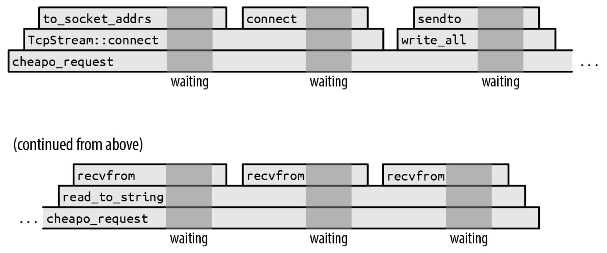
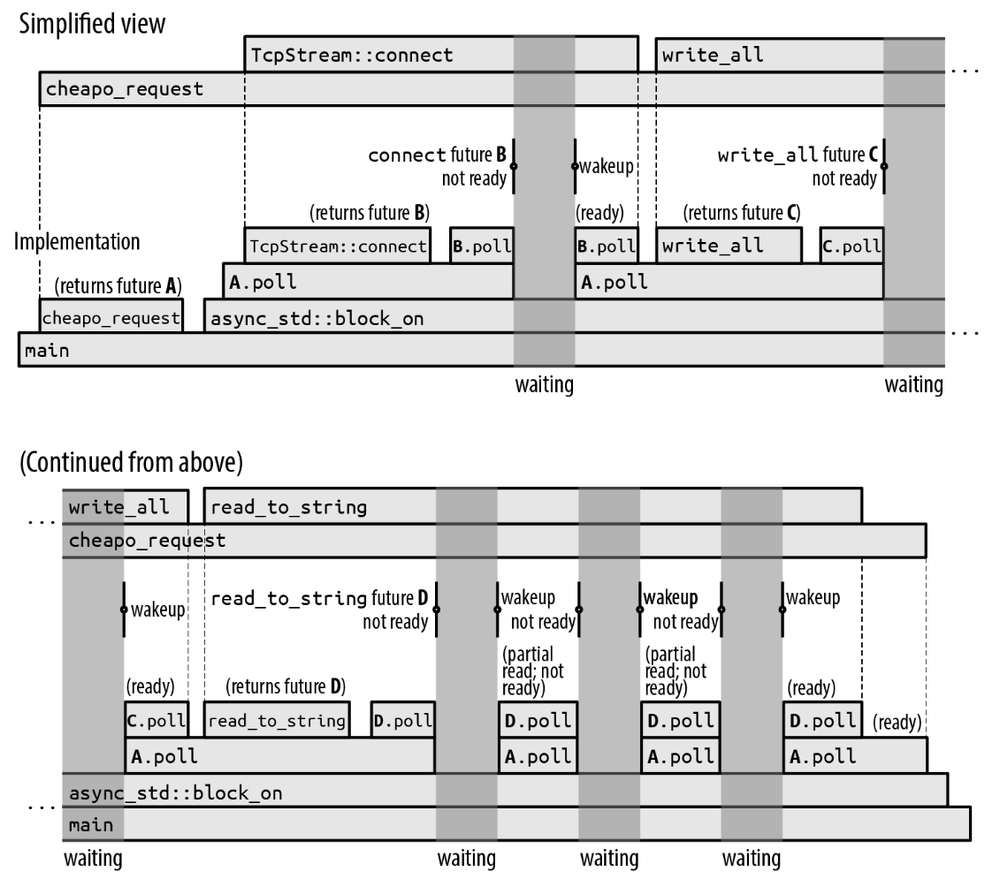
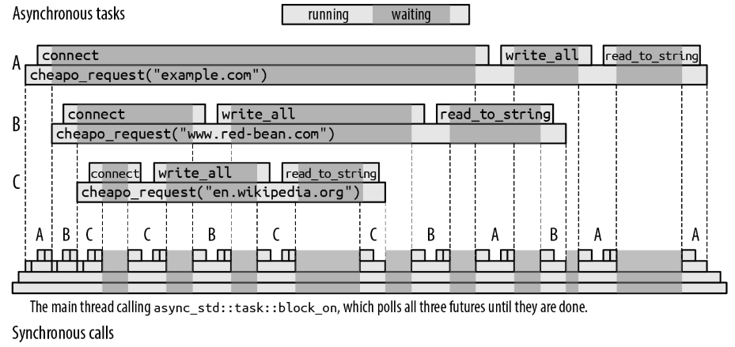
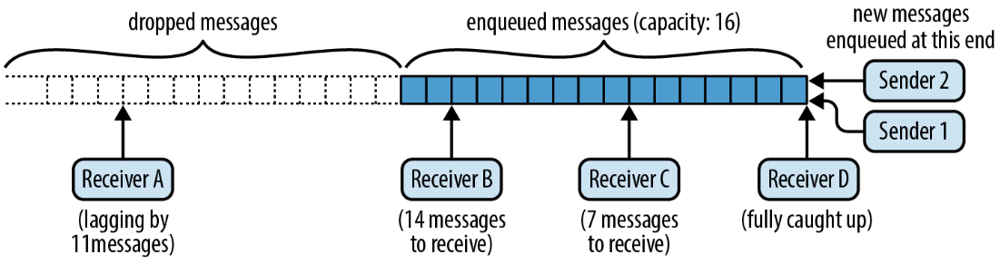

# 异步编程

假设你正在编写一个聊天服务器。每个网络连接都有很多要解析的到来的包、要组装的发送的包、要管理的安全参数、要追踪的聊天组订阅等。同时为许多连接管理所有这些信息需要进行一些组织。

理想情况下，你可以简单地为每一个到来的连接启动一个单独的线程：
```Rust
    use std::{net, thread};

    let listener = net::TcpListener::bind(address)?;

    for socket_result in listener.incoming() {
        let socket = socket_result?;
        let groups = chat_group_table.clone();
        thread::spawn(|| {
            log_error(serve(socket, groups));
        });
    }
```

这样对每一个连接都会创建一个新的线程运行`serve`函数，这个函数专门处理一个连接的需求。

这可以正常工作，直到一切都比计划的更加顺利很多，然后突然你就已经有了几万名用户。一个线程的栈增长到100KB或更多并不罕见，你可能不想就这样花费几GB的内存。要把任务分发到多个处理器上，线程是合适并且必须的，但它们的内存需求太大以至于我们通常需要一些补充的方式和线程一起使用，来减小资源占用。

你可以使用Rust的 *异步任务(asynchronous task)* 来在单个线程或者线程池中交替执行很多独立的任务。异步任务类似于线程，但可以更快地创建、更高效地传递控制权、并且内存开销比线程少一个数量级。在单个程序中同时运行数十万个异步任务是完全可行的。当然，你的应用仍然可能被其他因素限制，例如网络带宽、数据库速度、计算、或者任务本身的内存需求，但使用异步任务的固有内存开销比使用线程的要小很多。

一般来讲，异步Rust代码看起来和普通的多线程代码非常相似，除了那些可能阻塞的操作，例如I/O或获取锁的处理有一点不同。特殊对待这些操作让Rust有更多的信息了解你的代码的行为，这为进一步优化提供了可能。上面代码的异步版本看起来像这样：
```Rust
    use async_std::{net, task};

    let listener = net::TcpListener::bind(address).await?;

    let mut new_connections = listener.incoming();
    while let Some(socket_result) = new_connections.next().await {
        let socket = socket_result?;
        let groups = chat_group_table.clone();
        task::spawn(async {
            log_error(serve(socket, groups).await);
        });
    }
```

这里使用了`async_std` crate的网络和任务模块，并在可能阻塞的调用后加上了`.await`。但整体的结构和基于线程的版本一样。

这一章的目标不止是帮你编写异步代码，还要向你展示它的工作细节，以便你可以预测它在你的应用中的表现，并了解它在哪些方面最有价值。

- 为了展示异步编程的机制，我们列出了涵盖所有核心概念的最小语言功能集：future、异步函数、`await`表达式、任务、`block_on`和`spawn_local` executor。
- 然后我们会展示异步块和`spawn` executor。它们是真正完成工作的最基础的部分，但从概念上讲，它们只是我们刚才提到过的功能的变体。在这个过程中，我们会指出一些你可能会遇到的异步编程特有的问题并解释如何处理它们。
- 为了展示所有功能的协调工作，我们会展示一个聊天服务器和客户端的完整代码，上面的代码片段就是其中一部分。
- 为了演示原语future和executor如何工作，我们会展示`spawn_blocking`和`block_on`的简单实现。
- 最后，我们介绍了异步接口中经常出现的`Pin`类型，它被用来确保异步函数和块future被安全地使用。

## 从同步到异步

考虑当你调用下面的（不是异步的）函数时会发生什么：
```Rust
    use std::io::prelude::*;
    use std::net;

    fn cheapo_request(host: &str, port: u16, path: &str)
                          -> std::io::Result<String>
    {
        let mut socket = net::TcpStream::connect((host, port))?;

        let request = format!("GET {} HTTP/1.1\r\nHost: {}\r\n\r\n", path, host);
        socket.write_all(request.as_bytes())?;
        socket.shutdown(net::Shutdown::Write)?;

        let mut response = String::new();
        socket.read_to_string(&mut response)?;

        Ok(response)
    }
```

这会打开一个到web服务器的TCP连接，以过时的协议向它发送一个简单的HTTP请求[^1]，然后读取响应。”图20-1”展示了这个函数的执行过程随时间的变化。

[^1]:如果你真的需要一个HTTP客户端，考虑使用一些非常优秀的crate例如`surf`或`reqwest`，它们会正确并且异步地完成任务。这个客户端基本只是设法获得HTTPS重定向。


<p align="center">图20-1 一个同步HTTP请求的过程（深颜色的区域表示等待操作系统）</p>

图中展示了从左到右随着时间的推移，函数的调用栈的变化。每一个函数调用都是一个方块，位于它的调用者上面。显然，`cheapo_request`函数贯穿整个执行过程。它调用了Rust标准库里的函数例如`TcpStream::connect`和`TcpStream`的`write_all`和`read_to_string`实现。这些对其他函数的调用依次进行，但最终程序会进行 *系统调用* ，请求操作系统完成真正的工作，例如打开TCP连接，或者读写一些数据。

深灰色的区域表示程序正在等待操作系统完成系统调用。我们并没有按比例绘制这些时间。因为假如我们按比例绘制，整个图都将是深灰色：在实践中，这个函数把几乎所有时间都用在等待操作系统上。上面代码的执行时间将是系统调用之间的窄条。

当函数等待系统调用返回时，它所在的线程会阻塞住：它不能做任何事，直到系统调用结束。一个线程的栈达到几百或几千字节并不罕见，因此如果这是一个更大的系统的一部分，并且有很多线程做类似的任务，锁住这些线程的资源但除了等待什么也不做的代价是非常昂贵的。

为了解决这个问题，一个线程需要能在等待系统调用完成的同时去执行其他的任务。但如何实现这一点并不明显。例如，我们用来从套接字读取响应的函数的签名是：
```Rust
    fn read_to_string(&mut self, buf: &mut String) -> std::io::Result<usize>;
```

它的类型表明了：这个函数直到工作完成或者出错时才会返回。这个函数是 *同步的* ：当操作完成时调用者才会恢复执行。如果我们想在操作系统进行工作的同时用我们的线程去做别的任务，那么我们需要一个新的提供这个函数的 *异步* 版本的I/O库。

### `Future`

Rust支持异步操作的方法是引入一个trait `std::future::Future`：
```Rust
    trait Future {
        type Output;
        // 现在可以先把`Pin<&mut Self>`看作`&mut Self`。
        fn poll(self: Pin<&mut Self>, cx: &mut Context<'_>) -> Poll<Self::Output>;
    }

    enum Poll<T> {
        Ready(T),
        Pending,
    }
```

一个`Future`代表一个可以测试是否完成的操作。一个future的`poll`方法从来不会等待操作完成：它总是立即返回。如果操作完成了，`poll`会返回`Poll::Ready(output)`，其中`output`是最后的结果。否则，它会返回`Pending`。当且仅当future值得再次poll时，它会通过调用一个 *waker* 来通知我们，这是一个由`Context`提供的回调函数。我们称之为异步编程的“piñata 模型” ：你唯一能对future做的就是使用`poll`敲打它，直到有一个值掉出来。

所有现代的操作系统都包含一些系统调用的变体，我们可以用它们来实现这种poll接口。例如在Unix和Windows上，如果你把网络套接字设置为非阻塞模式，那么如果read和write会阻塞，它就会返回一个错误，你必须稍后再试。

因此`read_to_string`的一个异步版本的签名大概是这样：
```Rust
    fn read_to_string(&mut self, buf: &mut String)
        -> impl Future<Output = Result<usize>;
```

除了返回类型之外，这和我们之前展示的签名一样：异步的版本返回一个`Result<usize>`的 *future* 。你需要poll这个future，直到从它得到一个`Ready(result)`。每次它被poll时，都会尽可能地继续读取。最后的`result`给你成功的值或者错误的值，就像普通的I/O操作一样。这是通常的模式：异步版本的任何函数和同步版本的函数获取相同的参数，但返回类型有一个`Future`包装。

调用这个版本的`read_to_string`并不会真的读取任何内容；它所有的任务就是构造并返回一个future，这个future会在被poll时进行真正的工作。这个future必须包含处理请求所需的所有信息。例如，这个`read_to_string`返回的future必须记住调用它的输入流，和它需要写入数据的`String`。事实上，因为这个future持有了`self`和`buf`的引用，因此这个`read_to_string`的真正的签名必须是：
```Rust
    fn read_to_string<'a>(&'a mut self, buf: &'a mut String)
        -> impl Future<Output = Result<usize>> + 'a;
```

这个附加的生命周期指示了返回的future和它借用的`self`和`buf`的生命周期一样长。

`async-std` crate提供了`std`的所有I/O设施的异步版本，包括一个有`read_to_string`方法的异步`Read` trait。`async-std`密切地遵循了`std`的设计，尽可能地在自己的接口中重用`std`的类型，因此这两个世界中的错误、结果、网络地址、和其他大多数相关的数据都是兼容的。熟悉`std`有助于使用`async-std`，反之亦然。

`Future` trait的一个规则是，一旦一个future返回了`Poll::Ready`，它会假设它决不会再次被poll。一些future在自己被overpoll时简单地永远返回`Poll::Pending`；其它的可能panic或者挂起。（它们绝不能违反内存或线程安全性，或者导致未定义行为。）`Future` trait的`fuse`适配器将任何future转换成overpoll时永远返回`Poll::Pending`。但通常消费future的方法都遵循这个规则，因此`fuse`通常不是必须的。

如果poll听起来效率低下，请不必担心。Rust的异步架构是精心设计的，所以只要你的基本I/O函数例如`read_to_string`是正确实现的，那么只会在值得poll时才会poll一个future。每一次`poll`被调用时，某个东西应该返回`Ready`，或者至少向目标前进一步。我们将在“原语future和executor：何时一个future值得再次poll”中解释这是如何工作的。

但使用future看起来有一个挑战：当你poll时，如果你得到了`Poll::Pending`那你应该怎么做？你将不得不四处寻找这个线程暂时可以做的其他工作，并记住一段时间之后返回到这个future，然后再次poll。你的整个系统将因为持续追踪谁正在pending和当它们完成时应该做什么而变得杂乱无章。我们的`cheapo_request`函数的简洁性会被破坏。

好消息是：它并不是这样的！

### `async`函数和`await`表达式

这里有一个 *异步函数* 版本的`cheapo_request`：
```Rust
    use async_std::io::prelude::*;
    use async_std::net;

    async fn cheapo_request(host: &str, port: u16, path: &str)
                                -> std::io::Result<String>
    {
        let mut socket = net::TcpStream::connect((host, port)).await?;

        let request = format!("GET {} HTTP/1.1\r\nHost: {}\r\n\r\n", path, host);
        socket.write_all(request.as_bytes()).await?;
        socket.shutdown(net::Shutdown::Write)?;

        let mut response = String::new();
        socket.read_to_string(&mut response).await?;

        Ok(response)
    }
```

这和之前的版本基本相同，除了：

- 函数以`async fn`代替`fn`开头。
- 它使用了`async_std` crate里的异步版本的`TcpStream::connect`, `write_all`, `read_to_string`。它们都返回结果的future（本节中的示例使用了`async_std`的1.7版本）。
- 每一次调用返回future的函数之后，代码都会加上`.await`。尽管这看起来像是访问一个结构体的`await`字段，但它实际上是语言内置的一个特殊语法，它会等待一个future直到它准备好。`await`表达式会求出future的最终值。这个函数正是通过它获取`connect, write_all, read_to_string`的结果。

和普通的函数不同，当你调用异步函数时，它会在执行实际的主体代码之前立即返回。显然，调用的返回值还没有被计算出来；你得到的是它的最终值的 *future* 。因此如果你执行这行代码：
```Rust
    let response = cheapo_request(host, port, path);
```

那么`response`将是一个`std::io::Result<String>`的future，`cheapo_request`的函数体还没有开始执行。你不需要调整异步函数的返回类型；Rust会自动把`async fn f(...) -> T`看做一个返回`T`的future而不是直接返回`T`的函数。

一个异步函数返回的future包含了函数体运行时所需的所有信息：函数的参数、局部变量所需的空间，等等。（就好像你把调用栈捕获为了一个普通的Rust值。）因此`response`必须包含传入的`host, port, path`，因为`cheapo_request`的函数体需要它们才能运行。

future的具体类型由编译器根据函数体和参数自动生成。这个类型并没有名称；你只知道它实现了`Future<Output=R>`，其中`R`是异步函数的返回类型。从这一点来看，异步函数的future类似于闭包：闭包也有匿名类型、也是由编译器生成并且实现了`FnOnce`、`Fn`和`FnMut` trait。

当你第一次poll `cheapo_request`返回的future时，将会从函数体的开头开始运行到第一个由`TcpStream::connect`返回的future的`await`。这个`await`表达式会poll `connect` future，如果它还没准备好，那么它会向调用者返回`Poll::Pending`：直到`TcpStream::connect`的future返回`Poll::Ready`时，对`cheapo_request`的future的poll才能通过第一个`await`继续执行。因此表达式`TcpStream::connect(...).await`的一个大概等价的写法是：
```Rust
    {
        // 注意：这是伪代码，不是有效的Rust代码
        let connect_future = TcpStream::connect(...);
        'retry_point:
        match connect_future.poll(cx) {
            Poll::Ready(value) => value,
            Poll::Pending => {
                // 设置`cheapo_request`的future的下一次`poll`
                // 从'retry_point处恢复执行。
                ...
                return Poll::Pending
            }
        }
    }
```

`await`表达式会获取future的所有权然后poll它。如果它已经准备好，那么future的最终值就是`await`表达式的值，并且会继续往下执行。否则，它向调用者返回`Poll::Pending`。

但关键的是，下一次poll `cheapo_request`的future时将不会再次从函数的首部开始：相反，它从poll `connect_future`的地方开始 *恢复(resume)* 执行。直到future准备好之后我们才会继续执行这个异步函数的其他部分。

随着`cheapo_request`的future继续被poll，它会从函数体里的一个`await`开始执行到下一个`await`，并且只有当它正在等待的子future ready时才会继续。因此，`cheapo_request`的future将会被poll多少次取决于子future的行为和函数本身的控制流。`cheapo_request`的future会追踪下一次`poll`时的恢复点和所有的局部状态——变量、参数、临时值——恢复需要这些。

在函数中间挂起并稍后恢复执行的能力是异步函数独有的。当普通函数返回时，它的栈帧就消失了。因为`await`表达式依赖于恢复执行的能力，所以你只能在异步函数里使用它们。

在撰写本书时，Rust还不允许trait有异步方法。只有自由函数和特定类型固有的方法才可以是异步的。取消这个限制需要对语言进行一些修改。在此期间，如果你需要定义包含异步函数的trait，可以考虑使用`async-trait` crate，它提供了一个基于宏的解决方案。

### 在同步代码中调用异步函数：`block_on`

某种意义上讲，异步函数只是在推卸责任。在异步函数里很容易获取一个future的值：只需要`await`它。但异步函数 *本身* 也返回一个future，因此现在调用者需要负责poll它。最后，总有一个地方必须实际等待一个值。

我们可以使用`async_std`的`task::block_on`函数在普通的同步函数（例如`main`）中调用`cheapo_request`，它获取一个future并且poll它直到它产生一个值：
```Rust
    fn main() -> std::io::Result<()> {
        use async_std::task;

        let response = task::block_on(cheapo_request("example.com", 80, "/"))?;
        println!("{}", response);
        Ok(())
    }
```

因为`block_on`是一个产生异步函数的最终值的同步函数，你可以将它看作是异步世界到同步世界的适配器。但它阻塞的特性也意味着你永远不应该在一个异步函数里使用`block_on`：它会阻塞整个线程直到值准备好。作为代替，请使用`await`。

”图20-2”展示了`main`的一个可能的执行过程。


<p align="center">图20-2 阻塞等待一个异步函数</p>

上面的时间线，即“简化视图”，展示了程序的异步调用的抽象视图：`cheapo_request`首先调用了`TcpStream::connect`来获取一个套接字，然后对套接字调用了`write_all`和`read_to_string`。然后它返回。这和本章前面的同步版本的`cheapo_request`的时间线非常相似。

但这里每一个异步调用都是多阶段的过程：一个future被创建，然后被poll直到它准备好，可能还会创建并poll其他子future。下面的时间线，即“实现”，展示了实现了这个异步行为的实际同步调用。这是一个介绍普通的异步执行过程中到底发生了什么的好机会：

- 首先，`main`调用`cheapo_request`，它返回最终结果的future `A`。然后`main`把这个future传给了`async_std::block_on`，它会poll `A`。
- poll `A`促使`cheapo_request`的函数体开始执行。函数里调用了`TcpStream::connect`来获取一个套接字的future `B`并await它。更确切地说，因为`TcpStream::connect`可能会遇到错误，因此`B`是一个`Result<TcpStream, std::io::Error>`的future。
- future `B`被`await` poll。因为网络连接还没有建立好，所以`B.poll`返回`Poll::Pending`，但会设置好当套接字准备好后唤醒调用它的任务。
- 因为future `B`还没有准备好，`A.poll`也会向它的调用者`block_on`返回`Poll::Pending`。
- 因为`block_on`没有别的事情可做，它会陷入睡眠。这时整个线程会阻塞。
- 当`B`的连接准备好之后，它会唤醒poll它的任务。这促使`block_on`开始行动，它会尝试再次poll future `A`。
- poll `A`促使`cheapo_request`在它的第一个`await`处恢复执行，然后再次poll `B`。
- 这一次`B`准备好了：套接字已经创建完毕，因此它返回`Poll::Ready(Ok(socket))`。
- 到此`TcpStream::connect`的异步调用就完成了。`TcpStream::connect(...).await`表达式的值就是`Ok(socket)`。
- `cheapo_request`的函数体会继续正常执行，使用`format!`宏构造请求字符串并传递给`socket.write_all`。
- `socket.write_all`是一个异步函数，它返回一个future `C`，然后`cheapo_request`会await `C`。

剩余的流程和之前相似。在”图20-2”所示的执行流程中，`socket.read_to_string`在准备好之前被poll了四次，每一次都会从套接字读取 *一些* 数据，但`read_to_string`被指定为一直读取到输入的末尾，这需要好几次的操作。

听起来编写一个一直调用`poll`的循环并不难。但让`async_std::task::block_on`真正有价值的是：它知道怎么睡眠到恰好future值得再次poll，而不是浪费处理器的时间和电量来进行几十亿次无用的`poll`调用。基本的I/O函数例如`connect`和`read_to_string`返回的future保留了传递给`poll`的`Context`参数提供的唤醒器，并在`block_on`应该醒来并再次尝试poll时调用唤醒器来唤醒它。我们将在“原语future和executor：何时一个future值得再次poll”中通过实现一个简单版本的`block_on`来展示这具体是怎么工作的。

和我们之前展示的原始的同步版本一样，这个异步版本的`cheapo_request`方法也把几乎所有的时间花费在等待操作完成上。如果时间轴是按比例绘制的，那么图将几乎完全是深灰色的，只有当程序被唤醒时会有几个计算过程对应的很细的条。

这里讲了很多细节。幸运的是，你通常可以只考虑简化的上层时间线：一些函数调用是同步的，其他是异步的并需要一个`await`，但它们都只是函数调用。Rust的异步支持的成功取决于帮助程序员在实践中只需要考虑简化的视图，不会被实现的来回跳转干扰。

### spawn异步任务

`async_std::task::block_on`函数会阻塞直到一个future的值准备好。但在单个future上完全阻塞一个线程并不比同步调用更好：本章的目的是让线程在等待的同时 *做别的工作* 。

为了实现这一点，你可以使用`async_std::task::spawn_local`。这个函数接受一个future并把它添加到一个池，当`block_on`等待的future还没准备好时`block_on`会poll这个池。因此如果你把一堆future传递给`spawn_local`并且之后对最终结果的future调用`block_on`，`block_on`会poll每一个被spawn的future（当它们可以进一步执行时），并发运行整个池，直到结果准备好。

在撰写本书时，只有当启用`async-std` crate的`unstable`特性时`spawn_local`才可用。你需要在 *Cargo.toml* 中用这样的一行引入`async-std`：
```toml
    async-std = { version = "1", features = ["unstable"] }
```

`spawn_local`函数是标准中用于启动新线程的`std::thread::spawn`函数的异步版本的类似物：

- `std::thread::spawn(c)`接收闭包`c`然后启动一个线程运行它，返回一个`std::thread::JoinHandle`，它的`join`方法会等待线程结束并返回`c`返回的内容。
- `async_std::task::spawn_local(f)`接收future `f`并把它添加到当前线程调用`block_on`时会poll的池里。`spawn_local`会返回它自己的`async_std::task::JoinHandle`类型，它本身是一个future，你可以await它来获取`f`的最终值。

例如，假设我们想让一个HTTP请求的集合并发执行。这是第一次尝试：
```Rust
    pub async fn many_requests(requests: Vec<(String, u16, String)>)
                               -> Vec<std::io::Result<String>>
    {
        use async_std::task;

        let mut handles = vec![];
        for (host, port, path) in requests {
            handles.push(task::spawn_local(cheapo_request(&host, port, &path)));
        }

        let mut results = vec![];
        for handle in handles {
            results.push(handle.await);
        }

        results
    }
```

这个函数对`requests`的每个元素调用`cheapo_request`，将每一个调用返回的future传给`spawn_local`。它把最后的`JoinHandle`收集到一个vector并且await每一个。以任意顺序await join handles都是没问题的：因为请求已经被spawn，它们的future将会被按需poll，即这个线程调用了`block_on`并且无事可做时。所有的请求会并发运行。一旦它们完成，`many_requests`会向调用者返回结果。

上面的代码几乎是正确的，但Rust的借用检查器担心`cheapo_request`的future的生命周期：
```
    error: `host` does not live long enough
        handles.push(task::spawn_local(cheapo_request(&host, port, &path)));
                                       ---------------^^^^^-------------
                                       |              |
                                       |              borrowed value does not
                                       |              live long enough
                         argument requires that `host` is borrowed for `'static`
    }
    - `host` dropped here while still borrowed
```

`path`也有一个类似的错误。

自然地，如果我们向异步函数传递引用，那么它们返回的future就必须持有这些引用，因此出于安全性future不能比它们借用的值生存的更久。任何持有引用的其他值也有相同的限制。

问题在于`spawn_local`不能确保你会在`host`和`path`被drop之前等待任务结束。事实上，`spawn_local`只接受生命周期是`'static`的future，因为你可以简单地忽略它返回的`JoinHandle`并让任务继续运行程序的剩下部分。这并不是异步任务独有的问题：当你尝试用`std::thread::spawn`启动一个线程，并且它的闭包捕获了局部变量的引用时也会遇到类似的错误。

一种解决这个问题的方法是创建另一个版本的获取参数所有权的异步函数：
```Rust
    async fn cheapo_owning_request(host: String, port: u16, path: String)
                                   -> std::io::Result<String> {
        cheapo_request(&host, port, &path).await
    }
```

这个函数接收`String`而不是`&str`引用，因此它的future自身将拥有`host`和`path`，并且生命周期是`'static`。借用检查器可以看到它立刻await了`cheapo_request`的future，并且因此如果这个future被poll，它借用的`host`和`path`变量肯定还在。一切都没有问题。

使用`cheapo_owning_request`，你可以像这样spawn所有的请求：
```Rust
    for (host, port, path) in requests {
        handles.push(task::spawn_local(cheapo_owning_request(host, port, path)));
    }
```

你可以使用`block_on`在同步的`main`函数中调用`many_requests`：
```Rust
    let requests = vec![
        ("example.com".to_string(),      80, "/".to_string()),
        ("www.red-bean.com".to_string(), 80, "/".to_string()),
        ("en.wikipedia.org".to_string(), 80, "/".to_string()),
    ];

    let results = async_std::task::block_on(many_requests(requests));
    for result in results {
        match result {
            Ok(response) => println!("{}", response),
            Err(err) => eprintln!("error: {}", err),
        }
    }
```

这段代码会在`block_on`的调用中并发运行三个请求。每个请求会在当其他的请求阻塞时抓住机会继续执行，它们全部在调用者线程中执行。”图20-3”中展示了三个`cheapo_request`调用的可能的执行过程。


<p align="center">图20-3 在单个线程中运行三个异步任务</p>

（我们鼓励你自己尝试运行这段代码，使用`eprintln!`在`cheapo_request`开头和每一个`await`表达式之后打印消息，这样你可以看到这些调用如何交错执行。）

对`many_requests`的调用（为了简单没有展示）spawn了三个异步的任务，分别用`A`、`B`、`C`标记。`block_on`开始时先poll `A`，`A`会开始连接到`example.com`。这会立刻返回`Poll::Pending`，`block_on`会把注意移动到下一个spawn的任务，然后poll future `B`，最后是`C`，它们会开始连接各自的服务器。

当所有可以poll的future都返回了`Poll::Pending`之后，`block_on`会进入睡眠，直到其中一个`TcpStream::connect`的future指示它的任务值得再次poll。

在这次执行中，服务器`en.wikipedia.org`比其他的响应得更快，因此这个任务最先完成。当一个spawn的任务完成时，它会把值保存在`JoinHandle`并标记它已经准备好了，这样`many_requests` await它时无需等待，可以继续执行。最后，其它的`cheapo_request`要么成功要么返回错误，然后`many_request`本身可以返回了。最后，`main`接收`block_on`返回的结果的vector。

所有这些执行都发生在单个线程中，三个`cheapo_request`的调用通过对future的poll实现交错执行。一个异步调用看起来像是一个运行到完成的单个函数调用，但实际上异步调用由一系列对future的`poll`方法的同步调用实现。每一个单独的`poll`调用都可以快速返回，让出线程从而让其他异步调用可以执行。

我们终于达成了我们在本章开头设置的目标：让一个线程在等待I/O完成的同时去执行其他的工作，这样线程的资源不会因等待而浪费。更妙的是，达成这个目标的代码看起来非常像普通的Rust代码：一些函数被标记为`async`、一些函数调用后面有`.await`、使用的函数来自`async_std`而不是`std`，但除此之外，它就是普通的Rust代码。

异步任务和线程有一个不同之处需要牢记：异步任务只有在`await`表达式中被await的future返回`Poll::Pending`时才会切换到其他异步任务。这意味着如果你在`cheapo_request`中放了一段长时间运行的计算代码，那么在它完成之前，任何传给`spawn_local`的其他任务都没有机会运行。而使用线程时没有这个问题：操作系统可以在任何地方挂起任何线程并设置计时器来确保没有线程可以垄断处理器。

异步代码依赖于共享线程的future的协作。如果你需要让长时间计算和异步代码共存，本章后面的“长时间计算：`yield_now`和`spawn_blocking`”中介绍了一些方法。

### `async`块

除了异步函数之外，Rust还支持 *异步块(asynchronous block)* 。与一个普通的块返回最后一个表达式的值不同，一个异步块返回最后一个表达式的 *值的future* 。你可以在异步块里使用`await`表达式。

异步块看起来就像普通的块表达式，在前边加上`async`关键字：
```Rust
    let serve_one = async {
        use async_std::net;

        // 监听连接并接受
        let listener = net::TcpListener::bind("localhost:8087").await?;
        let (mut socket, _add) = listener.accept().await?;

        // 通过`socket`与客户端交互
        ...
    };
```

这里用一个future初始化了`serve_one`，当poll它时，它会监听并处理单个TCP连接。块的代码直到`serve_one`被poll才会执行，就像异步函数只有在它的future被poll时才会执行一样。

如果你在异步块里使用了`?`操作符，它会从块里返回，而不是从所处的函数返回。例如，如果上面的`bind`调用返回一个错误，那么`?`操作符会返回它作为`serve_one`的最终值。类似的，`return`表达式会从异步块里返回，而不是从外层的函数返回。

如果一个异步块引用了周围代码里的变量，它的future会捕获那些变量，就像闭包一样。并且和`move`闭包一样（见“偷取值的闭包”），你可以用`async move`来创建获取变量所有权的块，而不是持有变量的引用。

异步块提供了一种精确地分离出想要异步运行的部分代码的方法。例如，在上一节中，`spawn_local`需要`'static` future，因此我们定义了`cheapo_owning_request`包装函数来得到一个获取参数所有权的future。你可以简单地在一个异步块里调用`cheapo_request`而不需要分离出包装函数来实现相同的效果：
```Rust
    pub async fn many_requests(requests: Vec<(String, u16, String)>)
                               -> Vec<std::io::Result<String>>
    {
        use async_std::task;

        let mut handles = vec![];
        for (host, port, path) in requests {
            handles.push(task::spawn_local(async move {
                cheapo_request(&host, port, &path).await
            }));
        }
        ...
    }
```

因为这是一个`async move`块，所以它的future获取了`String`值`host`和`path`的所有权，就类似`move`闭包一样。然后它向`cheapo_request`传递引用，借用检查器可以看到块的`await`表达式获取了`cheapo_request`的future的所有权，因此`host`和`path`的引用不可能比它们借用的被捕获的变量生存的更久。异步块和`cheapo_owning_request`完成了同样的事，但所需的样板代码更少。

一个你可能遇到的问题是没有语法能指定异步块的返回类型，即异步函数参数后跟的`-> T`。当使用`?`操作符时这可能会导致问题：
```Rust
    let input = async_std::io::stdin();
    let future = async {
        let mut line = String::new();

        // 这会返回`std::io::Result<usize>`。
        input.read_line(&mut line).await?;

        println!("Read line: {}", line);

        Ok(())
    };
```

这会因为如下错误失败：
```
    error: type annotations needed
       |
    42 |     let future = async {
       |         ------ consider giving `future` a type
    ...
    46 |         input.read_line(&mut line).await?;
       |         ^^^^^^^^^^^^^^^^^^^^^^^^^^^^^^^^^ cannot infer type
```

Rust不能分辨异步块的返回类型应该是什么。`read_line`方法返回一个`Result<(), std::io::Error>`，但因为`?`操作符使用了`From` trait来在需要时转换成指定的错误类型，所以这个异步块的返回类型是`Result<(), E>`，其中`E`可能是任何实现了`From<std::io::Error>`的类型。

Rust未来的版本可能会添加指定`async`块的返回类型的语法。但现在，可以通过手动写出最后的`Ok`的类型来解决这个问题：
```Rust
    let future = async {
        ...
        Ok::<(), std::io::Error>(())
    };
```

因为`Result`是一个需要成功和错误类型作为参数的泛型类型，我们可以像这里一样使用`Ok`或`Err`指定那些类型参数。

### 从异步块中构建异步函数

异步块给了我们另一种实现和异步函数相同效果的方法，并且更加灵活一点。例如，我们可以将我们的`cheapo_request`写成一个普通的、同步的返回异步块的future的函数：
```Rust
    use std::io;
    use std::future::Future;

    fn cheapo_request<'a>(host: &'a str, port: u16, path: &'a str)
        -> impl Future<Output = io::Result<String>> + 'a
    {
        async move {
            ... function body ...
        }
    }
```

当你调用这个版本的函数时，它会立刻返回异步块的值的future。这个future会捕获函数的参数并且和异步函数返回的future的行为一样。因为我们没有使用`async fn`语法，我们需要在返回值中写出`impl Future`，但对调用者来说，这两个定义是同一个函数签名的两种可替换的实现。

如果你想让函数被调用时立刻进行一些计算然后再构造返回的future，那么第二种方法更有用。例如，另一种协调`cheapo_request`和`spawn_local`的方法是让它变成一个返回`'static` future的同步函数，并让这个future捕获参数的拷贝的所有权：
```Rust
    fn cheapo_request(host: &str, port: u16, path: &str)    
        -> impl Future<Output = io::Result<String> + 'static
    {
        let host = host.to_string();
        let path = path.to_string();

        async move {
            ... use &*host, port, and path ...
        }
    }
```

这个版本让异步块捕获`host`和`path`为`String`值，而不是`&str`引用。因为future拥有自己运行所需的所有数据，所以它是有效的`'static`生命周期。（我们在上面的签名中写出了`+ 'static`，但`-> impl`返回的类型默认是`'static`的，因此省略它不会有影响。）

因为这个版本的`cheapo_request`返回的future是`'static`的，我们可以直接把它们传递给`spawn_local`：
```Rust
    let join_handle = async_std::task::spawn_local(
        cheapo_request("areweasyncyet.rs", 80, "/")
    );

    ... other work ...

    let response = join_handle.await?;
```

### 在一个线程池中spawn异步任务

我们至今为止展示过的例子几乎把所有时间花费在等待I/O上，但一些负载是更多处理器工作和阻塞的组合。当你有太多的计算以至于单个处理器不能进行快速处理，你可以使用`async_std::task::spawn`来把一个future spawn到一个工作线程池里，这些线程会poll可以进一步执行的future。

`async_std::task::spawn`的使用方法类似`async_std::task::spawn_local`：
```Rust
    use async_std::task;

    let mut handles = vec![];
    for (host, port, path) in requests {
        handles.push(task::spawn(async move {
            cheapo_request(&host, port, &path).await
        }));
    }
    ...
```

类似于`spawn_local`，`spawn`也返回一个`JoinHandle`值，你可以await它来获取future的最终值。但和`spawn_local`不同的是，这个future不会等到你调用`block_on`才会被poll，只要线程池中有一个空闲的线程，它就会尝试poll这个future。

在实践中，`spawn`比`spawn_local`使用得更加广泛，因为人们更希望他们的负载不管计算和阻塞怎么混合，都能在机器上均衡地执行。

当使用`spawn`时一个需要记住的点是线程池会尝试保持忙碌，因此只要有一个线程空闲你的future就会被poll。一个异步调用可能在一个线程中开始执行，在一个`await`表达式处阻塞，最后在另一个不同的线程中恢复执行。因此将一个异步函数调用看作单个函数调用是一个合理的简化（事实上，异步函数和`await`表达式的目的就是鼓励你以这种方式思考）。和代码的执行情况有关，异步调用可能实际上会在很多不同线程中移动。

如果你正在使用thread-local存储，你可能会惊讶地发现你在`await`表达式之前放置的一些数据在恢复之后被替换成了某些完全不同的东西，这是因为你的任务现在正在被池中的另一个线程poll。如果这导致了问题，你应该使用 *task-local storage* ；细节见`async-std` crate中`task_local!`宏的文档。

### 但你的future实现了`Send`吗？

有一个`spawn`要求但`spawn_local`不要求的限制。因为future被送到另一个线程运行，因此future必须实现了`Send`标记trait。我们在“线程安全：`Send`和`Sync`”中介绍过`Send`。只有当future包含的所有值都是`Send`时future才是`Send`：所有的函数参数、局部变量、甚至匿名的临时值都必须能安全地移动到另一个线程。

和之前一样，这个要求也不是异步任务独有的：如果你尝试使用`std::thread::spawn`启动一个捕获了非`Send`值的闭包也会遇到一个类似的错误。不同之处在于，传给`std::thread::spawn`的闭包会留在新创建的线程中运行，而spawn到线程池里的future可能会在await时从一个线程移动到另一个线程。

这个限制很容易意外触发。例如，下面的代码看起来足够合法：
```Rust
    use async_std::task;
    use std::rc::Rc;

    async fn reluctant() -> String {
        let string = Rc::new("ref-counted String".to_string());

        some_asynchronous_thing().await;

        format!("Your splendid string: {}", string)
    }

    task::spawn(reluctant());
```

一个异步函数的future必须持有足够的信息来让它可以从一个`await`表达式继续执行。在这个例子中，`reluctant`的future必须在`await`之后使用`string`，因此这个future将会，或至少有时会，包含一个`Rc<String>`值。因为`Rc`指针不能安全地在线程之间共享，所以这个future本身不能是`Send`。并且因为`spawn`只接受`Send`的future，所以Rust会报错：
```
    error: future cannot be sent between threads safely
        |
    17  |     task::spawn(reluctant());
        |     ^^^^^^^^^^^ future returned by `reluctant` is not `Send`
        |

        |
    127 | T: Future + Send + 'static,
        |             ---- required by this bound in `async_std::task::spawn`
        |
        = help: within `impl Future`, the trait `Send` is not implemented
                for `Rc<String>`
    note: future is not `Send` as this value is used across an await
    10  |         let string = Rc::new("ref-counted string".to_string());
        |             ------ has type `Rc<String>` which is not `Send`
    11  |
    12  |         some_asynchronous_thing().await;
        |         ^^^^^^^^^^^^^^^^^^^^^^^^^^^^^^^
                      await occurs here, with `string` maybe used later
    ...
    15  |    }
        |    - `string` is later dropped here
```

这一段错误信息很长，但包含很多有用的细节：

- 它解释了为什么future需要是`Send`：`task::spawn`的要求。
- 它解释了什么样的值不是`Send`：局部变量`string`，它的类型是`Rc<String>`。
- 它解释了为什么`string`会影响future：它的作用域跨过了`await`。

有两种解决这个问题的方法。一个是限制非`Send`的值的作用域，让它不包含任何`await`表达式，因此就不需要保存在函数的future里：
```Rust
    async fn reluctant() -> String {
        let return_value = {
            let string = Rc::new("ref-counted string".to_string());
            format!("Your splendid string: {}", string)
            // `Rc<String>`在这里离开作用域...
        };

        // ...因此当我们在这里挂起时不需要保存它。
        some_asynchronous_thing().await;

        return_value
    }
```

另一种解决方案是简单地用`std::sync::Arc`替换`Rc`。`Arc`使用原子更新来管理它的引用计数，这意味着它会稍微慢一点，不过`Arc`指针是`Send`。

尽管最终你会学会识别和避免非`Send`类型，但一开始它们可能令人惊讶。（至少，你的作者经常被惊讶到。）例如，较旧的Rust代码有时会像这样使用泛型结果类型：
```Rust
    // 不推荐！
    type GenericError = Box<dyn std::error::Error>;
    type GenericResult<T> = Result<T, GenericError>;
```

这个`GenericError`类型使用了一个trait对象来存储任何实现了`std::error::Error`的类型。但并没有给它施加更严格的限制：如果有一个非`Send`类型实现了`Error`，它们将能转换成一个`GenericError`类型。因为这种可能性，`GenericError`将不是`Send`，下面的代码将不能工作：
```Rust
    fn some_fallible_thing() -> GenericResult<i32> {
        ...
    }

    // 这个函数的future不是`Send`...
    async fn unfortunate() {
        // ...因为这个调用返回的值...
        match some_fallible_thing() {
            Err(error) => {
                report_error(error);
            }
            Ok(output) => {
                // ...到这个await处仍然存在...
                use_output(output).await;
            }
        }
    }

    // ...因此这个`spawn`会导致错误。
    async_std::task::spawn(unfortunate());
```

和前面的例子一样，编译器的错误消息解释了发生了什么，指出了那个`Result`是罪魁祸首。因为Rust考虑到`some_fallible_thing`的结果在整个`match`表达式中生效，包括`await`表达式，它决定了`unfortunate`的future不是`Send`。这个错误是因为Rust过度谨慎：尽管`GenericError`不能安全地发送到另一个线程，但`await`只会在结果是`Ok`的时候发生，因此当我们await `use_output`返回的future时错误的值永远不会存在。

一个理想的解决方法是使用更加严格的泛型错误类型，例如我们在“处理多种错误类型”中建议的这个：
```Rust
    type GenericError = Box<dyn std::error::Error + Send + Sync + 'static>;
    type GenericResult<T> = Result<T, GenericError>;
```

这个trait对象显式地要求底层的错误类型要实现了`Send`，这样就一切顺利了。

如果你的future不是`Send`并且不能方便地将它变成`Send`，那么你可以使用`spawn_local`来在当前线程运行它。当然，你需要保证这个线程在某个地方调用`block_on`，以给它运行的机会，并且你将不能从多处理器中受益。

### 长时间计算：`yield_now`和`spawn_blocking`

如果一个future和其他任务共享线程，那么它的`poll`方法应该总是尽可能快速地返回。但如果你在进行长时间的计算，它可能需要很长时间才会到达下一个`await`，让其它的异步任务等待比你预想得更长的时间。

一种避免这种情况的方法是偶尔就`await`一次。`async_std::task::yield_now`函数返回一个为此设计的简单future：
```Rust
    while computation_not_done() {
        // ... 进行中等规模的计算 ...
        async_std::task::yield_now().await;
    }
```

`yield_now`的future第一次被poll时，它会返回`Poll::Pending`，但它会很快声明它值得再次poll。效果就是你的异步调用可以放弃线程，其他的任务可以得到运行的机会，但很快又会轮到你的调用。`yield_now`的future第二次被poll时，它会返回`Poll::Ready(())`，因此你的异步函数可以恢复执行。

然而这个方法并不总是可行。如果你正在使用一个外部的crate来做长时间计算或者调用外部的C或C++代码，那么并不方便修改代码来变得更加异步友好。或者可能很难确保计算的每一条路径都会经过`await`。

对于这种情况，你可以使用`async_std::task::spawn_blocking`。这个函数接受一个闭包，在它自己的线程中运行它，并返回一个返回值的future。异步代码可以await这个future，把它的线程让给其他的任务，直到计算完成。通过把困难的任务放在单独的线程，可以让操作系统负责让它很好地共享处理器。

例如，假设我们需要检查用户输入的密码和我们在认证数据库中存储的哈希过的版本是否一致。为了安全性，验证密码需要是计算密集的，这样即使攻击者获取了数据库的拷贝，他们也不能简单地尝试几万亿个可能的密码来看看是否匹配。`argonautica` crate提供了一个专为存储密码设计的哈希函数：一个正确生成的`argonautica`哈希值需要几分之一秒来验证。我们可以像这样在我们的异步应用中使用`argonautica`（版本`0.2`）：
```Rust
    async fn verify_password(password: &str, hash: &str, key: &str)
                            -> Result<bool, argonautica::Error>
    {
        // 获取参数的拷贝，以让闭包变为'static
        let password = password.to_string();
        let hash = hash.to_string();
        let key = key.to_string();

        async_std::task::spawn_blocking(move || {
            argonautica::Verifier::default()
                .with_hash(hash)
                .with_password(password)
                .with_secret_key(key)
                .verify()
        }).await
    }
```

如果`password`匹配`hash`它会返回`Ok(true)`，其中的`key`是数据库里的一个键。在传给`spawn_blocking`的闭包里进行验证，可以把昂贵的计算放到它自己的线程里，确保它不会影响对其它用户的请求返回响应。

### 比较异步设计

Rust的异步编程的方案在很多方面都和其他语言采用的方案很像。例如，JavaScript、C#和Rust都有带有`await`表达式的异步函数。所有这些语言都有值来表示还未完成的计算：Rust称之为“future”，JavaScript称之为“promise”，C#称之为“task”，但它们都代表一个可能要等待的值。

然而Rust中poll的使用并不寻常。在JavaScript和C#中，一个异步函数被调用后会立刻执行，有一个内置在系统库中的全局的事件循环负责当它们等待的值可用时恢复挂起的异步函数调用。然而在Rust中，异步函数调用什么都不做，直到把它的future传递给`block_on`、`spawn`或者`spawn_local`，这些函数会poll它并驱动工作完成。这些函数，称为 *executor* ，扮演了其它语言中的全局事件循环的角色。

因为Rust允许你——程序员来选择一个executor来poll你的future，所以Rust不需要内置在系统中的全局事件循环。`async-std` crate提供了我们在本章中用过的executor函数，但我们在本章稍后会使用的`tokio` crate，定义了它自己的类似的executor函数集。并且作为本章的终结，我们会实现自己的executor。你可以在同一个程序中使用这三种executor。

### 一个真实的异步HTTP客户端

如果我们不展示一个使用合适的异步HTTP客户端crate的例子将是我们的疏忽，因为它是如此简单，并且有好几个好的crate可以选择，包括`reqwest`和`surf`。

这里有一个使用`surf`来并发运行一系列请求的重写的`many_requests`，甚至比基于`cheapo_request`的版本还要简单，你需要在 *Cargo.toml* 中加上这些依赖：
```toml
    [dependencies]
    async-std = "1.7"
    surf = "1.0"
```

然后，我们可以像这样定义`many_requests`：
```Rust
    pub async fn many_requests(urls: &[String])
                               -> Vec<Result<String, surf::Exception>>
    {
        let client = surf::Client::new();

        let mut handles = vec![];
        for url in urls {
            let request = client.get(&url).recv_string();
            handles.push(async_std::task::spawn(request));
        }

        let mut results = vec![];
        for handle in handles {
            results.push(handle.await);
        }

        results
    }

    fn main() {
        let requests = &["http://example.com".to_string(),
                         "https://www.red-bean.com".to_string(),
                         "https://en.wikipedia.org/wiki/Main_Page".to_string()];

        let results = async_std::task::block_on(many_requests(requests));
        for result in results {
            match result {
                Ok(response) => println!("*** {}\n", response),
                Err(err) => eprintln!("error: {}\n", err),
            }
        }
    }
```

使用单个`surf::Client`来进行所有请求让我们可以在其中某些请求指向同一个服务器时重用HTTP连接。并且不需要异步块：因为`recv_string`是一个返回`Send + 'static` future的异步方法，我们可以直接把它的future传给`spawn`。

## 一个异步的客户端和服务器

是时候整理一下我们至今为止讨论过的关键思路并将它们组合成一个可以工作的程序了。很大程度上来说，异步应用类似于普通的多线程应用，但有新机会写出紧凑且富有表现力的代码。

这一节的示例是一个聊天服务器和客户端。[完整的代码](https://github.com/ProgrammingRust/async-chat)见这里。真实的聊天系统很复杂，从安全和重连到隐私和现代化都是需要考虑的因素，但我们将只实现一组简单的功能子集，这样能更加关注几个我们感兴趣的点。

特别地，我们想很好的处理 *背压(backpressure)* 。意思是如果一个客户端的网络连接很慢或者完全丢失了连接，必须不影响其他客户端交换信息的能力。并且因为一个慢速的客户端不应该让服务器花费无限制的内存来保存它不断增长的累积消息，我们的服务器应该丢弃一些不能跟上速度的客户端的消息，但要通知它们它们的消息流是不完整的。（一个真实的服务器应该把消息记录到磁盘上并让客户端去获取它们错过的消息，不过我们省略了这个功能。）

我们以命令`cargo new --lib async-chat`开始项目，首先把以下内容添加到 *async-chat/Cargo.toml* ：
```toml
    [package]
    name = "async-chat"
    version = "0.1.0"
    authors = ["You <you@example.com>"]
    edition = "2018"

    [dependencies]
    async-std = { version = "1.7", features = ["unstable"] }
    tokio = { version = "1.0", features = ["sync"] }
    serde = { version = "1.0", features = ["derive", "rc"] }
    serde_json = "1.0"
```

我们依赖四个crate：

- `async-std` crate是我们在本章中一直在用的异步I/O原语和工具的集合。
- `tokio` crate是另一个类似`async-std`的异步原语的集合，它是最古老和成熟的之一。它被广泛使用并保持设计和实现的高标准，但相比`async-std`还需要一些别的crate才能使用。

    `tokio`是一个很大的crate，但我们只需要它的一个组件，因此 *Cargo.toml* 中的`features = ["sync"]`字段将`tokio`削减到只有我们需要的部分，让它更加轻量一些。

    当异步库的生态系统不够成熟时，人们会避免同时在一个程序中使用`tokio`和`async-std`，但这两个项目一直在合作来确保可以正确工作，只要遵守它们的文档中的每一条规则。
- `serde`和`serde_json` crate我们之前已经在”第18章”中见过。它们给了我们便利且高效地生成和解析JSON的工具，我们的聊天协议将使用JSON来在网络中表示数据。我们想使用`serde`中的一些可选特性，因此在我们指定依赖时选择了那些特性。

我们的聊天应用的整体架构，包括客户端和服务器，看起来像这样：
```
    async-chat
    |-- Cargo.toml
    |-- src
        |-- lib.rs
        |-- utils.rs
        |-- bin
            |-- client.rs
            |-- server
                |-- main.rs
                |-- connection.rs
                |-- group.rs
                |-- group_table.rs
```

这个包的布局使用了我们在“src/bin目录”中介绍过的一个Cargo的特性：除了主要的库crate  *src/lib.rs* 和它的子模块 *src/utils.rs* 之外，它还包含两个可执行文件：

-  *src/bin/client.rs* 是聊天客户端的单文件可执行程序。
-  *src/bin/server* 是聊天服务器的可执行程序，它被分成四个文件： *main.rs* 保存`main`函数，还有三个子模块 *connection.rs* 、 *group.rs* 、 *group_table.rs* 。

我们将在本章中展示每个源文件的内容，等它们都就位之后，如果在目录树中输入`cargo build`，就会编译库crate并且构建两个可执行程序。Cargo会自动把库crate当作一个依赖，这使得它变为一个放置客户端和服务器共享的定义的好地方。类似的，`cargo check`会检查整个源码树。为了运行其中某一个可执行程序，你可以使用像这样的命令：
```
    $ cargo run --release --bin server -- localhost:8088
    $ cargo run --release --bin client -- localhost:8088
```

`--bin`选项指示了要运行哪一个可执行程序，并且任何跟在`--`选项后面的参数都会被传给可执行程序本身。我们的客户端和服务器需要知道服务器的地址和TCP端口。

### `Error`和`Result`类型

库crate的`utils`模块定义了整个应用中用到的结果和错误类型。 *src/utils.rs* ：
```Rust
    use std::error::Error;

    pub type = ChatError = Box<dyn Error + Send + Sync + 'static>;
    pub type = ChatResult<T> = Result<T, ChatError>;
```

这是我们在“处理多种错误类型”中建议过的通用的错误类型。`async_std`、`serde_json`和`tokio` crate都定义了它们自己的错误类型，但`?`运算符可以自动把它们全部转换成`ChatError`，使用标准库的`From` trait的实现可以把任何合适的错误类型转换成`Box<dyn Error + Send + Sync + 'static>`。`Send`和`Sync`约束确保了如果一个被spawn到其他线程的任务失败了，它可以安全地把错误汇报给主线程。

在一个真实的应用中，请考虑使用`anyhow` crate，它提供了类似于这里的`Error`和`Result`类型。`anyhow` crate易于使用并且提供了一些我们的`ChatError`和`ChatResult`没有的很棒的特性。

### 协议

库crate把整个聊天协议封装在两个类型里，在 *lib.rs* 中定义：
```Rust
    use serde::{Deserialize, Serialize};
    use std::sync::Arc;

    pub mod utils;

    #[derive(Debug, Deserialize, Serialize, PartialEq)]
    pub enum FromClient {
        Join { group_name: Arc<String> },
        Post {
            group_name: Arc<String>,
            message: Arc<String>,
        },
    }

    #[derive(Debug, Deserialize, Serialize, PartialEq)]
    pub enum FromServer {
        Message {
            group_name: Arc<String>,
            message: Arc<String>,
        },
        Error(String),
    }

    #[test]
    fn test_fromclient_json() {
        use std::sync::Arc;

        let from_client = FromClient::Post {
            group_name: Arc::new("Dogs".to_string()),
            message: Arc::new("Samoyeds rock!".to_string()),
        };

        let json = serde_json::to_string(&from_client).unwrap();
        assert_eq!(json,
                   r#"{"Post":{"group_name":"Dogs","message":"Samoyeds rock!"}}"#);
        
        assert_eq!(serde_json::from_str::<FromClient>(&json).unwrap(),
                   from_client);
    }
```

`FromClient`枚举表示一个客户端可能发送给服务器的包：它可以要求加入一个房间并向它加入的房间发送消息。`FromServer`表示服务器可能返回给客户端的包：被发到聊天组里的消息和错误消息。使用引用计数指针`Arc<String>`来代替普通的`String`帮助服务器在管理组和分发消息时避免拷贝字符串。

`#[derive]`属性让`serde` crate为`FromClient`和`FromServer`生成`Serialize`和`Deserialize` trait的实现。这让我们可以调用`serde_json::to_string`来把它们转换成JSON值、通过网络发送它们、并且最终调用`serde_json::from_str`来把它们转换回Rust形式。

`test_fromclient_json`单元测试展示了这该如何使用。有了`serde`生成的`Serialize`实现，我们可以调用`serde_json::to_string`来把给定的`FromClient`值转换成这个JSON：
```json
    {"Post":{"group_name":"Dogs","message":"Samoyeds rock!"}}
```

然后生成的`Deserialize`实现会把它转换成一个等价的`FromClient`值。注意`FromClient`中的`Arc`指针对序列化的形式没有影响：引用计数的字符串直接作为JSON的对象成员值出现。

### 获取用户输入：异步流

我们的聊天客户端的第一个功能是读取用户的命令并向服务器发送相应的包。管理一个合适的用户接口超出了本章的范围，因此我们只准备完成能工作的最简单的实现：直接从标准输入读取。下面的代码在 *src/bin/client.rs* ：
```Rust
    use async_std::prelude::*;
    use async_chat::utils::{self, ChatResult};
    use async_std::io;
    use async_std::net;

    async fn send_commands(mut to_server: net::TcpStream) -> ChatResult<()> {
        println!("Commands:\n\
                  join GROUP\n\
                  post GROUP MESSAGE...\n\
                  Type Control-D (on Unix) or Control-Z (on Windows) \
                  to close the connection.");

        let mut command_lines = io::BufReader::new(io::stdin()).lines();
        while let Some(command_result) = command_lines.next().await {
            let command = command_result?;
            // `parse_command`的定义见Github仓库
            let request = match parse_command(&command) {
                Some(request) => request,
                None => continue,
            };

            utils::send_as_json(&mut to_server, &request).await?;
            to_server.flush().await?;
        }
    }
```

这段代码中调用了`async_std::io::stdin`来获取一个客户端的标准输入的异步handle，用`async_std::io::BufReader`包装它来进行缓冲，然后调用`lines`来逐行处理用户的输入。它尝试把输入的每一行命令行解析为`FromClient`值，并且如果成功就把值发送给服务器。如果用户输入了未知的命令，`parse_command`会打印出错误消息并返回`None`，因此`send_commands`可以继续循环。如果用户输入了end-of-file标志，那么`lines`流会返回`None`，因此`send_commands`会返回。这和以普通的同步程序的方式编写的代码非常相似，除了它使用了`async_std`版本的库特性。

异步的`BufReader`的`lines`方法很有趣。它并不像标准库一样返回一个迭代器：标准库中`Iterator::next`方法是一个普通的同步函数，因此调用`commands.next()`将会阻塞线程直到读取到下一行。作为代替，它返回一个`Result<String>`值的 *流(stream)* 。流是异步中和迭代器类似的概念：它按需以一种异步友好的风格产生一个值的序列。这里是`Stream` trait的定义，来自于`async_std::stream`模块：
```Rust
    trait Stream {
        type Item;

        // 现在，把`Pin<&mut Self>`看作`&mut Self`就好。
        fn poll_next(self: Pin<&mut Self>, cx: &mut Context<'_>)
            -> Poll<Option<Self::Item>>;
    }
```

你可以将它看作`Iterator`和`Future` trait的结合。类似于迭代器，`Stream`有关联的`Item`类型并使用`Option`来指示序列何时结束。但类似于future，流必须被poll才能得到下一个item（或者知道stream已经结束），你必须调用`poll_next`直到它返回`Poll::Ready`。一个流的`poll_next`实现应该总是快速返回，不能阻塞。如果一个流返回`Poll::Pending`，它必须在值得再次poll时通过`Context`提醒调用者。

`poll_next`方法直接使用起来很别扭，但你通常不需要这么做。类似迭代器，流也有很多工具方法例如`filter`和`map`。其中一个是`next`方法，它返回流的下一个`Option<Self::Item>`的future。你可以调用`next`并await future返回而不是显式地poll流。

将这些组合起来，`send_commands`通过使用`next`和`while let`迭代一个流产生的值并消耗输入的行：
```Rust
    while let Some(item) = stream.next().await {
        ... use item ...
    }
```

（未来的Rust版本可能会引入一种`for`循环语法的异步变体来消耗流，就像普通的`for`循环消耗`Iterator`值一样。）

在流结束后poll它——即在它返回`Poll::Ready(None)`来指示流结束之后——就类似于在一个迭代器返回`None`之后调用`next`或在一个future返回`Poll::Ready`之后poll它一样。`Stream` trait没有指定这种情况下流的行为，因此有些流可能行为不当。类似于future和迭代器，流有一个`fuse`方法来确保这样的调用结果是可预测的，更多细节见文档。

当处理流时，要记得use `async_std`的 prelude：
```Rust
    use async_std::prelude::*;
```

这是因为`Stream` trait的工具方法，例如`next, map, filter`等等，并不是真的定义在`Stream`自身里。实际上，它们是另一个trait `StreamExt`的默认方法，这个trait自动为所有`Stream`实现：
```Rust
    pub trait StreamExt: Stream {
        // ... 以默认方法的方式定义工具方法 ...
    }

    impl<T: Stream> StreamExt for T { }
```

这是我们在“trait和其他人的类型”中介绍过的 *扩展trait(extension trait)* 的一个例子。`async_std::prelude`模块把`StreamExt`的方法引入作用域，因此要记得use这个prelude来确保这些方法在你的代码中可见。

### 发送包

为了通过网络套接字传输包，我们的客户端和服务器使用了库crate的`utils`模块中的`send_as_json`函数：
```Rust
    use async_std::prelude::*;
    use serde::Serialize;
    use std::marker::Unpin;

    pub async fn send_as_json<S, P>(outbound: &mut S, packet: &P) -> ChatResult<()>
    where
        S: async_std::io::Write + Unpin,
        P: Serialize,
    {
        let mut json = serde_json::to_string(&packet)?;
        json.push('\n');
        outbound.write_all(json.as_bytes()).await?;
        Ok(())
    }
```

这个函数构建`packet`的JSON `String`表示，在末尾加上了一个换行符，然后全部写入`outbound`。

通过它的where子句，你可以看到`send_as_json`非常灵活。要发送的包的类型`P`，可以是任何实现了`serde::Serialize`的类型。输出流`S`可以是任何实现了`async_std::io::Write`的类型，这个trait是`std::io::Write` trait的异步版本。这足够我们在一个异步的`TcpStream`上发送`FromClient`和`FromServer`值。保持`send_as_json`的定义是泛型的可以确保它不依赖流或包的类型的细节，不过这样的话`send_as_json`就只能使用那些trait的方法了。

为了使用`write_all`方法，`S`中的`Unpin`约束是必须的。我们将在本章稍后介绍pin和unpin，但现在只需要给需要的类型参数添加上`Unpin`约束即可，如果你哪里忘了，Rust编译器会指出来的。

`send_as_json`把包序列化到临时的`String`中，然后写入到`outbound`中，而不是直接序列化到`outbound`流中。`serde_json` crate确实提供了一些函数把值直接序列化到输出流，但那些函数只支持同步流。写入到异步流需要同时修改`serde_json`和`serde` crate的格式无关的核心，因为这些trait是为同步方法设计的。

和流一样，`async_std`的I/O trait的很多方法实际上也是定义在扩展trait中，因此无论何时使用它们都要记得`use async_std::prelude::*`。

### 接收包：更多异步流

为了接收包，我们的服务器和客户端将使用`utils`模块中的这个函数来接收`FromClient`和`FromServer`值，它从一个异步的TCP套接字，即`async_std::io::BufReader<TcpStream>`中接收值：
```Rust
    use serde::de::DeserializeOwned;

    pub fn receive_as_json<S, P>(inbound: S) -> impl Stream<Item = ChatResult<P>>
        where S: async_std::io::BufRead + Unpin,
              P: DeserializeOwned,
    {
        inbound.lines()
            .map(|line_result| -> ChatResult<P> {
                let line = line_result?;
                let parsed = serde_json::from_str::<P>(&line)?;
                Ok(parsed)
            })
    }
```

类似`send_as_json`，这个函数的输入流和包的类型也是泛型的：

- 流的类型`S`必须实现了`async_std::io::BufRead`，它是`std::io::BufRead`的异步版本，表示一个有缓冲的输入字节流。
- 包的类型`P`必须实现了`DeserializeOwned`，它是`serde`的`Deserialize` trait的一个更严格的变体。为了性能，`Deserialize`可以产生直接从被反序列化的缓冲区借用的`&str`和`&[u8]`值，来避免拷贝数据。然而在我们的例子中，这并不是一个好主意：我们需要向调用者返回反序列化后的值，因此它们的生命周期必须要能超过解析的缓冲区。一个实现了`DeserializeOwned`的类型总是和被反序列化的缓冲区无关。

调用`inbound.lines()`返回一个`std::io::Result<String>`值的`Stream`。然后我们使用了流的`map`适配器来对每一个item应用一个闭包，处理错误并把每一行当作类型`P`的一个值的JSON形式进行解析。这会产生一个`ChatResult<P>`值的流，然后直接返回它。函数的返回类型是：
```Rust
    impl Stream<Item = ChatResult<P>>
```

这意味着我们返回的类型异步地产生一个`ChatResult<P>`值的序列，但我们的调用者并不能确定它的精确类型。因为我们传递给`map`的闭包有一个匿名类型，它是`receive_as_json`可能返回的最具体的类型。

注意`receive_as_json`本身并不是一个异步函数。它是一个返回一个异步值，即一个流的普通函数。更加深入地了解Rust的异步支持，而不是“简单地到处添加`async`和`.await`”为类似这种充分利用语言优势的清晰、灵活和高效的定义开辟了可能性。 

为了看看`receiver_as_json`如何使用，这里是我们的 *src/bin/client.rs* 中的聊天客户端的`handle_replies`函数，它接收一个来自网络的`FromServer`值的流并打印给用户看：
```Rust
    use async_chat::FromServer;

    async fn handle_replies(from_server: net::TcpStream) -> ChatResult<()> {
        let buffered = io::BufReader::new(from_server);
        let mut reply_stream = utils::receive_as_json(buffered);

        while let Some(reply) = reply_stream.next().await {
            match reply? {
                FromServer::Message { group_name, message } => {
                    println!("message posted to {}: {}", group_name, message);
                }
                FromServer::Error(message) => {
                    println!("error from server: {}", message);
                }
            }
        }

        Ok(())
    }
```

这个函数接受一个从服务接收数据的套接字，用一个`BufReader`包装它（当然，也是`async_std`的版本），然后传递给`receive_as_json`来获取一个到来的`FromServer`值的流。然后它使用了一个`while let`循环来处理到来的响应，检查错误并打印出每一条服务器的响应。

### 客户端的`main`函数

因为我们已经展示了`send_commands`和`handle_replies`，我们可以展示聊天客户端的主函数了，它的定义在 *src/bin/client.rs* 中：
```Rust
    use async_std::task;

    fn main() -> ChatResult<()> {
        let address = std::env::args().nth(1)
            .expect("Usage: client ADDRESS:PORT");

        task::block_on(async {
            let socket = net::TcpStream::connect(address).await?;
            socket.set_nodelay(true)?;
            
            let to_server = send_commands(socket.clone());
            let from_server = handle_replies(socket);

            from_server.race(to_server).await?;

            Ok(())
        })
    }
```

在从命令行获取了服务器的地址之后，`main`有一系列要调用的异步函数，因此它把其余的函数包装在一个异步块中并把块的future传递给`async_std::task::block_on`来运行。

一旦连接建立之后，我们希望`send_commands`和`handle_replies`函数串联执行，这样我们可以在输入的时候看到其他人的消息。如果我们输入了文件结束符或者到服务器的连接断开，程序应该退出。

按照我们这一章介绍的内容，你可能会想类似这样的代码：
```Rust
    let to_server = task::spawn(send_commands(socket.clone()));
    let from_server = task::spawn(handle_replies(socket));

    to_server.await?;
    from_server.await?;
```

但因为我们要await这两个join handle，只有当两个任务 *都* 结束时程序才会退出。我们希望 *任何一个* 任务结束时程序就会退出。future的`race`方法完成了这个功能。调用`from_server.race(to_server)`返回一个新future，它同时poll `from_server`和`to_server`，并在任何一个准备好时返回`Poll::Ready(v)`：最终的值是第一个完成的future的值，未完成的future被丢弃。

`race`方法和很多其它有用的工具，被定义在`async_std::prelude::FutureExt` trait中，`async_std::prelude`让它对我们可见。

到这里，客户端的代码中只剩下`parse_command`函数还没有展示过。它只是非常直观的文本处理代码，因此我们不会在这里展示它的定义。细节见Git仓库中的完整代码。

### 服务器的`main`函数

这里是服务器的主文件： *src/bin/server/main.rs* 的完整内容：
```Rust
    use async_std::prelude::*;
    use async_chat::utils::ChatResult;
    use std::sync::Arc;

    mod connection;
    mod group;
    mod group_table;

    use connection::serve;

    fn main() -> ChatResult<()> {
        let address = std::env::args().nth(1).expect("Usage: server ADDRESS");

        let chat_group_table = Arc::new(group_table::GroupTable::new());

        async_std::task::block_on(async {
            // 这段代码在本章的导论部分展示过
            use async_std::{net, task};
            
            let listener = net::TcpListener::bind(address).await?;

            let mut new_connections = listener.incoming();
            while let Some(socket_result) = new_connections.next().await {
                let socket = socket_result?;
                let groups = chat_group_table.clone();
                task::spawn(async {
                    log_error(serve(socket, groups).await);
                });
            }

            Ok(())
        })
    }

    fn log_error(result: ChatResult<()>) {
        if let Err(error) = result {
            eprintln!("Error: {}", error);
        }
    }
```

服务器的`main`函数和客户端的很像：它进行一些初始化工作，然后调用`block_on`来运行一个异步块来做真正的工作。为了处理从客户端到来的连接，它创建了一个`TcpListener`套接字，它的`incoming`方法返回一个`std::io::Result<TcpStream>`值的流。

对每个到来的连接，我们spawn一个异步任务运行`connection::serve`函数。每一个任务还接受一个`GroupTable`值的引用，它表示我们的服务器的聊天组的列表，通过一个`Arc`引用计数指针被所有连接共享。

如果`connection::serve`返回一个错误，我们向标准错误输出记录一条消息并让任务退出。其它的连接继续运行。

### 处理聊天连接：异步的`Mutex`

这里是服务器的主体： *src/bin/server/connection.rs* 中的`connection`模块的`serve`函数：
```Rust
    use async_chat::{FromClient, FromServer};
    use async_chat::utils::{self, ChatResult};
    use async_std::prelude::*;
    use async_std::io::BufReader;
    use async_std::net::TcpStream;
    use async_std::sync::Arc;

    use crate::group_table::GroupTable;

    pub async fn serve(socket: TcpStream, groups: Arc<GroupTable>)
                 -> ChatResult<()>
    {
        let outbound = Arc::new(Outbound::new(socket.clone()));

        let buffered = BufReader::new(socket);
        let mut from_client = utils::receive_as_json(buffered);
        while let Some(request_result) = from_client.next().await {
            let request = request_result?;
            let result = match request {
                FromClient::Join { group_name } => {
                    let group = groups.get_or_create(group_name);
                    group.join(outbound.clone());
                    Ok(())
                }

                FromClient::Post { group_name, message } => {
                    match groups.get(&group_name) {
                        Some(group) => {
                            group.post(message);
                            Ok(())
                        }
                        None => {
                            Err(format!("Group '{}' does not exist", group_name))
                        }
                    }
                }
            };

            if let Err(message) = result {
                let report = FromServer::Error(message);
                outbound.send(report).await?;
            }
        }

        Ok(())
    }
```

这基本只是客户端的`handle_replies`函数的镜像：代码的主体是一个循环，它负责处理一个`FromClient`值的流，这个流是使用`receive_as_json`从一个缓冲的TCP流构建的。如果有错误发生，我们就生成一个`FromServer::Error`包将坏消息传回给客户端。

除了错误消息之外，客户端还接收它们加入的聊天组的消息，因此与客户端的连接要被每个组共享。我们可以简单地给每个组一个`TcpStream`的克隆，但如果这些源里有两个尝试同时向套接字里写入包，它们的输出就会穿插在一起，并且客户端最终将会接收到乱码的JSON。我们需要安排连接的安全并发访问。

我们使用在 *src/bin/server/connection.rs* 里定义的`Outbound`类型来完成这一点，它的定义如下：
```Rust
    use async_std::sync::Mutex;

    pub struct Outbound(Mutex<TcpStream>);

    impl Outbound {
        pub fn new(to_client: TcpStream) -> Outbound {
            Outbound(Mutex::new(to_client))
        }

        pub async fn send(&self, packet: FromServer) -> ChatResult<()> {
            let mut guard = self.0.lock().await;
            utils::send_as_json(&mut *guard, &packet).await?;
            guard.flush().await?;
            Ok(())
        }
    }
```

在创建`Outbound`值时，它会获取一个`TcpStream`值得所有权，并把它包装在一个`Mutex`里来确保同时只有一个任务可以使用它。`serve`函数把每个`Outbound`包装在一个`Arc`引用计数指针里，这样客户端加入的所有组可以共享同一个`Outbound`实例。

调用`Outbound::send`时首先锁住互斥锁，返回一个可以解引用为内部的`TcpStream`值的guard值。我们使用`send_as_json`来传输`packet`，最后调用`guard.flush()`来确保它不会只传输了一半。（据我们所知，`TcpStream`并不真的缓冲数据，但`Write` trait允许它的实现这么做，因此我们不应该冒险。）

表达式`&mut *guard`可以帮我们解决Rust并不会为了满足trait约束来强制解引用的问题。我们显式地解引用互斥锁guard并且借用`TcpStream`的可变引用，产生一个`send_as_json`需要的`&mut TcpStream`。

注意`Outbound`使用了`async_std::sync::Mutex`类型，而不是标准库的`Mutex`。这么做有三个原因。

第一，如果一个任务在持有一个互斥锁guard的时候挂起，标准库的`Mutex`可能会有不恰当的行为。如果正在运行任务的线程选择了另一个任务来运行，并且那个任务里尝试锁住同一个`Mutex`，就会出现问题：从`Mutex`的观点来看，已经拥有它的线程再次尝试锁住它。标准的`Mutex`设计时并没有考虑到这种情况，因此它会panic或者死锁。（它永远不会错误地允许锁定。）有一些工作让Rust能在编译期检测出这个问题并且在`std::sync::Mutex` guard的作用域包含一个`await`表达式时给出一个警告。因为`Outbound::send`需要在await `send_as_json`和`guard.flush`的同时持有锁，所以它必须使用`async_std`的`Mutex`。

第二，异步的`Mutex`的`lock`方法返回一个guard的future，因此一个等待锁住互斥锁的任务会让出线程给其它任务，直到互斥锁准备好。（如果互斥锁已经可用，`lock` future会立刻准备好，任务也不会挂起自身。）另一方面，标准的`Mutex`的`lock`方法在等待获取锁时会定住整个线程。因为上面的代码在通过网络传输一个包时需要持有锁，这可能会需要一段时间。

最后，标准的`Mutex`必须被锁住它的线程解锁。为了强迫这一点，标准的互斥锁guard类型没有实现`Send`：它不能被传送到其他线程。这意味着一个包含这样的guard的future自身也没有实现`Send`，因此不能传给`spawn`以在线程池中运行；它只能用`block_on`或者`spawn_local`来运行。一个`async_std Mutex`的guard确实实现了`Send`，因此在被spawn的任务中使用它不会有问题。

### 聊天组表：同步的`Mutex`

但正确的原则并不是像“总是在异步代码中使用`async_std::sync::Mutex`”这么简单。通常没有必要在持有锁的同时await别的东西，上锁通常也不会持续太长时间。在这种情况下，标准库的`Mutex`可能更加高效。我们的聊天服务器的`GroupTable`类型展示了这种情况。这里是 *src/bin/server/group_table.rs* 的完整内容：
```Rust
    use crate::group::Group;
    use std::collections::HashMap;
    use std::sync::{Arc, Mutex};

    pub struct GroupTable(Mutex<HashMap<Arc<String>, Arc<Group>>);

    impl GroupTable {
        pub fn new() -> GroupTable {
            GroupTable(Mutex::new(HashMap::new()))
        }

        pub fn get(&self, name: &String) -> Option<Arc<group>> {
            self.0.lock()
                .unwrap()
                .get(name)
                .cloned()
        }

        pub fn get_or_create(&self, name: Arc<String>) -> Arc<Group> {
            self.0.lock()
                .unwrap()
                .entry(name.clone())
                .or_insert_with(|| Arc::new(Group::new(name)))
                .clone()
        }
    }
```

一个`GroupTable`就是一个被锁保护的哈希表，它把聊天组的名称映射到实际的组，两者都使用引用计数指针来管理。`get`和`get_or_create`方法会锁住互斥锁，进行一些哈希表的操作，可能还会有一些内存分配，并返回。

在`GroupTable`中，我们使用了一个普通的`std::sync::Mutex`。这个模块中没有任何异步代码，因此没有需要避免的`await`。事实上，如果我们想在这里使用`async_std::sync::Mutex`，我们需要把`get`和`get_or_create`变成异步函数，这会引入future的创建、挂起、恢复的开销，收益却只有一点：互斥锁只有在一些哈希操作和内存分配操作时会被锁住。

如果我们的聊天服务器发现它有了数百万的用户，并且`GroupTable`互斥锁变成了一个瓶颈，那么把它变为异步的并不能解决问题。使用一些专为并发访问设计的集合类型来代替`HashMap`可能会更好。例如，`dashmap` crate提供了这样一个类型。

### 聊天组：tokio的广播通道

在我们的服务器中，`group::Group`类型代表一个聊天组。这个类型只需要支持两个`connection::serve`会调用的方法：`join`添加一个成员，`post`发送一条消息。每一条消息需要发送给所有的成员。

这里我们要解决前面提到的 *背压* 挑战。有几个相关的需求：

- 如果一个成员不能跟上被发送到组里的消息——例如它们的网络连接很慢——其它的成员不应该被影响。
- 即使有成员落后，也应该有办法让他们重新加入对话并以某种方式继续参与。
- 用来缓存消息的内存不应该无限制地增长。

因为这些挑战在实现多到多的通信模式时非常普遍，`tokio` crate提供了一个 *广播通道(broadcast channel)* 类型，它实现了一组合理的权衡。一个`tokio`广播通道是一个值的队列（在我们的例子中就是聊天消息），它允许任何数量的不同线程或任务发送和接收值。 它被称为“广播”通道，因为每一个消费者都会获得每个值的拷贝。（值的类型必须实现了`Clone`。）

通常，一个广播通道会保留队列中的每条消息直到每一个消费者都获得了它的拷贝。但如果队列的长度超过了通道的最大容量（在创建时指定），最旧的消息就会被丢弃。所有不能跟上的消费者会在尝试获取下一条消息时将得到一个错误值，并且通道会把它们前进到可用的最旧的消息。

例如，”图20-4”展示了一个最大容量为16的广播通道。


<p align="center">图20-4 一个tokio广播通道</p>

这里有2个sender发送消息和4个receiver接收消息——或者更精确地说，从队列中拷贝消息。Receiver B有14条要接收的消息，Receiver C有7条，Receiver D完全跟上了。Receiver A落后了，并且有11条消息都被丢弃了。它下一次尝试接收消息时会失败，返回一个错误表示这种情况，然后它会直接前进到当前队列的尾部。

我们的聊天服务器将每一个聊天组表示为一个携带`Arc<String>`值的广播通道：向组发送一条消息会向所有的成员广播。这里是`group::Group`类型的定义，在 *src/bin/server/group.rs* 中定义：
```Rust
    use async_std::task;
    use crate::connection::Outbound;
    use std::sync::Arc;
    use tokio::sync::broadcast;

    pub struct Group {
        name: Arc<String>,
        sender: broadcast::Sender<Arc<String>>
    }

    impl Group {
        pub fn new(name: Arc<String>) -> Group {
            let (sender, _receiver) = broadcast::channel(1000);
            Group { name, sender }
        }

        pub fn join(&self, outbound: Arc<Outbound>) {
            let receiver = self.sender.subscribe();

            task::spawn(handle_subscriber(self.name.clone(), receiver, outbound));
        }

        pub fn post(&self, message: Arc<String>)  {
            // 当没有订阅者的时候这只会返回一个错误。一个连接的输出端可能在输入端结束发送
            // 之前的短时间内退出并drop掉它的订阅，这可能会导致输入端向一个空的组里发送消息。
            let _ignored = self.sender.send(message);
        }
    }
```

一个`Group`结构体持有聊天组的名称和一个`broadcast::Sender`，它表示组的广播通道的发送端。`Group::new`方法调用了`broadcast::channel`来创建一个最大容量为1000条消息的广播通道。`channel`函数同时返回一个sender和一个receiver，但我们这时还不需要receiver，因为这个组这时还没有任何成员。

为了向组里添加成员，`Group::join`方法会调用sender的`subscribe`方法来创建一个新的通道的receiver。然后它spawn一个新的异步任务来监测receiver的消息，并把它们写回到客户端，这个功能在`handle_subscriber`函数中完成。

这些细节完成之后，`Group::post`方法就很直观了：它简单地向广播通道发送消息。因为通道携带的值是`Arc<String>`，给每个receiver一个拷贝只会增加消息的引用计数，没有任何拷贝或堆分配。一旦所有的订阅者都接收到了消息，引用计数就会降到0，消息就会被释放。

这里是`handle_subscriber`的定义：
```Rust
    use async_chat::FromServer;
    use tokio::sync::broadcast::error::RecvError;

    async fn handle_subscriber(group_name: Arc<String>,
                               mut receiver: broadcast::Receiver<Arc<String>>,
                               outbound: Arc<Outbound>)
    {
        loop {
            let packet = match receiver.recv().await {
                Ok(message) => FromServer::Message {
                    group_name: group_name.clone(),
                    message: message.clone(),
                },
                Err(RecvError::Lagged(n)) => FromServer::Error(
                    format!("Dropped {} messages from {}.", n, group_name)
                ),

                Err(RecvError::Closed) => break,
            };

            if outbound.send(packet).await.is_err() {
                break; 
            }
        }
    }
```

尽管细节不同，但这个函数的形式非常熟悉：它是一个从广播通道接收消息并通过共享的`Outbound`发送回客户端的循环。如果循环不能跟上广播通道，它会接收到一个`Lagged`错误，然后它会报告给客户端。

如果向客户端发送消息失败了，可能是因为连接关闭了，`handle_subscriber`会退出它的循环并返回，导致异步任务退出。这会drop广播通道的`Receiver`，取消通道的订阅。这样，当连接被drop时，它的每个组成员都会被清除。

我们的聊天组永远不会关闭，因为我们永远不会从组表里移除一个组，但为了完整性，`handle_subscriber`还是通过退出任务来处理一个`Closed`错误。

注意我们为每一个组的每一个客户端成员都创建了一个新的异步任务。这是可行的，因为异步任务与线程相比消耗的内存要小很多，并且在一个进程内从一个异步任务切换到另一个非常高效。

这就是聊天服务器的完整代码。它有些简陋，并且`async_std`、`tokio`和`futures` crate还有很多比我们在本书中介绍的更有价值的特性，但这个示例的理想目的是展示异步生态系统的某些功能如何协同工作：异步任务、流、异步I/O trait、通道、和两种风格的互斥锁。

## 原语future和executor：何时一个future值得再次poll

聊天服务展示了我们怎么使用像`TcpListener`和`broadcast`通道这样的异步原语编写代码，并用像`block_on`和`spawn`来驱动它们执行。现在我们可以看看它们是如何实现的。关键的问题在于，当一个future返回`Poll::Pending`时，它怎么跟executor协调以在正确的时间再次poll它？

考虑当我们运行聊天客户端的`main`函数中的这段代码时会发生什么：
```Rust
    task::block_on(async {
        let socket = net::TcpStream::connect(address).await?;
        ...
    })
```

`block_on`第一次poll异步块的future时，网络连接当然不能立刻准备好，因此`block_on`会陷入睡眠。但应该什么时候唤醒它？一旦网络连接准备好，`TcpStream`需要告诉`block_on`它应该再次poll异步块的future，因为它知道这个时候，`await`将会结束，异步块的执行可以取得进展。

当一个类似`block_on`这样的executor poll一个future时，它必须传递一个回调函数，称为一个 *waker* 。如果future还没有准备好，`Future` trait的规则要求它必须立刻返回`Poll::Pending`，并设置好当future值得再次poll时调用waker。

因此一个手写的`Future`实现通常看起来像这样：
```Rust
    use std::task::Waker;

    struct MyPrimitiveFuture {
        ...
        waker: Option<Waker>,
    }

    impl Future for MyPrimitiveFuture {
        type Output = ...;

        fn poll(mut self: Pin<&mut Self>, cx: &mut Context<'_>) -> Poll<...> {
            ...

            if .. future is ready ... {
                return Poll::Ready(final_value);
            }

            // 保存waker稍后使用。
            self.waker = Some(cx.waker().clone());
            Poll::Pending
        }
    }
```

换句话说，如果future的值已经准备好，就返回它。否则，保存一个`Context`的waker，并返回`Poll::Pending`。

当future值得再次poll时，future必须通过waker通知最后一个poll它的executor：
```Rust
    // 如果有一个waker，就调用它，并清除`self.waker`。
    if let Some(waker) = self.waker.take() {
        waker.wake();
    }
```

理想情况下，executor和future交替poll和wake：executor poll future然后陷入睡眠，然后future调用waker，唤醒executor并再次poll future。

异步函数和异步块的future本身并不处理waker。它们简单地把上下文传递给它们await的子future，委托它们保存并调用waker。在我们的聊天客户端中，异步块的future第一次被poll时简单地把它的上下文传递给它await的`TcpStream::connect`的future。后续的poll也是类似地把上下文传递给await的future。

`TcpStream::connect`的future按照上一个例子中展示的那样被poll：它把waker交给一个辅助线程，这个线程等待连接完成然后调用waker。

`Waker`实现了`Clone`和`Send`，因此当需要时一个future总是可以获得waker的拷贝并发送给别的线程。`Waker::wake`方法会消耗waker。还有一个`wake_by_ref`方法不会消耗waker，但一些executor可以把消耗版本实现得更高效一些。（区别最多就是一个`clone`。）

一个executor过度poll一个future是无害的，只是不够高效。然而，future应该谨慎调用waker，直到它们可以取得实际进展的时候再调用：没有意义的唤醒和poll循环会导致一个executor根本不能睡眠，不仅浪费电量还让处理器无法处理其它任务。

现在我们已经展示了executor和future是如何通信的，我们将自己实现一个future，然后介绍一个`block_on` executor的实现。

### 调用waker：`spawn_blocking`

本章更早的时候，我们描述过`spawn_blocking`函数，它启动一个给定的闭包，在另一个线程运行并返回一个返回值的future。我们现在已经有了实现`spawn_blocking`所需的所有知识。为了简单，我们的版本将会每一个闭包创建一个新的线程，而不是像`async_std`的版本一样使用一个线程池。

尽管`spawn_blocking`返回一个future，但我们并不准备把它写成一个`async fn`。相反，它将是一个普通的同步函数，返回一个`SpawnBlocking`结构体，我们将基于它实现我们自己的`Future`。

我们的`spawn_blocking`的签名如下：
```Rust
    pub fn spawn_blocking<T, F>(closure: F) -> SpawnBlocking<T>
    where F: FnOnece() -> T,
          F: Send + 'static,
          T: Send + 'static,
```

因为我们需要把闭包送到另一个线程去运行并把结果带回来，因此闭包`F`和它的返回值`T`都必须实现了`Send`。并且因为我们不知道这个线程将会运行多久，因此它们必须都实现了`'static`。这些约束和`std::thread::spawn`的约束一样。

`SpawnBlocking<T>`是一个闭包将要返回的值的future。这是它的定义：
```Rust
    use std::sync::{Arc, Mutex};
    use std::task::Waker;

    pub struct SpawnBlocking<T>(Arc<Mutex<Shared<T>>>);

    struct Shared<T> {
        value: Option<T>,
        waker: Option<Waker>,
    }
```

`Shared`结构体必须充当future和运行闭包的线程之间的交点，因此把它放进`Arc`里，并且使用了`Mutex`来保护它。（这里使用同步的`Mutex`是没问题的。）poll这个future会检查`value`是否就绪和是否要把waker保存到`waker`中。运行闭包的线程会把返回值保存到`value`中，并且如果有`waker`的话就调用它。

这里是`spawn_blocking`的完整定义：
```Rust
    pub fn spawn_blocking<T, F>(closure: F) -> SpawnBlocking<T>
    where F: FnOnce() -> T,
          F: Send + 'static,
          T: Send + 'static,
    {
        let inner = Arc::new(Mutex::new(Shared {
            value: None,
            waker: None,
        }));
        
        std::thread::spawn({
            let inner = inner.clone();
            move || {
                let value = closure();

                let maybe_waker = {
                    let mut guard = inner.lock().unwrap();
                    guard.value = Some(value);
                    guard.waker.take()
                };

                if let Some(waker) = maybe_waker {
                    waker.wake();
                }
            }
        });

        SpawnBlocking(inner)
    }
```

在创建了`Shared`值之后，这段代码spawn了一个线程来运行闭包，把结果存储在`Shared`的`value`字段中，然后调用waker。

我们可以像下面这样为`SpawnBlocking`实现`Future`：
```Rust
    use std::future::Future;
    use std::pin::Pin;
    use std::task::{Context, Poll};

    impl<T: Send> Future for SpawnBlocking<T> {
        type Output = T;

        fn poll(self: Pin<&mut Self>, cx: &mut Context<'_>) -> Poll<T> {
            let mut guard = self.0.lock().unwrap();
            if let Some(value) = guard.value.take() {
                return Poll::Ready(value);
            }

            guard.waker = Some(cx.waker().clone());
            Poll::Pending
        }
    }
```

poll一个`SpawnBlocking`会检查闭包的值是否已经准备好了，如果准备好了就获取它的所有权并返回。否则，future就继续pending，并在future的`waker`字段中保存一个上下文的waker。

一旦一个`Future`返回`Poll::Ready`，你不应该再去poll它。通常的消耗future的方式，例如`await`和`block_on`都遵守这个规则。如果一个`SpawnBlocking`被过度poll，不会有什么特别的麻烦发生，但它也没有特别处理这种情况。对手写的future来说这是典型的情况。

### 实现`block_on`

除了能实现future原语之外，我们也已经有了构建一个简单的executor所需的所有知识。在这一节中，我们将编写我们自己的`block_on`。它将比`async_std`的版本简单一些；例如，它不支持`spawn_local`、task-local变量、或者嵌套调用（在异步代码中调用`block_on`）。但它足够运行我们的聊天客户端和服务器。代码如下：
```Rust
    use waker_fn::waker_fn;         // Cargo.toml: waker-fn = "1.1"
    use futures_lite::pin;          // Cargo.toml: futures-lite = "1.11"
    use crossbeam::sync::Parker;    // Cargo.toml: crossbeam = "0.8"
    use std::future::Future;
    use std::task::{Context, Poll};

    fn block_on<F: Future>(future: F) -> F::Output {
        let parker = Parker::new();
        let unparker = parker.unparker().clone();
        let waker = waker_fn(move || unparker.unpark());
        let mut context = Context::from_waker(&waker);

        pin!(future);

        loop {
            match future.as_mut().poll(&mut context) {
                Poll::Ready(value) => return value,
                Poll::Pending => parker.park(),
            }
        }
    }
```

这段代码很短，但却有很多内容，让我们逐步来分解。

```Rust
    let parker = Parker::new();
    let unparker = parker.unparker().clone();
```

`crossbeam` crate的`Parker`类型是一个简单的阻塞原语：调用`parker.park()`会阻塞当前的线程直到某个别的线程对相应的`Unparker`调用`.unpark()`，`Unparker`通过调用`parker.unparker()`获得。如果你`unpark`了一个还没有park的线程，它的下一次`park`调用将没有阻塞、立即返回。我们的`block_on`将使用`Parker`来在future还没有准备好时等待，并且传递给future的waker将负责unpark它：
```Rust
    let waker = waker_fn(move || unparker.unpark());
```

`waker_fn` crate中的同名函数将会根据一个给定的闭包创建一个`Waker`。这里，我们创建了一个`Waker`，它被调用时会调用闭包`move || unparker.unpark()`。你可以只使用标准库创建waker，但`waker_fn`更加方便一点。

```Rust
    pin!(future);
```
给定一个类型`F`的future，`pin!`宏会获取future的所有权并声明一个同名的新变量，它的类型是`Pin<&mut F>`，并且借用那个future。这就给了我们`poll`方法所需的`Pin<&mut Self>`。原因我们将在下一节介绍，但异步函数和块的future在可以被poll之前必须通过`Pin`来引用。

```Rust
    loop {
        match future.as_mut().poll(&mut context) {
            Poll::Ready(value) => return value,
            Poll::Pending => parker.park(),
        }
    }
```

最后，这个poll循环非常简单。传递一个携带我们的waker的上下文之后，我们poll future直到它返回`Poll::Ready`。如果它返回`Poll::Pending`，我们就park线程，它会阻塞直到`waker`被调用。然后我们会再次尝试poll。

`as_mut`调用让我们可以在不放弃所有权的情况下poll `future`；我们将在下一节中更详细地解释这一点。

## `Pin`

尽管异步函数和块对于编写清晰的异步代码至关重要，但处理它们的future需要非常小心。`Pin`类型帮助Rust确保它们被安全使用。

在这一节中，我们将展示为什么异步函数调用和块的future不能像普通的Rust值一样自由处理。然后我们将展示`Pin`如何充当一个指针的“seal of approval”，以被用来安全地管理这样的future。最后，我们将展示一些使用`Pin`值的方法。

### future的两个生命阶段

考虑下面简单的异步代码：[^2]

[^2]:译者注：因为某些谜之原因，译者这里无法在代码里逃逸（escapeinside无效），只能（用texcomments）在注释里逃逸，这里原文中“2”和“3”都是在`await`和`?`之间的位置。

```Rust
    use async_std::io::prelude::*;
    use async_std::{io, net};

    async fn fetch_string(address: &str) -> io::Result<String> {
        // “1”
        let mut socket = net::TcpStream::connect(address).await?; // “2”
        let mut buf = String::new();
        socket.read_to_string(&mut buf).await?; // “3”
        Ok(buf)
    }
```

这会打开一个到给定地址的TCP连接并且返回一个服务器发送的`String`。标记为“1”“2”“3”的点是 *恢复点(resumption point)* ，异步函数中的代码在执行时可能会在这些点挂起。

假设你调用了它但却没有await，例如：
```Rust
    let response = fetch_string("localhost:6502");
```

现在`response`是一个准备在`fetch_string`的开头执行的future。在内存中，这个future看起来像”图20-5”这样。


<p align="center">图20-5 <code>fetch_string</code>的调用构造出的future</p>

因为我们刚刚创建这个future，它应该在恢复点“1”，即函数体的开头开始执行。这个状态下，future继续运行时唯一需要的值就是函数参数。

现在假设你已经poll了`response`几次，它到达了函数体中的这个点：[^3]

[^3]:同上。

```Rust
    socket.read_to_string(&mut buf).await?; // “3”
```

进一步假设`read_to_string`的结果还没有准备好，因此这一次poll会返回`Poll::Pending`。这时，future看起来像”图20-6”。


<p align="center">图20-6 await <code>read_to_string</code>到一半的同一个future</p>

一个future必须总是持有它下一次被poll时恢复运行所需的所有信息。在这个情况下这些信息包括：

- 恢复点“3”，表示应该在poll `read_to_string`的future的`await`处恢复。
- 在这个恢复点处还存在的变量：`socket`和`buf`。`address`的值在这个future中并没有体现，因为这个函数不再需要它。
- `read_to_string`子future，`await`表达式正在poll它。

注意对`read_to_string`的调用借用了`socket`和`buf`的引用。在一个同步函数中，所有的局部变量都存在栈上，但在异步函数中，生命周期包含一个`await`的局部变量必须放置在future中，这样当下一次poll时它们才可用。借用这样的变量的引用会借用future的一部分。

然而，Rust要求值在被借用时不能被move。假设你想把这个future移动到一个新位置：
```Rust
    let new_variable = response;
```

Rust没有办法找到所有活跃的引用并调整它们。因此`socket`和`buf`的引用会继续指向原本的`response`里的旧位置，而不是指向新位置。它们就会变成悬垂指针，如”图20-7”所示。


<p align="center">图20-7 <code>fetch_string</code>的future，在借用的同时被move（Rust会阻止这种情况）</p>

阻止被借用的值被move通常是借用检查器的职责。借用检查器把变量看作所有权树的根，但和存储在栈上的变量不同，如果future本身被move了那么存储在future中的变量也会被move。这意味着`socket`和`buf`的借用不仅会影响`fetch_string`可以对自己的变量进行的操作，还会影响它的调用者可以对`response`（包含它们的future）进行的操作。异步函数的future是借用检查器的的盲点，Rust为了保持内存安全的保证必须处理这种情况。

Rust对这个问题的解决方案依赖于一个发现：future在刚被创建时总是可以安全地move，只有当它们被poll以后才不能安全地move。一个异步函数调用返回的刚创建的future只包含一个恢复点和参数值。这些都属于异步函数的函数体，此时它还没有开始执行。只有当poll一个future后才有可能借用它的内容。

从这一点来看，我们可以看到每个future都有两个生命阶段：

- 当future被创建时第一个阶段开始。因为函数体还没有开始执行，它的任何一部分都还没有被借用。这时，它和其他Rust值一样可以安全地移动。
- 第二个阶段开始于future第一次被poll。一旦函数体开始执行，它就可能借用存储在future中的变量的引用，然后await，导致future的一部分被借用。在future第一次被poll之后，我们必须假设它已经不能安全地move了。

第一个生命阶段的灵活性让我们可以把future传递给`block_on`和`spawn`，以及调用适配器方法例如`race`和`fuse`，它们全都是以值接受future。事实上，创建future的异步函数调用也需要把它返回给调用者，这里也有一次move。

future只有被poll之后才会进入第二个生命阶段。`poll`方法需要future以`Pin<&mut Self>`值传递。`Pin`是一个指针类型的包装（类似于`&mut Self`），它限制了指针的使用方式，确保它们引用的对象（例如`Self`）不能再次被move。因此在poll一个future之前你必须先创建它的`Pin`包装的指针。

这就是Rust保证future安全的策略：一个future在被poll之前不可能变得危险；你不能poll一个future，直到你构造一个`Pin`包装的指针；并且一旦你这么做了，future就不能再move。

“一个不能move的值”听起来好像不可能：在Rust中move无处不在。我们将在下一节中详细解释`Pin`如何保护future。

尽管这一节是在讨论异步函数，但所有讨论的内容也适用于异步块。一个由异步块创建的新future会像闭包一样从周围的环境中捕获它用到的变量。只有当poll它的future时才会创建对它的内容的引用，将它标记为不能安全地move。

请记住，这种move的脆弱性仅限于异步函数和块的future，以及它们特殊的编译器生成的`Future`实现。如果你手动为你的类型实现了`Future`，就像我们在“调用waker：`spawn_blocking`”中为我们的`SpawnBlocking`类型做的一样，这样的future不管是在poll前还是poll后都可以完美地move。在任何手写的`poll`实现中，借用检查器会确保你借用的`self`的部分引用会在`poll`返回时消失。这只是因为异步函数和块有能力在一个函数调用中途挂起执行，如果这个过程中有借用，我们必须谨慎处理它们的future。

### Pinned 指针

`Pin`类型是一个future的指针的包装，它限制了指针的用法来确保future一旦被poll之后就不能再move。对于不会被move的future这些限制可以被忽略，但它们对安全地poll异步函数和块的future是至关重要的。

这里的 *指针* ，意思是任何实现了`Deref`或者`DerefMut`的类型。`Pin`包装的指针被称为 *pinned pointer* 。`Pin<&mut T>`和`Pin<Box<T>>`是典型的pinned指针。

标准库中的`Pin`的定义很简单：
```Rust
    pub struct Pin<P> {
        pointer: P,
    }
```

注意`pointer`字段 *不是* `pub`的。这意味着唯一构造或者使用`Pin`的方法就是该类型提供的精心挑选过的方法。

给定一个异步函数或块的future，有一些获取pinned指针的方法：

- `futures-lite` crate提供的`pin!`宏，把一个`T`类型的变量替换成一个`Pin<&mut T>`类型的新变量。新的变量指向原来的值，原来的值被移动到栈上的一个匿名临时变量中，当新变量离开作用域时，值也会被drop。我们在我们的`block_on`实现中使用了`pin!`来钉住我们想要poll的future。
- 标准库的`Box::pin`构造器获取任意类型`T`的值的所有权，把它移动到堆里，然后返回一个`Pin<Box<T>>`。
- `Pin<Box<T>>`实现了`From<Box<T>>`，因此`Pin::from(boxed)`获取`boxed`的所有权并返回一个pinned box指向堆上的同一个`T`值。

每一种获得future的pinned指针的方式都意味着放弃future的所有权，并且没有办法将它转变回来。pinned指针自身可以move到任何地方，但move一个指针不会move它引用的对象。因此创建一个pinned指针的过程就是在证明你永久放弃了move这个future的能力。这就是想让它可以被安全地poll所需的全部内容。

一旦你钉住了一个future，如果你想poll它，所有的`Pin<pointer to T>`类型有一个`as_mut`方法解引用指针并返回一个`Pin<&mut T>`，这正是`poll`所需的。

`as_mut`方法还可以帮助你在不放弃所有权的情况下poll一个future。我们的`block_on`实现就用到了这一点：
```Rust
    pin!(future);

    loop {
        match future.as_mut().poll(&mut context) {
            Poll::Ready(value) => return value,
            Poll::Pending => parker.park(),
        }
    }
```

这里，`pin!`宏重新声明`future`为一个`Pin<&mut F>`，因此我们可以把它传递给`poll`。但可变引用不是`Copy`，因此`Pin<&mut F>`也不能是`Copy`，这意味着直接调用`future.poll()`将会获取`future`的所有权，导致下一次迭代时`future`的值变为未初始化状态。为了避免这一点，我们调用了`future.as_mut()`来在每一次迭代时重新借用一个新的`Pin<&mut F>`。

没有办法得到一个被钉住的future的`&mut`引用：因为如果可以的话，你就可以使用`std::mem::replace`或者`std::mem::swap`把它move出来，并在原来的位置放一个新的future，这显然是不允许的。

我们在普通的异步代码中之所以不用考虑钉住的future，是因为大多数情况下获取一个future的值——await它或者传给一个executor——都会获取future的所有权并在内部管理pinning。例如，我们的`block_on`实现就获取了future的所有权，然后使用`pin!`宏来产生一个poll所需的`Pin<&mut F>`。一个`await`表达式也会获取future的所有权并且在内部使用一种类似`pin!`宏的方法。

### `Unpin` trait

然而，不是所有的future都需要这么谨慎地处理。对于任何为普通类型手写的`Future`实现，例如我们之前提到的`SpawnBlocking`类型，这种构造和使用pinned指针的限制是不必要的。

这样的类型会实现`Unpin`标记trait：
```Rust
    trait Unpin { }
```

Rust中几乎所有的类型都通过编译器的特殊支持实现了`Unpin`。异步函数和块的future是这个规则的例外。

对于`Unpin`类型，`Pin`没有施加任何限制。你可以使用`Pin::new`从一个普通的指针制造一个pinned指针，也可以使用`Pin::into_inner`转换回指针。`Pin`本身会传递指针自己的`Deref`和`DerefMut`实现。

例如，`String`实现了`Unpin`，因此我们可以写：
```Rust
    let mut string = "Pined?".to_string();
    let mut pinned: Pin<&mut String> = Pin::new(&mut string);

    pinned.push_str(" Not");
    Pin::into_inner(pinned).push_str(" so much.");

    let new_home = string;
    assert_eq!(new_home, "Pinned? Not so much.");
```

即使构造出一个`Pin<&mut String>`之后，我们也有对原本的字符串的完整可变访问权限，并且一旦`Pin`被`into_inner`消耗，可变引用就会消失，此时我们还可以把它move进一个新的变量中。因此对于那些是`Unpin`的类型——几乎所有类型都是——`Pin`只是一个该类型指针的无聊的包装。

这意味着当你为自己的`Unpin`类型实现`Future`时，你的`poll`实现可以把`self`看作是一个`&mut Self`，而不是一个`Pin<&mut Self>`。pin基本可以完全忽略。

你可能会很惊讶`Pin<&mut F>`和`Pin<Box<F>>`实现了`Unpin`，即使`F`没有实现。这听起来好像不对——一个`Pin`怎么能是`Unpin`？——但如果你仔细想想这两个术语的含义，它确实应该是这样的。即使`F`一旦被poll之后就不能再安全地move，但一个指向它的指针总是可以安全地move的，不管是否被poll过。只有指针move了，它指向的对象并没有。

当你想把异步函数或块的future传递给一个只接受`Unpin` future的函数时知道这些是有用的。（这样的函数在`async_std`中很罕见，但在异步生态系统的其他地方较为常见。）即使`F`不是`Unpin`，`Pin<Box<F>>`也是`Unpin`，因此对一个异步函数或块的future应用`Box::pin`可以得到一个可以在任何地方使用的future，代价是一次堆分配。

有很多处理`Pin`的unsafe方法，它们可以让你对指针和它指向的对象做任何事情，即使目标类型不是`Unpin`。但正如我们在”第22章”中解释的一样，Rust不能检查这些方法是否被正确使用，确保使用它们的代码的安全性变成了你的责任。

## 异步代码什么时候能带来帮助？

编写异步代码比编写多线程代码更加棘手。你需要使用正确的I/O和同步原语、手动打断长时间计算或者仍到其他线程去、并处理其他的细节例如pin这种多线程代码中没有的问题。因此异步代码到底提供了什么样的优势？

你经常听到的两种说法经不起仔细考察：

- “异步代码非常适合I/O。”这并不是很正确。如果你的应用把时间都花费在等待I/O上，那么将它变为异步的并不能让I/O运行得更快。目前通常使用的异步I/O接口在任何方面都不比相应的同步接口更高效。两种方式下操作系统要做的工作是一样的。（事实上，一个还没有准备好的异步I/O操作必须在之后重试，因此它需要两次系统调用才能完成，而不是一次。）
- “异步代码比多线程代码更容易编写。”在类似JavaScript和Python的语言中，这可能确实是对的。在那些语言中，程序中使用async/await作为并发的形式：有单个线程负责执行，中断只发生在`await`表达式中，因此通常不需要用互斥锁来保证数据的一致性：只要不在使用它的中途await就行！当任务切换只发生在显式允许的地方的时候，你的代码可以更容易地理解。

但这个观点并不适用于Rust，在Rust中多线程基本不是问题。一旦你的程序能通过编译，它就可以免于数据竞争。不确定的行为仅限于同步原语例如互斥锁、通道、原子量，等等。因此异步代码在帮助你了解其他线程何时可能影响到你的代码行为这方面没有独特的优势；在 *所有* safe的Rust代码中这些都很清楚。

当然，Rust的异步支持在和多线程一起使用时真的非常出色。如果放弃它确实很遗憾。

因此，异步代码的真正优势是什么？

-  *异步任务消耗更少的内存* 。在Linux上，一个线程开始时的内存占用是20KB[^4]。future可以小得多：我们的聊天服务器的future只有几百字节，并且随着Rust编译器的改进还可以变得更小。
-  *异步任务可以更快地创建* 。在Linux上，创建一个线程需要大概15µs。spawn一个异步任务只需要大约300ns，几乎只有 $\frac{1}{50}$ 的时间。
-  *异步任务的上下文切换比操作系统线程的上下文切换更快* ，在Linux上分别是0.2µs和1.7µs[^5]。然而，这是两者的最佳情况：如果切换是因为I/O就绪，两者都需要花费1.7µs。切换是否发生在不同处理器上的线程或者任务间也会产生重要的影响：处理器核心之间的通信非常慢。

[^4]:这包括内核内存和为线程分配的物理页，而不是虚拟的、尚未分配的页面。macOS和Windows上这个数字也相差不多。
[^5]:Linux上下文切换以前也是大概0.2µs的范围，直到内核因为处理器的安全缺陷而被迫使用更慢的技术。


这提示我们异步代码可以解决什么样的问题。例如，一个异步服务器可能为每一个任务使用更少的内存，因此可以处理更多同时的连接。（这可能也是异步代码因“适合I/O”而享有盛誉的地方。）或者，如果你的设计可以自然地组织为很多互相通信的独立任务，那么更低的开销、更短的创建时间、快速的上下文切换都是重要的优势。这就是为什么聊天服务器是异步编程的经典案例，但多人游戏和网络路由可能也是合适的使用场景。

在其他情况下，适合使用异步的条件并不是很清楚。如果你的程序有一个线程池进行繁重的计算或者因为等待I/O完成而闲置，那么上面列出的优势可能对性能并没有很大的影响。你必须优化你的计算，找到更快的网络连接，或者进行一些其他能真正影响到限制因素的改进。

在实践中，我们可以找到的每个大规模服务器的说明都强调了测量、调整和不懈努力以识别和消除任务之间的竞争源头的重要性。一个异步架构不能帮你跳过其中任何一点。事实上，虽然有很多现成的工具可用于评估多线程程序的行为，但Rust的异步任务对这些工具是不可见的，因此还需要它们自己专门的工具。（正如一位睿智的长者所说：“现在你有了 *两个* 问题”。）

即使你现在并不使用异步代码，知道还有这种选择也很nice，如果你以后有幸比现在忙很多的话。
