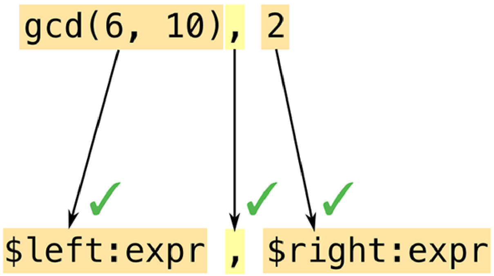
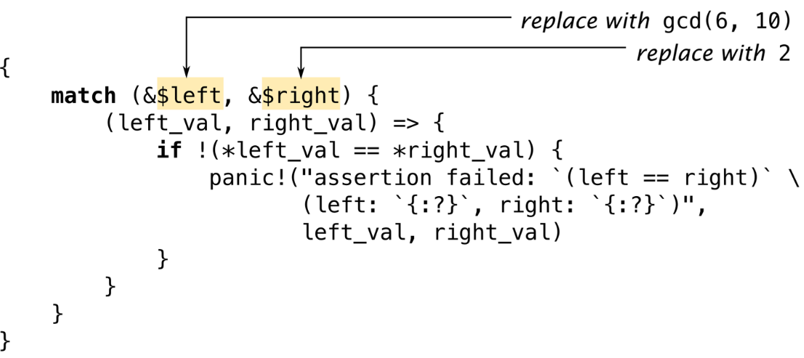

# 宏

 *A cento (from the Latin for “patchwork”) is a poem made up entirely of lines quoted from another poet.* 
<p align="right">
    ——Matt Madden
</p>

Rust支持 *宏(macros)* ，这是一种普通函数无法做到的扩展语言的方式。例如，我们已经看到过`assert_eq!`宏，它可以方便地用来测试：
```Rust
    assert_eq!(gcd(6, 10), 2);
```

这也可以写成一个泛型函数，但`assert_eq!`可以做到几件函数做不到的事。其中一点是当断言失败时，`assert_eq!`会生成包含断言所在的文件名和行号的错误消息。函数没有办法获得这些信息，但宏可以，因为它们工作的方式完全不同。

宏是一种缩写。编译期间在类型检查之前、更在生成任何机器码之前，每一个宏调用都会被 *展开(expand)* ——即被替换为一些Rust代码。上面的宏调用会展开成类似这样的代码：
```Rust
    match (&gcd(6, 10), &2) {
        (left_val, right_val) => {
            if !(*left_val == *right_val) {
                panic!("assertion failed: `(left == right)`, \
                        (left: `{:?}`, right: `{:?}`)", left_val, right_val));
            }
        }
    }
```

`panic!`也是一个宏，它自己会展开成更多Rust代码（这里没有展示）。那些代码里用到了两个别的宏：`file!()`和`line!()`。一旦crate中的每一个宏调用都被完全展开，Rust会进入编译的下一个阶段。

在运行时，一个断言失败看起来像这样（并且可能指示`gcd()`函数中的一个bug，因为`2`是正确结果）：
```
    thread 'main' panicked at 'assertion failed: `(left == right)`, (left: `17`,
    right: `2`)', gcd.rs:7
```

如果你是从C++来的，你可能经历过一些宏的糟糕体验。Rust的宏采用了一种不同的方式，类似于Scheme的`syntax-rules`。相比于C++的宏，Rust的宏和语言的其他部分集成得更好，并且因此更不容易出错。宏调用总是用感叹号标记，这样当你阅读代码时它们会很显眼，并且不会在你想调用函数时偶然错误地调用成了宏。Rust的宏从来不会插入不匹配的花括号或圆括号。并且Rust的宏带有模式匹配，这使得编写既可维护又易于使用的宏变得更容易。

在本章中，我们将通过几个简单的示例展示如何编写宏。但和Rust中的很多部分一样，宏值得深入理解，所以我们将介绍一个更复杂的宏的设计，它允许我们直接在我们的程序中嵌入JSON字面量。但除了本书中介绍的部分之外，宏还有更多的内容。因此我们将以一些进一步学习的点结束，既有我们将在这里向你展示的高级技巧，也有功能更强大的被称为 *过程宏(procedural macros)* 的设施。

## 宏基础

”图21-1”展示了`assert_eq!`宏的部分源码。


<p align="center">图21-1 <code>assert_eq!</code>宏</p>

`macro_rules!`是Rust中定义宏的主要方法。注意，宏定义里`assert_eq`后边没有`!`：只有在调用宏时才需要`!`，定义时不需要。

并不是所有的宏都是以这种方式定义的：少数的宏，例如`file!`、`line!`和`macro_rules!`自身，是编译器内建的。我们将在本章的末尾讨论另一种方法，称为过程宏。但我们的主要精力还是集中在`macro_rules!`，这是（目前为止）最容易的编写自己的宏的方法。

一个用`macro_rules!`定义的宏完全靠模式匹配工作。宏的主体只是一系列规则：
```
    ( pattern1 ) => ( template1 );
    ( pattern2 ) => ( template2 );
    ...
```

”图21-1”中的`assert_eq!`版本只有一个模式和一个模板。

顺带一提，你可以使用方括号或者花括号来代替模式或模板两侧的圆括号，对Rust来说它们并没有任何区别。另外，当你调用一个宏时，这些都是等价的：
```Rust
    assert_eq!(gcd(6, 10), 2);
    assert_eq![gcd(6, 10), 2];
    assert_eq!{gcd(6, 10), 2}
```

唯一的不同是花括号后边的分号是可选的。为了方便，我们在调用`assert_eq!`时使用圆括号，调用`vec!`时使用方括号，`macro_rules!`时使用花括号。

现在我们展示了一个宏展开的简单示例和生成这个宏的定义，我们可以深入了解它工作的细节：

- 我们将详细地解释Rust是怎么发现和展开你的程序中的宏定义的。
- 我们将指出在根据宏模板生成代码时的一些细节之处。
- 最后，我们将展示模式如何处理重复的结构。

### 宏展开基础

Rust会在编译的前期展开宏。编译器会从头到尾读取源码，在这个过程中定义和展开宏。宏只有在定义之后才能被调用，因为Rust会立刻展开每一个宏调用，而不会去看程序的剩余部分。（相反，函数和其他的”item”的定义不需要按照任何顺序。调用一个后面才定义的函数也是OK的。）

当Rust展开一个`assert_eq!`宏调用时，行为和执行一个`match`表达式非常像。Rust首先根据模式匹配参数，如”图21-2”所示：


<p align="center">图21-2 展开一个宏，第1部分：用模式匹配参数</p>

宏的模式是Rust的mini语言。它们本质上是匹配代码的正则表达式。但普通的正则表达式是操作字符，而模式操作 *token(词元)* ——数字、变量名、标点符号等Rust中的构建块。这意味着你可以在宏模式中自由地使用注释和空格来提升它们的可读性。注释和空格不是token，因此它们不会影响到匹配。

正则表达式和宏模式的另一个重要不同之处是圆括号、方括号、花括号在Rust中总是成对出现。这一点会在宏展开之前就检查，不仅仅是在宏模式中，而且是在整个语言中。

在这个例子中，我们的模式包含了 *fragment(片段)*  `$left:expr`，这告诉Rust去匹配一个表达式（在这个例子中，就是`gcd(6, 10)`）并把它复制到名称`$left`。然后Rust用`gcd`调用后边的逗号匹配模式中的逗号。类似于正则表达式，模式只有少数特殊字符会触发有趣的匹配行为；其它的所有字符，例如逗号，都必须逐字匹配相同的字符，否则就会匹配失败。

这个模式中的两个代码片段都是`expr`类型：它们代表表达式。我们将在“片段类型”中看到其他类型的代码片段。

因为这个模式匹配到了所有的参数，Rust会展开相应的 *template(模板)* (”图21-3”)：


<p align="center">图21-3 展开一个宏，第2部分：填充模板</p>

Rust会用匹配阶段发现的代码片段来替换`$left`和`$right`。

一个常见的错误是在输出模板中包含片段的类型：写`$left:expr`而不是`$left`。Rust不会立刻检测出这种错误。它会把`$left`看做一个整体，然后把`:expr`看作和模板中其他部分一样的东西：要包含在宏的输出中的词元。因此只有当你 *调用* 这个宏时这个错误才会出现；然后它会生成错误的不能编译的输出。如果你在使用一个新的宏时得到了类似`` cannot find type `expr` in this scope` ``和`help: maybe you meant to use a path separator here`这样的错误消息，可以检查下它是不是有这个错误。（“调试宏”提供了更多类似这种情况的建议。）

宏模板和web编程中常用的很多种模板语言中的任意一种都没有太大的区别。唯一的不同——也是很重要的一点——就是它的输出是Rust代码。

### 意外的结果

把代码片段插入模板和普通的处理值的代码有一些区别。这些区别一开始可能并不明显。我们之前看到的`assert_eq!`宏包含了一些有些奇怪的代码，这是宏编程特有的。让我们重点看看其中两个有趣的部分。

首先，为什么这个宏创建了两个变量`left_val`和`right_val`？为什么我们不能把模板简化成这样？
```Rust
    if !($left == $right) {
        panic!("assertion failed: `(left == right)` \
                (left: `{:?}`, right: `{:?}`)", $left, $right)
    }
```
为了回答这个问题，尝试手动展开宏调用`assert_eq!(letters.pop(), Some('z'))`。输出将会是什么？Rust会把匹配到的表达式插入模板中的多个位置。看起来在构建错误消息时重新求值表达式是一个坏主意，原因不仅仅是因为它需要消耗两倍的时间：因为`letters.pop()`从vector中移除一个值，所以在我们第二次调用它时会产生一个和第一次不同的值！这就是为什么真正的宏只计算一次`$left`和`$right`，然后存储它们的值。

来到第二个问题：为什么这个宏借用了`$left`和`$right`的值的引用？为什么不直接把它们的 *值* 存进变量中，像这样？
```Rust
    macro_rules! bad_assert_eq {
        ($left:expr, $right:expr) => ({
            match ($left, $right) {
                (left_val, right_val) => {
                    if !(left_val == right_val) {
                        panic!("assertion failed" /* ... */);
                    }
                }
            }
        });
    }
```

对于我们展示过的特殊情况，即宏的参数是整数的情况下，这可以正常工作。但如果调用者传递了一个`String`变量作为`$left`或`$right`，这段代码将会移动变量的值！
```Rust
    fn main() {
        let s = "a rose".to_string();
        bad_assert_eq!(s, "a rose");
        println!("confirmed: {} is a rose", s);    // error: use of moved value "s"
    }
```

因为我们不想让断言移动值，所以宏里使用了引用。

（你可能想知道为什么这个宏使用了`match`而不是`let`来定义变量。我们也想知道。事实证明并没有特殊的原因这么做。`let`是等价的。）

简而言之，宏可能做出令人惊讶的行为。如果一个你写的宏附近发生了奇怪的事，那很可能是这个宏有问题。

C++里的这个经典bug你 *将不会* 看到：
```Rust
    // buggy C++ macro to add 1 to a number
    #define ADD_ONE(n) n + 1
```

原因大部分的C++程序员应该很熟悉了，并且不值得详细解释，类似`ADD_ONE(1) * 10`或者`ADD_ONE(1 << 4)`这样的代码可能会产生令人惊讶的行为。为了修复它，你需要在宏定义中加上更多括号。这在Rust中是不必要的，因为Rust宏和语言集成的更好。Rust知道它什么时候是在处理表达式，因此在把一个表达式粘贴到另一个地方时它会自动添加括号。

### 重复

标准的`vec!`宏有两种形式：
```Rust
    // 重复一个值N次
    let buffer = vec![0_u8; 1000];

    // 一个逗号分隔的值的列表
    let numbers = vec!["udon", "ramen", "soba"];
```

它可以像这样实现：
```Rust
    macro_rules! vec {
        ($elem:expr ; $n:expr) => {
            ::std::vec::from_elem($elem, $n)
        };
        ( $( $x:expr ),* ) => {
            <[_]>::into_vec(Box::new([ $( $x ),* ]))
        };
        ( $( $x:expr ),+ ,) => {
            vec![ $( $x ),* ]
        };
    }
```

这里有三个规则。我们将解释多个规则是如何工作的，然后依次看看每一个规则。

当Rust展开一个例如`vec![1, 2, 3]`的宏调用时，它首先尝试匹配参数`1, 2, 3`和第一条规则的模式，即`$elem:expr ; $n:expr`。这会匹配失败：`1`是一个表达式，但这个模式要求它后边有一个分号，然而并没有。因此Rust会移动到第二个规则，等等。如果没有规则可以匹配，就会报错。

第一个规则处理类似`vec![0u8; 1000]`这样的调用。恰好有一个标准（但不在文档里的）函数`std::vec::from_elem`，正好可以完成我们需要的功能，因此这个规则很直观。

第二个规则处理`vec!["udon", "ramen", "soba"]`。模式`$( $x:expr ),*`使用了一个我们之前没有提过的的特性：重复。它匹配0个或多个逗号分隔的表达式。更一般地来说，语法`$( PATTERN ),*`用来匹配任意逗号分割的列表，其中列表中的每一项与`PATTERN`匹配。

这里的`*`和正则表达式中的`*`有相同的含义（“0次或多次”），尽管正则表达式没有特殊的`,*`重复器。你也可以用`+`来要求至少一次匹配，或者用`?`要求0次或1次匹配。”表21-1”列出了全套的重复模式。

|          **模式**   |   **含义**   |
| --- | --- |
|         `$( ... )*`      |  匹配0次或多次，无分隔符    |
|         `$( ... ),*`     |  匹配0次或多次，逗号分隔    |
|         `$( ... );*`     |  匹配0次或多次，分号分隔    |
|         `$( ... )+`      |  匹配1次或多次，无分隔符    |
|         `$( ... ),+`     |  匹配1次或多次，逗号分隔    |
|         `$( ... );+`     |  匹配1次或多次，分号分隔    |
|         `$( ... )?`      |  匹配0次或1次，无分隔符     |
|         `$( ... ),?`     |  匹配0次或1次，逗号分隔     |
|         `$( ... );?`     |  匹配0次或1次，分号分隔     |

代码片段`$x`不是单个表达式，而是一个表达式的列表。这个规则的模板也使用了重复语法：
```Rust
    <[_]>::into_vec(Box::new([ $( $x ),* ]))
```

再一次，恰好有标准方法可以满足我们的需要。这段代码创建了一个装箱的数组，然后使用`[T]::into_vec`方法把这个装箱的数组转换成一个vector。

开头的`<[_]>`，是一种不常见的写法，它表示类型“某些东西的切片”，由Rust来推断元素类型。名字是普通标识符的类型可以直接在表达式中使用，但类似`fn()`、`&str`，或者`[_]`这样的类型必须用尖括号包裹。

重复模式出现在模板的末尾，即`$($x),*`。这个`$(...),*`和我们在模式中看到的是相同的语法。它迭代`$x`匹配到的表达式列表并把它们全部插入模板，用逗号分隔。

在这种情况下看，重复的输出看起来和输入一样。但并不总是这样。我们可以编写类似这样的规则：
```Rust
    ( $( $x:expr ),* ) => {
        {
            let mut v = Vec::new();
            $( v.push($x); )*
            v
        }
    };
```

这里，模板中`$( v.push($x); )*`这一部分会对`$x`中的每个表达式插入一个`v.push()`调用。一个宏分支可以展开成一个表达式序列，但这里我们只需要单个表达式，所以我们把vector的处理包装在一个块中。

和Rust中其他部分不同，使用`$( ... ),*`并不能自动支持可选的尾部逗号。然而，有一种标准的技巧是通过添加一个额外的规则来支持尾部逗号。也就是我们的`vec!`宏的第三条规则所做的：
```Rust
    ( $( $x:expr ),+ ,) => {    // 如果存在尾部的逗号，
        vec![ $( $x ),* ]       // 重试没有它的情况
    }
```

我们使用`$( ... ),+ ,`来匹配一个有额外逗号的列表。然后，我们在模板中递归调用了`vec!`，但排除了那个逗号。这一次第二条规则将会匹配。

## 内建的宏

Rust编译器提供了几个宏，如果你要定义自己的宏，它们可能会发挥作用。这些宏都不能使用`macro_rules!`来实现。它们被硬编码进`rustc`：

*`file!(), line!(), column!()`*

&emsp;&emsp;`file!()`展开成一个字符串字面量：当前的文件名。`line!()`和`column!()`展开成`u32`字面量，表示当前的行号和列号（从1开始计数）。

&emsp;&emsp;如果一个宏调用了另一个宏，那个宏又调用了另一个宏，这三个宏在不同的文件中，并且最后一个宏调用了`file!(), line!()`或者`column!()`，它会展开成 *第一个* 宏调用的位置。

*`stringify!(...tokens...)`*

&emsp;&emsp;展开成一个包含给定token的字符串字面量。`assert!`宏就是使用了它来生成一条包含了断言代码的错误信息。

&emsp;&emsp;参数中的宏调用 *不会* 被展开：`stringify!(line!())`会展开为`"line!()"`。

&emsp;&emsp;Rust根据token构建字符串，因此生成的字符串里没有换行符或者注释。

*`concat!(str0, str1, ...)`*

&emsp;&emsp;连接参数展开为单个字符串字面量。

Rust还定义了下面这些宏用来查询构建环境：

*`cfg!(...)`*

&emsp;&emsp;展开为一个bool常量，如果当前的构建环境满足括号里的条件则为`true`。例如，如果在编译时启用了调试断言那么`cfg!(debug_assertions)`为真。

&emsp;&emsp;这个宏和“属性”中介绍过的`#[cfg(...)]`属性的语法完全相同，但它不是条件编译，而是得到一个true或者false。

*`env!("VAR_NAME")`*

&emsp;&emsp;展开为一个字符串：在编译时该环境变量的值。如果这个变量不存在，会产生编译错误。

&emsp;&emsp;除了Cargo在编译crate时设置的几个有趣的环境变量之外，这个宏毫无价值。例如，为了得到crate当前的版本，你可以写：

```Rust
        let version = env!("CARGO_PKG_VERSION");
```

&emsp;&emsp;这些环境变量的完整列表见[Cargo文档](https://doc.rust-lang.org/cargo/reference/environment-variables.html#environment-variables-cargo-sets-for-crates)。

*`option_env!("VAR_NAME")`*

&emsp;&emsp;它和`env!`宏一样，除了它返回一个`Option<&'static str>`，当环境变量没有设置时返回`None`。

还有更多内建的宏可以让你引入另一个文件中的代码或者数据：

*`include!("file.rs")`*

&emsp;&emsp;展开为指定文件的内容，必须是有效的Rust代码——表达式或者”item”的序列。

*`include_str!("file.txt")`*

&emsp;&emsp;展开成一个包含指定文件内容的`&'static str`。你可以像这样使用它：

```Rust
        const COMPOSITOR_SHADER: &str =
            include_str!("../resources/compositor.glsl");
```

&emsp;&emsp;如果文件不存在或者不是有效的UTF-8，会产生编译错误。

*`include_bytes!("file.dat")`*

&emsp;&emsp;和上一个基本相同，除了它把文件当作二进制数据而不是UTF-8文本，结果是一个`&'static [u8]`。

和所有的宏一样，这些宏也是在编译时进行处理。如果文件不存在或者不能被读取，就会编译失败。它们不可能在运行时出错。在任何情况下，如果文件名是一个相对路径，它会被解析为相对于当前文件所在的目录的路径。

Rust还提供了几个方便的宏：

*`todo!(), unimplemented!()`*

&emsp;&emsp;这些等价于`panic!()`，但用于表示不同的意图。`unimplemented!()`出现在`if`分支、`match`分支，以及其它还未处理的case中。它总是会panic。`todo!()`大致相同，但传达的意图是代码还没写完；一些IDE使用它来进行标记。

*`matches!(value, pattern)`*

&emsp;&emsp;比较一个值和一个模式，当它们匹配时返回`true`，否则返回`false`。它等价于写：

```Rust
        match value {
            pattern => true,
            _ => false
        }
```

&emsp;&emsp;如果你在寻找基本的编写宏的练习，这是一个很好的例子——尤其是你可以在标准库文档中看到它的实际实现非常简单。

## 调试宏

调试宏可能很有挑战性。最大的问题是在宏展开的过程中缺少可视性。Rust总是展开所有宏，找到一些错误，然后打印出一条错误信息，但这个错误信息并没有显示出完整的展开后的代码！

这里有三个工具可以帮助你调试宏。（这些特性都是unstable的，但因为它们被设计为用在开发的过程中，而不是最后的代码中，因此在实践中这不是一个很大的问题。）

第一个也是最简单的一个，你可以让`rustc`显示你的代码在展开所有宏之后是什么样的。使用`cargo build --verbose`来看看Cargo是怎么调用`rustc`的。拷贝`rustc`的命令行并加上`-Z unstable-options --pretty expanded`选项。完全展开后的代码会输出到终端。不幸的是，只有当你的代码没有语法错误时这种方式才能生效。

第二，Rust提供了一个`log_syntax!()`宏简单地在编译期把它的参数打印到终端。你可以使用它来进行`println!`风格的调试。这个宏需要`#![feature(log_syntax)]`特性标记。

第三，你可以让Rust编译器把所有宏调用记录到终端。在代码中插入`trace_macros!(true)`，之后每当Rust展开一个宏时，它都会打印出宏的名字和参数。例如，考虑这个程序：
```Rust
    #![feature(trace_macros)]

    fn main() {
        trace_macros!(true);
        let numbers = vec![1, 2, 3];
        trace_macros!(false);
        println!("total: {}", numbers.iter().sum::<u64>());
    }
```

它会产生如下输出：
```
    $ rustup override set nightly
    ...
    $ rustc trace_example.rs
    note: trace_macro
     --> trace_example.rs:5:19
      |
    5 |     let numbers = vec![1, 2, 3];
      |                   ^^^^^^^^^^^^^
      |
      = note: expanding `vec! { 1 , 2 , 3 }`
      = note: to `< [ _ ] > :: into_vec ( box [ 1 , 2 , 3 ] )`
```
编译器会显示每一个宏调用的代码，包括展开之前和展开之后的代码。`trace_macros!(false);`这一行关闭了追踪，因此`println!()`的调用不会被追踪。

## 构建`json!`宏

我们已经讨论了`macro_rules!`的核心特性。在这一节，我们将渐进式开发一个构建JSON数据的宏。我们将用这个例子来展示开发一个宏的过程、展示`macro_rules!`剩余的部分、并提供一些保证你的宏正确工作的建议。

回到”第10章”，我们使用了这个枚举来代表JSON数据：
```Rust
    #[derive(Clone, PartialEq, Debug)]
    enum Json {
        Null,
        Boolean(bool),
        Number(f64),
        String(String),
        Array(Vec<Json>),
        Object(Box<HashMap<String, Json>>)
    }
```

不幸的是，编写`Json`值的语法非常复杂：
```Rust
    let students = Json::Array(vec![
        Json::Object(Box::new(vec![
            ("name".to_string(), Json::String("Jim Blandy".to_string())),
            ("class_of".to_string(), Json::Number(1926.0)),
            ("major".to_string(), Json::String("Tibetan throat singing".to_string()))
        ].into_iter().collect())),
        Json::Object(Box::new(vec![
            ("name".to_string(), Json::String("Jason Orendorff".to_string())),
            ("class_of".to_string(), Json::Number(1702.0)),
            ("major".to_string(), Json::String("Knots".to_string()))
        ].into_iter().collect()))
    ]);
```

我们希望能使用更类似JSON的语法来实现同样的效果：
```Rust
    let students = json!([
        {
            "name": "Jim Blandy",
            "class_of": 1926,
            "major", "Tibetan throat singing"
        },
        {
            "name": "Jason Orendorff",
            "class_of": 1702,
            "major": "Knots"
        }
    ]);
```

我们要实现的是一个`json!`宏，它获取一个JSON值作为参数并展开为类似上一个例子中的表达式。

### 片段类型

编写任何复杂宏的第一步都是指明如何匹配或 *解析* 期望的输入。

我们已经能看到这个宏将会有好几条规则，因为JSON数据中有几种不同的东西：对象，数组，数字等等。实际上，我们可能会猜测我们将为每一种JSON类型编写一条规则：
```Rust
    macro_rules! json {
        (null)    => { Json::Null };
        ([ ... ]) => { Json::Array(...) };
        ({ ... }) => { Json::Object(...) };
        (???)     => { Json::Boolean(...) };
        (???)     => { Json::Number(...) };
        (???)     => { Json::String(...) };
    }
```

这并不完全正确，因为宏模式没法区分最后三种情况，但我们稍后将会看到怎么处理它们。前三种情况至少很明显地以不同的token开头，因此我们可以用这些token进行区分。

第一个规则已经可以工作了：
```Rust
    macro_rules! json {
        (null) => {
            Json::Null
        }
    }

    #[test]
    fn json_null() {
        assert_eq!(json!(null), json::Null);    // passes!
    }
```

为了支持JSON数组，我们可能要尝试匹配元素为`expr`：
```Rust
    macro_rules! json {
        (null) => {
            Json::Null
        };
        ([ $( $element:expr ),* ]) => {
            Json::Array(vec![ $( $element ),* ])
        };
    }
```

不幸的是，这不能匹配所有的JSON数组。这里有一个会产生问题的例子：
```Rust
    #[test]
    fn json_array_with_json_element() {
        let macro_generated_value = json!(
            [
                // 有效的JSON，但不匹配`$element:expr`
                {
                    "pitch": 440.0
                }
            ]
        );
        let hand_coded_value =
            Json::Array(vec![
                Json::Object(Box::new(vec![
                    ("pitch".to_string(), Json::Number(440.0))
                ].into_iter().collect()))
            ]);
        assert_eq!(macro_generated_value, hand_coded_value);
    }
```

模式`$( $element:expr ),*`意思是“一个逗号分隔的Rust表达式的列表”。但很多JSON值尤其是对象，不是有效的Rust表达式，它们不能匹配。

因为你想要匹配的代码并不都是表达式，所以Rust还支持其他几种片段类型，如”表21-2”所示。

|          **片段类型**     |   **匹配的内容（及示例）**   |     **后边可以跟**   |
| --- | --- | --- |
|         `expr`    |  一个表达式：`2 + 2, "udon", x.len()`    |  `=> , ;`    |
|         `stmt`    |  一个表达式或者声明，不包括尾部的分号（很难用；尝试用`expr`或`block`代替）    |  `=> , ;`  |
|         `ty`  |  一个类型：`String, Vec<u8>, (&str, bool), dyn Read + Send`     |  `=> , ; \| { [ : > as where`  |
|         `path`    |  一个路径（已讨论过）：`ferns, ::std::sync::mpsc`    |  `=> , ; \| { [ : > as where`  |
|         `pat`     |  一个模式（已讨论过）：`_, Some(ref x)`     |  `=> , = \| if in`  |
|         `item`    |  一个item（已讨论过）：`struct Point { x: f64, y: f64 }, mod ferns;`   |  任何东西  |
|         `block`   |  一个块（已讨论过）：`{ s += "ok\n"; true }`   |  任何东西   |
|         `meta`    |  一个属性的内容（已讨论过）：`inline, derive(Copy, Clone), doc="3D models."`  |  任何东西  |
|         `ident`   |  一个标识符：`std, Json, longish_variable_name`    |  任何东西  |
|         `literal` |  一个字面值：`1024, "Hello, world!", 1_000_000f64`     |  任何东西  |
|         `lifetime`  |  一个生命周期：`'a, 'item, 'static`    |  任何东西  |
|         `vis`     |  可见性说明符：`pub, pub(crate), pub(in module::submodule)`  |  任何东西  |
|         `tt`      |  一个token树：`;, >=, {}, [0 1 (+ 0 1)]`   |  任何东西  |

表格中的大部分选项严格要求Rust语法。`expr`类型只匹配Rust表达式（不是JSON值），`ty`只匹配Rust类型，等等。它们是不可扩展的：没有办法定义一种新的可以用`expr`识别的运算符或关键字。我们不能用这些来实现匹配任意JSON数据。

最后两个，`ident`和`tt`，支持匹配不是Rust代码的参数。`ident`匹配任何标识符。`tt`匹配单个 *token树* ：一对正确匹配的括号：`(...), [...], {...}`，以及其中的任何内容，包括嵌套的token树；或者一个没有括号的单个token，例如`1926`或`"Knots"`。

token树正是我们的`json!`宏所需要的。每一个JSON值都是单个token树：数字、字符串、bool值、`null`都是单个token，对象和数组是token树。因此我们可以写出像这样的模式：
```Rust
    macro_rules! json {
        (null) => {
            Json::Null
        };
        ([ $( $element:tt ),* ]) => {
            Json::Array(...)
        };
        ({ $( $key:tt : $value: tt ),* }) => {
            Json::Object(...)
        };
        ($other::tt) => {
            ... // TODO: 返回数字、字符串、bool值
        };
    }
```

这个版本的`json!`宏可以匹配任何JSON数据。现在我们只需要产生正确的Rust代码。

为了保证Rust在未来可以添加新的语法特性而不会破坏任何你今天写的宏，Rust限制了模式中紧跟在片段之后的token。”表21-2”中“后边可以跟”这一列展示了哪些token可以跟在模式后面。例如，模式`$x:expr ~ $y:expr`是错的，因为`~`不允许出现在`expr`后面。模式`$vars:pat => $handler:expr`是可以的，因为`$vars:pat`后跟的是箭头`=>`，它允许跟在`pat`后面，而`$handler:expr`后面没有跟任何东西，这种情况总是允许的。

### 宏中的递归

我们已经见过了一个在宏里调用自身的小例子：我们的`vec!`的实现使用了递归来支持尾部的逗号。这里我们可以展示一个更加显著的例子：`json!`需要递归调用它自身。

我们可能会尝试在不递归的情况下支持JSON数组，像这样：
```Rust
    ([ $( $element:tt ),* ]) => {
        Json::Array(vec![ $( $element ),* ])
    };
```
但这段代码并不能工作。这样只是把JSON数据（`$element` token树）粘贴到了Rust表达式之中，但它们是两种不同的语言。

我们需要把数组中的每一个元素从JSON格式转换为Rust代码。幸运的是，有一个宏可以做到这件事：就是我们正在写的这个宏！
```Rust
    ([ $( $element:tt ),* ]) => {
        Json::Array(vec![ $( json!($element) ),* ])
    };
```

这种方式还可以支持对象：
```Rust
    ({ $( $key:tt : $value:tt ),* }) => {
        Json::Object(Box::new(vec![
            $( ($key.to_string(), json!($value)) ),*
        ].into_iter().collect()))
    };
```

默认情况下编译器会把宏的递归次数上限设置为64。对于`json!`宏的常规使用这肯定已经足够了，但有时复杂的递归宏会达到这个上限。你可以在使用这个宏的crate的开头加上这一行来调整上限
```Rust
    #![recursion_limit = "256"]
```
我们的`json!`宏基本已经完成了。剩下的只有支持布尔、数字和字符串值。

### 宏和trait

编写复杂的宏时总是会遇到困难。重要的是要记住，宏并不是解决问题的唯一途径。

这里，我们需要支持`json!(true)`、`json!(1.0)`、`json!("yes")`，把这些值转换成对应的`Json`值。但宏并不擅长区分类型。假如我们这么写：
```Rust
    macro_rules! json {
        (true) => {
            Json::Boolean(true)
        };
        (false) => {
            Json::Boolean(false)
        };
        ...
    }
```

显然这种方案是行不通的。布尔类型只有两个值，但数字和字符串有很多值。

幸运的是，有一种标准的把多种类型的值转换成另一种特定类型的方法：`From` trait。我们可以简单地为几种类型实现这个trait：
```Rust
    impl From<bool> for Json {
        fn from(b: bool) -> Json {
            Json::Boolean(b)
        }
    }

    impl From<i32> for Json {
        fn from(i: i32) -> Json {
            Json::Number(i as f64)
        }
    }

    impl From<String> for Json {
        fn from(s: String) -> Json {
            Json::String(s)
        }
    }

    impl<'a> From<&'a str> for Json {
        fn from(s: &'a str) -> Json {
            Json::String(s.to_string())
        }
    }
    ...
```

事实上，所有的12种数字类型应该有非常相似的实现，因此编写一个宏来避免复制粘贴是有意义的：
```Rust
    macro_rules! impl_from_num_for_json {
        ( $( $t:ident )* ) => {
            $(
                impl From<$t> for Json {
                    fn from(n: $t) -> Json {
                        Json::Number(n as f64)
                    }
                }
            )*
        };
    }

    impl_from_num_for_json!(u8 i8 u16 i16 u32 i32 u64 i64 u128 i128
                            usize isize f32 f64);
```

现在我们可以使用`Json::from(value)`来把`value`转换成`Json`。在我们的宏中，看起来像这样：
```Rust
    ( $other:tt ) => {
        Json::from($other)  // 处理布尔/数字/字符串
    };
```

向我们的`json!`宏中添加了这个规则之后，它就可以通过我们目前写过的所有测试了。把所有部分汇总起来，它现在看起来像这样：
```Rust
    macro_rules! json {
        (null) => {
            Json::Null
        };
        ([ $( $element:tt),* ]) => {
            Json::Array(vec![ $( json!($element) ),* ])
        };
        ({ $( $key:tt : $value:tt ),* }) => {
            Json::Object(Box::new(vec![
                $( ($key.to_string(), json!($value)) ),*
            ].into_iter().collect()))
        };
        ( $other:tt ) => {
            Json::from($other)  // 处理布尔/数字/字符串
        };
    }
```

事实证明，这个宏意外地支持在JSON数据中使用变量甚至任意的Rust表达式，这是一个有趣的特性：
```Rust
    let width = 4.0;
    let desc = 
        json!({
            "width": width,
            "height": (width * 9.0 / 4.0)
        });
```

因为`(width * 9.0 / 4.0)`是用括号括起来的，所以它是单个的token树，因此在解析这个对象时宏可以成功地用`$value:tt`匹配它。

### 作用域和hygiene

在编写宏时一个令人惊讶的问题是它们将来自不同范围的代码粘贴在一起。因此接下来的几页将介绍Rust处理作用域的两种方式：一种用于局部变量和参数，另一种用于其他的东西。

为了展示为什么会有这个问题，让我们重写解析JSON对象的规则（之前展示过的`json!`宏的第三条规则），让它不再使用临时的vector。我们可以像这样写：
```Rust
    ({ $($key:tt : $value:tt),* }) => {
        {
            let mut fields = Box::new(HashMap::new());
            $( fields.insert($key.to_string(), json!($value)); )*
            Json::Object(fields)
        }
    };
```

现在我们不再使用`collect()`，而是通过重复调用`.insert()`方法来填充`HashMap`。这意味着我们需要把map存储在一个临时的变量中，这里命名为`fields`。

但如果调用`json!`宏的代码中恰好也有一个叫`fields`的变量，会发生什么呢？
```Rust
    let fields = "Fields, W.C.";
    let role = json!({
        "name": "Larson E. Whipsnade",
        "actor": fields
    });
```

展开这个宏时将会把两段代码拼在一起，两段代码中都用了变量`fields`来表示不同的东西！
```Rust
    let fields = "Fields, W.C.";
    let role = {
        let mut fields = Box::new(HashMap::new());
        fields.insert("name".to_string(), Json::from("Larson E. Whipsnade"));
        fields.insert("actor".to_string(), Json::from(fields));
        Json::Object(fields)
    };
```

看起来好像只要宏里使用了临时变量就无法避免这个问题，并且你可能已经正在思考可能的解决方案了。也许我们应该把`json!`宏中的变量重命名为一般情况下调用者不会传入的名字：例如用`__json$fields`代替`fields`。

这里令人惊讶的是 *宏可以正常工作* 。Rust会为你重命名变量！这个特性一开始在Scheme宏中实现，被称为 *hygiene* ，因此Rust被认为有 *hygienic宏* 。

理解hygiene宏的最简单的方式就是想象每一次展开宏时，展开的部分都被染成了不同的颜色。

不同颜色的变量，就好像有不同的名字一样：


注意这里宏的调用者传入并被粘贴到输出中的代码，例如`"name"`和`"actor"`，保持了它们原本的颜色（黑色）。只有宏模板生成的token被染成了另一种颜色。

现在这里有一个叫`fields`的变量（在调用者中声明）和另一个叫`fields`的变量（宏引入的）。因为这两个名字的颜色不同，所以这两个变量不会混淆。

如果一个宏真的需要引用一个在调用者作用域里的变量，那么调用者必须向宏传递这个变量的名字。

（染色的比喻并不意味着hygiene真的就是这么工作的。实际的机制要更聪明一些：不管是什么颜色，如果两个标识符引用了宏和调用者作用域里的同一个变量，那么就认为它们是相同的。但在Rust中像这样的例子非常少见。如果你理解了上面的例子，那么就使用hygiene宏来说已经足够了。）

你可能已经注意到了很多别的标识符也被染上了一种或多种的颜色：例如`Box`、`HashMap`、`Json`等。就算没有颜色，Rust也可以辨认出这些类型的名字。这是因为Rust中的hygiene仅限于局部变量和参数。对于常量、类型、昂发、模块、静态变量、宏名来说，Rust是“色盲”。

这意味着如果我们的`json!`宏被用在了`Box`、`HashMap`或`Json`不在作用域里的模块中时，这个宏将不能工作。我们将在下一节中展示怎么避免这个问题。

首先，我们将考虑一个Rust的hygiene会产生阻碍的例子，并且我们需要解决它。假设我们有很多函数都包含下面这一行代码：
```Rust
    let req = ServerRequest::new(server_socket.session());
```

如果复制粘贴这一行将会很痛苦。我们可以使用宏来代替吗？
```Rust
    macro_rules! setup_req {
        () => {
            let req = ServerRequest::new(server_socket.session());
        }
    }

    fn handle_http_request(server_socket: &ServerSocket) {
        setup_req!();   // 声明`req`，使用了`server_socket`
        ... // 使用`req`的代码
    }
```

显然这么写不能工作。必须要让宏里的`server_socket`这个名字指向函数里声明的参数`server_socket`，`req`变量恰好相反。但hygiene会保护宏里的名字不会和其他作用域里的名字“碰撞”——即使这正是你想要的行为。

解决方案是把你计划在宏里宏外都要使用的变量全部传进宏里：
```Rust
    macro_rules! setup_req {
        ($req:ident, $server_socket:ident) => {
            let $req = ServerRequest::new($server_socket.session());
        }
    }

    fn handle_http_request(server_socket: &ServerSocket) {
        setup_req!(req, server_socket);
        ... // 使用`req`的代码
    }
```

因为`req`和`server_socket`现在由函数提供，所以它们的“颜色”和那个作用域一样。

hygiene让宏的使用变得更繁琐了一点，但这是一个特性，而不是bug：知道了它们不会在背后扰乱局部变量之后，可以更容易地推理hygiene宏。如果你在一个函数里搜索一个类似`server_socket`的标识符，你将会发现所有使用了它的地方，包括宏调用。

### 导入和导出宏

因为宏在编译的早期被展开，此时Rust还不知道你的项目的完整的模块结构，因此编译器有特殊的方法来导入和导出它们。

在一个模块中可见的宏自动地在它的子模块中可见。为了从一个模块“逆向”导出到它的父模块，可以使用`#[macro_use]`属性。例如，假设我们的 *lib.rs* 看起来像这样：
```Rust
    #[macro_use] mod macros;
    mod client;
    mod server;
```

`macros`模块中定义的所有的宏都被导入到了`lib.rs`，因此它们对crate中的其他部分都可见，包括在`client`和`server`中。

使用`#[macro_export]`标记的宏自动地变为`pub`并可以和其他item一样通过路径引用。

例如，`lazy_static` crate提供了一个叫`lazy_static`的被`#[macro_export]`标记的宏。为了在你自己的crate中使用这个宏，你可以写：
```Rust
    use lazy_static::lazy_static;
    lazy_static!{ }
```
一旦一个宏被导入之后，就可以像其他的item一样使用它：
```Rust
    use lazy_static::lazy_static;

    mod m {
        crate::lazy_static!{ }
    }
```

当然，实际上这也意味着你的宏可能会在其他的模块中被调用。因此一个导出的宏不应该依赖任何作用域中的东西——没有办法预测使用它的作用域中会有什么。甚至标准prelude的特性也可以被遮蔽。

因此，宏应该使用绝对路径来表示它用到的任何名称。为此`macro_rules!`提供了特殊的片段`$crate`。它和`crate`不同，后者是一个可以在任何地方的路径中使用的关键字，而不仅仅是在宏里。`$crate`的含义类似于定义这个宏的crate的根模块的绝对路径。我们可以使用`$crate::Json`来代替`Json`，这样即使`Json`没有被导入也可以工作。`HashMap`可以改为`::std::collections::HashMap`或者`$crate::macros::HashMap`。在后者的情况下，我们需要重新导出`HashMap`，因为`$crate`不能用来访问crate的私有特性。它实际上会被展开成类似`::jsonlib`的普通路径。可见性规则不受影响。

在将宏移动到了它自己的`macros`模块，并修改它使用`$crate`之后，它看起来像这样。这是最终的版本：
```Rust
    // macro.rs
    pub use std::collections::HashMap;
    pub use std::boxed::Box;
    pub use std::string::ToString;

    #[macro_export]
    macro_rules! json {
        (null) => {
            $crate::Json::Null
        };
        ([ $( $element:tt ),* ]) => {
            $crate::Json::Array(vec![ $( json!($element) ),* ])
        };
        ({ $( $key:tt : $value:tt ),* }) => {
            {
                let mut fields = $crate::macros::Box::new(
                    $crate::macros::HashMap::new());
                $(
                    fields.insert($crate::macros::ToString::to_string($key), 
                                  json!($value));
                )*
                $crate::Json::Object(fields)
            }
        };
        ($other:tt) => {
            $crate::Json::from($other)
        };
    }
```

因为`.to_string()`方法是标准的`ToString` trait的一部分，所以我们也使用了`$crate`来引用它，并使用了我们在“完全限定方法调用”中介绍过的语法：`$crate::macors::ToString::to_string($key)`。在我们的例子中，为了让宏能正常工作，这并不是必须的，因为`ToString`在标准prelude里。但如果你在调用一个trait的方法，并且这个trait可能不在调用处的作用域里，那么完全限定方法调用将是最好的方式。

## 在匹配时避免语法错误

下面的宏看起来是有原因的，但它会给Rust带来一些麻烦：
```Rust
    macro_rules! complain {
        ($msg:expr) => {
            println!("Complaint filed: {}", $msg);
        };
        (user : $userid:tt , $msg:expr) => {
            println!("Complaint from user {}: {}", $userid, $msg);
        };
    }
```

假如我们像这样调用它：
```Rust
    complain!(user: "jimb", "the AI lab's chatbots keep picking on me");
```

以人眼来看，显然这会匹配第二个模式。但Rust会首先尝试第一个规则，尝试用`$msg:expr`匹配所有的输入。这时事情会变得糟糕起来。`user: "jimb"`显然不是一个表达式，因此我们会得到一个语法错误。Rust拒绝掩盖语法错误——宏已经足够难调试了。它会立刻报错并中断编译。

如果模式中的其他token匹配失败，rust会移动到下一条规则。只有语法错误会导致终止，并且只有当尝试匹配片段时才会出现语法错误。

这里的问题并不难理解：我们尝试在一条错误的规则中用`$msg:expr`匹配一个片段。它会匹配失败，因为我们没想过用这条规则来匹配，调用者是希望用另一条规则来匹配。有两种避免这个错误的方式：

第一，避免易混淆的规则。例如，我们可以修改宏，让每一个模式都以一个不同的标识符开头：
```Rust
    macro_rules! complain {
        (msg : $msg:expr) => {
            println!("Complaint filed: {}", $msg);
        };
        (user : $userid:tt , msg : $msg:expr) => {
            println!("Complaint from user {}: {}", $userid, $msg);
        };
    }
```

当宏的参数以`msg`开头时，我们会得到规则1。当它们以`user`开头时，我们会得到规则2。我们现在可以在尝试匹配一个片段之前得到正确的规则。

另一种避免伪语法错误的方式是把更加具体的规则放在前面。把`user :`规则放在第一个就可以解决`complain!`的问题，会导致语法错误的规则不会再被触发。

## `macro_rules!`之外

宏模式可以解析比JSON更复杂得多的输入，但我们会发现它的复杂性很快就脱离了控制。

Daniel Keep等人的[The Little Book of Rust Macros](https://danielkeep.github.io/tlborm/book/)是一本优秀的讲解高级`macro_rules!`编程的书。这本书非常的清楚和聪明，它比我们这里更加详细地描述了宏展开的每一个概念。它还提出了几种非常巧妙的技术，将`macro_rules!`模式作为一种编程语言来解析复杂的输入。这一点我们不太热衷。请小心使用。

Rust 1.15引入了一种单独的机制称为 *过程宏(procedural macros)* 。过程宏支持扩展`#[derive]`属性来实现自定义派生，如”图21-4”所示。还可以创造自定义的属性以及新的和之前介绍的`macro_rules!`宏调用方式一样的宏。

![通过`#[derive]`属性来调用一个`IntoJson`过程宏](../img/f21-4.png)
<p align="center">图21-4 通过<code>#[derive]</code>属性来调用一个<code>IntoJson</code>过程宏</p>

并不存在`IntoJson` trait，但没关系：一个过程宏可以使用这种方式来插入它需要的代码（在这个例子中，可能是`impl From<Money> for Json { ... }`）。

过程宏之所以被称为“过程”是因为它被实现为一个Rust函数，而不是声明规则集。这个函数通过一个简单的抽象层和编译器交互，并且可以非常复杂。例如，`diesel`数据库的库使用了过程宏来连接到一个数据库并在编译期根据该数据库的模式生成代码。

因为过程宏要和编译器内部交互，编写高效的宏需要了解编译器的工作原理，这超出了本书的范围。然而，它在[在线文档](https://doc.rust-lang.org/book/ch19-06-macros.html#procedural-macros-for-generating-code-from-attributes)中有充分的介绍。

也许当读到这里时，你已经决定了你很讨厌宏。那该怎么办呢？一种替代方案是使用构建脚本来生成Rust代码。[Cargo文档](https://doc.crates.io/build-script.html#case-study-code-generation)一步步地展示了怎么做到这点。它包含编写一个程序生成你想要的Rust代码、在 *Cargo.toml* 中添加一行以在构建过程中运行这个程序、使用`include!`把生成的代码引入你的crate。
