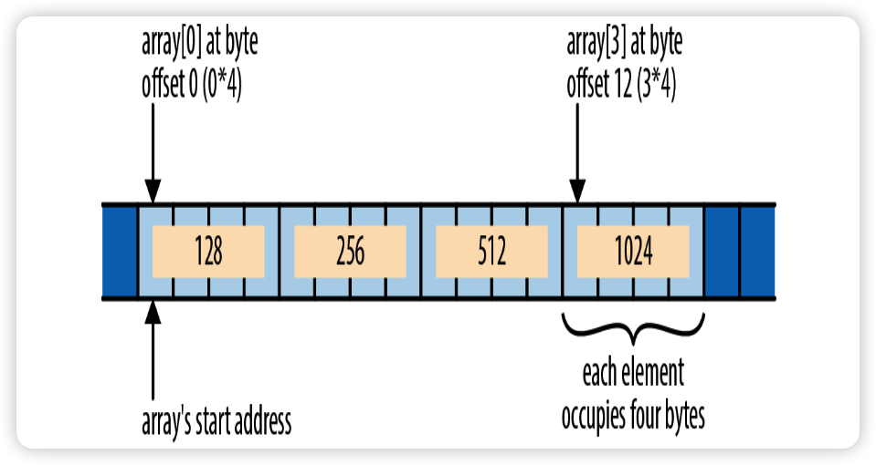
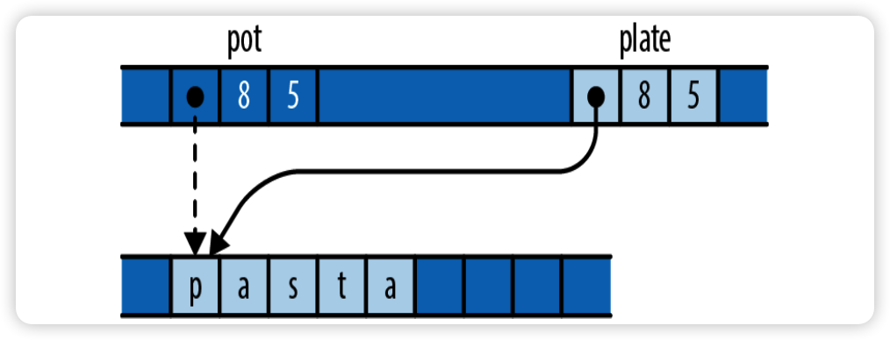
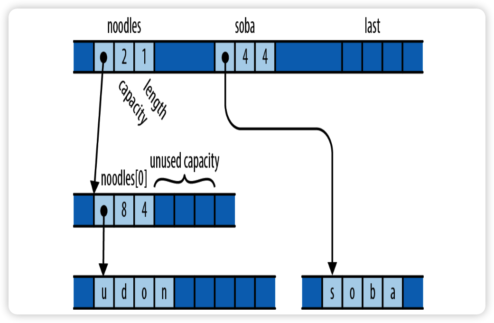
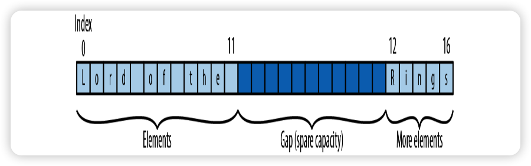
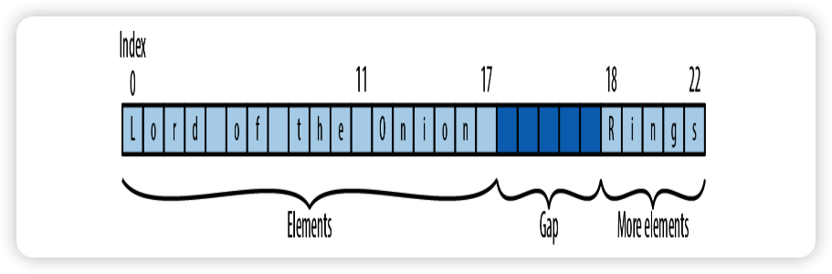

# unsafe代码

*Let no one think of me that I am humble or weak or passive;*

*Let them understand I am of a different kind: dangerous to my enemies, loyal to my friends. To such a life glory belongs.*

<p align="right">
    ——Euripides, Medea
</p>

系统编程的乐趣在于，在每一个安全的语言和精心设计的抽象之下，都是不安全的机器语言和比特位。你也可以在Rust中写出这样的代码。

到目前为止本书中介绍的语言部分，例如类型、生命周期、约束检查等都可以自动保证你的程序完全没有内存错误和数据竞争。但这种自动的技术有它的局限性；Rust并不能识别出来很多有价值的技术是安全的。

 *unsafe代码* 让你可以告诉Rust，“我要使用一些你不能保证安全的特性”。把一个块或者函数标记为unsafe之后，你就可以调用标准库中的unsafe函数、解引用unsafe指针、调用其他语言例如C和C++编写的函数等。Rust的其他安全性检查依然生效：类型检查、生命周期检查、约束检查等仍然和之前一样。unsafe代码只是允许了一小部分额外的特性。

正是因为有了允许超出safe Rust界限的能力，Rust才能实现它自身的大部分基础特性，和C/C++一样，Rust也被用来实现它自己的标准库。unsafe代码可以让`Vec`类型更高效地管理它的缓冲区；让`std::io`模块和操作系统交互；让`std::thread`和`std::sync`模块提供并发原语。

本章介绍了unsafe特性的一些基础：

- Rust的`unsafe`块区分开了普通的safe Rust代码和使用unsafe特性的代码。
- 你可以把函数标记为`unsafe`，提醒调用者他们必须遵守的一些额外约束来避免未定义行为。
- 原始指针和它们的方法允许对内存进行不受限的访问，并允许你构建Rust的类型系统可能禁止的数据结构。Rust的引用虽然安全，但却是受限制的，原始指针正如每个C或C++程序员所知，是一个强大而锋利的工具。
- 理解未定义行为的定义将会帮助你理解为什么它们比得到错误结果还要糟糕的多。
- unsafe trait，类似于`unsafe`函数，隐含了每个实现（而不是每个调用者）都要遵守的规则。

## unsafe从何而来？

在本书的开头处，我们曾经展示过一个C程序，它以一种非常令人惊讶的方式崩溃。这是因为它违背了C标准的一个规则。你可以在Rust中实现相同的效果：

```
    $ cat crash.rs
    fn main() {
        let mut a: usize = 0;
        let ptr = &mut a as *mut usize;
        unsafe {
            *ptr.offset(3) = 0x7ffff72f484c;
        }
    }
    $ cargo build
       Compiling unsafe-samples v0.1.0
        Finished debug [unoptimized + debuginfo] target(s) in 0.44s
    $ ../../target/debug/crash
    crash: Error: .netrc file is readable by others.
    crash: Remove password or make file unreadable by others.
    Segmentation fault (core dumped)
    $
```

这个程序借用了局部变量`a`的一个可变引用，然后把它转换成了`*mut usize`类型的原始指针，然后使用了它的`offset`方法来产生一个指向三个字之后的位置的指针。这里恰巧存储了`main`的返回地址。这个程序用一个常量覆盖了返回地址，因此从`main`返回之后程序的行为就很奇怪。这个崩溃之所以可行，是因为程序错误使用了unsafe的特性——在这个例子中，就是解引用原始指针的能力。

一个unsafe特性通常隐含了一份 *合约(contract)* ：即一组Rust不能自动强制，但你必须遵守才能避免 *未定义行为* 的规则。

一份合约超出了普通的类型检查和生命周期检查，它们隐含着一些unsafe特性特定的规则。通常来说，Rust本身完全不知道这些合约，它们只在unsafe特性的文档里得到解释。例如，原始指针类型的合约是禁止解引用一个指向的位置超出原来指向物的末尾的原始指针。这个例子中的表达式`*ptr.offset(3) = ...`打破了这个合约。但是，正如上面所示，Rust没有任何警告，成功编译了这个程序：它的安全检查并没有检测出来这个违规行为。当你使用unsafe特性时，你作为程序员，需要负责检查你的代码遵守了它们的合约。

很多特性如果想正确使用，都要遵守一定的规则。但这些规则并不是我们这里说的合约，除非它们可能会导致未定义行为。未定义行为是一种Rust假设你的代码中绝对不会出现的行为。例如，Rust假设你不会用别的值覆盖函数的返回地址。通过了Rust通常的安全检查并且遵守了使用到的unsafe特性的合约的代码不可能会出现这样的行为。因为这个程序违反了原始指针的合约，因此它的行为变得未定义，并最终崩溃。

如果你的代码出现了未定义行为，说明你打破了你负责的一部分，Rust拒绝预测结果。从系统库的深处抛出来一个错误并崩溃是一种可能的结果；把你的计算机的控制权交给攻击者是另一种可能的结果。不同的Rust版本可能也会有不同的行为。然而，有时未定义行为不一定会产生可见的结果。例如，如果这里的`main`函数永远不会返回（可能调用了`std::process::exit`来提前终止程序），那么错误的返回地址也无关紧要。

你只能在`unsafe`块或者`unsafe`函数里使用unsafe特性；我们将在接下来的小节介绍它们。它们让unsafe特性不容易被忽略：通过强迫你写一个`unsafe`块或者函数，Rust能确保你知道你的代码可能要遵守一些额外的规则。

## unsafe块

`unsafe`块看起来就像一个以`unsafe`关键字开头的普通块，区别在于你可以在unsafe块里使用unsafe特性：
```Rust
    unsafe {
        String::from_utf8_unchecked(ascii)
    }
```

如果没有块前面的`unsafe`关键字，Rust将会禁止使用`from_utf8_unchecked`，因为它是一个`unsafe`的函数。在`unsafe`块中，你可以随意使用它。

和普通的Rust块一样，`unsafe`块的值也是最后一条表达式的值，或者是`()`。这个例子中`String::from_utf8_unchecked`的调用提供了块的值。

一个`unsafe`块为你解锁了5个额外的功能：

- 你可以调用`unsafe`函数。每一个`unsafe`函数都有它自己的合约，这取决于它的功能。
- 你可以解引用原始指针。safe代码可以传递、比较、通过引用转换创建原始指针，但只有unsafe代码才可以使用它们来访问内存。我们将在“原始指针”中详细介绍原始指针并解释如何安全地使用它们。
- 你可以访问`union`的字段，尽管编译器不能确定它们含有相应类型的有效值。
- 你可以访问可变的`static`变量。正如“全局变量”中解释的一样，Rust不能确保什么时候有线程正在使用可变的`static`变量，因此它们的合约要求你要确保所有的访问都是正确同步的。
- 你可以访问通过Rust的外部函数接口声明的函数和变量。即使它们是不可变的，也会被认为是`unsafe`的，因为它们是使用其他语言编写的，这些语言可能不遵守Rust的安全规则。

把unsafe特性约束在`unsafe`块里并不会真的阻止你做任何想做的事。你完全只需要在你的代码里加上一个`unsafe`块，然后就可以继续了。这个规则的作用主要是为了把人类的注意力吸引到那些Rust不能保证安全性的代码上：

- 你不会意外地使用到unsafe特性，然后发现你要为甚至不知道它的存在的合约负责。
- 一个`unsafe`块可以吸引reviewer更多的注意力。一些项目甚至有一些自动化流程来确保这一点，例如标记出会影响`unsafe`块的代码来吸引更多注意力。
- 当你正在考虑编写一个`unsafe`块时，你可以花费一点时间来问问自己你的任务是否真的需要这些特性。如果是为了性能，你是否有测量数据表明这真的是一个性能瓶颈？可能有一种在safe Rust中也可以实现相同效果的方法。

## 示例：一个高效的ASCII字符类型

这里有一个示例，`Ascii`是一个字符串类型，它确保它的内容总是有效的ASCII字符。这个类型使用一个unsafe特性来提供到`String`的0开销转换：
```Rust
    mod my_ascii {
        /// 一个ASCII编码的字符串
        #[derive(Debug, Eq, PartialEq)]
        pub struct Ascii(
            // 它必须只存有有效的ASCII文本：从`0`到`0x7f`的字节序列
            Vec<u8>
        );

        impl Ascii {
            /// 从`bytes`中的Ascii文本创建一个`Ascii`。
            /// 如果`bytes`中含有任何非ASCII字符就返回一个`NotAsciiError`错误。
            pub fn from_bytes(bytes: Vec<u8>) -> Result<Ascii, NotAsciiError> {
                if bytes.iter().any(|&byte| !byte.is_ascii()) {
                    return Err(NotAsciiError(bytes));
                }
                Ok(Ascii(bytes))
            }
        }

        // 当转换失败时，我们会给出不能转换的vector。
        // 它应该实现`std::error::Error`，这里为了简洁就省略了。
        #[derive(Debug, Eq, PartialEq)]
        pub struct NotAsciiError(pub Vec<u8>);

        // 安全、高效的转换，使用unsafe代码实现。
        impl From<Ascii> for String {
            fn from(ascii: Ascii) -> String {
                // 如果这个模块没有bug的话，这里就是安全的，
                // 因为有效的ASCII文本也是有效的UTF-8文本。
                unsafe { String::from_utf8_unchecked(ascii.0) }
            }
        }
        ...
    }
```

这个模块的关键是`Ascii`类型的定义。这个类型本身被标记为`pub`，以让它在`my_ascii`模块外可见。但它的`Vec<u8>`元素 *不是* public的，因此只有`my_ascii`模块里的方法可以创建一个`Ascii`值或者访问它的元素。这完全控制了模块里哪些代码是公开的哪些是不公开的。只要public的构造器和方法能确保新创建的`Ascii`值是有效的，并始终保持有效，那么程序的其他部分就不可能违反规则。并且public的构造器`Ascii::from_bytes`确实小心地检查了给定的vector来确保能从它构建出一个有效的`Ascii`。出于简洁性的考虑，我们并没有展示出每一个方法，但你可以想象还有一些处理文本的方法，这些方法同样确保`Ascii`的值总是有效的ASCII文本，就像`String`的方法确保它的内容总是有效的UTF-8.

这样的安排让我们可以非常高效地为`String`实现`From<Ascii>`。unsafe函数`String::from_utf8_unchecked`获取一个字节vector并根据它的内容构建一个`String`，并且不检查它的内容是否是有效的UTF-8文本；这个函数的合约就是调用者要负责这一点。幸运的是，`Ascii`类型强迫的规则正是满足`from_utf8_unchecked`的合约所需的条件。正如我们在“UTF-8”中解释的一样，任何有效的ASCII文本都是有效的UTF-8文本，因此`Ascii`内部的`Vec<u8>`可以立刻作为一个`String`的缓冲区使用。

有了这些定义之后，你可以写这样的代码：
```Rust
    use my_ascii::Ascii;

    let bytes: Vec<u8> = b"ASCII and ye shall receive".to_vec();

    // 这里的调用没有任何内存分配或者文本拷贝，只进行一次扫描。
    let ascii: Ascii = Ascii::from_bytes(bytes)
        .unwrap();  // 我们已经知道了bytes是没问题的。

    // 这里的调用是0开销的：没有内存分配、拷贝、扫描。
    let string = String::from(ascii);

    assert_eq!(string, "ASCII and ye shall receive");
```

使用`Ascii`不需要unsafe块。我们已经使用unsafe操作实现了一个safe的接口，并且安排好只依赖模块自己的代码而不是用户的行为来满足它的合约。

`Ascii`只是一个`Vec<u8>`的包装，并在模块里隐藏了一些强迫它的内容需要满足的规则。一个这样的类型被称为 *newtype* ，它是Rust中非常普遍的一种模式。Rust自己的`String`类型就是用完全相同的方式定义的，区别只有它的内容被限制为UTF-8，而不是ASCII。事实上，这是标准库里`String`的定义：
```Rust
    pub struct String {
        vec: Vec<u8>,
    }
```

在机器语言的层面上，是完全没有Rust的类型信息的，newtype和它的元素有完全相同的内存表示，因此构建一个newtype完全不需要任何额外的机器指令。在`Ascii::from_bytes`中，表达式`Ascii(bytes)`只是表明`Vec<u8>`现在的内存表示持有的是一个`Ascii`值。类似的，`String::from_utf8_unchecked`在内联的情况下可能不包含任何机器指令：它只表明`Vec<u8>`现在被认为是一个`String`。

## unsafe函数

`unsafe`函数的定义就像一个以`unsafe`开头的普通函数。`unsafe`函数的函数体自动被认为是一个`unsafe`块。

你只能在`unsafe`块里调用`unsafe`函数。这意味着将一个函数标记为`unsafe`可以警告调用者这个函数有一个额外的合约，必须满足这个合约才能避免未定义行为。

例如，这里有一个新的`Ascii`类的构造器，这个构造器从一个字节vector构建一个`Ascii`，并且不检查内容是否是有效的ASCII：
```Rust
    // 这段代码必须放在`my_ascii`模块中。
    impl Ascii {
        /// 从`bytes`构建一个`Ascii`值，不检查`bytes`是否是有效的ASCII文本。
        ///
        /// 这个函数直接返回一个`Ascii`，而不是像`from_bytes`一样返回一个
        /// `Result<Ascii, NotAsciiError>`。
        ///
        /// # 安全性
        ///
        /// 调用者必须确保`bytes`只包含ASCII字符：每个字节都不大于0x7f。
        /// 否则，最后的结果是未定义的。
        pub unsafe fn from_bytes_unchecked(bytes: Vec<u8>) -> Ascii {
            Ascii(bytes)
        }
    }
```

如果调用`Ascii::from_bytes_unchecked`的代码总是知道vector中只包含有效的ASCII字符，那么`Ascii::from_bytes`里的检查就只是在浪费时间，并且调用者还必须处理永远不会出现的`Err`结果。`Ascii::from_bytes`可以简化这种情况下的调用和错误处理。

但之前我们曾经强调过`Ascii`的public构造器和方法保证`Ascii`的值是有效的的重要性。`from_bytes_unchecked`是不是没有遵守这个规则？

不完全是：`from_bytes_unchecked`把它的责任通过它的合约交给了调用者。这个合约的存在正是它应该被标记为`unsafe`的原因：虽然这个函数本身没有进行unsafe的操作，但它的调用者必须遵守一些Rust不能强制的规则才能避免未定义行为。

你真的能通过打破`Ascii::from_bytes_unchecked`的合约来导致未定义行为吗？是的。你可以像下面这样构造一个无效的`String`：
```Rust
    // 想象这个vector是一些我们认为会产生ASCII文本的操作的结果，
    // 但这个操作出错了。
    let bytes = vec![0xf7, 0xbf, 0xbf, 0xbf];
    let ascii = unsafe {
        // 当`bytes`含有非ASCII值时这个unsafe的合约就被打破了
        Ascii::from_bytes_unchecked(bytes)
    };

    let bogus: String = ascii.into();

    // `bogus` 现在包含无效的UTF-8。
    // 解析它的第一个字符会产生一个无效的Unicode码点的`char`，
    // 这是未定义行为，因此Rust不知道这个断言的行为会是什么样的。
    assert_eq!(bogus.chars().next().unwrap() as u32, 0x1fffff);
```

在特定版本的Rust和特定的平台上，这个断言会输出下面的错误信息并失败：
```
    thread 'main' panicked at 'assertion failed: `(left == right)`
      left: `2097151`
     right: `2097151`, src/main.rs:42:5
```

这两个数字在我们看来似乎是相等的，但这不是Rust的问题；这是之前的`unsafe`块的问题。当我们说未定义行为会导致无法预料的结果时，这就是其中一种情况。

这个例子展示了两个有关bug和unsafe代码的关键事实：

-  *`unsafe` 块之前发生的bug可能会打破合约*。一个`unsafe`块是否会导致未定义行为可能不仅仅取决于这个块本身，还取决于提供它要操作的值的代码。你的`unsafe`代码依赖的任何东西都是和安全相关的。只有当模块的其他部分正确的维护了`Ascii`相关的内容时，基于`String::from_utf_unchecked`的`Ascii`到`String`的转换才是安全的。
-  *打破合约的结果可能在你离开`unsafe`块之后才会出现*。不遵守unsafe特性而导致的未定义行为通常不会在`unsafe`块本身里出现。如上面所示，构造一个bogus `String`可能不会有问题，直到程序执行了一段时间后才出现问题。

本质上讲，Rsut的类型检查、借用检查和其他的静态检查都是在分析你的程序并尝试证明它不可能会出现未定义行为。当Rust成功编译你的程序时，这意味着它成功地证明了这一点。一个`unsafe`块是这个证明中的例外：等于你在告诉Rust“它没有问题，相信我”。你的声明是否正确可能依赖程序的任何会影响到`unsafe`块的部分，并且出错时产生的结果也可能出现在任何被`unsafe`块影响的地方。`unsafe`关键字也是在提醒你，你无法完全享受到它的安全检查的好处。

如果可以选择的话，你应该尽量选择使用安全的没有合约的接口。它们更容易使用，因为用户可以依赖Rust的安全检查来保证他们的代码不可能出现未定义行为。即使你的实现使用了unsafe特性，最好使用Rust的类型、生命周期和模块系统来满足它们的合约，同时只使用你自己可以保证的东西，而不是把责任传递给调用者。

不幸的是，在实际编程中遇到懒得解释它们的合约的unsafe函数并不罕见。它们期望你能依靠自己的经验和知识自己推导出这些规则。如果你曾经在使用一个C或C++的API时因为不知道自己用的对不对而感到不安，那么你知道那是一种什么感觉。

## unsafe块还是unsafe函数？

你可能会想知道是使用`unsafe`块还是直接把整个函数标记为unsafe。我们推荐的方法是首先对该函数做出决定：

- 如果这个函数可能被误用，可以成功编译但可能导致未定义行为，那么你应该将它标记为unsafe。正确使用这个函数的规则就是它的合约，也正是合约的存在让它变得unsafe。
- 否则，这个函数是safe的：没有调用能让它产生未定义行为。它不应该被标记为`unsafe`。

这个函数在函数体里是否使用unsafe特性并不这个重要，关键是合约的存在。之前我们展示过一个没有使用unsafe特性的unsafe函数，也展示过一个使用了unsafe特性的safe函数。

不要只因为你在函数体里使用了unsafe特性就把safe的函数标记为`unsafe`。这只会让函数更难用，并且迷惑调用者，让他以为这里有一个合约。正确的做法是使用一个`unsafe`块，即使这个块就是整个函数体。

## 未定义行为

在引言中，我们说过术语 *未定义行为* 意思是“Rust假设你的代码绝对不会出现的行为”。这是一个奇怪的说法，尤其是我们通过其他语言积累的经验告诉我们这些行为 *确实* 会偶然出现。为什么这个概念有助于规定unsafe代码的义务？

编译器是从一种编程语言到另一种语言的转换器。Rust编译器接收一个Rust程序并把它翻译成等价的机器语言程序。但两个差别这么大的语言，我们说它们等价到底是什么意思？

幸运的是，相比于语言学家，对程序员来说这个问题简单的多。如果两个程序执行时总是有相同的可见的行为，那么我们说这两个程序是等价的：它们进行相同的系统调用、以等价的方式和外部函数交互等等。这有点像程序的图灵测试：如果你不能分辨出你是在和原始的程序交互还是和翻译后的程序交互，那么它们就是等价的。

现在考虑下面的代码：
```Rust
    let i = 10;
    very_trustworthy(&i);
    println!("{}", i * 100);
```

即使我们完全不知道`very_trustworthy`的定义，我们可以看到它只接收一个`i`的共享引用，因此这个调用不可能改变`i`的值。因此传递给`println!`的值将总是`1000`，Rust可以把这段代码翻译成机器语言，就好像我们写的是：
```Rust
    very_trustworthy(&10);
    println!("{}", 1000);
```

这个转换后的版本和原本的有相同的可见的行为，而且它可能还要更快一点。但只有在我们认同它真的和原始的版本相同的时候考虑它的性能才有意义。如果`very_trustworthy`被定义成这样呢？
```Rust
    fn very_trustworthy(shared: &i32) {
        unsafe {
            // 把这个共享引用转换成一个可变的指针。
            // 这是未定义行为。
            let mutable = shared as *const i32 as *mut i32;
            *mutable = 20;
        }
    }
```

这段代码打破了共享引用的规则：它把`i`的值改成了`20`，但`i`是以共享的方式借用的。因此，现在对这个函数的调用者进行转换会产生非常明显的效果：如果Rust转换了这段代码，程序会打印出`1000`；如果它保留了这段代码并使用`i`的新值，它会打印出`2000`。在`very_trustworthy`中打破共享引用的规则意味着共享引用的行为并不会如调用者所预期。

这类问题出现在几乎每种Rust会尝试进行的转换中。包括把一个函数内联到调用者中、当调用结束后控制流返回到调用处，等等。但是我们以一个打破了这种假设的的例子来开始这一章。

对Rust（或其他任何语言）来说基本不可能判断对程序的转换是否能保持它的含义，除非它可以信任语言的基础特性的行为和预期一样。它们是否会进行这种转换不仅依赖于眼下的代码，还可能依赖潜在的很远之外的代码。为了对你的代码做一点改动，Rust必须假设程序的其他部分的行为都是正常的。

然后这里是Rust对行为正确程序的规则：

- 程序绝对不能读取未初始化的内存。
- 程序绝对不能创建无效的基础值：
    - 引用、box或函数指针为`null`
    - 既不是`0`也不是`1`的`bool`值
    - 判断值无效的`enum`
    - 无效的`char`值，非Unicode码点
    - 内容不是有效的UTF-8的`str`值
    - 虚表或者切片长度无效的胖指针
    - `!`类型的任何值
- ”第5章”中介绍的引用的规则必须要遵守。不能有引用的生命周期比引用的对象更长；共享的访问是只读访问，可变的访问是独占的访问。
- 程序绝对不能解引用空的、错误对齐的、或悬垂的指针。
- 程序绝对不能用一个指针去访问超出这个指针关联的对象的内存范围之外的位置。我们将在“安全地解引用原始指针”中详细解释这个规则。
- 程序必须没有数据竞争。数据竞争发生在两个线程在未同步的情况下访问相同的内存位置，并且其中至少有一个访问是写入访问。
- 程序绝对不能在一个其他语言通过外部函数接口所进行的调用中进行栈展开，正如在“栈展开”中解释的一样。
- 程序必须遵守标准库函数的合约。

由于我们还没有Rust的`unsafe`语义的完整模型，这个列表可能会随着时间的推移而改变，但这些内容很可能仍然是禁止的。

任何违反这些规则的行为都可能构成未定义行为，还会阻止Rust优化你的程序并把它们转换成机器语言。如果你打破了最后一个规则把无效的UTF-8传递给`String::from_utf8_unchecked`，那么之后可能2097151不等于2097151。

不使用unsafe特性的Rust代码只要能编译就能被保证遵守上述所有规则（假设编译器没有bug，我们正在逐渐靠近这个目标，但曲线和渐近线永远不会相交）。只有当你使用unsafe特性时，这些规则才会变成你自己的责任。

在C和C++中，即使你的程序没有报错成功通过了编译也意义不大；正如我们在这本书的引言中解释的，即使是用那些保持高标准代码的广受欢迎的库编写的最好的C和C++程序在实践中也会出现未定义行为。

## unsafe trait

 *unsafe trait* 是一种特殊的trait，它们有一个Rust无法检查或者强制实现必须遵守的规则，实现必须遵守这些规则才能避免未定义行为。为了实现一个unsafe trait，你必须将实现标记为unsafe的。理解trait的合约并确保你的实现满足合约是你的责任。

如果一个泛型函数的类型参数的约束中含有unsafe trait，那么通常这个函数自身也会使用unsafe特性，并且它们只依赖这些unsafe trait的合约来满足自己的合约。一个错误的trait实现可能会导致这样的函数出现未定义行为。

`std::marker::Send`和`std::marker::Sync`是unsafe trait的典型例子。这些trait并没有定义任何方法，因此可以很容易地为任何类型实现它们。但它们确实有合约：`Send`要求实现者可以安全地移动到另一个线程中，`Sync`要求实现者必须能安全地通过共享引用在线程间共享。为一个不恰当的类型实现`Send`将会使`std::sync::Mutex`不能再保证没有数据竞争。

这里有个简单的例子，Rust标准库曾经包含了一个叫`core::nonzero::Zeroable`的unsafe trait，它用来表示那些可以通过把所有字节置为0来安全地初始化的类型。举个例子，把一个`usize`置0是可以的，但把一个`&T`置0会产生空引用，如果解引用就会崩溃。对于那些实现了`Zeroable`的类型，有一些可行的优化：你可以使用`std::ptr::write_bytes`（`memset`在Rust中的等价函数）或者一个分配置0内存页的系统调用来快速地初始化它们的数组。（`Zeroable`是unstable的，并且在Rust 1.26中被移到只在`num` crate中内部使用，但它是一个好的、简单的、真实的例子。）

`Zeroable`是一个类型标记trait，没有方法或者关联类型：
```Rust
    pub unsafe trait Zeroable {}
```

为恰当的类型实现这个trait非常的直观：
```Rust
    unsafe impl Zeroable for u8 {}
    unsafe impl Zeroable for i32 {}
    unsafe impl Zeroable for usize {}
    // 其他的整数类型同理
```

有了这些定义，我们可以编写一个函数，它可以快速地分配一个给定长度的`Zeroable`类型的vector：
```Rust
    use core::nonzero::Zeroable;

    fn zeroed_vector<T>(len: usize) -> Vec<T>
        where T: Zeroable
    {
        let mut vec = Vec::with_capacity(len);
        unsafe {
            std::ptr::write_bytes(vec.as_mut_ptr(), 0, len);
            vec.set_len(len);
        }
        vec
    }
```

这个函数首先用给定的容量创建一个空的`Vec`，然后调用`write_bytes`用0来填充未初始化的缓冲区。（`write_bytes`函数把`len`看做`T`类型元素的数量，而不是字节的数量，因此这个调用确实填充了整个缓冲区。）vector的`set_len`方法只修改它的长度，不对缓冲区进行任何操作；这是unsafe的，因为你必须保证新的缓冲区空间内都包含正确初始化的`T`类型的值。但这正是`T: Zeroable`约束的：一个0字节的内存块代表一个有效的`T`值。我们对`set_len`的使用是安全的。

这里，我们来使用它：
```Rust
    let v: Vec<usize> = zeroed_vector(100_000);
    assert!(v.iter().all(|&u| u == 0));
```

显然`Zeroable`必须是一个unsafe的trait，因为一个不遵守合约的实现可能导致未定义行为：
```Rust
    struct HoldsRef<'a>(&'a mut i32);

    unsafe impl<'a> Zeroable for HoldsRef<'a> { }

    let mut v: Vec<HoldsRef> = zeroed_vector(1);
    *v[0].0 = 1;    // 崩溃：解引用空指针
```

Rust不知道`Zeroable`表示什么，所以它不能分辨出哪些类型的实现是不恰当的。和其他的unsafe特性一样，理解并遵守unsafe trait的合约是你的责任。

注意unsafe代码绝对不能依赖正确实现的普通的safe trait。例如，假设有一个`std::hash::Hasher` trait的实现简单地返回一个随机的哈希值，并且这个值和要哈希的值没有一点关系。这个trait要求同样的值两次被哈希时必须产生相同的哈希值，但这个实现并不满足这个要求，它很显然是错误的。但因为`Hasher`并不是unsafe的trait，unsafe代码在使用这个哈希器的时候不应该出现未定义行为。`std::collections::HashMap`类型是被精心编写的，它遵守所有用到的unsafe特性的合约，不管哈希器的行为是什么样的。具体来说，即使哈希表不能正确地工作：查找可能失败，表项可能随机出现或者消失，整个表也不会出现未定义行为。

## 原始指针

Rust中 *原始指针* 指的是没有约束的指针。你可以使用原始指针来组织Rust的普通指针类型无法做到的数据结构，例如双向链表或者任意的图对象。但因为原始指针太过灵活，Rust无法分辨出你是否正在安全地使用它们，因此你只能在`unsafe`块中解引用它们。

原始指针基本等价于C或C++中的指针，因此在和这些语言编写的代码交互时原始指针非常有用。

有两种原始指针：

- `*mut T`是可以修改引用对象的指针。
- `*const T`是只能读取引用对象的指针。

（没有`*T`类型，你必须指定`const`或者`mut`。）

你可以通过转换引用来创建原始指针，并使用`*`操作符来解引用它：
```Rust
    let mut x = 10;
    let ptr_x = &mut x as *mut i32;

    let y = Box::new(20);
    let ptr_y = &*y as *const i32;

    unsafe {
        *ptr_x += *ptr_y;
    }
    assert_eq!(x, 30);
```

和box指针以及引用不同，原始指针可以为null，类似C中的`NULL`和C++中的`nullptr`：
```Rust
    fn option_to_raw<T>(opt: Option<&T>) -> *const T {
        match opt {
            None => std::ptr::null(),
            Some(r) => r as *const T
        }
    }

    assert!(!option_to_raw(Some(&("pea", "pod"))).is_null());
    assert_eq!(option_to_raw::<i32>(None), std::ptr::null());
```

这个例子中没有`unsafe`块：创建、传递、比较原始指针都是safe的。只有解引用原始指针才是unsafe的。

unsized类型的原始指针是胖指针，就像相应的引用或`Box`指针一样。一个`*const [u8]`的指针除了地址之外还包括长度，一个trait对象的原始指针例如`*mut dyn std::io::Write`指针还附带一个虚表。

尽管Rust在很多场景可以隐式解引用safe的指针类型，但原始指针的解引用必须是显式的：

- `.`运算符不会隐式解引用原始指针，你必须用`(*raw).field`或者`(*raw).method(...)`。
- 原始指针并没有实现`Deref`，因此强制解引用并不适用于它们。
- `==`和`<`之类的运算符以地址比较原始指针：只有两个原始指针指向同一个内存位置它们才是相等的。与此类似，哈希一个原始指针会对它指向的地址进行哈希，而不是对它指向的对象的值进行哈希。
- 格式化trait例如`std::fmt::Dispaly`会自动解引用，但无法处理原始指针。例外的是`std::fmt::Debug`和`std::fmt::Pointer`，它们会以16进制地址的形式显示原始指针，不会解引用它们。

和C/C++中的`+`运算符不同，Rust的`+`运算符不能用于原始指针，但你可以使用原始指针的`offset`、`wrapping_offset`或者更方便的`add`、`sub`、`wrapping_add`、`wrapping_sub`方法对它们进行算数操作。`offset_from`方法可以给出两个指针之间的距离，不过我们必须确保起点和终点在相同的内存区域（例如在同一个`Vec`）里：
```Rust
    let trucks = vec!["grabage truck", "dump truck", "moonstruck"];
    let first: *const &str = &trucks[0];
    let last: *const &str = &trucks[2];
    assert_eq!(unsafe { last.offset_from(first) }, 2);
    assert_eq!(unsafe { first.offset_from(last) }, -2);
```

`first`和`last`不需要隐式转换，只要指明类型就够了。Rust隐式地把引用强制转换为原始指针（当然反过来不行）。

`as`运算符允许几乎把任何引用转换成原始指针或者转换两个原始指针类型。然而，你必须把一个复杂的转换拆分成一系列简单的转换。例如：
```Rust
    &vec![42_u8] as *const String;  // 错误：无效转换
    &vec![42_u8] as *const Vec<u8> as *const String;    // 允许
```

注意`as`不能把原始指针转换为引用。这样的转换是unsafe的，而`as`应该保证是safe的操作。要想做到这一点，你必须解引用原始指针（在一个`unsafe`块中）然后借用得到的值的引用。

这么做的时候一定要小心：这种方式产生的引用将会有无限的生命周期：它的生存时间没有任何限制，因为原始指针并没有给Rust提供推断这一点的信息。在后面的“一个libgit2的安全接口”一节中，我们将展示几个例子来演示如何正确地约束生命周期。

很多类型都有`as_ptr`和`as_mut_ptr`方法可以返回它们的内容的原始指针。例如，数组的切片和字符串会返回它们的第一个元素的指针，一些迭代器会返回它们要产生的下一个元素的指针。拥有所有权的指针类型例如`Box`、`Rc`和`Arc`有`into_raw`和`from_raw`函数可以转换成或转换自原始指针。其中一些方法的合约有一些令人惊讶的要求，因此在使用之前要仔细阅读它们的文档。

你也可以把整数转换成原始指针，尽管你唯一可以信任的整数是从之前的指针得到整数。“示例：`RefWithFlag`”以这种方式使用了原始指针。

和引用不同，原始指针既没有实现`Send`也没有实现`Sync`。因此，任何包含原始指针的类型默认都没有实现这两个trait。在线程间发送或者共享原始指针本质上并没有什么不安全的，毕竟，不管它们去了哪，在解引用它们的时候仍然需要一个`unsafe`块。但考虑到原始指针通常扮演的角色，语言的设计者认为默认是这样会更有帮助。我们已经在“unsafe trait”中讨论过如何自己实现`Send`和`Sync`了。

### 安全地解引用原始指针

这里有一些安全使用原始指针的基本规则：

- 解引用空指针或悬垂指针是未定义行为，指向未初始化内存或超出作用域的值的指针也是如此。
- 解引用没有按照类型正确对齐的指针是未定义行为。
- 你可以从解引用原始指针获得的值借用引用，不过只有当这么做满足”第5章”中介绍的引用安全性规则时才可以：引用不能超出被引用对象的生命周期、共享的访问是只读的访问、可变的访问是独占的访问。（这个规则很容易在无意中被违反，因为原始指针通常被用来创建非标准共享或所有权的数据结构。）
- 只有当一个原始指针指向的对象是正确的该类型的值时你才能使用它指向的对象。例如，你必须确保解引用一个`*const char`返回一个正确的Unicode码点。
- 在使用原始指针的`offset`和`wrapping_offset`方法时你必须确保最后指向的位置还在一开始指向的那个对象的值或者内存块里。如果你先把一个指针转换成整数，然后进行任何的算术运算，再把它转换回指针，那么结果必须是`offset`的规则允许你产生的指针。
- 如果你对原始指针指向的对象赋值，你必须保证不违反其中任何一个类型的不变量。例如，如果你有一个指向一个`String`的字节的`*mut u8`指针，你对这个`u8`赋的值必须保证`String`持有的仍是有效的UTF-8。

除了借用规则之外，这些都是在C和C++中使用指针时必须要遵守的基本规则。

不能违背类型的不变量的原因应该很清楚。很多Rust的标准类型在实现里都使用了unsafe代码，但仍然提供了safe的接口。它们假设Rust的安全检查、模块系统和可见性规则都没有被违反。使用原始指针来绕开这些保护措施可能会导致未定义行为。

完整又精确的原始指针的合约很难简单地说清楚，也可能会随着语言的改进发生改变。但这里列出的原则应该能保证代码是安全的。

### 示例：`RefWithFlag`

这里有一个例子展示了怎么使用原始指针来进行一些经典的位级操作并把它包装为一个完全安全的Rust类型[^1]。这个模块定义了一个类型`RefWithFlag<'a, T>`，它持有一个`&'a T`和一个`bool`，类似于元组`(&'a, bool)`一样。但它只占用一个机器字而不是两个。这种技术通常用在垃圾回收器和虚拟机中，其中的某些类型（例如表示任意对象的类型）的实例非常多，以至于如果能减小一个机器字就可以大大减少内存占用：

[^1]:在我们的领域它确实是一个经典。

```Rust
    mod ref_with_flag {
        use std::marker::PhantomData;
        use std::mem::align_of;

        /// 在单个字中存放一个`&T`和一个`bool`。
        /// 类型`T`必须是至少两字节对齐的。
        ///
        /// 如果你喜欢偷取指针的第2^n位，那么现在你可以安全地做到这一点！
        /// （“但这么做并没有那么刺激...”）
        pub struct RefWithFlag<'a, T> {
            ptr_and_bit: usize,
            behaves_like: PhantomData<&'a T> // 不占用空间
        }

        impl<'a, T: 'a> RefWithFlag<'a, T> {
            pub fn new(ptr: &'a T, flag: bool) -> RefWithFlag<T> {
                assert!(align_of::<T>() % 2 == 0);
                RefWithFlag {
                    ptr_and_bit: ptr as *const T as usize | flag as usize,
                    behaves_like: PhantomData
                }
            }

            pub fn get_ref(&self) -> &'a T {
                unsafe {
                    let ptr = (self.ptr_and_bit & !1) as *const T;
                    &*ptr
                }
            }

            pub fn get_flag(&self) -> bool {
                self.ptr_and_bit & 1 != 0
            }
        }
    }
```

这段代码利用了很多类型必须放在偶数内存地址处的特点：因为一个偶数地址的最低有效位总是0，因此我们可以在这里存储一些东西，然后只要把它置0就能还原原来的地址。并不是所有类型都能这么做；例如，类型`u8`和`(bool, [i8; 2])`可以被放在任何地址处。但我们可以在初始化时检查类型的对齐然后拒绝不适用的类型。

我们可以像这样使用`RefWithFlag`：
```Rust
    use ref_with_flag::RefWithFlag;

    let vec = vec![10, 20, 30];
    let flagged = RefWithFlag::new(&vec, true);
    assert_eq!(flagged.get_ref()[1], 20);
    assert_eq!(flagged.get_flag(), true);
```

`RefWithFlag::new`接收一个引用和一个`bool`值，之后断言引用的类型是合适的，然后把引用转换为一个原始指针，再转换成`usize`。不管我们在什么处理器上编译，`usize`类型都足够存储任何指针，因此把一个原始指针转换成`usize`再转换回来是良定义的。一旦我们有了一个`usize`，我们知道它肯定是偶数，因此我们可以使用`|`位或运算符把它和`bool`值结合在一起，当然要先把`bool`值转换成0或者1。

`get_flag`方法从一个`RefWithFlag`中提取出`bool`的部分。这很简单，只要看看最低位是否非零。

`get_ref`方法从一个`RefWithFlag`中提取出引用部分。首先，它把`usize`的最低位置0后转换为原始指针。`as`运算符不能把原始指针转换成引用，但我们可以解引用原始指针（当然是在`unsafe`块中）然后借用引用。借用原始指针指向对象的引用会产生一个没有生命周期约束的引用：如果可行的话，Rust会给任何引用赋予一个生命周期，用于检查代码。然而，通常有一些生命周期会更加准确，因此也能检查出更多的错误。在这种情况下，因为`get_ref`的返回类型是`&'a T`，Rust会看到引用的生命周期和`RefWithFlag`的生命周期参数`'a`相同。这正是我们想要的：这正是一开始的那个引用的生命周期。

在内存中，一个`RefWithFlag`看起来就像一个`usize`：因为`PhantomData`是一个0字节类型，`behaves_like`字段不会占用任何空间。但为了让Rust知道如何处理使用了`RefWithFlag`的代码的生命周期，`PhantomData`是必须的。想象一下如果没有`behaves_like`字段，这个类型的定义会变成什么样：
```Rust
    // 不能通过编译。
    pub struct RefWithFlag<'a, T: 'a> {
        ptr_and_bit: usize
    }
```

在”第5章”中，我们指出过任何包含引用的结构体绝对不能比它们借用的值生存的更久，否则引用会变成悬垂指针。结构体必须在它的字段上遵守这个限制。这当然也适用于`RefWithFlag`：在我们刚才看过的示例代码中，`flagged`必须不能比`vec`生存的更久，因为`flagged.get_ref()`返回一个它的引用。但这里的缩减版的`RefWithFlag`类型根本不包含任何引用，甚至都没用到生命周期参数`'a`，它只是一个`usize`。Rust应该如何知道该对`flagged`的生命周期进行什么限制？包含一个`PhantomData<&'a T>`字段可以告诉Rust处理`RefWithFlag<'a, T>`时， *就好像* 它还含有一个`&'a T`一样，这并不会影响结构体在内存中的表示。

尽管Rust并不真的知道发生了什么，它也会尽力帮你实现这些。如果你省略了`behaves_like`字段，Rust将会报错说生命周期`'a`和`T`都没有用到，然后建议使用`PhantomData`。

`RefWithFlag`和我们之前展示过的`Ascii`类型使用了相同的策略来避免未定义行为。这个类型本身是`pub`的，但它的字段不是，这意味着只有在`ref_with_flag`模块内的代码可以创建或访问`RefWithFlag`值。你不需要检查太多代码就能确信`ptr_and_bit`字段始终是正确构造的。

### 可空的指针

Rust中的空原始指针和C/C++中一样，都是0地址。对任何类型`T`，`std::ptr::null<T>`函数会返回一个`*const T`空指针，`std::ptr::null_mut<T>`返回一个`*mut T`空指针。

有一些方法可以检查一个原始指针是不是空的。最简单的是`is_null`方法，但`as_ref`方法可能会更加便捷：它接受一个`*const T`指针然后返回一个`Option<&'a T>`，把空指针转换为`None`。类似的，`as_mut`方法把一个`*mut T`转换成`Option<&'a mut T>`。

### 类型大小和对齐

一个`Sized`类型的值在内存中的字节数是固定的，并且必须放置在一个是 *对齐* 值倍数的地址处。例如，一个`(i32, i32)`元组占用8个字节，几乎所有的处理器都喜欢把它放在一个4的倍数的地址处。

`std::mem::size_of::<T>()`返回`T`类型的字节数，`std::mem::align_of::<T>()`返回它要求的对齐数。例如：
```Rust
    assert_eq!(std::mem::size_of::<i64>(), 8);
    assert_eq!(std::mem::align_of::<(i32, i32)>(), 4);
```

任何类型的对齐总是2的幂。

一个类型的大小通常向上取它的对齐的倍数，即使从技术上讲它用不了那么多空间。例如，虽然元组`(f32, u8)`只需要5个字节，但`size_of::<(f32, u8)>()`是8，因为`align_of<(f32, u8)>()`是4。这确保了如果有一个数组，那么元素的size总是等于一个元素到下一个元素的距离。

对于unsized的类型，大小和对齐取决于具体的值。给定一个unsized值的引用，`std::mem::size_of_val`和`std::mem::align_of_val`函数返回这个值的大小和对齐。这些函数可以同时用于`Sized`和unsized类型的值：
```Rust
    // 切片的胖指针会携带长度。
    let slice: &[i32] = &[1, 3, 9, 27, 81];
    assert_eq!(std::mem::size_of_val(slice), 20);

    let text: &str = "alligator";
    assert_eq!(std::mem::size_of_val(text), 9);

    use std::fmt::Display;
    let unremarkable: &dyn Dispaly = &193_u8;
    let remarkable: &dyn Dispaly = &0.0072973525664;

    // 这些函数返回trait对象指向的值的大小和对齐，
    // 而不是trait对象本身。
    // 这些信息来自于trait对象引用的虚表。
    assert_eq!(std::mem::size_of_val(unremarkable), 1);
    assert_eq!(std::mem::align_of_val(remarkable), 8);
```

### 指针算术

Rust把数组、切片或者vector布局为单个连续的内存块，如”图22-1”所示。元素都被按规律放置，这样如果每个元素占用`size`个字节，那么第`i`个元素从`i * size`处开始。


<p align="center">图22-1 内存中的数组</p>

这样做的一个好处如果你有两个指向同一个数组中元素的原始指针，比较这两个指针和比较两个元素的索引的结果是一样的：如果`i < j`，那么指向第`i`个元素的原始指针小于指向第`j`个元素的原始指针。这让原始指针作为数组遍历的边界时很有用。事实上，标准库中最简单的迭代切片的迭代器就是这样定义的：
```Rust
    struct Iter<'a, T> {
        ptr: *const T,
        end: *const T,
        ...
    }
```

`ptr`字段指向下一个要产生的元素，`end`字段作为边界：当`ptr == end`时，说明迭代结束了。

数组布局的另一个好处是：如果`element_ptr`是一个指向第`i`个元素的`*const T`或`*mut T`原始指针，那么`element_ptr.offset(o)`就是指向第`i + o`个元素的原始指针。它的定义等价于这样：
```Rust
    fn offset<T>(ptr: *const T, count: isize) -> *const T
        where T: Sized
    {
        let bytes_per_element = std::mem::size_of::<T>() as isize;
        let byte_offset = count * bytes_per_element;
        (ptr as isize).checked_add(byte_offset).unwrap() as *const T
    }
```

`std::mem::size_of::<T>`函数返回`T`类型的字节数。因为`isize`足够存储一个地址，因此可以把指针转换为`isize`，然后对这个值进行算术运算，最后把结果转换为指针。

创建一个指向数组尾部之后第一个字节的指针是可以的。你不能解引用这样的指针，但它可以用于表示循环的结束或者边界检查。

然而，使用`offset`创建一个指向数组尾部之后或者头部之前的指针是未定义行为，即使你甚至没有解引用它。为了优化，Rust会假设当`i`是正数时`ptr.offset(i) > ptr`，当`i`是负数时`ptr.offset(i) < ptr`。这个假设看起来是安全的，但如果`offset`中的算术运算溢出了`isize`值的范围它可能是不成立的。如果`i`被约束为保证最后的结果仍然和`ptr`指向同一个数组，那就不可能会溢出：数组自身不可能溢出地址空间的边界。（为了保证指向尾部后第一个字节的指针是安全的，Rust绝不会把值放置在地址空间的最顶端。）

如果你的确需要把指针偏移到超出指向的数组，你可以使用安全的`wrapping_offset`方法。它等价于`offset`，但Rust对`ptr.wrapping_offset(i)`和`ptr`的相对大小不做任何假设。当然，除非最后的结果还落在数组里，不然你仍然不能解引用它。

### 移进和移出内存

如果你在实现一个管理它自己的内存的类型，你将需要追踪内存里哪些部分存储了还在生命周期内的值，以及哪些部分是未初始化的，就像Rust处理局部变量一样。考虑这段代码：
```Rust
    let pot = "pasta".to_string();
    let plate = pot;
```

当这段代码运行之后，内存布局看起来如”图22-2”所示。


<p align="center">图22-2 把一个字符串从一个局部变量移动到另一个局部变量</p>

在赋值之后，`pot`是未初始化的，`plate`拥有了字符串的所有权。

在机器语言的层面，一个move操作对应什么并不确定，但在实践中它通常什么也不做。这次赋值可能导致`pot`仍然持有字符串的指针、容量和长度。当然，如果还把它视为一个在生命周期内的值会带来灾难性的后果，Rust确保你不会这样做。

同样的考虑也适用于那些管理自己内存的数据结构。假设你运行了这段代码：
```Rust
    let mut noodles = vec!["udon".to_string()];
    let soba = "soba".to_string();
    let last;
```

在内存中的状态可能如”图22-3”所示：


<p align="center">图22-3 一个有未初始化的空闲空间的vector</p>

vector还有空闲的空间来存储另一个元素，但这块空间现在的值是无效的，可能是任何之前存在这里的值。假设再运行下面的代码：
```Rust
    noodles.push(soba);
```

把字符串push进vector会把未初始化的内存转换为一个新的元素，如”图22-4”所示：


<p align="center">图22-4 把<code>soba</code>的值push进vector之后</p>

vector初始化了空的空间，并且增大了长度来表示这是一个新的、还活着的元素。这个字符串的所有者现在变成了这个vector；你可以通过vector的第二个元素引用这个字符串，并且drop这个vector会释放这两个字符串。并且`soba`现在变为未初始化。

最后，如果从vector中弹出一个值：
```Rust
    last = noodles.pop().unwrap();
```

在内存中，看起来像”图22-5”。


<p align="center">图22-5 从vector中弹出一个元素到<code>last</code>之后</p>

变量`last`获得了字符串的所有权。vector减小了长度来表示用来存储字符串的空间现在变为未初始化。

和之前的`pot`和`pasta`一样，这里`soba`、`last`和vector的空闲空间可能有完全相同的比特位。但只有`last`被认为拥有这个值，认为另外两个位置有活着的值显然是错误的。

初始化过的值的真正定义是 *被认为是活着(treated as live)* 的值。写入一个值的字节通常是初始化必要的步骤之一，但这只是因为这样做才能让值准备好被认为是活着的。move和copy在内存中的效果是一样的，区别在于move之后，源对象不再被认为是活着的，而copy之后，源对象和目标对象都是活着的。

Rust会在编译期追踪哪个局部变量是活着的，并阻止你使用那些值被移动走的变量。像`Vec`、`HashMap`、`Box`等类型都会动态追踪它们的缓冲区。如果你实现了一个自己管理内存的类，你需要做同样的事。

Rust为实现这样的类型提供了两个基本的操作：

*`std::ptr::read(src)`*

&emsp;&emsp;从`src`指向的位置移出一个值，并把它的所有权交给调用者。`src`参数应该是一个`*const T`原始指针，其中`T`是一个sized类型。在调用这个函数之后，`*src`的内容不受影响，但除非`T`实现了`Copy`，否则你必须保证你的程序不再把它视为活着的值。

&emsp;&emsp;这是`Vec::pop`背后的操作。pop一个值会调用`read`来把这个值移出缓冲区，然后减小长度来把这个空间标记为未初始化。

*`std::ptr::write(dest, value)`*

&emsp;&emsp;把`value`移动到`dest`指向的位置，在调用之前`dest`指向的必须是未初始化的内存，调用之后指向的位置将拥有这个值。`dest`必须是一个`*mut T`原始指针，`value`必须是一个`T`值，`T`是一个sized类型。

&emsp;&emsp;这是`Vec::push`背后的操作。push一个值会调用`write`把值移动到下一个可用的位置，然后增大长度来表示这个位置现在是一个有效的元素。

它们都是自由函数，不是原始指针类型的方法。

注意你不能对Rust的safe指针类型做这些操作，它们在任何时候都要求引用对象的是初始化过的，因此把一块未初始化的内存变为一个值，或者反过来，都超出了它们的能力。只有原始指针才符合要求。

标准库还提供了几个函数用来从一个内存块中把数组的值移动到另一个内存块中：

*`std::ptr::copy(src, dst, count)`*

&emsp;&emsp;把内存中`src`位置开始的`count`个值移动到`dst`处，就好像你写了一个`read`和`write`调用的循环来一次一个地移动这些元素一样。目的位置在调用之前必须是未初始化的，调用之后源位置将是未初始化的。`src`和`dest`参数必须是`*const T`和`*mut T`原始指针，`count`必须是`usize`。

*`ptr.copy_to(dst, count)`*

&emsp;&emsp;`copy`的一个更便利的版本，将从`ptr`开始处的`count`个值移动到`dst`位置处，不需要起始点作为参数。

*`std::ptr::copy_nonoverlapping(src, dst, count)`*

&emsp;&emsp;类似于`copy`，除了它的合约进一步要求源地址块和目的地址块不能重叠之外。它可能比`copy`快一点。

*`ptr.copy_to_nonoverlapping(dst, count)`*

&emsp;&emsp;`copy_nonoverlapping`的一个更便利的版本，类似于`copy_to`。

`read`和`write`函数还有另外两个家族，也在`std::ptr`模块里：

*`read_unaligned, write_unaligned`*

&emsp;&emsp;这两个函数类似于`read`和`write`，除了不像通常的引用类型一样要求指针是对齐的。这两个函数可能比普通的`read`和`write`函数慢。

*`read_volatile, write_volatile`*

&emsp;&emsp;这两个函数等价于C和C++中的volatile read和write。

### 示例：`GapBuffer`

这里有一个简单的例子用到了刚才介绍的函数。

假设你正在编写一个文本编辑器，并且正在寻找一个类型来表示文本。你可以选择`String`并使用`insert`和`remove`方法来在用户打字时插入或删除字符。但如果他们正在编辑一个大文件的起始位置，这些方法的开销就会很大：插入一个字符需要在内存中向右移动右侧所有的字符，删除一个字符需要向左移动右侧的所有字符。你可能希望这样常用的操作开销能更小。

Emacs文本编辑器使用了一种叫做 *gap buffer* 的简单数据结构，它可以在常量时间内插入和删除字符。`String`保持所有空闲空间都在文本的尾部，这样可以让`push`和`pop`操作的开销很小，而gap bufer把空闲空间保持在文本的中间，即正在编辑的地方。这样的空闲空间称为 *gap* 。在gap处插入或删除元素的开销很小：只需要简单地缩小或者扩大gap。你只需要把gap一侧的文本移动到另一侧就可以把gap移动到任何位置。当gap为空时，可以迁移到一个更大的缓冲区。

尽管在gap buffer中插入和删除操作速度都很快，但改变正在编辑的位置需要把gap移动到一个新的位置。移动元素所需的时间和要移动的距离成正比。幸运的是，典型的编辑活动包括在缓冲区的某一区域进行大量的修改，然后再去其他位置操作文本。

在这一节中我们将用Rust实现一个gap buffer。为了避免被UTF-8干扰，我们用缓冲区直接存储`char`值，但即使以其他格式存储文本，操作的基本原则都是相同的。

首先，我们将用实践来展示一个gap buffer。这段代码创建了一个`GapBuffer`，在其中插入了一些文本，然后把插入位置移动到最后一个单词之前：
```Rust
    let mut buf = GapBuffer::new();
    buf.insert_iter("Lord of the Rings".chars());
    buf.set_position(12);
```

在运行过这段代码之后，缓冲区如”图22-6”所示。


<p align="center">图22-6 一个包含一些文本的gap buffer</p>

插入操作会用新的文本填充gap。这行代码添加了一个单词，破坏了现在的布局：
```Rust
    buf.insert_iter("Onion ".chars());
```

结果如”图22-7”所示。


<p align="center">图22-7 一个包含更多文本的gap buffer</p>

这里是我们的`GapBuffer`类型：
```Rust
    use std;
    use std::ops::Range;

    pub struct GapBuffer<T> {
        // 存储元素。它提供我们需要的容量，但它的长度总是0。
        // GapBuffer把它的元素和gap放在`Vec`“未使用”的空间里。
        storage: Vec<T>,

        // `storage`中间未初始化的元素的范围。
        // 这个范围前面和后面的元素总是初始化过的。
        gap: Range<usize>
    }
```

`GapBuffer`以一种奇怪的方式使用它的`storage`字段[^2]。它永远不会真的在vector中存储任何元素。它只是简单的调用`Vec::with_capacity(n)`来获得一个可以存储`n`个元素的足够大的内存块，通过vector的`as_ptr`和`as_mut_ptr`方法获得指向内存块的原始指针，然后直接以它自己的方式来使用这块内存作为缓冲区。vector的长度将始终保持0.当`Vec`被drop时，`Vec`不会尝试释放它的元素，因为它不知道它持有任何元素，但它确实会释放这个内存块。这正是`GapBuffer`想要的，它有它自己的`Drop`实现，这个实现知道有效的元素在哪里并可以正确地drop它们。

[^2]:还有一种方法可以更好地实现这些功能，这种方法需要使用编译器内部的`alloc` crate里的`RawVec`类型，不过这个crate仍然是unstable的。

`GapBuffer`的最简单的方法如你所料：
```Rust
    impl<T> GapBuffer<T> {
        pub fn new() -> GapBuffer<T> {
            GapBuffer { storage: Vec::new(), gap: 0..0 }
        }

        /// 返回这个GapBuffer在不重新分配的情况下可以存储的元素数量
        pub fn capacity(&self) -> usize {
            self.storage.capacity()
        }

        /// 返回这个GapBuffer当前持有的元素数量
        pub fn len(&self) -> usize {
            self.capacity() - self.gap.len()
        }

        /// 返回当前的插入位置
        pub fn position(&self) -> usize {
            self.gap.start
        }
        ...
    }
```

它需要很多下列的函数来实现一个方法，这个方法返回指向给定索引位置的元素的原始指针。既然是Rust，那么我们需要一个返回`mut`指针的方法和一个返回`const`指针的方法。和上面的方法不同，它们并不是public的。继续这个`impl`块：
```Rust
    /// 返回一个指向底层存储中第`index`个元素的指针。不考虑gap。
    ///
    /// 安全性：`index`必须是`self.storage`中有效的索引
    unsafe fn space(&self, index: usize) -> *const T {
        self.storage.as_ptr().offset(index as isize)
    
    }

    /// 返回一个指向底层存储中第`index`个元素的可变指针。不考虑gap。
    ///
    /// 安全性：`index`必须是`self.storage`中有效的索引
    unsafe fn space_mut(&mut self, index: usize) -> *mut T {
        self.storage.as_mut_ptr().offset(index as isize)
    }
```

为了查找给定索引处的元素，你必须考虑这个索引是落在gap之前还是之后，然后进行调整：
```Rust
    /// 返回第`index`个元素的偏移量，考虑gap。
    /// 这个函数并不检查index是否在范围内，
    /// 但它永远不会返回一个在gap中的位置
    fn index_to_raw(&self, index: usize) -> usize {
        if index.self.gap.start {
            index
        } else {
            index + self.gap.len()
        }
    }

    /// 返回第`index`个元素的引用，
    /// `index`超出范围时返回`None`
    pub fn get(&self, index: usize) -> Option<&T> {
        let raw = self.index_to_raw(index);
        if raw < self.capacity() {
            unsafe {
                // 我们已经检查过`raw`和`self.capacity()`的大小关系了，
                // 并且index_to_raw会跳过gap，因此这是安全的。
                Some(&*self.space(raw))
            }
        } else {
            None
        }
    }
```

当我们开始在缓冲区中另一个位置开始插入或删除时，我们需要把gap移动到这个新位置。向右移动gap需要把元素向左移，反之亦然，就像水平仪中的液体流向一个方向时，气泡会向另一个方向移动：
```Rust
    /// 把当前的插入位置设置为`pos`。
    /// 如果`pos`越界就panic。
    pub fn set_position(&mut self, pos: usize) {
        if pos > self.len() {
            panic!("index {} out of range for GapBuffer", pos);
        }

        unsafe {
            let gap = self.gap.clone();
            if pos > gap.start {
                // `pos`落在了gap之后。通过把gap右侧的元素移动到`pos`之前
                // 来向右移动gap。
                let distance = pos - gap.start;
                std::ptr::copy(self.space(gap.end),
                               self.space_mut(gap.start),
                               distance);
            } else if pos < gap.start {
                // `pos`落在了gap之前。通过把gap左侧的元素移动到`pos`之后
                // 来向左移动gap。
                let distance = gap.start - pos;
                std::ptr::copy(self.space(pos),
                               self.space_mut(gap.end - distance),
                               distance);
            }

            self.gap = pos .. pos + gap.len();
        }
    }
```

这个函数使用了`std::ptr::copy`方法来移动元素；`copy`要求目的位置必须是未初始化的，并且把源位置置为未初始化。源位置和目的位置可以重叠，`copy`会正确地处理这种情况。因为gap在这个调用之前是未初始化的内存，并且这个函数会调整gap的位置来覆盖那些copy移动走的元素，因此`copy`函数的合约得到了满足。

元素的插入和删除相对简单。插入操作从gap中拿出一个元素的空间来存储新元素，而删除操作把值移出并增大gap来覆盖空出来的空间：
```Rust
    /// 在当前的插入位置插入`elt`，
    /// 并把新的插入位置设置为`elt`之后。
    pub fn insert(&mut self, elt: T) {
        if self.gap.len() == 0 {
            self.enlarge_gap();
        }

        unsafe {
            let index = self.gap.start;
            std::ptr::write(self.space_mut(index), elt);
        }
        self.gap.start += 1;
    }

    /// 在当前的插入位置插入`iter`产生的元素，
    /// 并把新的插入位置设置为这些元素之后。
    pub fn insert_iter<I>(&mut self, iterable: I)
        where I: IntoIterator<Item=T>
    {
        for item in iterable {
            self.insert(item)
        }
    }

    /// 移除插入位置后的第一个元素并返回它，
    /// 如果插入位置是在GapBuffer的末尾则返回`None`
    pub fn remove(&mut self) -> Option<T> {
        if self.gap.end == self.capacity() {
            return None;
        }

        let element = unsafe {
            std::ptr::read(self.space(self.gap.end))
        };
        self.gap.end += 1;
        Some(element)
    }
```

类似于`Vec`使用`std::ptr::write`来实现push、使用`std::ptr::read`来实现pop一样，`GapBuffer`使用`write`来实现`insert`、使用`read`来实现`remove`。并且就像`Vec`必须调整长度来维护已初始化元素和空闲空间的边界一样，`GapBuffer`也会调整它的gap。

当gap被填满时，`insert`方法必须增大缓冲区来获取更多的空闲空间。`enlarge_gap`方法（`impl`块中的最后一个方法）用来实现这一点：
```Rust
    /// 把`self.storage`的容量翻倍
    fn enlarge_gap(&mut self) {
        let mut new_capacity = self.capacity() * 2;
        if new_capacity == 0 {
            // 如果现有的vector是空的，就选择一个合适的起始容量。
            new_capacity = 4;
        }

        // 我们不知道resize一个Vec会对它“未使用的空间进行什么操作。
        // 因此简单地创建一个新的vector并把元素移动过去。
        let mut new = Vec::with_capacity(new_capacity);
        let after_gap = self.capacity() - self.gap.end;
        let new_gap = self.gap.start .. new.capacity() - after_gap;

        unsafe {
            // 移动落在gap之前的元素。
            std::ptr::copy_nonoverlapping(self.space(0),
                                          new.as_mut_ptr(),
                                          self.gap.start);
            // 移动落在gap之后的元素。
            let new_gap_end = new.as_mut_ptr().offset(new_gap.end as isize);
            std::ptr::copy_nonoverlapping(self.space(self.gap.end),
                                          new_gap_end,
                                          after_gap);
        }

        // 这会释放旧的Vec，但不会drop任何元素，
        // 因为Vec的长度是0。
        self.storage = new;
        self.gap = new_gap;
    }
```

和`set_position`必须使用`copy`来移动元素不同，`enlarge_gap`可以使用`copy_nonoverlapping`，因为它是把元素移动到一个完全全新的缓冲区。

把新的vector赋值给`self.storage`会drop旧的vector。但因为旧vector的长度是0，所以它会相信它没有要drop的元素，然后简单地释放缓冲区。`copy_nonoverlapping`会让源地址变为未初始化的，所以旧vector的假设确实是正确的：现在所有的元素的所有权都在新vector里。

最后，我们需要确保drop一个`GapBuffer`会释放所有元素：
```Rust
    impl<T> Drop for GapBuffer<T> {
        fn drop(&mut self) {
            unsafe {
                for i in 0 .. self.gap.start {
                    std::ptr::drop_in_place(self.space_mut(i));
                }
                for i in self.gap.end .. self.capacity() {
                    std::ptr:;drop_in_place(self.space_mut(i));
                }
            }
        }
    }
```

元素分布在gap之前和之后，因此我们迭代这两个区域并使用`std::ptr::drop_in_place`函数来drop每个元素。`drop_in_place`函数是一个工具函数，它的行为类似于`drop(std::ptr::read(ptr))`，但不需要把值move给调用者（因此也可以用于unsized类型）。在`enlarge_gap`中，当vector `self.storage`被drop时，它的缓冲区实际是未初始化的。

类似我们在本章中展示过的其他类型一样，`GapBuffer`确保它自己的不变量足够充分，以此来确保它用到的每个unsafe特性的合约都被遵守，因此它的所有public方法都不需要标记为unsafe。`GapBuffer`为一个在safe代码中不可能高效实现的特性实现了一个safe的接口。

### unsafe代码中的panic安全性

在Rust中，panic通常不会导致未定义行为；`panic!`宏并不是一个unsafe特性。但当你决定在unsafe代码中使用它时，你就需要考虑panic安全性了。

考虑上一节定义的`GapBuffer::remove`方法：
```Rust
    pub fn remove(&mut self) -> Opton<T> {
        if self.gap.end == self.capacity() {
            return None;
        }
        let element = unsafe {
            std::ptr::read(self.space(self.gap.end))
        };
        self.gap.end += 1;
        Some(element)
    }
```

`read`的调用会把元素立刻移出gap并留下未初始化的空间。这时`GapBuffer`处于一种不一致的状态：我们打破了所有gap之外的元素都必须是初始化过的这一不变量。幸运的是，下一条语句增大了gap让它覆盖了未初始化的空间，因此在我们返回时，不变量仍然成立。

但考虑如果在调用`read`之后、给`self.gap.end`赋值之前尝试使用一些可能panic的特性（例如索引元素）会发生什么。在这两个动作之间中断这个方法将会导致`GapBuffer`有一个未初始化的元素处于gap之外。下一次调用`remove`时将会再次尝试`read`这个元素；即使简单地drop `GapBuffer`也会尝试再次drop这个元素。这两种情况都是未定义行为，因为它们访问了未初始化的内存。

如果一个类型在方法里临时打破这个类型的不变量，然后再在返回之前恢复不变量，那么这个问题是不可避免的。在方法中途panic可能会缩短清理过程，让类型处于不一致的状态。

如果这个类型只使用safe代码，那么这种不一致可能会导致类型的行为出错，但不会导致未定义行为。但是用了unsafe特性的代码通常依赖它的不变量来满足那些特性的合约。被破坏的不变量会破坏合约，进而导致未定义行为。

当使用unsafe特性时，你必须特别注意那些临时打破不变量的区域，并保证它们不会在这些地方panic。

## 使用`union`重新解释内存

Rust提供了很多有用的抽象，但你编写的代码最终都是在操作字节。Union是Rust最强大的特性之一，它可以操作字节并选择如何解释它们。例如，所有32位——4个字节的类型都可以被解释为一个整数或者一个浮点数。每一种解释都是有效的，尽管这种解释的结果可能是无意义的。

一个union代表一些字节的集合，如果像下面这么写，就意味着这些字节可以被解释为一个整数或者一个浮点数：
```Rust
    union FloatOrInt {
        f: f32,
        i: i32,
    }
```

这是一个有两个字段`f`和`i`的union。它们可以像struct一样给字段赋值，但和struct不同的是当构建一个union时，你只能选择其中一个字段初始化。struct的每个字段指向不同的内存位置，但union的不同字段是对同一块字节序列的不同解释。给一个不同的字段赋值意味着覆盖部分或全部的字节。这里，`one`指向一个32位的内存区域，这块区域首先存储了整数`1`，然后存储了IEEE 754浮点数`1.0`。给`f`赋值后，之前给`FloatOrInt`赋的值立刻被覆盖：
```Rust
    let mut one = FloatOrInt{ i: 1 };
    assert_eq!(unsafe { one.i }, 0x00_00_00_01);
    one.f = 1.0;
    assert_eq!(unsafe { one.1 }, 0x3F_80_00_00);
```

出于同样的原因，unoin所占的字节数取决于最大的字段。例如，这个union占用64个比特，尽管`SmallOrLarge::s`只是一个`bool`：
```Rust
    union SmallOrLarge {
        s: bool,
        l: u64
    }
```

尽管构建一个union和向它的字段赋值完全是safe的，但读取它的任何字段都是unsafe的：
```Rust
    let u = SmallOrLarge { l: 1337 };
    println!("{}", unsafe {u.l});   // 打印出1337
```

这是因为和enum不同，union并没有标记。编译器并没有添加额外的位来记录当前的状态。没有办法在运行期判断一个`SmallOrLarge`应该被解释为`u64`还是`bool`，除非程序有一些额外的上下文。

给定字段的位模式是否有效也没有任何内建的保证。例如，写入`SmallOrLarge`的`l`字段会覆盖它的`s`字段，这时候的位模式可能并不是有效的`bool`值。因此，尽管写入union的字段是safe的，但每一次读取都需要`unsafe`。只有当`s`字段的位能构成一个有效的`bool`时才允许读取`u.s`，否则就是未定义行为。

在遵守这些限制的前提下，union可以作为一种有效的方式来临时解释一些数据，尤其是要对值的位表示进行操作而不是对值本身进行操作的时候。例如，之前提到的`FloatOrInt`类型可以用于简单地打印出一个浮点数的每一位，即使`f32`并没有实现`Binary`格式化器：
```Rust
    let float = FloatOrInt { f: 31337.0 };
    // 打印出1000110111101001101001000000000
    println!("{:b}", unsafe { float.i });
```

尽管这些简单的例子应该在任何版本的编译器上如预期工作，但不能保证每个字段都从同一个地址开始，除非在`union`的定义处添加一个属性告诉编译器如何在内存中摆放数据。添加属性`#[repr(C)]`可以保证所有字段都从0偏移处开始，而不是让编译器决定。有了这个保证，覆盖值的行为可以用来提取某些位，例如一个整数的符号位：
```Rust
    #[repr(C)]
    union SignExtractor {
        value: i64,
        bytes: [u8; 8]
    }

    fn sign(int: i64) -> bool {
        let se = SignExtractor { value: int };
        println!("{:b} ({:?})", unsafe { se.value }, unsafe { se.bytes });
        unsafe { se.bytes[7] >= 0b10000000 }
    }

    assert_eq!(sign(-1), true);
    assert_eq!(sign(1), false);
    assert_eq!(sign(i64::MAX), false);
    assert_eq!(sign(i64::MIN), true);
```

这里，符号位是最高有效字节的最高有效位。因为x86处理器是小端序，因此这些字节的顺序是反的；最高有效字节不是`bytes[0]`，而是`bytes[7]`。通常情况下，Rust代码不需要考虑这些，但因为这段代码直接操作`i64`的内存表示，所以这些底层的细节就变得很重要了。

因为union不能识别如何drop它们的内容，因此它们的所有字段都必须是`Copy`。然而，如果你必须在union中存储一个`String`，还是有一个解决方法：可以参考标准库中`std::mem::ManuallyDrop`的文档。

### match union

match一个Rust的union类似于match一个struct，除了每个模式都必须精确地指定一个字段之外：
```Rust
    unsafe {
        match u {
            SmallOrLarge { s: true } => { println!("boolean true"); }
            SmallOrLarge { l: 2 } => { println!("integer 2"); }
            _ => { println!("something else"); }
        }
    }
```

指定一个union字段但不指定值的`match`分支总是能成功匹配。如果`u`最后一个被写入的字段是`u.i`，下面的代码将会导致未定义行为：
```Rust
    // 未定义行为！
    unsafe {
        match u {
            FloatOrInt { f } => { println!("float {}", f) },
            // 警告：不可能到达的模式
            FloatOrInt { i } => { println!("int {}", i) }
        }
    }
```

## 借用`union`的引用

借用union的一个字段的引用会借用整个union。这意味着根据通常的借用规则，以可变的方式借用一个字段会禁止对其他任何字段的借用，以共享的方式借用一个字段导致不能再以可变的方式借用其他字段的引用。

正如我们将在下章介绍的，除了你自己的unsafe代码之外，Rust还能帮助其他语言编写的代码构建safe的接口。unsafe正如这个名字隐含的一样令人烦恼，但如果小心使用它，它可以帮助你构建高性能的代码，并同时保留Rust程序员喜欢的安全性保证。
